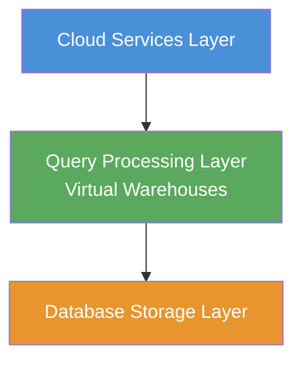
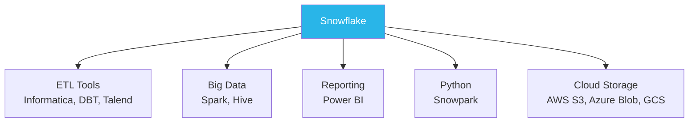

# Lecture 1: Introduction to Snowflake — Databases, Architecture, and Setup

---

## 1. Prerequisites

- Basic SQL knowledge (SELECT, INSERT, CREATE TABLE, data types)
- Familiarity with concepts like rows, columns, and relational data

---

## 2. Core Database Terminology

### 2.1 Database

A **database** is a system used to store and manage information for a business or application. Every industry — banking, insurance, telecom, healthcare, retail — relies on databases to store customer and operational data.

**Example:** Bank of America stores customer information, loan details, and insurance records in a database.

### 2.2 Schema

A **schema** is a logical grouping within a database. Different schemas separate data by department or domain.

```
Database: BankOfAmerica_DB
├── Schema: Insurance_Schema
├── Schema: Banking_Schema
└── Schema: Loans_Schema
```

### 2.3 Table

A **table** is the fundamental storage object inside a schema. It organizes data into **rows** (records) and **columns** (fields).

```
┌────────────┬───────────────┬──────────────┬──────────────┐
│ EMP_NUMBER │ EMP_NAME      │ ROLE         │ DATE_JOINED  │
├────────────┼───────────────┼──────────────┼──────────────┤
│ 1          │ Vinay         │ Engineer     │ 2022-01-31   │
│ 2          │ Sunil         │ Analyst      │ 2022-01-31   │
│ 3          │ Babu          │ Manager      │ 2022-01-31   │
└────────────┴───────────────┴──────────────┴──────────────┘
  (NUMBER)     (VARCHAR)       (VARCHAR)      (DATE)
```

### 2.4 Data Types

A **data type** defines the kind of information stored in a column.

| Data Type | Description                   | Example Values           |
|-----------|-------------------------------|--------------------------|
| NUMBER    | Whole or decimal numbers      | 1, 42, 3.14              |
| VARCHAR   | Text / character strings      | 'Vinay', 'Engineer'      |
| DATE      | Calendar dates                | 2022-01-31               |
| BOOLEAN   | True / False values           | TRUE, FALSE              |
| VARIANT   | Semi-structured data (JSON etc.)| `{"key": "value"}`     |

---

## 3. On-Premise vs. Cloud

### 3.1 On-Premise

With an on-premise deployment, a business owns and manages all hardware and software:

- Must **purchase** servers and software licenses upfront
- Responsible for **upgrades** when new software versions release
- Servers must run **24/7**, even during off-hours — incurring constant electricity costs
- Must hire an **admin team** for maintenance
- **Scaling up** (increasing capacity) or **scaling down** requires additional hardware purchases

```
On-Premise Model:
  Business Owner
       │
       ├── Purchase Hardware (Server: 1 TB, 32 GB RAM)
       ├── Purchase Software (V1 → upgrade to V2 manually)
       ├── Run 24/7 (pay electricity even with no customers)
       ├── Admin team for maintenance
       └── Manual scale-up/down (buy more hardware)
```

**Scale Up:** Increasing capacity of existing hardware (e.g., 1 TB → 4 TB storage).
**Scale Down:** Reducing capacity when business shrinks.

### 3.2 Cloud

Cloud providers (AWS, Azure, GCP) own the infrastructure. You pay only for what you use.

```
Cloud Model:
  Business Owner
       │
       └── Place Request with Cloud Provider
               ├── No hardware purchase needed
               ├── No manual software upgrades
               ├── No maintenance
               ├── Scale up/down instantly on demand
               └── Pay only for services consumed
```

**Major Cloud Providers:**
- **AWS** — Amazon Web Services
- **Azure** — Microsoft Azure
- **GCP** — Google Cloud Platform

**Cloud Service Models:**
- **SaaS** — Software as a Service
- **PaaS** — Platform as a Service
- **IaaS** — Infrastructure as a Service
- **DBaaS** — Database as a Service

---

## 4. Data Formats

Snowflake can process data in multiple formats:

| Format  | Description                                    | Example File     |
|---------|------------------------------------------------|------------------|
| CSV     | Comma-Separated Values — structured, tabular   | employees.csv    |
| JSON    | Key-value pairs — semi-structured              | car.json         |
| XML     | Tag-based markup — semi-structured             | books_info.xml   |
| Parquet | Columnar binary format — used in big data      | cars.parquet     |

---

## 5. Why Snowflake?

Snowflake is a **cloud data warehouse** — it runs entirely on cloud infrastructure and offers significant advantages over traditional on-premise databases:

| Advantage                        | Details                                                      |
|----------------------------------|--------------------------------------------------------------|
| Cloud-native                     | No hardware to buy or manage                                 |
| Pay-per-use billing              | Minimum billing: **1 minute**, then per-second after that    |
| Flexible storage                 | Scale up or down on demand                                   |
| Multi-format support             | CSV, JSON, XML, Parquet                                      |
| Cloud integrations               | Works with AWS, Azure, GCP                                   |
| ETL tool integrations            | Informatica, DBT, Talend, SnapLogic                          |
| Reporting tool integrations      | Power BI                                                     |
| Python integration               | Snowpark for Python-based data engineering                   |
| Big data tool integrations       | Apache Spark, Hive                                           |

> **Interview Tip:** "Snowflake is not available on-premise" — this is FALSE in the traditional sense; Snowflake is a **cloud** database. (Common certification question.)

---

## 6. Snowflake Architecture

Snowflake uses a **three-layer architecture** that separates storage, compute, and services.



### 6.1 Database Storage Layer

- Responsible for **storing all data**
- Data is stored in **compressed, columnar format** (Snowflake uses column-based storage, unlike Oracle which is row-based)
- Comparable to an external hard disk — it holds data but cannot process it alone

### 6.2 Query Processing Layer (Virtual Warehouses)

- Responsible for **reading and writing data**
- Uses **Virtual Warehouses** (compute clusters) to execute queries
- **Without a virtual warehouse, you CANNOT read or write data**
- Multiple virtual warehouses can exist in one account
- Virtual warehouses can be started, suspended, and resized independently

```
Virtual Warehouse States:
  STARTED   → Can read and write data ✓
  SUSPENDED → Cannot read or write data ✗
```

**Demonstration from lecture:**
```sql
-- Suspend warehouse → queries fail
ALTER WAREHOUSE COMPUTE_WH SUSPEND;

-- Try SELECT → Error: "Warehouse is suspended"
SELECT * FROM customer; -- FAILS

-- Resume warehouse
ALTER WAREHOUSE COMPUTE_WH RESUME;

-- Now SELECT works
SELECT * FROM customer; -- SUCCESS
```

### 6.3 Cloud Services Layer

- Handles **metadata management** — stores information about all objects created
- Handles **authentication** — verifying user identity on login
- Handles **infrastructure management**
- Handles **access control** (role-based permissions)
- The `INFORMATION_SCHEMA` in each database is part of cloud services metadata

> **Interview Tip:** "In which layer does Snowflake store metadata?" → **Cloud Services Layer**

### Full Architecture Analogy

```
External Hard Disk  →  Database Storage Layer   (stores files/data)
Computer RAM        →  Virtual Warehouse         (processes reads/writes)
Operating System    →  Cloud Services Layer       (manages metadata, auth)
```

---

## 7. Snowflake Editions

Snowflake is available in three editions:


| Edition           | Features                                              | Use Case                     |
|-------------------|-------------------------------------------------------|------------------------------|
| Standard          | Core features (~70% of total features)               | Learning, basic development  |
| Enterprise        | Advanced features (~90% of total features)           | Most production workloads    |
| Business Critical | All features (100%), including HIPAA, PCI compliance | Banks, healthcare, finance   |

**Analogy:** Like car variants — base, mid, high. Higher variant = more features.

---

## 8. Snowflake Certifications

| Certification      | Level    | Description                                      |
|--------------------|----------|--------------------------------------------------|
| SnowPro Core       | Basic    | Foundation certification — covers all core topics|
| SnowPro Advanced   | Advanced | Role-specific: Architect, Data Engineer, Admin   |

Completing this course prepares you for the **SnowPro Core Certification**.

---

## 9. Creating a Snowflake Account (Free Trial)

1. Go to **snowflake.com**
2. Click **"Start for Free"** (30-day free trial)
3. Enter your name, email, and sign-up reason
4. Choose an **edition** (Business Critical recommended for learning)
5. Choose a **cloud provider** (AWS, Azure, or GCP — just storage, no functional difference)
6. Receive an activation email → click the activation link
7. Set your **username** and **password**
8. Your account URL is unique — save it for future logins

---

## 10. Snowflake User Interfaces

Snowflake provides two user interfaces:

| Interface   | Available Since | Description                                 |
|-------------|-----------------|---------------------------------------------|
| Classic UI  | Pre-2023        | Legacy interface; still functional          |
| Snowsight   | 2023+           | Modern UI with improved experience          |

Both interfaces provide access to: Databases, Worksheets, Virtual Warehouses, Query History, Marketplace, Partner Connect.

**Key area: Worksheet** — this is where you write and execute SQL commands. Shortcut: `Ctrl + Enter` to execute.

---

## 11. Snowflake Objects

When you create a schema, you can create many types of objects inside it:

```
Schema
├── Tables
├── Dynamic Tables
├── Views
├── Materialized Views
├── Stages (Internal/External)
├── File Formats
├── Sequences
├── Snowpipes
├── Streams
├── Tasks
├── Stored Procedures
├── Functions
└── Storage Integrations
```

These are all **Snowflake database objects** — a Snowflake developer's main responsibilities revolve around creating and managing these.

---

## 12. Key Commands

### Creating Database and Schema

```sql
-- Create a database
CREATE DATABASE BankOfAmerica_DB;

-- Create schemas inside the database
CREATE SCHEMA Insurance_Schema;
CREATE SCHEMA Banking_Schema;
CREATE SCHEMA Loans_Schema;
```

> **Note:** When you create a database, two schemas are automatically created:
> - `PUBLIC` — default schema
> - `INFORMATION_SCHEMA` — stores metadata about all objects in the database

### Creating a Table

```sql
CREATE TABLE EMP (
    EMP_NUMBER   NUMBER,
    EMP_NAME     VARCHAR,
    ROLE         VARCHAR,
    DATE_JOINED  DATE
);
```

### Querying Metadata from INFORMATION_SCHEMA

```sql
-- Count all tables in the current database
SELECT *
FROM INFORMATION_SCHEMA.TABLES
WHERE TABLE_TYPE = 'BASE TABLE';
```

### Inserting Data

```sql
INSERT INTO EMP VALUES (1, 'Vinay', 'Engineer', '2022-01-31');
INSERT INTO EMP VALUES (2, 'Sunil', 'Analyst', '2022-01-31');
INSERT INTO EMP VALUES (3, 'Babu', 'Manager', '2022-01-31');
```

### Selecting Data

```sql
SELECT * FROM EMP;
```

### Warehouse Control

```sql
-- Suspend a warehouse (stops compute billing)
ALTER WAREHOUSE COMPUTE_WH SUSPEND;

-- Resume a warehouse
ALTER WAREHOUSE COMPUTE_WH RESUME;
```

---

## 13. Snowflake Ecosystem Integrations



---

## 14. Key Terms

| Term              | Definition                                                          |
|-------------------|---------------------------------------------------------------------|
| Database          | Container for storing and organizing business data                  |
| Schema            | Logical grouping of objects within a database                       |
| Table             | Structured storage of data in rows and columns                      |
| Data Type         | The kind of value stored in a column (NUMBER, VARCHAR, DATE, etc.)  |
| On-Premise        | Infrastructure owned and managed by the business itself             |
| Cloud             | Infrastructure rented from a provider (AWS, Azure, GCP)             |
| Virtual Warehouse | Snowflake's compute engine for reading and writing data             |
| Snowsight         | Snowflake's modern web UI (available from 2023)                     |
| Classic UI        | Snowflake's legacy web interface (pre-2023)                         |
| Metadata          | Data about data (object names, creation dates, column types, etc.)  |
| SnowPro Core      | The foundational Snowflake certification exam                        |

---

## 15. Summary

- A **database** holds **schemas**, which hold **objects** (tables, views, stages, etc.)
- Snowflake is a **cloud data warehouse** — not on-premise
- The **three-layer architecture**: Database Storage → Query Processing (Virtual Warehouse) → Cloud Services
- A **Virtual Warehouse must be running** to execute any read or write operation
- Snowflake charges a **minimum of 1 minute**, then per-second after that
- Snowflake supports **CSV, JSON, XML, and Parquet** file formats natively
- The **Snowsight** UI is the modern interface (2023+); **Classic UI** is the legacy version
- Two schemas are auto-created with every database: `PUBLIC` and `INFORMATION_SCHEMA`
