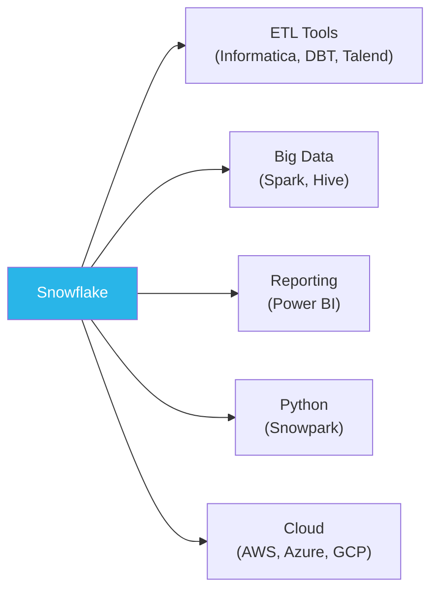
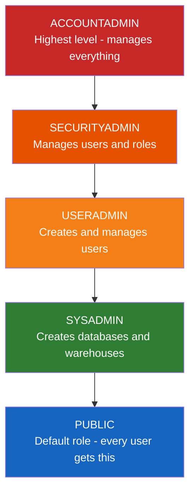

# Lecture 2: Users, Roles, UI Navigation, and Utility Functions

---

## 1. Recap of Lecture 1

- **Database** → contains **Schemas** → which contain **Objects** (tables, views, stages, etc.)
- Snowflake is a **cloud data warehouse** (not on-premise)
- **Three-layer architecture**: Database Storage | Query Processing (Virtual Warehouse) | Cloud Services
- Virtual warehouse must be **running** for any read/write operation
- Minimum billing: **1 minute**, then per-second

---

## 2. Snowflake Editions (Recap)

| Edition           | Description                                     |
|-------------------|-------------------------------------------------|
| Standard          | Core features                                   |
| Enterprise        | Advanced features                               |
| Business Critical | All features + compliance (HIPAA, PCI-DSS, etc.)|

Snowflake is currently supported by **three major cloud providers**: AWS, Azure, and GCP.

---

## 3. Integrations Overview



**ETL Tools:**
- **Informatica** (Informatica Cloud / IICS)
- **DBT** (Data Build Tool) — SQL-based transformation
- **Talend**, **SnapLogic**, **Matillion** — all are Snowflake partners

**Reporting:**
- **Power BI** can connect to Snowflake and consume data for dashboards

**Python:**
- **Snowpark** — Python API for working with Snowflake data using DataFrames
- Python connectors available for scripting and automation

---

## 4. Snowflake User Interfaces (UI)

| Interface   | Period       | Description                             |
|-------------|------------- |-----------------------------------------|
| Classic UI  | Before 2023  | Legacy interface; still works           |
| Snowsight   | 2023 onwards | Modern, improved UI                     |

Both interfaces contain the same core features:
- **Databases** panel
- **Worksheets** (where SQL is written and executed)
- **Warehouses**
- **Query History** / Copy History
- **Marketplace**
- **Partner Connect**

> **Interview Tip:** "What user interfaces have you worked on in Snowflake?" — Answer: Snowsight (current) and Classic UI (legacy).

### Shortcut for Executing Queries

```
Ctrl + Enter   →  Execute the selected/current query
```

---

## 5. Snowflake Marketplace

The **Marketplace** is a data-sharing platform within Snowflake where you can:
- Browse and access **third-party datasets** (e.g., COVID-19 analysis, financial data, weather data)
- Import external databases directly into your Snowflake account
- These imported databases show up in your databases list

**Steps to use Marketplace:**
1. Click on **Marketplace** in the sidebar
2. Browse available datasets
3. Click **Get** on a dataset
4. The database is imported and available in your account

---

## 6. Partner Connect

**Partner Connect** lists all Snowflake partner tools — ETL, reporting, analytics, and big data tools.

Available partners include: **DBT, Informatica, Matillion, SnapLogic, Talend, Looker, Power BI**, and many more.

To connect to a partner tool:
1. Click on the partner (e.g., Informatica)
2. Click **Connect** — you will receive a 30-day free trial for many partners

---

## 7. Query History

Snowflake maintains a **Query History** of all statements you have executed.

- Available for the **last 14 days** (maximum)
- Accessible via the **History** tab in the UI or through the `ACCOUNT_USAGE` schema
- Contains: query text, execution time, status, rows affected, user, warehouse used

```sql
-- Access query history from the Snowflake UI:
-- Navigate to: Activity → Query History
```

---

## 8. Roles in Snowflake

Snowflake is **Role-Based Access Control (RBAC)** — every user must have a role, and all privileges are assigned to roles, not directly to users.

### 8.1 Built-in System Roles



| Role          | Responsibilities                                                   | Real-World Analogy |
|---------------|--------------------------------------------------------------------|--------------------|
| ACCOUNTADMIN  | Full control — manages the entire account                         | CEO / Manager      |
| SECURITYADMIN | Creates and manages users and roles                                | IT Security Lead   |
| USERADMIN     | Creates users and grants roles                                     | HR / Team Lead     |
| SYSADMIN      | Creates databases, schemas, warehouses                             | Consultant         |
| PUBLIC        | Default role — minimal privileges, assigned to all users by default| Fresher / Entry-level |

> **Important:** Without a role, a user cannot exist in Snowflake. Every user is assigned at least the PUBLIC role by default.

> **Key Principle:** Snowflake is **role-based**, not user-based. Privileges are given to **roles**, and roles are assigned to users.

### 8.2 Default Role

When you create a user **without** explicitly assigning a role, the default role is:
```
PUBLIC
```

---

## 9. Creating Users

### Syntax

```sql
CREATE USER username PASSWORD = 'your_password';
```

### Example — Creating Multiple Users

```sql
CREATE USER Deepak  PASSWORD = 'Password123!';
CREATE USER Anil    PASSWORD = 'Password123!';
CREATE USER Vinay   PASSWORD = 'Password123!';
CREATE USER Rashika PASSWORD = 'Password123!';
```

### Verify Users

```sql
SHOW USERS;
```

Sample output:
```
name      | login_name | default_role | ...
----------|------------|--------------|----
KRISHNA   | KRISHNA    | ACCOUNTADMIN |
DEEPAK    | DEEPAK     | PUBLIC       |
ANIL      | ANIL       | PUBLIC       |
```

---

## 10. Granting Roles to Users

```sql
-- Syntax
GRANT ROLE role_name TO USER user_name;

-- Examples
GRANT ROLE SECURITYADMIN TO USER Deepak;
GRANT ROLE USERADMIN     TO USER Anil;
GRANT ROLE SYSADMIN      TO USER Vinay;
-- Rashika keeps PUBLIC (default — no GRANT needed)
```

> **Note:** Attempting to grant PUBLIC explicitly returns:
> `"Granting role PUBLIC has no effect. Every user and role has PUBLIC implicitly granted."`

### Verifying the Current Role

```sql
SELECT CURRENT_ROLE();
```

---

## 11. A User Can Have Multiple Roles

A single user can be assigned multiple roles:

```sql
GRANT ROLE SECURITYADMIN TO USER Deepak;
GRANT ROLE USERADMIN     TO USER Deepak;
-- Deepak now has: SECURITYADMIN, USERADMIN, PUBLIC
```

Multiple users can also share the same role:

```sql
GRANT ROLE SYSADMIN TO USER Vinay;
GRANT ROLE SYSADMIN TO USER Sunil;  -- Both Vinay and Sunil have SYSADMIN
```

---

## 12. Snowflake Utility Functions

These functions return information about the **current session context** — commonly asked in interviews.

### 12.1 Context Functions

```sql
SELECT CURRENT_USER();        -- Returns the logged-in username
SELECT CURRENT_DATABASE();    -- Returns the active database name
SELECT CURRENT_SCHEMA();      -- Returns the active schema name
SELECT CURRENT_WAREHOUSE();   -- Returns the active virtual warehouse
SELECT CURRENT_ROLE();        -- Returns the active role
SELECT CURRENT_DATE();        -- Returns today's date (YYYY-MM-DD)
SELECT CURRENT_TIMESTAMP();   -- Returns current date and time
```

### 12.2 Example Output

```
CURRENT_USER()      → KRISHNA
CURRENT_DATABASE()  → DEV_DB
CURRENT_SCHEMA()    → DEV_SCHEMA
CURRENT_WAREHOUSE() → COMPUTE_WH
CURRENT_ROLE()      → ACCOUNTADMIN
CURRENT_DATE()      → 2025-03-20
CURRENT_TIMESTAMP() → 2025-03-20 19:27:00.000
```

---

## 13. Time Zones in Snowflake

Snowflake uses **UTC-based time zones**. You can view and change them using `SHOW PARAMETERS`.

### Viewing Time Zone Settings

```sql
-- Show all parameters
SHOW PARAMETERS;

-- Filter for timezone parameter only
SHOW PARAMETERS LIKE 'TIMEZONE';
```

**Default timezone:** `America/Los_Angeles` (UTC-7 / UTC-8)

### Changing Timezone

```sql
-- Change to India Standard Time
ALTER SESSION SET TIMEZONE = 'Asia/Calcutta';

-- Verify the change
SELECT CURRENT_TIMESTAMP();  -- Now shows IST (+05:30)
```

### Understanding UTC Offsets

- UTC is **Universal Time Coordinated** — the global time standard
- **India (IST)** = UTC + 5:30
- **America/Los_Angeles** = UTC - 7:00 (PDT) or UTC - 8:00 (PST)

---

## 14. SHOW Commands Reference

Snowflake provides `SHOW` commands to inspect objects quickly:

```sql
SHOW USERS;          -- List all users
SHOW ROLES;          -- List all roles
SHOW DATABASES;      -- List all databases
SHOW SCHEMAS;        -- List schemas in current database
SHOW TABLES;         -- List tables in current schema
SHOW WAREHOUSES;     -- List virtual warehouses
SHOW PARAMETERS;     -- List session/account parameters
SHOW STAGES;         -- List internal named stages
SHOW FILE FORMATS;   -- List file formats
SHOW INTEGRATIONS;   -- List storage/API integrations
SHOW FUNCTIONS;      -- List available functions (986+ built-in)
```

> **Difference: `SHOW TABLES` vs. `INFORMATION_SCHEMA.TABLES`:**
> - `SHOW TABLES` → only the **current schema**
> - `INFORMATION_SCHEMA.TABLES` → **all schemas** in the current database

---

## 15. Switching Context (USE Command)

```sql
-- Switch to a specific database
USE DATABASE DEV_DB;

-- Switch to a specific schema
USE SCHEMA DEV_SCHEMA;

-- Switch warehouse
USE WAREHOUSE COMPUTE_WH;
```

These can also be done from the dropdown selectors in the Snowsight UI.

---

## 16. Key Commands Summary

```sql
-- User management
CREATE USER username PASSWORD = 'pwd';
SHOW USERS;
GRANT ROLE role_name TO USER user_name;
REVOKE ROLE role_name FROM USER user_name;

-- Session context
SELECT CURRENT_USER();
SELECT CURRENT_DATABASE();
SELECT CURRENT_SCHEMA();
SELECT CURRENT_WAREHOUSE();
SELECT CURRENT_ROLE();
SELECT CURRENT_DATE();
SELECT CURRENT_TIMESTAMP();

-- Parameters
SHOW PARAMETERS;
SHOW PARAMETERS LIKE 'TIMEZONE';
ALTER SESSION SET TIMEZONE = 'Asia/Calcutta';

-- Object discovery
SHOW TABLES;
SHOW SCHEMAS;
SHOW WAREHOUSES;
```

---

## 17. Key Terms

| Term              | Definition                                                                   |
|-------------------|------------------------------------------------------------------------------|
| RBAC              | Role-Based Access Control — privileges are assigned to roles, not users      |
| Role              | A named collection of privileges in Snowflake                                |
| ACCOUNTADMIN      | Highest-privilege built-in role in Snowflake                                 |
| PUBLIC            | Default role automatically assigned to all users                             |
| Marketplace       | Snowflake's built-in platform for sharing and accessing third-party datasets  |
| Partner Connect   | Portal linking Snowflake with partner ETL and BI tools                       |
| Query History     | Log of all executed SQL statements — available for the last 14 days          |
| SHOW PARAMETERS   | Command to display all session/account configuration settings                |
| CURRENT_USER()    | Function returning the currently logged-in username                          |
| Snowsight         | Snowflake's modern UI (2023+)                                                |

---

## 18. Summary

- Snowflake is **role-based** (RBAC) — privileges are assigned to roles, then roles to users
- **Built-in roles**: ACCOUNTADMIN > SECURITYADMIN > USERADMIN > SYSADMIN > PUBLIC
- A user's **default role** is always PUBLIC unless explicitly changed
- Use `GRANT ROLE role_name TO USER user_name` to assign roles
- **Context functions** (`CURRENT_USER`, `CURRENT_DATABASE`, etc.) are frequently asked in interviews
- **SHOW PARAMETERS** reveals all session settings including the active timezone
- **Marketplace** lets you import third-party datasets; **Partner Connect** connects to ETL/BI tools
- **Query History** keeps a 14-day log of all executed statements
