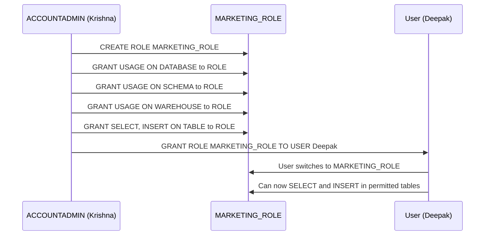

# Lecture 3: Account Setup, DDL, Roles Deep Dive, and Date Functions

---

## 1. Creating a Snowflake Account — Step-by-Step

1. Navigate to **snowflake.com**
2. Click **Start for Free**
3. Fill in: first name, last name, email, reason for signing up
4. Choose **Edition**: Standard / Enterprise / Business Critical
5. Choose **Cloud Provider**: AWS / Azure / GCP
6. Click **Get Started**
7. Check your email → click **Activate Your Snowflake Account**
8. The activation link contains your **unique account URL** — save this!
9. Set your **username** (e.g., `KRISHNA`) and **password**
10. Log in → navigate to **Projects → Worksheets**

> Snowflake accounts expire after **30 days** on the free trial. You can create a new account with a different email afterward.

---

## 2. Creating Databases and Schemas

### Creating a Database

```sql
CREATE DATABASE MARKETING_DB;
```

After creation, two schemas are **automatically created**:
1. `PUBLIC` — default, empty schema for user objects
2. `INFORMATION_SCHEMA` — read-only metadata views about all objects

### Creating Schemas

```sql
CREATE SCHEMA MARKETING_SCHEMA;
CREATE SCHEMA SALES_SCHEMA;
CREATE SCHEMA FINANCE_SCHEMA;
```

### Verifying Databases

```sql
-- Method 1: SHOW command
SHOW DATABASES;

-- Method 2: INFORMATION_SCHEMA
SELECT * FROM INFORMATION_SCHEMA.DATABASES;
```

The output includes: database name, creation timestamp, owner, options.

---

## 3. Creating Tables

```sql
-- Basic table creation
CREATE TABLE TNS_DEPT (
    DEPT_NUMBER   NUMBER,
    DEPT_NAME     VARCHAR,
    LOCATION      VARCHAR
);

-- Employee table
CREATE TABLE TNS_EMP (
    EMP_NUMBER    NUMBER,
    EMP_NAME      VARCHAR,
    SALARY        NUMBER
);
```

### Verifying Tables

```sql
-- Method 1: INFORMATION_SCHEMA.TABLES
SELECT *
FROM INFORMATION_SCHEMA.TABLES
WHERE TABLE_TYPE = 'BASE TABLE';

-- Method 2: SHOW TABLES (current schema only)
SHOW TABLES;
```

**Column descriptions in `INFORMATION_SCHEMA.TABLES`:**

| Column Name      | Description                           |
|------------------|---------------------------------------|
| TABLE_CATALOG    | Database name                         |
| TABLE_SCHEMA     | Schema name                           |
| TABLE_NAME       | Table name                            |
| TABLE_TYPE       | BASE TABLE, VIEW, etc.                |
| CREATED          | Timestamp when table was created      |
| LAST_ALTERED     | Timestamp of last modification        |

### Checking Column Information

```sql
-- Get column details for a specific table
SELECT *
FROM INFORMATION_SCHEMA.COLUMNS
WHERE TABLE_NAME = 'TNS_EMP';
```

---

## 4. GET_DDL Function

To view the creation script (DDL) of any Snowflake object:

```sql
-- Syntax
SELECT GET_DDL('object_type', 'object_name');

-- Get DDL for a table
SELECT GET_DDL('TABLE', 'TNS_EMP');

-- Get DDL for a file format
SELECT GET_DDL('FILE_FORMAT', 'JSON_FORMAT');

-- Get DDL for a view
SELECT GET_DDL('VIEW', 'MY_VIEW');
```

This is useful when you need to:
- Recreate an object in another environment
- Audit the structure of existing objects
- Generate documentation

---

## 5. Snowflake Objects Reference

The full list of objects you can create under a schema:

```
Schema
├── Tables                 ← Primary storage objects
├── Dynamic Tables         ← Automatically refreshed tables
├── Views                  ← Virtual tables based on queries
├── Materialized Views     ← Pre-computed, stored view results
├── Stages                 ← File storage locations (internal/external)
├── File Formats           ← Describe how to parse files
├── Sequences              ← Auto-incrementing number generators
├── Snowpipes              ← Continuous/micro-batch data loading
├── Streams                ← Change data capture (CDC)
├── Tasks                  ← Scheduled SQL execution
├── Stored Procedures      ← Reusable SQL/JavaScript/Python logic
├── Functions (UDFs)       ← User-defined functions
└── Storage Integrations   ← Cloud storage connection objects
```

---

## 6. Roles Deep Dive: Privileges and Custom Roles

### Role Hierarchy in Snowflake

```
ACCOUNTADMIN
     │
SECURITYADMIN
     │
  USERADMIN
     │
  SYSADMIN
     │
   PUBLIC
```

In real-world projects, you will typically be assigned a **custom role** — not one of the system roles. For example: `MARKETING_ROLE`, `DEV_ROLE`, `SALES_ROLE`.

### Creating a Custom Role

```sql
CREATE ROLE MARKETING_ROLE;
```

### Viewing Privileges of a Role

```sql
-- Show what privileges a role has
SHOW GRANTS TO ROLE MARKETING_ROLE;

-- Initially: no privileges (empty result)
```

### Granting Privileges to a Role

A role needs privileges to access objects. The privilege hierarchy follows the object hierarchy:

```
Account Level
    └── Database
            └── Schema
                    └── Table / Warehouse / Stage
```

```sql
-- Step 1: Grant database access
GRANT USAGE ON DATABASE MARKETING_DB TO ROLE MARKETING_ROLE;

-- Step 2: Grant schema access
GRANT USAGE ON SCHEMA MARKETING_SCHEMA TO ROLE MARKETING_ROLE;

-- Step 3: Grant warehouse access
GRANT USAGE ON WAREHOUSE MARKETING_WH TO ROLE MARKETING_ROLE;

-- Step 4: Grant table access (SELECT = read)
GRANT SELECT ON TABLE TNS_DEPT TO ROLE MARKETING_ROLE;
GRANT SELECT ON TABLE TNS_EMP  TO ROLE MARKETING_ROLE;

-- Grant INSERT privilege separately
GRANT INSERT ON TABLE TNS_DEPT TO ROLE MARKETING_ROLE;
GRANT INSERT ON TABLE TNS_EMP  TO ROLE MARKETING_ROLE;
```

### Revoking Privileges

```sql
-- Revoke a role from a user
REVOKE ROLE MARKETING_ROLE FROM USER Deepak;

-- Revoke a privilege from a role
REVOKE USAGE ON DATABASE SALES_DB FROM ROLE PUBLIC;
```

### Creating a Warehouse (for a Role)

```sql
CREATE WAREHOUSE MARKETING_WH;
```

---

## 7. RBAC in Action — Full Example



> **Core Principle:** Snowflake privileges are **role-based**. When a new person joins a project, you only need to assign them the correct role — all permissions follow automatically.

---

## 8. Granting CREATE DATABASE Privilege

To allow a role to create databases, you grant at the **account** level:

```sql
GRANT CREATE DATABASE ON ACCOUNT TO ROLE DEV_ROLE;
```

Once a role can create a database, it automatically has full control over objects within that database.

---

## 9. Snowflake Built-in Functions

Snowflake provides nearly **1,000 built-in functions** covering date, string, math, conversion, and more.

```sql
-- View all available functions
SHOW FUNCTIONS;
-- Returns ~986 functions with their descriptions
```

### 9.1 Date Functions

#### CURRENT_DATE and CURRENT_TIMESTAMP

```sql
SELECT CURRENT_DATE();       -- 2025-03-21
SELECT CURRENT_TIMESTAMP();  -- 2025-03-21 08:30:00.123
```

#### DAY_OF_YEAR

Returns which day of the year the given date falls on (1–366):

```sql
SELECT DAYOFYEAR(CURRENT_DATE());  -- e.g., 80 (80th day of the year)

-- Passing a specific date (must use CAST if it's a string)
SELECT DAYOFYEAR('2022-12-26'::DATE);  -- Returns 360
```

#### DATE_TRUNC — Find Start of Period

```sql
-- Start of current year
SELECT DATE_TRUNC('YEAR', CURRENT_DATE());   -- 2025-01-01

-- Start of current month
SELECT DATE_TRUNC('MONTH', CURRENT_DATE());  -- 2025-03-01

-- Start of current week
SELECT DATE_TRUNC('WEEK', CURRENT_DATE());   -- e.g., 2025-03-17
```

#### LAST_DAY — Last Day of a Month

```sql
-- Last day of the current month
SELECT LAST_DAY(CURRENT_DATE());        -- 2025-03-31

-- Last day of February 2024 (leap year)
SELECT LAST_DAY('2024-02-01'::DATE);    -- 2024-02-29
```

#### ADD_MONTHS — Add or Subtract Months

```sql
-- Add 2 months to current date
SELECT ADD_MONTHS(CURRENT_DATE(), 2);    -- 2025-05-21

-- Subtract 2 months
SELECT ADD_MONTHS(CURRENT_DATE(), -2);   -- 2025-01-21
```

#### DATEDIFF — Calculate Date Differences

```sql
-- Syntax: DATEDIFF(unit, start_date, end_date)

-- Calculate experience in years
SELECT DATEDIFF('YEAR', '2020-03-24'::DATE, CURRENT_DATE());    -- 5

-- Experience in months
SELECT DATEDIFF('MONTH', '2020-03-24'::DATE, CURRENT_DATE());   -- ~60

-- Experience in days
SELECT DATEDIFF('DAY', '2020-03-24'::DATE, CURRENT_DATE());     -- ~1826
```

#### Practical Example: Calculate Employee Experience

```sql
-- Create table
CREATE TABLE TNS_EMP (
    EMP_NUMBER  NUMBER,
    EMP_NAME    VARCHAR,
    DOJ         DATE       -- Date of Joining
);

-- Insert records
INSERT INTO TNS_EMP VALUES (1, 'Syed',  '2020-03-24'::DATE);
INSERT INTO TNS_EMP VALUES (2, 'Sunil', '2010-03-24'::DATE);

-- Calculate experience in years
SELECT
    EMP_NUMBER,
    EMP_NAME,
    DATEDIFF('YEAR',  DOJ, CURRENT_DATE()) AS EXPERIENCE_YEARS,
    DATEDIFF('MONTH', DOJ, CURRENT_DATE()) AS EXPERIENCE_MONTHS,
    DATEDIFF('DAY',   DOJ, CURRENT_DATE()) AS EXPERIENCE_DAYS
FROM TNS_EMP;
```

Expected output:
```
EMP_NUMBER | EMP_NAME | EXPERIENCE_YEARS | EXPERIENCE_MONTHS | EXPERIENCE_DAYS
-----------|----------|------------------|-------------------|----------------
1          | Syed     | 5                | 60                | 1826
2          | Sunil    | 15               | 180               | 5479
```

---

## 10. The CAST Operator (`::`)

The `::` operator converts a value from one data type to another.

```sql
-- Convert string to DATE
SELECT '2022-12-26'::DATE;

-- Convert to NUMBER
SELECT '42'::NUMBER;

-- Convert to VARCHAR
SELECT 100::VARCHAR;

-- In context with DAYOFYEAR
SELECT DAYOFYEAR('2022-12-26'::DATE);  -- 360
```

> **Why this matters:** When you pass a string literal like `'2022-12-26'` to a date function, Snowflake may treat it as `VARCHAR`. Using `::DATE` explicitly tells Snowflake to treat it as a date.

---

## 11. String Functions

### SPLIT_PART

Splits a string by a delimiter and returns a specific part.

```sql
-- Syntax: SPLIT_PART(string, delimiter, position)

-- Example: employee name stored as 'FirstName_LastName_Surname'
SELECT SPLIT_PART('Vinay_Kumar_CH', '_', 1) AS FIRST_NAME;   -- Vinay
SELECT SPLIT_PART('Vinay_Kumar_CH', '_', 2) AS LAST_NAME;    -- Kumar
SELECT SPLIT_PART('Vinay_Kumar_CH', '_', 3) AS SURNAME;      -- CH
```

**Full query with table:**

```sql
CREATE TABLE TNS_HR_INFO (
    EMP_NUMBER  NUMBER,
    EMP_NAME    VARCHAR,   -- Format: 'FirstName_LastName_Surname'
    JOB         VARCHAR,
    SALARY      NUMBER
);

INSERT INTO TNS_HR_INFO VALUES (7369, 'Vinay_Kumar_CH',  'ANALYST',   20000);
INSERT INTO TNS_HR_INFO VALUES (7370, 'Tharun_Rao_MK',   'ENGINEER',  30000);
INSERT INTO TNS_HR_INFO VALUES (7371, 'Krishna_Balan_SK','ARCHITECT', 50000);

-- Extract name components
SELECT
    EMP_NUMBER,
    SPLIT_PART(EMP_NAME, '_', 1) AS FIRST_NAME,
    SPLIT_PART(EMP_NAME, '_', 2) AS LAST_NAME,
    SPLIT_PART(EMP_NAME, '_', 3) AS SURNAME
FROM TNS_HR_INFO;
```

---

## 12. How Many Days Left in the Year?

```sql
SELECT
    365 - DAYOFYEAR(CURRENT_DATE()) AS DAYS_LEFT_IN_YEAR;

-- Or more accurately (handles leap years):
SELECT
    DATEDIFF('DAY', CURRENT_DATE(), LAST_DAY(ADD_MONTHS(DATE_TRUNC('YEAR', CURRENT_DATE()), 11))) AS DAYS_LEFT;
```

---

## 13. Key Commands Reference

```sql
-- Database and Schema
CREATE DATABASE db_name;
CREATE SCHEMA schema_name;
SHOW DATABASES;
SHOW SCHEMAS;

-- Tables
CREATE TABLE table_name (col1 datatype, col2 datatype, ...);
SHOW TABLES;
SELECT * FROM INFORMATION_SCHEMA.TABLES WHERE TABLE_TYPE = 'BASE TABLE';
SELECT * FROM INFORMATION_SCHEMA.COLUMNS WHERE TABLE_NAME = 'table_name';
SELECT GET_DDL('TABLE', 'table_name');

-- Roles and Privileges
CREATE ROLE role_name;
GRANT USAGE ON DATABASE db_name TO ROLE role_name;
GRANT USAGE ON SCHEMA schema_name TO ROLE role_name;
GRANT USAGE ON WAREHOUSE wh_name TO ROLE role_name;
GRANT SELECT ON TABLE table_name TO ROLE role_name;
GRANT INSERT ON TABLE table_name TO ROLE role_name;
GRANT CREATE DATABASE ON ACCOUNT TO ROLE role_name;
REVOKE ROLE role_name FROM USER user_name;
SHOW GRANTS TO ROLE role_name;

-- Date Functions
SELECT DAYOFYEAR(CURRENT_DATE());
SELECT DATE_TRUNC('YEAR', CURRENT_DATE());
SELECT LAST_DAY(CURRENT_DATE());
SELECT ADD_MONTHS(CURRENT_DATE(), n);
SELECT DATEDIFF('YEAR', start_date, end_date);

-- Cast operator
SELECT '2022-12-26'::DATE;
SELECT '42'::NUMBER;
```

---

## 14. Key Terms

| Term           | Definition                                                              |
|----------------|-------------------------------------------------------------------------|
| DDL            | Data Definition Language — CREATE, ALTER, DROP statements               |
| INFORMATION_SCHEMA | System schema containing metadata views for all objects in a database |
| RBAC           | Role-Based Access Control                                               |
| Privilege      | A specific permission granted to a role (SELECT, INSERT, USAGE, etc.)   |
| USAGE          | Privilege to access (but not modify) a database, schema, or warehouse   |
| GET_DDL()      | Function that returns the creation script of any object                  |
| CAST (::)      | Operator to convert a value to a different data type                    |
| DATE_TRUNC     | Function returning the start of a time period (year, month, week, day)  |
| DATEDIFF       | Function calculating the difference between two dates                   |
| SPLIT_PART     | Function splitting a string by a delimiter and returning a portion      |

---

## 15. Summary

- Creating a database automatically creates `PUBLIC` and `INFORMATION_SCHEMA` schemas
- `INFORMATION_SCHEMA` is your primary tool for **metadata queries** (tables, columns, schemas, stages, file formats)
- Snowflake objects include: tables, views, stages, file formats, sequences, snowpipes, streams, tasks, procedures, functions, storage integrations
- Custom roles give teams granular access — the admin defines roles once, then assigns to users
- **Role-based**: give privileges to roles, assign roles to users
- The `::` cast operator converts data types — critical for date comparisons
- Key date functions: `DAYOFYEAR`, `DATE_TRUNC`, `LAST_DAY`, `ADD_MONTHS`, `DATEDIFF`
- `SPLIT_PART` splits strings by a delimiter — useful for parsing combined fields
