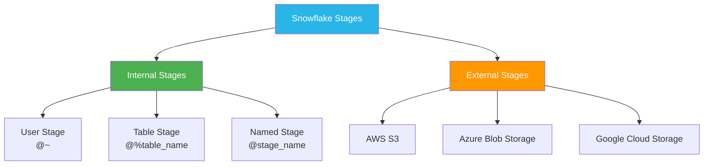
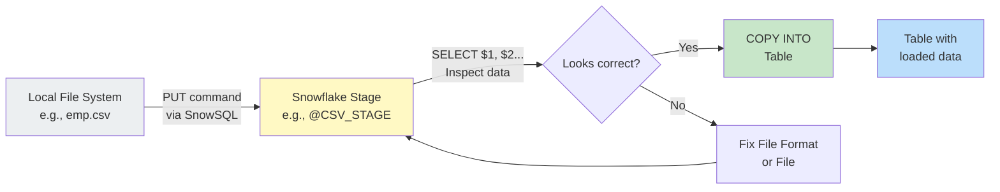

# Lecture 4: Stages — Concepts, Internal Stages, and File Operations

---

## 1. What is a Stage?

A **stage** in Snowflake is a **named location** where files are stored before they are loaded into tables (or after they are unloaded from tables). Think of it as a "landing zone" for files.

**Windows Analogy:**

```
Windows File System          Snowflake
─────────────────────────── ─────────────────────────────────
C:\ drive               →   User Stage  (@~)
D:\ drive               →   Table Stage (@%table_name)
E:\ drive               →   Named Stage (@stage_name)
```

> A stage is not a database object you store data in permanently — it is a **temporary file storage area** used during the data loading (and unloading) process.

---

## 2. Types of Stages



### 2.1 Internal Stages

Files are stored **inside Snowflake's own storage**. No external cloud account needed.

| Stage Type  | Notation          | Creation              | Notes                                    |
|-------------|-------------------|-----------------------|------------------------------------------|
| User Stage  | `@~`              | Auto-created per user | Every user has one automatically         |
| Table Stage | `@%table_name`    | Auto-created per table| Every table has one automatically        |
| Named Stage | `@stage_name`     | Created by user (`CREATE STAGE`) | Most flexible — can be shared |

> **Important:** You **cannot** manually create a User Stage or Table Stage — they are created automatically. Only **Named Stages** can be explicitly created.

### 2.2 External Stages

Files are stored in a **cloud provider's object storage** (S3, Azure Blob, GCS). Covered in detail in Lectures 10–11.

---

## 3. Stage Notation Summary

```sql
-- User Stage
@~                     -- Current user's stage

-- Table Stage
@%TABLE_NAME           -- Stage for a specific table

-- Named Stage
@STAGE_NAME            -- Named stage you created
```

---

## 4. Commands for Working with Stages

### 4.1 LIST — View Files in a Stage

```sql
-- List files in User Stage
LIST @~;

-- List files in Table Stage
LIST @%EMP;

-- List files in a Named Stage
LIST @CSV_STAGE;
LIST @JSON_STAGE;
```

### 4.2 SHOW STAGES — View All Named Stages

```sql
SHOW STAGES;

-- Alternatively, query INFORMATION_SCHEMA
SELECT * FROM INFORMATION_SCHEMA.STAGES;
```

> **Difference:** `SHOW STAGES` shows stages in the **current schema only**. `INFORMATION_SCHEMA.STAGES` shows stages across **all schemas** in the current database.

### 4.3 CREATE STAGE — Create a Named Stage

```sql
-- Create stages for different file types
CREATE STAGE CSV_STAGE;
CREATE STAGE JSON_STAGE;
CREATE STAGE XML_STAGE;
CREATE STAGE PARQUET_STAGE;
```

### 4.4 DESCRIBE STAGE — View Stage Properties

```sql
DESCRIBE STAGE CSV_STAGE;
```

Output shows properties like file format type, field delimiter, skip header, etc.

> **Important:** By default, any stage you create — regardless of the name — is treated as a **CSV stage** by Snowflake. The name alone doesn't determine the format.

### 4.5 REMOVE — Delete Files from a Stage

```sql
-- Remove a specific file
RM @JSON_STAGE/sample.json.gz;

-- Remove all files from a stage
RM @JSON_STAGE;
```

---

## 5. Reading Data Directly from a Stage

You can query data directly from a stage **before** loading it into a table. This is useful for inspection and transformation.

### Dollar Notation for Columns

For **CSV files**, columns are referenced as `$1`, `$2`, `$3`, etc.:

```sql
-- Read all columns from a CSV file in a stage
SELECT $1, $2, $3, $4, $5
FROM @USER_STAGE/emp.csv;

-- Read using the file format to skip header
SELECT $1, $2, $3, $4, $5
FROM @CSV_STAGE
(FILE_FORMAT => 'FILE_CSV_FORMAT');
```

For **JSON, XML, Parquet**, there is only **one column** (`$1`) because these formats are semi-structured.

```sql
-- Read from JSON stage — returns a single column
SELECT $1
FROM @JSON_STAGE
(FILE_FORMAT => 'JSON_FORMAT');
```

---

## 6. The PUT Command — Uploading Files to a Stage

The `PUT` command uploads a file from your **local machine** into a Snowflake stage.

> **Critical Note:** `PUT` cannot be executed in the Snowflake web UI (Snowsight). It can **only** be executed through **SnowSQL** (the command-line interface).

### Syntax

```
PUT file://path/to/file @stage_name
```

### Example

```
PUT file://C:/Users/user/files/emp.csv @CSV_STAGE
PUT file://C:/Users/user/files/car.json @JSON_STAGE
PUT file://C:/Users/user/files/books_info.xml @XML_STAGE
```

### What PUT Does Automatically

1. **Compresses** the file (using gzip — `.gz` extension added)
2. **Encrypts** the file
3. Uploads it to the stage

```sql
-- After PUT, file name appears with .gz extension
LIST @JSON_STAGE;
-- Output: sample.json.gz
```

> **Interview Question:** "What does the PUT command do automatically?"
> **Answer:** Automatically **compresses** the file using gzip and **encrypts** it.

---

## 7. Installing SnowSQL (CLI)

SnowSQL is Snowflake's command-line interface — required for the `PUT` command.

### Installation

1. Search for "SnowSQL download" → go to the Snowflake documentation
2. Download the Windows installer
3. Run the installer (click Next → Install → Finish)

### Connecting via SnowSQL

```
snowsql -a <account_name> -u <username>
```

- **Account name**: found in your Snowflake URL (e.g., `xy12345.us-east-1`)
- Enter password when prompted

### SnowSQL Session Example

```
$ snowsql -a xy12345.us-east-1 -u KRANTI
Password: ****

Connected to:
  User:      KRANTI
  Warehouse: (none)
  Database:  (none)
  Schema:    (none)

-- Connect to database and schema
SALES_DB > USE DATABASE SALES_DB;
SALES_DB > USE SCHEMA SALES_SCHEMA;

-- Place a file
SALES_DB#SALES_SCHEMA > PUT file://C:/files/emp.csv @CSV_STAGE;
-- Status: UPLOADED

-- Verify
SALES_DB#SALES_SCHEMA > LIST @CSV_STAGE;
```

---

## 8. File Formats

A **File Format** is a named object that describes how a file should be parsed. It specifies:
- The type of file (CSV, JSON, XML, Parquet)
- Delimiters (for CSV)
- Whether to skip the header row
- Quote characters
- Null handling

### Why File Formats Are Needed

By default, Snowflake treats every file in a stage as a **CSV file**. When you have JSON, XML, or Parquet files, you must specify the correct file format so Snowflake parses them correctly.

### Creating File Formats

```sql
-- CSV file format
CREATE FILE FORMAT FILE_CSV_FORMAT
    TYPE = 'CSV'
    FIELD_DELIMITER = ','
    SKIP_HEADER = 1
    FIELD_OPTIONALLY_ENCLOSED_BY = '"';

-- JSON file format (minimal — type is sufficient)
CREATE FILE FORMAT JSON_FORMAT
    TYPE = 'JSON';

-- XML file format
CREATE FILE FORMAT XML_FORMAT
    TYPE = 'XML';

-- Parquet file format
CREATE FILE FORMAT PARQUET_FORMAT
    TYPE = 'PARQUET';
```

### CSV File Format Parameters Explained

| Parameter                  | Description                                        | Example Value |
|----------------------------|----------------------------------------------------|---------------|
| `FIELD_DELIMITER`          | Character separating fields within a row          | `','`         |
| `RECORD_DELIMITER`         | Character separating rows (`\n` = newline)         | `'\n'`        |
| `SKIP_HEADER`              | Number of header rows to skip                      | `1`           |
| `FIELD_OPTIONALLY_ENCLOSED_BY` | Quote character wrapping field values          | `'"'`         |

> **Interview Tip:** CSV files with values like `"123 Main St, Apt 4, Dallas"` (containing commas) need `FIELD_OPTIONALLY_ENCLOSED_BY = '"'` to correctly handle commas inside quoted fields.

### Viewing File Formats

```sql
-- Method 1
SHOW FILE FORMATS;

-- Method 2
SELECT * FROM INFORMATION_SCHEMA.FILE_FORMATS;
```

### Granting File Format Access

```sql
GRANT USAGE ON FILE FORMAT FILE_CSV_FORMAT TO ROLE PUBLIC;
```

### Describing a File Format

```sql
DESCRIBE FILE FORMAT FILE_CSV_FORMAT;
```

### Assigning a File Format to a Stage

You can associate a file format directly with a stage so you don't have to specify it in every query:

```sql
-- Alter a stage to assign a file format
ALTER STAGE JSON_STAGE
    SET FILE_FORMAT = (FORMAT_NAME = 'JSON_FORMAT');

-- Now queries against this stage automatically use JSON format
SELECT $1 FROM @JSON_STAGE;
```

---

## 9. COPY INTO — Loading Data from Stage to Table

The `COPY INTO` command loads data from a stage into a table.

### Syntax

```sql
COPY INTO table_name
FROM @stage_name
FILE_FORMAT = (FORMAT_NAME = 'format_name');
```

### Examples

```sql
-- Load CSV data
COPY INTO EMPLOYEE
FROM @CSV_STAGE
FILE_FORMAT = (FORMAT_NAME = 'FILE_CSV_FORMAT');

-- Load JSON data
COPY INTO TNS_SEMI_STRUCTURED
FROM @JSON_STAGE
FILE_FORMAT = (FORMAT_NAME = 'JSON_FORMAT');
```

### Pattern Matching — Load Specific Files

```sql
-- Load only files whose names match pattern 'EMP*.csv.gz'
COPY INTO EMPLOYEE
FROM @CSV_STAGE
FILE_FORMAT = (FORMAT_NAME = 'FILE_CSV_FORMAT')
PATTERN = '.*EMP.*\\.csv\\.gz';
```

This is useful when a stage contains many files and you only want to load specific ones.

### COPY INTO Output

```
status  | rows_loaded | errors_seen | first_error
--------|-------------|-------------|------------
LOADED  | 25          | 0           | NULL
```

---

## 10. Granting Privileges for Loading Data

For a non-admin user to run `COPY INTO`, they need the `INSERT` privilege on the target table:

```sql
-- Grant INSERT on table
GRANT INSERT ON TABLE EMPLOYEE TO ROLE PUBLIC;

-- Grant SELECT on table (for reading)
GRANT SELECT ON TABLE EMPLOYEE TO ROLE PUBLIC;
```

---

## 11. Loading Data via the Snowsight UI (Drag and Drop)

Snowsight also provides a **visual data loading** option:
1. Go to **Databases → [db] → [schema] → Tables**
2. Click **Create** → **From File** (or right-click an existing table → **Load Data**)
3. Browse and select your CSV file
4. Set options: first line contains header, delimiter, etc.
5. Click **Load**

This is a quick way to load small files without writing SQL — but for production workloads, `COPY INTO` with stages is the standard approach.

---

## 12. Complete Data Loading Workflow



---

## 13. Key Commands Summary

```sql
-- Stage Management
CREATE STAGE stage_name;
SHOW STAGES;
SELECT * FROM INFORMATION_SCHEMA.STAGES;
LIST @stage_name;
DESCRIBE STAGE stage_name;
ALTER STAGE stage_name SET FILE_FORMAT = (FORMAT_NAME = 'format_name');
RM @stage_name/file_name;

-- File Formats
CREATE FILE FORMAT format_name TYPE = 'CSV' FIELD_DELIMITER = ',' SKIP_HEADER = 1;
CREATE FILE FORMAT format_name TYPE = 'JSON';
SHOW FILE FORMATS;
SELECT * FROM INFORMATION_SCHEMA.FILE_FORMATS;
DESCRIBE FILE FORMAT format_name;

-- Loading Data
COPY INTO table_name
FROM @stage_name
FILE_FORMAT = (FORMAT_NAME = 'format_name');

-- With pattern
COPY INTO table_name
FROM @stage_name
FILE_FORMAT = (FORMAT_NAME = 'format_name')
PATTERN = '.*EMP.*\\.csv\\.gz';

-- SnowSQL (command line)
-- snowsql -a <account> -u <username>
-- PUT file://local/path/file.csv @stage_name;
```

---

## 14. Key Terms

| Term          | Definition                                                                   |
|---------------|------------------------------------------------------------------------------|
| Stage         | A named location (internal or external) where files are stored               |
| User Stage    | Auto-created stage for each user (`@~`)                                       |
| Table Stage   | Auto-created stage for each table (`@%tablename`)                             |
| Named Stage   | A stage explicitly created with `CREATE STAGE`                               |
| PUT           | SnowSQL command to upload a file from local to a stage                       |
| LIST          | Command to view files in a stage                                              |
| COPY INTO     | Command to load data from a stage into a table                               |
| File Format   | Named object describing how to parse a file (CSV, JSON, XML, Parquet)        |
| SnowSQL       | Snowflake's command-line interface (CLI) — required for PUT command           |
| Dollar Notation | `$1`, `$2`, etc. — positional column references when reading from a stage  |

---

## 15. Summary

- A **stage** is a file storage location — think of it as a folder inside (or outside) Snowflake
- **Internal stages**: User (`@~`), Table (`@%table`), Named (`@stage_name`)
- User and Table stages are **auto-created**; Named stages are created with `CREATE STAGE`
- The **PUT command** uploads local files to a stage — only works in **SnowSQL** (CLI), not in the web UI
- PUT automatically **compresses** (gzip) and **encrypts** files
- A **File Format** tells Snowflake how to parse a file — critical for non-CSV formats
- By default, all stages treat files as CSV — assign a JSON/XML/Parquet file format explicitly
- **COPY INTO** loads data from a stage into a table — use `FILE_FORMAT` to skip headers and parse correctly
- Use **PATTERN** in COPY INTO to load only files matching a naming pattern
