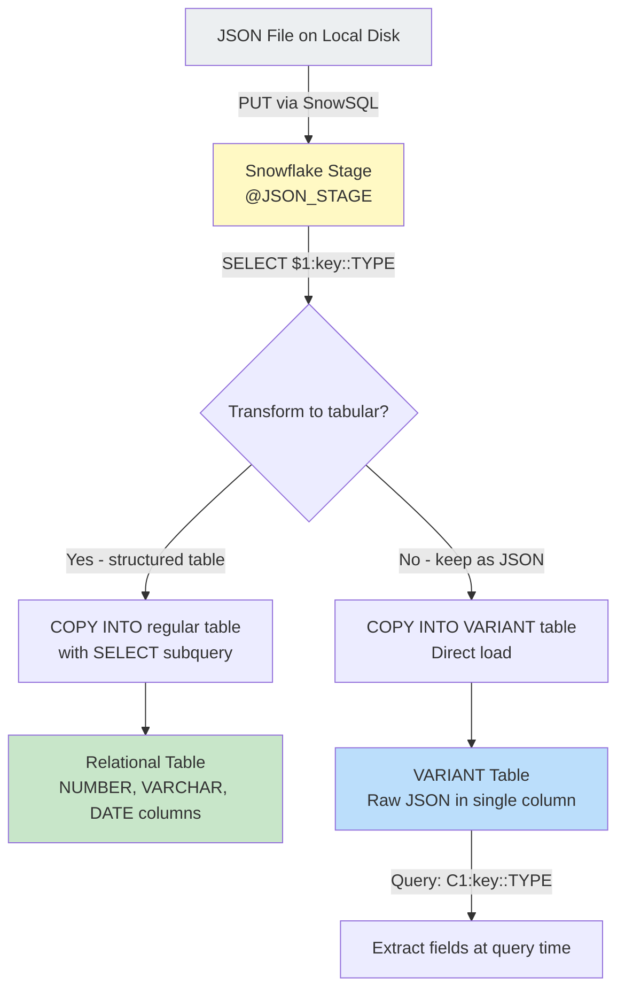

# Lecture 6: Semi-Structured Data — JSON Deep Dive and COPY INTO

---

## 1. Recap: JSON Basics

- JSON = **Key-Value Pair** format
- Each record is wrapped in `{}` (curly braces)
- Multiple records are wrapped in `[]` (array / square brackets)
- All semi-structured formats (JSON, XML, Parquet) present as a **single column** (`$1`) when read from a stage
- Use `$1:key_name` to extract a specific key's value
- Use `::DATATYPE` to cast values to the correct type

---

## 2. Sample JSON File — student data

**File: sample.json**

```json
[
  {
    "student_number": 1,
    "student_name": "Tharun",
    "course": "Snowflake",
    "date_of_joining": "2025-03-15"
  },
  {
    "student_number": 2,
    "student_name": "Sai",
    "course": "Snowflake",
    "date_of_joining": "2025-03-15"
  },
  {
    "student_number": 3,
    "student_name": "Anand",
    "course": "Snowflake",
    "date_of_joining": "2025-03-15"
  }
]
```

**Keys in this file:** `student_number`, `student_name`, `course`, `date_of_joining`

---

## 3. Reading JSON from Stage — Column by Column

First, verify the file exists in the stage:

```sql
LIST @JSON_STAGE;
-- sample.json.gz
```

Read the entire JSON record:

```sql
SELECT $1
FROM @JSON_STAGE
(FILE_FORMAT => 'JSON_FORMAT');
```

Output (one row per JSON object):
```
$1
----------------------------------------------------
{"student_number":1,"student_name":"Tharun","course":"Snowflake","date_of_joining":"2025-03-15"}
{"student_number":2,"student_name":"Sai","course":"Snowflake","date_of_joining":"2025-03-15"}
```

---

## 4. Extracting Individual Keys

```sql
-- Extract student_number key
SELECT $1:student_number
FROM @JSON_STAGE (FILE_FORMAT => 'JSON_FORMAT');
-- Returns: "1", "2", "3" (as strings, quoted)

-- Cast to NUMBER (removes quotes, right-aligns)
SELECT $1:student_number::NUMBER AS STUDENT_NUMBER
FROM @JSON_STAGE (FILE_FORMAT => 'JSON_FORMAT');
-- Returns: 1, 2, 3 (numeric)

-- Cast to VARCHAR (removes surrounding double quotes from string values)
SELECT $1:student_name::VARCHAR AS STUDENT_NAME
FROM @JSON_STAGE (FILE_FORMAT => 'JSON_FORMAT');
-- Returns: Tharun, Sai, Anand

-- Full extraction with all columns
SELECT
    $1:student_number::NUMBER  AS STUDENT_NUMBER,
    $1:student_name::VARCHAR   AS STUDENT_NAME,
    $1:course::VARCHAR         AS COURSE,
    $1:date_of_joining::DATE   AS DATE_OF_JOINING
FROM @JSON_STAGE
(FILE_FORMAT => 'JSON_FORMAT');
```

**Result:**

```
STUDENT_NUMBER | STUDENT_NAME | COURSE    | DATE_OF_JOINING
---------------|--------------|-----------|----------------
1              | Tharun       | Snowflake | 2025-03-15
2              | Sai          | Snowflake | 2025-03-15
3              | Anand        | Snowflake | 2025-03-15
```

---

## 5. Loading JSON Data into a Table

### Create Table

```sql
CREATE TABLE TNS_STUDENTS (
    STUDENT_NUMBER  NUMBER,
    STUDENT_NAME    VARCHAR,
    COURSE          VARCHAR,
    DATE_OF_JOINING DATE
);
```

### Load Using COPY INTO with Subquery

```sql
COPY INTO TNS_STUDENTS
FROM (
    SELECT
        $1:student_number::NUMBER,
        $1:student_name::VARCHAR,
        $1:course::VARCHAR,
        $1:date_of_joining::DATE
    FROM @JSON_STAGE
    (FILE_FORMAT => 'JSON_FORMAT')
);
```

Output:
```
status | rows_loaded | errors_seen
-------|-------------|------------
LOADED | 3           | 0
```

Verify:

```sql
SELECT * FROM TNS_STUDENTS;
```

---

## 6. Working with Multiple JSON Files in the Same Stage

When you have multiple JSON files in a stage, you can:

### 6.1 See All Data (Both Files Combined)

```sql
SELECT $1
FROM @JSON_STAGE
(FILE_FORMAT => 'JSON_FORMAT');
-- Returns records from ALL files
```

### 6.2 Identify Which File Each Record Came From

```sql
SELECT
    METADATA$FILENAME   AS SOURCE_FILE,
    $1:student_number::NUMBER AS STUDENT_NUMBER,
    $1:student_name::VARCHAR  AS STUDENT_NAME
FROM @JSON_STAGE
(FILE_FORMAT => 'JSON_FORMAT');
```

Output:
```
SOURCE_FILE     | STUDENT_NUMBER | STUDENT_NAME
----------------|----------------|-------------
sample.json.gz  | 1              | Tharun
sample.json.gz  | 2              | Sai
car.json.gz     | 1              | John
car.json.gz     | 2              | Jane
```

### 6.3 Load from a Specific File Only

```sql
COPY INTO TNS_STUDENTS
FROM (
    SELECT
        $1:student_number::NUMBER,
        $1:student_name::VARCHAR,
        $1:course::VARCHAR,
        $1:date_of_joining::DATE
    FROM @JSON_STAGE
    (FILE_FORMAT => 'JSON_FORMAT')
)
FILES = ('sample.json.gz');
```

Or using PATTERN:

```sql
COPY INTO TNS_STUDENTS
FROM @JSON_STAGE
FILE_FORMAT = (FORMAT_NAME = 'JSON_FORMAT')
PATTERN = '.*sample.*\\.json\\.gz';
```

---

## 7. Complete JSON Loading Workflow — car.json Example

**File: car.json** (324 records)

```json
{
  "id": 1,
  "first_name": "John",
  "last_name": "Doe",
  "car_make": "Toyota",
  "car_model": "Camry",
  "car_year": 2020
}
```

### Step 1: Upload file via SnowSQL

```bash
PUT file://C:/files/car.json @JSON_STAGE;
```

### Step 2: Create target table

```sql
CREATE TABLE TNS_CARS_INFO (
    ID          NUMBER,
    FIRST_NAME  VARCHAR,
    LAST_NAME   VARCHAR,
    CAR_MAKE    VARCHAR,
    CAR_MODEL   VARCHAR,
    CAR_YEAR    NUMBER
);
```

### Step 3: Preview data from the stage

```sql
SELECT
    $1:id::NUMBER        AS ID,
    $1:first_name::VARCHAR AS FIRST_NAME,
    $1:last_name::VARCHAR  AS LAST_NAME,
    $1:car_make::VARCHAR   AS CAR_MAKE,
    $1:car_model::VARCHAR  AS CAR_MODEL,
    $1:car_year::NUMBER    AS CAR_YEAR
FROM @JSON_STAGE
(FILE_FORMAT => 'JSON_FORMAT')
WHERE METADATA$FILENAME LIKE '%car.json%';
-- Returns 324 rows
```

### Step 4: Load data

```sql
COPY INTO TNS_CARS_INFO
FROM (
    SELECT
        $1:id::NUMBER,
        $1:first_name::VARCHAR,
        $1:last_name::VARCHAR,
        $1:car_make::VARCHAR,
        $1:car_model::VARCHAR,
        $1:car_year::NUMBER
    FROM @JSON_STAGE
    (FILE_FORMAT => 'JSON_FORMAT')
    WHERE METADATA$FILENAME LIKE '%car.json%'
);
```

Output: `LOADED | 324 rows`

### Step 5: Verify

```sql
SELECT COUNT(*) FROM TNS_CARS_INFO;  -- 324
SELECT * FROM TNS_CARS_INFO LIMIT 5;
```

---

## 8. Assigning File Format to a Stage

Instead of specifying the file format in every query, you can attach it directly to the stage:

```sql
-- Attach JSON format to the JSON stage
ALTER STAGE JSON_STAGE
    SET FILE_FORMAT = (FORMAT_NAME = 'JSON_FORMAT');
```

Now queries against this stage no longer need `(FILE_FORMAT => 'JSON_FORMAT')`:

```sql
-- Before altering: must specify format
SELECT $1 FROM @JSON_STAGE (FILE_FORMAT => 'JSON_FORMAT');

-- After altering: format is assumed
SELECT $1 FROM @JSON_STAGE;
```

Verify the stage format:

```sql
DESCRIBE STAGE JSON_STAGE;
-- stage_file_format shows: JSON
```

This also means that `COPY INTO` statements no longer need `FILE_FORMAT`:

```sql
-- Without explicit file format (stage already has JSON format assigned)
COPY INTO TNS_SEMI_STRUCTURED
FROM @JSON_STAGE;
```

> **Interview Answer:** "A copy command must specify a file format in order to execute" → **FALSE**. If the stage already has a file format assigned, no explicit file format is needed in the COPY command.

---

## 9. Storing Raw JSON in VARIANT Columns

Instead of transforming JSON into relational columns, you can store the entire JSON object in a single `VARIANT` column:

```sql
-- Create table with VARIANT column
CREATE TABLE TNS_SEMI_STRUCTURED (
    C1 VARIANT
);

-- Load all JSON files at once
COPY INTO TNS_SEMI_STRUCTURED
FROM @JSON_STAGE
FILE_FORMAT = (FORMAT_NAME = 'JSON_FORMAT');

-- Query by extracting from VARIANT
SELECT
    C1:student_number::NUMBER AS STUDENT_NUMBER,
    C1:student_name::VARCHAR  AS STUDENT_NAME,
    C1:course::VARCHAR        AS COURSE
FROM TNS_SEMI_STRUCTURED;
```

**Advantages of VARIANT storage:**
- No schema changes needed when new JSON keys are added
- Store heterogeneous JSON structures in one column
- Flexible querying — pick the keys you need at query time

---

## 10. VARIANT with File Name Tracking

A common pattern is to store both the file name and the raw JSON content:

```sql
CREATE TABLE TNS_SSD (
    FILE_NAME VARCHAR,
    C1        VARIANT
);

-- Load with file name
COPY INTO TNS_SSD
FROM (
    SELECT
        METADATA$FILENAME,
        $1
    FROM @JSON_STAGE
    (FILE_FORMAT => 'JSON_FORMAT')
);

-- Query
SELECT
    FILE_NAME,
    C1:student_number::NUMBER AS STUDENT_NUMBER,
    C1:student_name::VARCHAR  AS STUDENT_NAME
FROM TNS_SSD;
```

---

## 11. JSON Key Names Are Case-Sensitive

When extracting keys from JSON, **key names must match exactly** (case-sensitive):

```json
{
  "StudentNumber": 1,
  "student_name": "Tharun"
}
```

```sql
-- CORRECT
SELECT $1:StudentNumber FROM @JSON_STAGE (FILE_FORMAT => 'JSON_FORMAT');

-- INCORRECT (returns null — wrong case)
SELECT $1:studentnumber FROM @JSON_STAGE (FILE_FORMAT => 'JSON_FORMAT');
```

---

## 12. COPY INTO File Format — Required vs. Optional

| Scenario                                        | File Format Required in COPY? |
|-------------------------------------------------|-------------------------------|
| Stage has no file format assigned               | YES — must specify            |
| Stage has a file format assigned (ALTER STAGE)  | NO — optional                 |
| Using default CSV files                         | Optional (CSV is default)     |
| Loading JSON without format                     | YES — will fail without it    |

---

## 13. Key Commands Summary

```sql
-- File Format Creation
CREATE FILE FORMAT JSON_FORMAT TYPE = 'JSON';

-- Assign format to stage
ALTER STAGE JSON_STAGE SET FILE_FORMAT = (FORMAT_NAME = 'JSON_FORMAT');

-- Read JSON from stage
SELECT $1 FROM @JSON_STAGE (FILE_FORMAT => 'JSON_FORMAT');

-- Extract specific key
SELECT $1:key_name::DATATYPE AS alias
FROM @JSON_STAGE (FILE_FORMAT => 'JSON_FORMAT');

-- Full transformation query
SELECT
    $1:id::NUMBER,
    $1:first_name::VARCHAR,
    $1:last_name::VARCHAR
FROM @JSON_STAGE (FILE_FORMAT => 'JSON_FORMAT')
WHERE METADATA$FILENAME LIKE '%car.json%';

-- COPY INTO with transformation
COPY INTO table_name
FROM (
    SELECT $1:col1::TYPE, $1:col2::TYPE
    FROM @JSON_STAGE (FILE_FORMAT => 'JSON_FORMAT')
);

-- VARIANT storage
CREATE TABLE semi_table (C1 VARIANT);
COPY INTO semi_table FROM @JSON_STAGE FILE_FORMAT = (FORMAT_NAME = 'JSON_FORMAT');
SELECT C1:key_name::TYPE AS alias FROM semi_table;

-- Multi-file handling
SELECT METADATA$FILENAME AS FILE_NAME, $1 FROM @JSON_STAGE (FILE_FORMAT => 'JSON_FORMAT');

-- Describe stage
DESCRIBE STAGE stage_name;
```

---

## 14. Architecture of JSON Data Loading



---

## 15. Key Terms

| Term              | Definition                                                                       |
|-------------------|----------------------------------------------------------------------------------|
| JSON              | JavaScript Object Notation — key-value pair semi-structured format               |
| Key               | The name/label in a JSON key-value pair (e.g., `"student_number"`)               |
| Value             | The data associated with a key in a JSON pair (e.g., `1`, `"Tharun"`)           |
| VARIANT           | Snowflake data type for storing semi-structured (JSON, XML, Parquet) data        |
| Dollar Notation   | `$1:key_name` — syntax for extracting a JSON key from a stage column             |
| CAST (::)         | Converts JSON string value to typed value (e.g., `::NUMBER`, `::DATE`)           |
| METADATA$FILENAME | Virtual column showing the source file name for each stage record                |
| ALTER STAGE       | Command to modify a stage's properties, including assigning a file format        |
| COPY INTO         | Command to load data from a stage into a Snowflake table                          |
| FILES / PATTERN   | COPY INTO options to specify which files to load by name or regex pattern        |

---

## 16. Summary

- JSON is a **key-value pair** format; extract values using `$1:key_name`
- Always use `::DATATYPE` (CAST) to get properly typed values from JSON
- Multiple JSON files in a stage can be processed together; use `METADATA$FILENAME` to track sources
- You can store raw JSON in `VARIANT` columns — flexible but requires key extraction at query time
- Attaching a file format directly to a stage (via `ALTER STAGE`) removes the need to specify it in every `COPY INTO`
- `COPY INTO` does **not** require an explicit file format if the stage already has one assigned
- JSON key names are **case-sensitive** — match them exactly as they appear in the file
