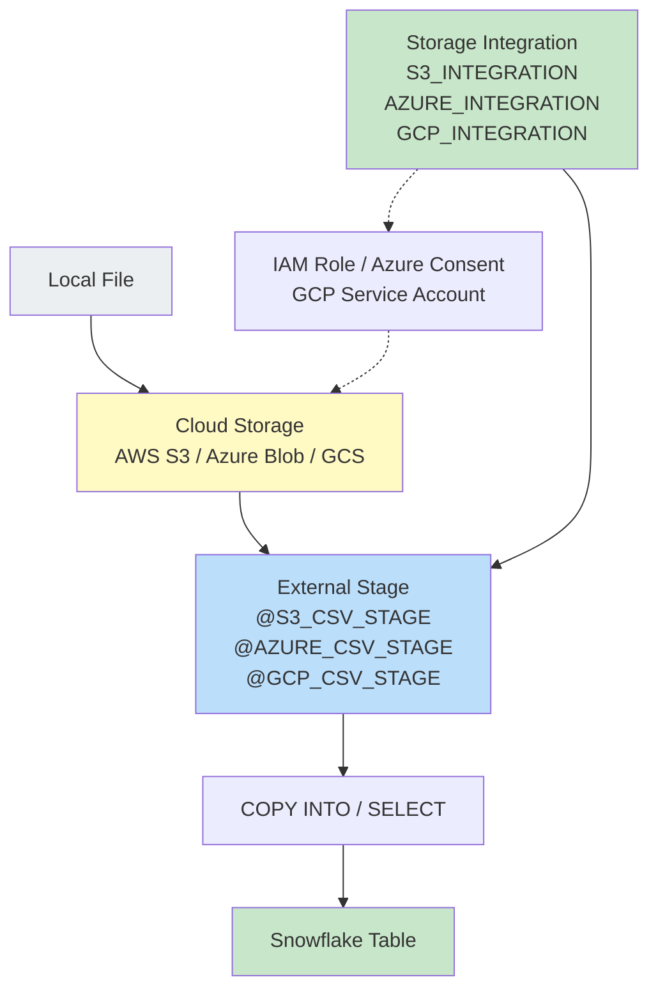

# Lecture 10: External Stages — Azure, GCP, and AWS

---

## 1. Recap: Internal Stages

From previous lectures, all stages created so far (`CSV_STAGE`, `JSON_STAGE`, `XML_STAGE`, `PARQUET_STAGE`) are **internal named stages**. You can verify this with:

```sql
-- List all stages
SHOW STAGES;

-- Or query metadata view
SELECT * FROM INFORMATION_SCHEMA.STAGES;
```

Both commands return the same stages. The key difference (covered in Lecture 9) is that `SHOW STAGES` only returns stages in the **current schema**, while `INFORMATION_SCHEMA.STAGES` returns stages from all schemas in the current database.

---

## 2. Why External Stages?

An **external stage** points to files stored in a cloud provider's storage service (AWS S3, Azure Blob Storage, or GCP Cloud Storage) rather than inside Snowflake's own storage.

### Analogy: Windows Folder Permissions

In Windows, a folder on your computer has permissions:
- **Full Control** = Read + Write + Delete + Rename + Modify
- If you log in as any user with Full Control, you can do everything with files in that folder

Similarly in cloud storage, Snowflake needs a **permission/role** to access files in cloud storage buckets or containers.

### Cloud Storage Comparison

| Platform  | Storage Unit     | Sub-unit     | Access Mechanism                          |
|-----------|------------------|--------------|-------------------------------------------|
| Windows   | Drive/Location   | Folder       | Windows permissions (Full Control)        |
| AWS       | S3 Bucket        | Folder/Prefix| IAM Role with `AmazonS3FullAccess`        |
| Azure     | Storage Account  | Container    | `Storage Blob Data Contributor` role      |
| GCP       | GCS Bucket       | Folder       | `Cloud Storage Storage Admin` role        |

---

## 3. Storage Integration Object

To allow Snowflake to communicate with external cloud storage, you must create a **Storage Integration** object in Snowflake.

### What Is a Storage Integration?

A Storage Integration is a Snowflake object that:
- Establishes a trusted connection between Snowflake and a cloud provider
- Stores the credentials and allowed locations securely
- Is referenced when creating external stages

```sql
-- See all existing integration objects
SHOW INTEGRATIONS;
```

If no integrations exist yet, this returns an empty result.

---

## 4. Microsoft Azure External Stage — Step-by-Step

### 4.1 Azure Storage Setup

**Step 1: Create a Storage Account**

In Azure Portal, navigate to **Storage Accounts** → **Create**.

- Resource Group: `RG-April-2025`
- Storage Account Name: `sa-april-2025` (must be globally unique, lowercase, no special chars)
- Click **Review + Create** → **Create**
- Wait for "Deployment is complete" → Click **Go to resource**

**Step 2: Create a Container**

Inside the storage account, scroll to **Containers** → click the **+** button.

- Container Name: `stg-csv-files` (Azure does not allow underscores; use hyphens)
- Click **Create**

**Step 3: Upload a File**

Inside the container, click **Upload** → browse and select your CSV file (e.g., `emp.csv`) → click **Upload**.

**Step 4: Get the File Path**

To find the full path of the uploaded file:
1. Click the three dots (**...**) next to the file
2. Click **Properties**
3. Copy the URL

The URL format is:
```
https://<storage_account_name>.blob.core.windows.net/<container_name>/<file_name>
```

Example:
```
https://sa-april-2025.blob.core.windows.net/stg-csv-files/emp.csv
```

This maps to:
- **Storage Account** = location (like a drive)
- **Container** = folder
- **File name** = file

### 4.2 Get the Azure Tenant ID

In Azure Portal, navigate to **Azure Active Directory** (now called **Microsoft Entra ID** or **Microsoft N3D**) → find and copy the **Tenant ID**.

### 4.3 Create the Storage Integration in Snowflake

Navigate to your database/schema in Snowflake (Databases → Sales_DB → Sales_Schema → Create → Storage Integration → Microsoft Azure). Copy the generated syntax:

```sql
CREATE STORAGE INTEGRATION AZURE_INTEGRATION
    TYPE = EXTERNAL_STAGE
    STORAGE_PROVIDER = 'AZURE'
    ENABLED = TRUE
    AZURE_TENANT_ID = '<your_tenant_id>'
    STORAGE_ALLOWED_LOCATIONS = (
        'azure://sa-april-2025.blob.core.windows.net/stg-csv-files/'
    );
```

- `TYPE = EXTERNAL_STAGE` — this integration is for accessing external storage
- `STORAGE_PROVIDER = 'AZURE'` — specifies Microsoft Azure
- `AZURE_TENANT_ID` — the Azure tenant/directory ID copied from Azure AD
- `STORAGE_ALLOWED_LOCATIONS` — the exact Azure container path Snowflake is permitted to access

```sql
-- Verify the integration was created
SHOW INTEGRATIONS;
-- Returns: AZURE_INTEGRATION
```

### 4.4 Describe the Integration and Get the Consent URL

```sql
DESCRIBE STORAGE INTEGRATION AZURE_INTEGRATION;
```

Key parameters returned:

| Parameter                   | Source     | Purpose                                            |
|-----------------------------|------------|----------------------------------------------------|
| `STORAGE_ALLOWED_LOCATIONS` | Azure      | The permitted access paths                         |
| `AZURE_TENANT_ID`           | Azure      | The directory/tenant identifier                    |
| `AZURE_CONSENT_URL`         | Snowflake  | URL to grant Snowflake access to your Azure tenant |
| `AZURE_MULTI_TENANT_APP_NAME` | Snowflake | The app name Snowflake registers in your tenant  |

### 4.5 Grant Access via Azure Consent URL

1. Copy the `AZURE_CONSENT_URL` from the DESCRIBE output
2. Open it in a browser
3. You will see a consent dialog — check the box and click **Accept**
4. You will be redirected to a Snowflake confirmation page

This registers Snowflake's multi-tenant application in your Azure tenant.

### 4.6 Assign Role in Azure Container

1. Copy the `AZURE_MULTI_TENANT_APP_NAME` from the DESCRIBE output
2. In Azure Portal, navigate to your **Storage Account** → **Container**
3. Click **Access Control (IAM)**
4. Click **Add** → **Add role assignment**
5. Search for and select: **Storage Blob Data Contributor**
6. Click **Next** → **Select members**
7. Paste the Multi-Tenant App Name into the search box
8. Select it → click **Select** → **Review + assign**

Role assignment confirmation: "The role assignment has been added."

### 4.7 Create the External Stage in Snowflake

```sql
CREATE STAGE AZURE_CSV_STAGE
    URL = 'azure://sa-april-2025.blob.core.windows.net/stg-csv-files/'
    STORAGE_INTEGRATION = AZURE_INTEGRATION;
```

- `URL` — the Azure container path (replaces `https://` with `azure://`)
- `STORAGE_INTEGRATION` — the integration object name created earlier

```sql
-- Verify the stage
SHOW STAGES;
-- AZURE_CSV_STAGE | external | AZURE

-- List files in the stage
LIST @AZURE_CSV_STAGE;
-- emp.csv.gz (or emp.csv depending on original upload)
```

### 4.8 Load Data from Azure Stage

The loading process is identical to internal stages:

```sql
-- Preview data
SELECT $1, $2, $3, $4, $5, $6, $7, $8, $9, $10
FROM @AZURE_CSV_STAGE
(FILE_FORMAT => 'FILE_CSV_FORMAT');

-- Load into table
COPY INTO EMPLOYEE
FROM @AZURE_CSV_STAGE
FILE_FORMAT = (FORMAT_NAME = 'FILE_CSV_FORMAT');

-- Verify
SELECT COUNT(*) FROM EMPLOYEE;  -- 25
```

---

## 5. GCP Cloud Storage External Stage — Step-by-Step

### 5.1 GCP Storage Setup

**Step 1: Create a GCS Bucket**

In GCP Console, navigate to **Navigation Menu** → **Cloud Storage** → **Buckets** → **Create**.

- Bucket Name: `bkt-april-2025` (globally unique)
- Click **Continue** through options → **Create** → **Confirm**

**Step 2: Create a Folder**

Inside the bucket, click **Create Folder**.

- Folder Name: `stg_csv_files`
- Click **Create**

**Step 3: Upload a File**

Select the folder → click **Upload Files** → select your file → click **Upload**.

**Step 4: Copy the Location Path**

Click the three-dot menu next to the file → **Copy GCS path**. It will look like:

```
gs://bkt-april-2025/stg_csv_files/emp.csv
```

The stage URL format is:
```
gcs://bkt-april-2025/stg_csv_files/
```

### 5.2 Create the GCP Storage Integration

In Snowflake (Databases → Sales_DB → Sales_Schema → Create → Storage Integration → Google Cloud Platform):

```sql
CREATE STORAGE INTEGRATION GCP_INTEGRATION
    TYPE = EXTERNAL_STAGE
    STORAGE_PROVIDER = 'GCS'
    ENABLED = TRUE
    STORAGE_ALLOWED_LOCATIONS = (
        'gcs://bkt-april-2025/stg_csv_files/'
    );
```

Note: GCP integration requires only `STORAGE_ALLOWED_LOCATIONS` — no tenant ID is needed.

```sql
-- Verify
SHOW INTEGRATIONS;
-- AZURE_INTEGRATION, GCP_INTEGRATION
```

### 5.3 Describe the GCP Integration and Get Service Account

```sql
DESCRIBE STORAGE INTEGRATION GCP_INTEGRATION;
```

Key parameters:

| Parameter                    | Source     | Purpose                                          |
|------------------------------|------------|--------------------------------------------------|
| `STORAGE_ALLOWED_LOCATIONS`  | GCP        | Permitted GCS paths                              |
| `STORAGE_GCP_SERVICE_ACCOUNT`| Snowflake  | The GCP service account Snowflake uses to access |

Copy the `STORAGE_GCP_SERVICE_ACCOUNT` value (it looks like an email address).

### 5.4 Grant Access in GCP

1. In GCP Console, navigate to **Cloud Storage** → **Buckets**
2. Click on your bucket name (`bkt-april-2025`)
3. Click the **Permissions** tab
4. Click **Grant Access**
5. In **New principals**, paste the GCP Service Account email
6. In **Role**, search for and select: **Cloud Storage Storage Admin** (under Storage)
7. Click **Save**

### 5.5 Create the GCP External Stage

```sql
CREATE STAGE GCP_CSV_STAGE
    URL = 'gcs://bkt-april-2025/stg_csv_files/'
    STORAGE_INTEGRATION = GCP_INTEGRATION;

-- Verify files
LIST @GCP_CSV_STAGE;
```

### 5.6 Load Data from GCP Stage

```sql
-- Delete existing data for demo
DELETE FROM EMPLOYEE;

-- Load from GCP external stage
COPY INTO EMPLOYEE
FROM @GCP_CSV_STAGE
FILE_FORMAT = (FORMAT_NAME = 'FILE_CSV_FORMAT');

-- Verify
SELECT COUNT(*) FROM EMPLOYEE;  -- 25
```

---

## 6. AWS S3 External Stage — Step-by-Step

### 6.1 AWS S3 Storage Setup

**Step 1: Create an S3 Bucket**

In AWS Console, navigate to **S3** → **Create bucket**.

- Bucket Name: `bkt-april-2025` (globally unique, lowercase)
- Scroll down → click **Create bucket**

**Step 2: Create Folders**

Inside the bucket, click **Create folder**:
- `stg_csv_files`
- `stg_json_files`
- `stg_xml_files`

(Create separate folders for each file type as needed.)

**Step 3: Upload Files**

Navigate to the `stg_csv_files` folder → click **Upload** → **Add files** → select `emp.csv` → **Upload**.

**Step 4: Copy the S3 Path**

Select the uploaded file → click **Copy S3 URI**. The format is:

```
s3://bkt-april-2025/stg_csv_files/emp.csv
```

The stage URL (folder level) is: `s3://bkt-april-2025/stg_csv_files/`

### 6.2 Create an IAM Role in AWS

AWS uses IAM (Identity and Access Management) roles to grant Snowflake access.

**Step 1: Navigate to IAM**

In AWS Console → search for and select **IAM** → click **Roles** in the left menu.

**Step 2: Create a New Role**

Click **Create role**.
- Trusted entity type: **AWS account**
- Select: **Another AWS account**
- Account ID: enter `123456789` (dummy — we will update this later)
- Enable: **Require external ID**
- External ID: enter `12345` (dummy — we will update this with the real value from Snowflake)
- Click **Next**

**Step 3: Attach Permissions**

Search for and select: **AmazonS3FullAccess** → check the box → click **Next**.

**Step 4: Name and Create the Role**

- Role Name: `SnowflakeS3Role` (or any descriptive name)
- Click **Create role**

**Step 5: Get the Role ARN**

Search for the newly created role → click on it. Copy the **ARN** (Amazon Resource Name). It looks like:

```
arn:aws:iam::123456789012:role/SnowflakeS3Role
```

### 6.3 Create the AWS Storage Integration in Snowflake

Navigate to Databases → Sales_DB → Sales_Schema → Create → Storage Integration → Amazon S3:

```sql
CREATE STORAGE INTEGRATION S3_INTEGRATION
    TYPE = EXTERNAL_STAGE
    STORAGE_PROVIDER = 'S3'
    ENABLED = TRUE
    STORAGE_AWS_ROLE_ARN = 'arn:aws:iam::123456789012:role/SnowflakeS3Role'
    STORAGE_ALLOWED_LOCATIONS = (
        's3://bkt-april-2025/stg_csv_files/',
        's3://bkt-april-2025/stg_json_files/'
    );
```

- `STORAGE_AWS_ROLE_ARN` — the ARN of the IAM role created in step above
- `STORAGE_ALLOWED_LOCATIONS` — one or more S3 paths Snowflake is allowed to access

```sql
-- Verify integrations
SHOW INTEGRATIONS;
-- AZURE_INTEGRATION, GCP_INTEGRATION, S3_INTEGRATION
```

### 6.4 Describe the S3 Integration and Update the Trust Policy

```sql
DESCRIBE STORAGE INTEGRATION S3_INTEGRATION;
```

Key parameters:

| Parameter                  | Source     | Purpose                                          |
|----------------------------|------------|--------------------------------------------------|
| `STORAGE_ALLOWED_LOCATIONS`| AWS        | Permitted S3 paths                               |
| `STORAGE_AWS_ROLE_ARN`     | AWS        | IAM Role ARN provided during creation            |
| `STORAGE_AWS_EXTERNAL_ID`  | Snowflake  | The real external ID to use in the trust policy  |
| `STORAGE_AWS_IAM_USER_ARN` | Snowflake  | Snowflake's AWS user that assumes the role       |

**Important:** Earlier, when creating the IAM role, you used a dummy External ID (`12345`). The actual external ID is provided by Snowflake in the `STORAGE_AWS_EXTERNAL_ID` parameter. You must update the IAM role's trust policy with the correct values.

### 6.5 Update the IAM Trust Policy

1. In AWS IAM, navigate to **Roles** → search for your role → click it
2. Click the **Trust relationships** tab
3. Click **Edit trust policy**
4. Update two values in the policy JSON:
   - Replace the `sts:ExternalId` value with the real `STORAGE_AWS_EXTERNAL_ID` from Snowflake
   - Replace the dummy account ID with the real `STORAGE_AWS_IAM_USER_ARN` from Snowflake

Example trust policy after update:

```json
{
  "Version": "2012-10-17",
  "Statement": [
    {
      "Effect": "Allow",
      "Principal": {
        "AWS": "<STORAGE_AWS_IAM_USER_ARN>"
      },
      "Action": "sts:AssumeRole",
      "Condition": {
        "StringEquals": {
          "sts:ExternalId": "<STORAGE_AWS_EXTERNAL_ID>"
        }
      }
    }
  ]
}
```

5. Click **Update policy**

### 6.6 Create the S3 External Stage

Since you have multiple S3 folders, create a separate stage for each:

```sql
-- Stage for CSV files
CREATE STAGE S3_CSV_STAGE
    URL = 's3://bkt-april-2025/stg_csv_files/'
    STORAGE_INTEGRATION = S3_INTEGRATION;

-- Stage for JSON files
CREATE STAGE S3_JSON_STAGE
    URL = 's3://bkt-april-2025/stg_json_files/'
    STORAGE_INTEGRATION = S3_INTEGRATION;

-- Verify
LIST @S3_CSV_STAGE;
LIST @S3_JSON_STAGE;
```

### 6.7 Load Data from AWS External Stage

```sql
-- Load from S3 CSV stage
COPY INTO EMPLOYEE
FROM @S3_CSV_STAGE
FILE_FORMAT = (FORMAT_NAME = 'FILE_CSV_FORMAT');

-- 25 records loaded

-- Query JSON from S3
SELECT
    $1:id::NUMBER        AS ID,
    $1:first_name::VARCHAR AS FIRST_NAME,
    $1:last_name::VARCHAR  AS LAST_NAME,
    $1:car_make::VARCHAR   AS CAR_MAKE,
    $1:car_model::VARCHAR  AS CAR_MODEL,
    $1:car_year::NUMBER    AS CAR_YEAR
FROM @S3_JSON_STAGE
(FILE_FORMAT => 'JSON_FORMAT')
WHERE METADATA$FILENAME LIKE '%car.json%';
```

The data extraction process is **identical** to internal stages — only the stage name (and the underlying cloud provider) is different.

---

## 7. Verifying All Stages

After creating all internal and external stages:

```sql
SHOW STAGES;
```

Output includes all stages with their type and provider:

```
Stage Name        | Type     | Cloud Provider | URL
------------------|----------|----------------|------------------------------------
CSV_STAGE         | internal | -              | -
JSON_STAGE        | internal | -              | -
XML_STAGE         | internal | -              | -
PARQUET_STAGE     | internal | -              | -
AZURE_CSV_STAGE   | external | AZURE          | azure://sa-april-2025.blob...
GCP_CSV_STAGE     | external | GCS            | gcs://bkt-april-2025/...
S3_CSV_STAGE      | external | S3             | s3://bkt-april-2025/stg_csv_files/
S3_JSON_STAGE     | external | S3             | s3://bkt-april-2025/stg_json_files/
```

```sql
-- All stages across all schemas in the database
SELECT * FROM INFORMATION_SCHEMA.STAGES;
```

---

## 8. External Stage Architecture



---

## 9. Comparison: Azure vs GCP vs AWS Integration

| Feature               | Azure                        | GCP                          | AWS                           |
|-----------------------|------------------------------|------------------------------|-------------------------------|
| Storage Unit          | Storage Account + Container  | GCS Bucket + Folder          | S3 Bucket + Folder/Prefix     |
| URL Format            | `azure://account.blob.core...`| `gcs://bucket/folder/`      | `s3://bucket/folder/`         |
| Integration Parameter | `AZURE_TENANT_ID`            | None (just locations)        | `STORAGE_AWS_ROLE_ARN`        |
| Auth Mechanism        | Consent URL + Role Assignment| Grant GCP Service Account    | Update IAM Trust Policy       |
| Role to Assign        | Storage Blob Data Contributor| Cloud Storage Storage Admin  | AmazonS3FullAccess            |
| Snowflake Provides    | Consent URL, App Name        | GCP Service Account          | External ID, IAM User ARN     |

---

## 10. Key Commands Summary

```sql
-- Check existing integrations
SHOW INTEGRATIONS;

-- Create Azure storage integration
CREATE STORAGE INTEGRATION AZURE_INTEGRATION
    TYPE = EXTERNAL_STAGE
    STORAGE_PROVIDER = 'AZURE'
    ENABLED = TRUE
    AZURE_TENANT_ID = '<tenant_id>'
    STORAGE_ALLOWED_LOCATIONS = ('azure://account.blob.core.windows.net/container/');

-- Create GCP storage integration
CREATE STORAGE INTEGRATION GCP_INTEGRATION
    TYPE = EXTERNAL_STAGE
    STORAGE_PROVIDER = 'GCS'
    ENABLED = TRUE
    STORAGE_ALLOWED_LOCATIONS = ('gcs://bucket/folder/');

-- Create AWS S3 storage integration
CREATE STORAGE INTEGRATION S3_INTEGRATION
    TYPE = EXTERNAL_STAGE
    STORAGE_PROVIDER = 'S3'
    ENABLED = TRUE
    STORAGE_AWS_ROLE_ARN = 'arn:aws:iam::123456789012:role/RoleName'
    STORAGE_ALLOWED_LOCATIONS = ('s3://bucket/folder1/', 's3://bucket/folder2/');

-- Describe integration (get consent URL, service account, external ID)
DESCRIBE STORAGE INTEGRATION AZURE_INTEGRATION;
DESCRIBE STORAGE INTEGRATION GCP_INTEGRATION;
DESCRIBE STORAGE INTEGRATION S3_INTEGRATION;

-- Create external stage
CREATE STAGE S3_CSV_STAGE
    URL = 's3://bucket/folder/'
    STORAGE_INTEGRATION = S3_INTEGRATION;

-- List files in external stage
LIST @S3_CSV_STAGE;

-- Query data from external stage
SELECT $1, $2, $3 FROM @S3_CSV_STAGE (FILE_FORMAT => 'FILE_CSV_FORMAT');

-- Load data from external stage
COPY INTO EMPLOYEE
FROM @S3_CSV_STAGE
FILE_FORMAT = (FORMAT_NAME = 'FILE_CSV_FORMAT');
```

---

## 11. Key Terms

| Term                        | Definition                                                                              |
|-----------------------------|-----------------------------------------------------------------------------------------|
| External Stage              | A Snowflake stage that points to cloud storage (S3, Azure Blob, GCS)                   |
| Storage Integration         | A Snowflake object that establishes trusted communication with cloud storage             |
| AZURE_TENANT_ID             | The Azure Active Directory identifier for your Azure subscription                        |
| AZURE_CONSENT_URL           | URL to grant Snowflake permission to register in your Azure tenant                      |
| AZURE_MULTI_TENANT_APP_NAME | The name of Snowflake's application registered in your Azure tenant                     |
| Storage Blob Data Contributor| Azure role that allows Snowflake to read/write files in Azure containers               |
| STORAGE_GCP_SERVICE_ACCOUNT | The GCP service account email Snowflake uses to access GCS buckets                     |
| Cloud Storage Storage Admin | GCP role that grants Snowflake full access to GCS bucket objects                       |
| IAM Role                    | AWS Identity and Access Management role granting permissions to S3                     |
| STORAGE_AWS_ROLE_ARN        | Amazon Resource Name of the IAM role Snowflake will assume                             |
| STORAGE_AWS_EXTERNAL_ID     | Unique ID Snowflake provides; must be placed in the IAM role's trust policy            |
| STORAGE_AWS_IAM_USER_ARN    | Snowflake's own AWS user ARN; used as the Principal in the IAM trust policy            |
| AmazonS3FullAccess          | AWS managed policy granting full S3 read/write/delete access                           |
| Trust Policy                | JSON policy in an IAM role defining which external entities can assume the role         |

---

## 12. Summary

- External stages point to files in **cloud provider storage** (AWS S3, Azure Blob, GCS) rather than inside Snowflake
- A **Storage Integration** object is required to securely connect Snowflake to cloud storage — one integration per cloud provider
- **Azure** setup: create storage account → container → upload file → create integration with `AZURE_TENANT_ID` and `STORAGE_ALLOWED_LOCATIONS` → grant consent via URL → assign `Storage Blob Data Contributor` role to Snowflake's multi-tenant app
- **GCP** setup: create bucket → folder → upload file → create integration with `STORAGE_ALLOWED_LOCATIONS` → grant `Cloud Storage Storage Admin` to the `STORAGE_GCP_SERVICE_ACCOUNT`
- **AWS** setup: create S3 bucket → folder → upload file → create IAM role with `AmazonS3FullAccess` → create integration with `STORAGE_AWS_ROLE_ARN` and `STORAGE_ALLOWED_LOCATIONS` → update IAM trust policy with `STORAGE_AWS_EXTERNAL_ID` and `STORAGE_AWS_IAM_USER_ARN` from Snowflake
- Once an external stage is created, reading and loading data is **identical** to internal stages — only the stage name changes
- You can create **multiple stages** from a single integration object, each pointing to a different folder/prefix within the allowed locations
- All three cloud providers charge approximately ₹2 for initial credit card verification; 12-month free tiers are available for AWS and Azure, 90-day for GCP
