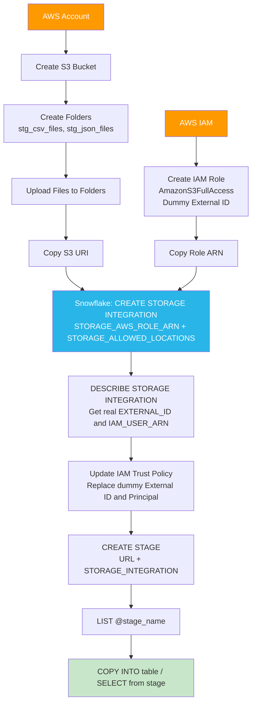
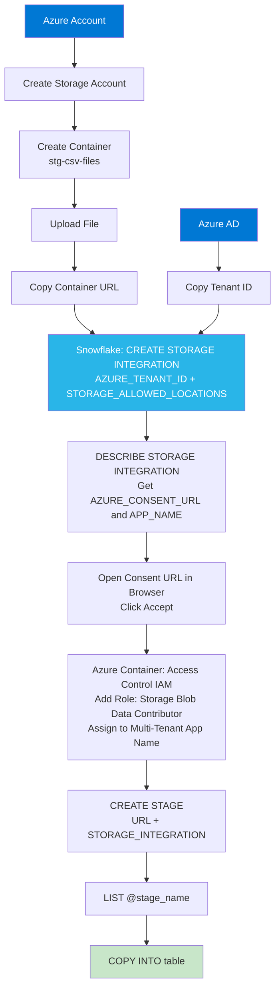

# Lecture 11: Storage Integration Deep Dive — AWS, Azure, GCP, and ALTER STORAGE INTEGRATION

---

## 1. Recap: Storage Integration Concepts

From Lecture 10, a **Storage Integration** is a Snowflake object that acts as a bridge between Snowflake and cloud storage. It contains:
- The cloud provider type
- The allowed storage locations (which paths Snowflake is permitted to read/write)
- Provider-specific authentication details (Tenant ID for Azure, Role ARN for AWS)

```sql
-- Review all existing integrations
SHOW INTEGRATIONS;
-- Returns: AZURE_INTEGRATION, GCP_INTEGRATION, S3_INTEGRATION
```

---

## 2. DESCRIBE STORAGE INTEGRATION — Full Parameter Reference

The most important command for working with storage integrations is `DESCRIBE STORAGE INTEGRATION`. It reveals all the parameters you provided plus the additional parameters Snowflake generates automatically.

### Azure Integration Parameters

```sql
DESCRIBE STORAGE INTEGRATION AZURE_INTEGRATION;
```

| Parameter                      | Source    | Description                                              |
|-------------------------------|-----------|----------------------------------------------------------|
| `STORAGE_ALLOWED_LOCATIONS`    | You       | Azure container paths Snowflake can access               |
| `AZURE_TENANT_ID`              | You       | Your Azure Active Directory Tenant ID                    |
| `AZURE_CONSENT_URL`            | Snowflake | Click this URL to approve Snowflake in your Azure tenant |
| `AZURE_MULTI_TENANT_APP_NAME`  | Snowflake | The name of the Snowflake app registered in Azure AD     |

### GCP Integration Parameters

```sql
DESCRIBE STORAGE INTEGRATION GCP_INTEGRATION;
```

| Parameter                      | Source    | Description                                              |
|-------------------------------|-----------|----------------------------------------------------------|
| `STORAGE_ALLOWED_LOCATIONS`    | You       | GCS bucket paths Snowflake can access                    |
| `STORAGE_GCP_SERVICE_ACCOUNT`  | Snowflake | GCP service account email; grant this access to your GCS bucket |

### AWS S3 Integration Parameters

```sql
DESCRIBE STORAGE INTEGRATION S3_INTEGRATION;
```

| Parameter                      | Source    | Description                                              |
|-------------------------------|-----------|----------------------------------------------------------|
| `STORAGE_ALLOWED_LOCATIONS`    | You       | S3 bucket/folder paths Snowflake can access              |
| `STORAGE_AWS_ROLE_ARN`         | You       | IAM Role ARN provided when creating the integration      |
| `STORAGE_AWS_EXTERNAL_ID`      | Snowflake | Real External ID — must replace dummy value in IAM trust policy |
| `STORAGE_AWS_IAM_USER_ARN`     | Snowflake | Snowflake's own AWS identity — must be the Principal in trust policy |

---

## 3. AWS Integration — Detailed Trust Policy Update

This is the most technically complex part of the AWS setup. Here is the complete flow:

### 3.1 The External ID Problem

When creating the IAM role in AWS (before creating the integration in Snowflake), you do not yet know the real External ID. You enter a dummy value (e.g., `12345`). After the integration is created, Snowflake provides the correct External ID via `DESCRIBE STORAGE INTEGRATION`.

### 3.2 Before Updating the Trust Policy

When the IAM role was first created, the trust policy looks like this:

```json
{
  "Version": "2012-10-17",
  "Statement": [
    {
      "Effect": "Allow",
      "Principal": {
        "AWS": "arn:aws:iam::111111111111:root"
      },
      "Action": "sts:AssumeRole",
      "Condition": {
        "StringEquals": {
          "sts:ExternalId": "12345"
        }
      }
    }
  ]
}
```

Problems with this initial policy:
1. The `sts:ExternalId` is `12345` — a dummy value
2. The `Principal` AWS value is your own account ID — not Snowflake's identity

### 3.3 After Updating the Trust Policy

Copy the values from `DESCRIBE STORAGE INTEGRATION S3_INTEGRATION`:
- `STORAGE_AWS_EXTERNAL_ID` → replace `"12345"` in the policy
- `STORAGE_AWS_IAM_USER_ARN` → replace the `Principal.AWS` value

Correct trust policy:

```json
{
  "Version": "2012-10-17",
  "Statement": [
    {
      "Effect": "Allow",
      "Principal": {
        "AWS": "<STORAGE_AWS_IAM_USER_ARN>"
      },
      "Action": "sts:AssumeRole",
      "Condition": {
        "StringEquals": {
          "sts:ExternalId": "<STORAGE_AWS_EXTERNAL_ID>"
        }
      }
    }
  ]
}
```

Steps:
1. In AWS Console: IAM → Roles → find your role → click it
2. Click **Trust relationships** tab
3. Click **Edit trust policy**
4. Replace the two placeholder values
5. Click **Update policy**

---

## 4. Creating Stages from Storage Integration Objects

Each integration object can serve **multiple stages**, as long as each stage URL is in the integration's `STORAGE_ALLOWED_LOCATIONS`.

### One Integration — Multiple Stages

```sql
-- S3 integration with two allowed locations
CREATE STORAGE INTEGRATION S3_INTEGRATION
    TYPE = EXTERNAL_STAGE
    STORAGE_PROVIDER = 'S3'
    ENABLED = TRUE
    STORAGE_AWS_ROLE_ARN = 'arn:aws:iam::123456789012:role/SnowflakeS3Role'
    STORAGE_ALLOWED_LOCATIONS = (
        's3://bkt-april-2025/stg_csv_files/',
        's3://bkt-april-2025/stg_json_files/'
    );

-- Create stage for CSV files
CREATE STAGE S3_CSV_STAGE
    URL = 's3://bkt-april-2025/stg_csv_files/'
    STORAGE_INTEGRATION = S3_INTEGRATION;

-- Create stage for JSON files
CREATE STAGE S3_JSON_STAGE
    URL = 's3://bkt-april-2025/stg_json_files/'
    STORAGE_INTEGRATION = S3_INTEGRATION;
```

Both stages use the same integration object but point to different folders.

### DESCRIBE STAGE — Viewing Stage Properties

```sql
DESCRIBE STAGE S3_CSV_STAGE;
```

Key properties:
- `stage_location` — the full S3/Azure/GCS URL
- `stage_type` — `External Named`
- `cloud` — AWS, AZURE, or GCS
- `region` — the cloud region of the storage

---

## 5. Adding New Allowed Locations — ALTER STORAGE INTEGRATION

Over time, you may need to give Snowflake access to additional folders or buckets that were not listed when the integration was first created.

### The Problem

Suppose you try to create a new stage pointing to a location that is NOT in the integration's allowed locations:

```sql
-- Trying to create a stage for XML files (location not yet allowed)
CREATE STAGE S3_XML_STAGE
    URL = 's3://bkt-april-2025/stg_xml_files/'
    STORAGE_INTEGRATION = S3_INTEGRATION;
```

Error:
```
This location is not allowed by the integration object. 
Please use DESCRIBE STORAGE INTEGRATION to check allowed and blocked locations.
```

### Why This Happens

The integration object was created with only two allowed locations:
- `s3://bkt-april-2025/stg_csv_files/`
- `s3://bkt-april-2025/stg_json_files/`

The XML location `s3://bkt-april-2025/stg_xml_files/` is not in the list, so Snowflake blocks the stage creation.

### Solution: ALTER STORAGE INTEGRATION

```sql
ALTER STORAGE INTEGRATION S3_INTEGRATION
    SET STORAGE_ALLOWED_LOCATIONS = (
        's3://bkt-april-2025/stg_csv_files/',
        's3://bkt-april-2025/stg_json_files/',
        's3://bkt-april-2025/stg_xml_files/'
    );
```

**Important:** When using `ALTER STORAGE INTEGRATION ... SET STORAGE_ALLOWED_LOCATIONS`, you must include ALL locations you want to allow — including the existing ones. If you omit existing locations, they are removed.

```sql
-- Verify the update
DESCRIBE STORAGE INTEGRATION S3_INTEGRATION;
-- STORAGE_ALLOWED_LOCATIONS now shows 3 locations

-- Now the stage creation will succeed
CREATE STAGE S3_XML_STAGE
    URL = 's3://bkt-april-2025/stg_xml_files/'
    STORAGE_INTEGRATION = S3_INTEGRATION;

-- Verify
LIST @S3_XML_STAGE;
```

### Adding Even More Locations

The same ALTER pattern applies when adding a 4th location (e.g., for Parquet files):

```sql
-- Try to create a new stage for parquet — will fail if location not allowed
CREATE STAGE S3_PARQUET_STAGE
    URL = 's3://bkt-april-2025/stg_parquet_files/'
    STORAGE_INTEGRATION = S3_INTEGRATION;
-- ERROR: location not allowed

-- Alter to add the parquet location
ALTER STORAGE INTEGRATION S3_INTEGRATION
    SET STORAGE_ALLOWED_LOCATIONS = (
        's3://bkt-april-2025/stg_csv_files/',
        's3://bkt-april-2025/stg_json_files/',
        's3://bkt-april-2025/stg_xml_files/',
        's3://bkt-april-2025/stg_parquet_files/'
    );

-- Now the stage can be created
CREATE STAGE S3_PARQUET_STAGE
    URL = 's3://bkt-april-2025/stg_parquet_files/'
    STORAGE_INTEGRATION = S3_INTEGRATION;

-- Verify files
LIST @S3_PARQUET_STAGE;
```

---

## 6. Working with Data from External Stages — Full Examples

### 6.1 JSON Data from S3

After uploading `car.json` to `s3://bkt-april-2025/stg_json_files/`:

```sql
-- Query JSON from S3 external stage
SELECT
    $1:id::NUMBER          AS ID,
    $1:first_name::VARCHAR AS FIRST_NAME,
    $1:last_name::VARCHAR  AS LAST_NAME,
    $1:car_make::VARCHAR   AS CAR_MAKE,
    $1:car_model::VARCHAR  AS CAR_MODEL,
    $1:car_year::NUMBER    AS CAR_YEAR
FROM @S3_JSON_STAGE
(FILE_FORMAT => 'JSON_FORMAT')
WHERE METADATA$FILENAME LIKE '%car.json%';
-- Returns 324 rows
```

The process is identical to internal JSON stages — only `@JSON_STAGE` is replaced with `@S3_JSON_STAGE`.

### 6.2 XML Data from S3

After uploading `emp_sample.xml` to the XML folder and creating `@S3_XML_STAGE`:

```sql
-- Load XML from S3 external stage using LATERAL FLATTEN
INSERT INTO EMP
SELECT
    XMLGET(b.VALUE, 'EMPNO'):$::NUMBER,
    XMLGET(b.VALUE, 'ENAME'):$::VARCHAR,
    XMLGET(b.VALUE, 'JOB'):$::VARCHAR,
    XMLGET(b.VALUE, 'MGR'):$::NUMBER,
    XMLGET(b.VALUE, 'HIREDATE'):$::DATE,
    XMLGET(b.VALUE, 'SAL'):$::NUMBER,
    XMLGET(b.VALUE, 'COMM'):$::NUMBER,
    XMLGET(b.VALUE, 'DEPTNO'):$::NUMBER
FROM @S3_XML_STAGE (FILE_FORMAT => 'XML_FORMAT') AS a,
     LATERAL FLATTEN(INPUT => a.$1:$) AS b
WHERE METADATA$FILENAME LIKE '%emp_sample%';
```

Again, the only change is the stage name from `@XML_STAGE` to `@S3_XML_STAGE`.

---

## 7. INFORMATION_SCHEMA.STAGES — Extended Review

After creating all internal and external stages:

```sql
SELECT * FROM INFORMATION_SCHEMA.STAGES;
```

Output includes columns like:
- `STAGE_NAME` — name of the stage
- `STAGE_TYPE` — `Internal Named` or `External Named`
- `STAGE_URL` — URL for external stages (null for internal)
- `STAGE_REGION` — cloud region (null for internal stages)
- `STAGE_CLOUD` — AWS, AZURE, GCS (null for internal stages)

### SHOW STAGES vs INFORMATION_SCHEMA.STAGES

| Command                            | Scope                     |
|------------------------------------|---------------------------|
| `SHOW STAGES`                      | Current schema only       |
| `SELECT * FROM INFORMATION_SCHEMA.STAGES` | All schemas in current database |

This rule applies to all Snowflake metadata objects:

| Object   | SHOW Command            | Scope         | INFORMATION_SCHEMA View         | Scope                    |
|----------|-------------------------|---------------|---------------------------------|--------------------------|
| Tables   | `SHOW TABLES`           | Current schema| `INFORMATION_SCHEMA.TABLES`     | All schemas in database  |
| Stages   | `SHOW STAGES`           | Current schema| `INFORMATION_SCHEMA.STAGES`     | All schemas in database  |
| Formats  | `SHOW FILE FORMATS`     | Current schema| `INFORMATION_SCHEMA.FILE_FORMATS` | All schemas in database |
| Columns  | N/A                     | -             | `INFORMATION_SCHEMA.COLUMNS`    | All schemas in database  |

**Practical Demonstration:**

```sql
-- Create a second schema and add tables
CREATE SCHEMA MARKETING_SCHEMA;

USE SCHEMA MARKETING_SCHEMA;
CREATE TABLE MKT_TABLE_1 (...);
CREATE TABLE MKT_TABLE_2 (...);
-- ... (5 tables total)

USE SCHEMA SALES_SCHEMA;
-- Already has 8 tables

-- SHOW TABLES: current schema only
SHOW TABLES;  -- Returns 8 tables (SALES_SCHEMA only)

-- INFORMATION_SCHEMA.TABLES: all schemas in database
SELECT * FROM INFORMATION_SCHEMA.TABLES
WHERE TABLE_TYPE = 'BASE TABLE';
-- Returns 13 tables (8 from SALES_SCHEMA + 5 from MARKETING_SCHEMA)
```

---

## 8. Full External Stage Workflow Diagrams

### AWS S3 Full Setup Flow



### Azure Full Setup Flow



---

## 9. Key Commands Summary

```sql
-- Show all integration objects
SHOW INTEGRATIONS;

-- Describe an integration (get auth details)
DESCRIBE STORAGE INTEGRATION AZURE_INTEGRATION;
DESCRIBE STORAGE INTEGRATION GCP_INTEGRATION;
DESCRIBE STORAGE INTEGRATION S3_INTEGRATION;

-- Create external stages
CREATE STAGE S3_CSV_STAGE
    URL = 's3://bucket/csv/'
    STORAGE_INTEGRATION = S3_INTEGRATION;

CREATE STAGE AZURE_CSV_STAGE
    URL = 'azure://account.blob.core.windows.net/container/'
    STORAGE_INTEGRATION = AZURE_INTEGRATION;

CREATE STAGE GCP_CSV_STAGE
    URL = 'gcs://bucket/folder/'
    STORAGE_INTEGRATION = GCP_INTEGRATION;

-- List files in an external stage
LIST @S3_CSV_STAGE;
LIST @AZURE_CSV_STAGE;
LIST @GCP_CSV_STAGE;

-- Describe a stage
DESCRIBE STAGE S3_CSV_STAGE;

-- Add new allowed location to an existing integration
ALTER STORAGE INTEGRATION S3_INTEGRATION
    SET STORAGE_ALLOWED_LOCATIONS = (
        's3://bucket/csv/',
        's3://bucket/json/',
        's3://bucket/xml/'   -- newly added
    );

-- View stages across all schemas
SELECT * FROM INFORMATION_SCHEMA.STAGES;

-- Query external stage data (same as internal stage)
SELECT $1:key::VARCHAR FROM @S3_JSON_STAGE (FILE_FORMAT => 'JSON_FORMAT');

-- Load from external stage
COPY INTO TABLE_NAME
FROM @S3_CSV_STAGE
FILE_FORMAT = (FORMAT_NAME = 'FILE_CSV_FORMAT');
```

---

## 10. Key Terms

| Term                           | Definition                                                                              |
|-------------------------------|-----------------------------------------------------------------------------------------|
| Storage Integration            | Snowflake object establishing trusted communication with cloud storage                  |
| DESCRIBE STORAGE INTEGRATION   | Command to view all parameters of an integration, including Snowflake-generated values  |
| STORAGE_AWS_EXTERNAL_ID        | Unique ID generated by Snowflake; must be placed in the IAM role's trust policy        |
| STORAGE_AWS_IAM_USER_ARN       | Snowflake's own AWS identity; must be the Principal in the IAM trust policy            |
| STORAGE_GCP_SERVICE_ACCOUNT    | GCP service account email generated by Snowflake; grant it Cloud Storage admin access  |
| AZURE_CONSENT_URL              | URL generated by Snowflake; open in browser to register Snowflake in your Azure tenant |
| AZURE_MULTI_TENANT_APP_NAME    | Name of Snowflake's app in Azure; assign Storage Blob Data Contributor role to it      |
| ALTER STORAGE INTEGRATION      | Command to modify an integration, e.g., to add new allowed storage locations           |
| STORAGE_ALLOWED_LOCATIONS      | Integration parameter listing all permitted cloud storage paths                         |
| Trust Policy                   | AWS IAM JSON policy defining who can assume a role and under what conditions            |
| External Stage                 | A stage pointing to cloud storage (not inside Snowflake); requires a storage integration|

---

## 11. Summary

- The `DESCRIBE STORAGE INTEGRATION` command is the key step after creating any integration — it reveals the authentication details Snowflake needs you to configure on the cloud provider side
- For **AWS**: the `STORAGE_AWS_EXTERNAL_ID` and `STORAGE_AWS_IAM_USER_ARN` from DESCRIBE must be used to update the IAM role's trust policy — a two-step process because you cannot know these values before creating the integration
- For **GCP**: grant the `STORAGE_GCP_SERVICE_ACCOUNT` email the `Cloud Storage Storage Admin` role on your GCS bucket
- For **Azure**: open the `AZURE_CONSENT_URL` in a browser to register Snowflake in your Azure tenant, then assign `Storage Blob Data Contributor` to the `AZURE_MULTI_TENANT_APP_NAME` at the container level
- One integration object can support **multiple external stages** — each stage must point to a URL within the integration's `STORAGE_ALLOWED_LOCATIONS`
- Use `ALTER STORAGE INTEGRATION ... SET STORAGE_ALLOWED_LOCATIONS = (...)` to add new bucket/folder paths — you must include all existing locations plus the new one
- After all stages are created, `INFORMATION_SCHEMA.STAGES` will show both internal and external stages across all schemas in the database
- The data extraction and loading process from external stages is **exactly the same** as from internal stages — only the stage name in `@stage_name` differs
