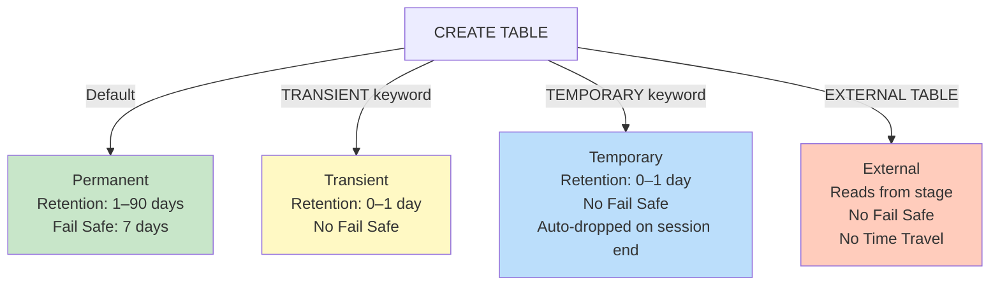

# Lecture 12: Table Types, Time Travel, Fail Safe, and External Tables

---

## 1. Overview: Snowflake Table Types

Snowflake supports four distinct table types, each with different retention, persistence, and cost characteristics:

| Table Type  | Retention Period  | Fail Safe  | Session Scope? | IS_TRANSIENT |
|-------------|-------------------|------------|----------------|--------------|
| Permanent   | 0–90 days (default: 1) | 7 days  | No             | NO           |
| Transient   | 0–1 day           | None       | No             | YES          |
| Temporary   | 0–1 day           | None       | Yes (auto-dropped) | YES       |
| External    | N/A               | N/A        | No             | N/A          |

---

## 2. Permanent Tables

**Permanent tables** are the default table type in Snowflake. When you run `CREATE TABLE ...` without any keyword qualifier, you create a permanent table.

### Identifying Permanent Tables

```sql
SELECT TABLE_NAME, TABLE_TYPE, RETENTION_TIME, IS_TRANSIENT
FROM INFORMATION_SCHEMA.TABLES
WHERE TABLE_TYPE = 'BASE TABLE'
  AND IS_TRANSIENT = 'NO';
```

- `TABLE_TYPE = 'BASE TABLE'` — filters out views and other object types
- `IS_TRANSIENT = 'NO'` — permanent tables have `IS_TRANSIENT = NO`
- `RETENTION_TIME` — shows the current data retention days (default: 1)

### Default Retention Period

By default, every newly created table has a retention period of **1 day**.

```sql
-- Check retention period for a specific table
SELECT TABLE_NAME, RETENTION_TIME
FROM INFORMATION_SCHEMA.TABLES
WHERE TABLE_TYPE = 'BASE TABLE'
  AND IS_TRANSIENT = 'NO'
  AND TABLE_NAME = 'EMP';

-- Result: RETENTION_TIME = 1 (one day)
```

### Increasing the Retention Period

For permanent tables, retention can be increased up to **90 days**:

```sql
-- Increase retention to 90 days
ALTER TABLE EMP
    SET DATA_RETENTION_TIME_IN_DAYS = 90;

-- Verify
SELECT TABLE_NAME, RETENTION_TIME
FROM INFORMATION_SCHEMA.TABLES
WHERE TABLE_NAME = 'EMP';
-- RETENTION_TIME = 90
```

Trying to set more than 90 days results in an error:

```sql
-- This will fail
ALTER TABLE EMP SET DATA_RETENTION_TIME_IN_DAYS = 91;
-- Error: "Exceeds the maximum allowable retention time"
```

### Creating a Table with Retention Set from the Start

You can define `DATA_RETENTION_TIME_IN_DAYS` during `CREATE TABLE`:

```sql
CREATE TABLE TNS_CUSTOMER
    DATA_RETENTION_TIME_IN_DAYS = 0
AS
SELECT * FROM SNOWFLAKE_SAMPLE_DATA.TPCH_SF100.CUSTOMER;
```

This creates a permanent table but with **zero days** of retention (no time travel available).

---

## 3. Time Travel — Going Back to the Past

**Time Travel** is one of Snowflake's most powerful features. It allows you to query data as it existed at a specific point in the past — within the retention period.

### What Is Time Travel?

If data in a table is accidentally modified or deleted, Time Travel lets you:
1. **View** what the data looked like at a previous point
2. **Restore** the data by copying the historical snapshot into the current table

### Time Travel Limits

| Table Type    | Maximum Retention (Time Travel window) |
|---------------|----------------------------------------|
| Permanent     | 90 days                                |
| Transient     | 1 day                                  |
| Temporary     | 1 day                                  |

### Time Travel Syntax — AT OFFSET

The `AT(OFFSET => -N)` syntax goes back N seconds in time:

```sql
-- Go back 60 seconds (1 minute)
SELECT * FROM EMP
AT(OFFSET => -60 * 1);

-- Go back 120 seconds (2 minutes)
SELECT * FROM EMP
AT(OFFSET => -60 * 2);

-- Go back 180 seconds (3 minutes)
SELECT * FROM EMP
AT(OFFSET => -60 * 3);

-- Go back 90 days (in seconds)
SELECT * FROM EMP
AT(OFFSET => -60 * 60 * 24 * 90);
```

The offset is always **negative** (going backward from the current time) and measured in **seconds**.

---

## 4. Time Travel — Practical Example

### Scenario: Accidental Data Update

Suppose you have an `EMP` table with 25 records and correct salary data.

**Step 1: Get the current timestamp**

```sql
SELECT CURRENT_TIMESTAMP();
-- 2025-04-03 14:32:15.000 +0000
```

**Step 2: Simulate an accidental mass update**

```sql
-- A developer accidentally updates ALL employee salaries to 100
UPDATE EMP SET SALARY = 100;

-- Verify the damage
SELECT EMP_NUMBER, SALARY FROM EMP;
-- All 25 rows now show SALARY = 100 (incorrect!)
```

**Step 3: Go back in time to check previous data**

```sql
-- Go back 2 minutes to see correct salaries
SELECT * FROM EMP
AT(OFFSET => -60 * 2);

-- Go back 3 minutes
SELECT * FROM EMP
AT(OFFSET => -60 * 3);
```

If you can see the correct historical data, proceed to restore it.

**Step 4: Create a backup table from the historical data**

```sql
-- Create a backup with data from 4 minutes ago
CREATE TABLE EMP_BKP AS
SELECT * FROM EMP
AT(OFFSET => -60 * 4);

-- Verify backup has correct salaries
SELECT EMP_NUMBER, SALARY FROM EMP_BKP;
-- Shows correct original salaries
```

**Step 5: Restore data using MERGE**

Use the MERGE statement to copy correct salaries from the backup table back to the original table:

```sql
MERGE INTO EMP AS T
USING EMP_BKP AS S
ON T.EMP_NUMBER = S.EMP_NUMBER
WHEN MATCHED THEN
    UPDATE SET T.SALARY = S.SALARY;
```

- `EMP` is the **target** table (with incorrect data)
- `EMP_BKP` is the **source** table (with correct historical data)
- The join condition is `T.EMP_NUMBER = S.EMP_NUMBER`
- When a match is found, the salary is updated from the source

**Step 6: Verify the restoration**

```sql
SELECT EMP_NUMBER, SALARY FROM EMP;
-- Correct salaries restored!
```

---

## 5. Fail Safe — Recovery After Time Travel Expires

Even after the Time Travel window (up to 90 days) expires, Snowflake provides an additional **7-day Fail Safe period** for emergency data recovery.

### Fail Safe Key Facts

- Duration: **exactly 7 days** — non-configurable
- Available for: **permanent tables only** (transient and temporary tables have NO fail safe)
- Who can use it: **only Snowflake administrators** — you cannot access fail safe directly
- Purpose: emergency recovery of data that cannot be recovered via Time Travel

### Time Travel + Fail Safe Timeline

```
Data Created
|
|-------- Time Travel ---------|------ Fail Safe ------|--- Purged
|                              |                       |
0 days                       90 days                 97 days
```

| Period       | Access Method                          | Who Can Access |
|--------------|----------------------------------------|----------------|
| Time Travel  | `AT(OFFSET => -N)` query               | You (developer)|
| Fail Safe    | Contact Snowflake Support              | Snowflake only |
| After 97 days| Data is permanently purged             | No one         |

---

## 6. TABLE_STORAGE_METRICS — Monitoring Table Size

To monitor storage usage for specific tables, use the `TABLE_STORAGE_METRICS` view:

```sql
SELECT *
FROM INFORMATION_SCHEMA.TABLE_STORAGE_METRICS
WHERE TABLE_NAME = 'TNS_CUSTOMER';
```

Key columns:
- `ACTIVE_BYTES` — current table size in bytes (the "live" data)
- `TIME_TRAVEL_BYTES` — bytes used by Time Travel historical data
- `FAIL_SAFE_BYTES` — bytes used by Fail Safe data
- `RETAINED_FOR_CLONE_BYTES` — bytes retained for cloning purposes

Note: These values may take a few minutes to update after creating or modifying a table.

---

## 7. Transient Tables

**Transient tables** behave like permanent tables in terms of schema definition, but have reduced storage protection.

### Creating a Transient Table

```sql
CREATE TRANSIENT TABLE T_STUDENTS (
    STUDENT_NUMBER NUMBER,
    STUDENT_NAME   VARCHAR,
    COURSE         VARCHAR
);
```

The keyword `TRANSIENT` is placed between `CREATE` and `TABLE`.

### Verifying Transient Tables

```sql
SELECT TABLE_NAME, IS_TRANSIENT, RETENTION_TIME
FROM INFORMATION_SCHEMA.TABLES
WHERE TABLE_TYPE = 'BASE TABLE'
  AND IS_TRANSIENT = 'YES';
-- Returns transient tables
```

### Transient Table Rules

| Property             | Value                                |
|----------------------|--------------------------------------|
| Default Retention    | 1 day (same as permanent)            |
| Maximum Retention    | 1 day only — cannot be increased     |
| Fail Safe            | None                                 |
| Session-bound        | No — persists across sessions        |
| IS_TRANSIENT column  | YES                                  |

Attempting to set retention beyond 1 day fails:

```sql
ALTER TABLE T_STUDENTS SET DATA_RETENTION_TIME_IN_DAYS = 2;
-- Error: "Invalid value 2 for parameter 'DATA_RETENTION_TIME_IN_DAYS'
--         Valid values are: 0 to 1 for TRANSIENT objects"
```

### When to Use Transient Tables

Transient tables are ideal when:
- You truncate and reload the table every day (ETL staging tables)
- The data in the table is **not critical** — can be reloaded from source if lost
- You want to **reduce storage costs** (no 7-day Fail Safe overhead)

---

## 8. Temporary Tables

**Temporary tables** are session-scoped — they exist only for the duration of the current Snowflake session and are automatically dropped when the session ends.

### Creating a Temporary Table

```sql
CREATE TEMPORARY TABLE TEMP_STUDENTS (
    STUDENT_NUMBER NUMBER,
    STUDENT_NAME   VARCHAR,
    COURSE         VARCHAR
);

-- Alternative syntax
CREATE TEMP TABLE TEMP_EMP (
    EMP_NUMBER NUMBER,
    EMP_NAME   VARCHAR,
    HIRE_DATE  DATE
);
```

### Verifying Temporary Tables

```sql
SELECT TABLE_NAME, TABLE_TYPE, RETENTION_TIME, IS_TRANSIENT
FROM INFORMATION_SCHEMA.TABLES
WHERE TABLE_TYPE = 'LOCAL TEMPORARY';
-- TABLE_TYPE = 'LOCAL TEMPORARY' for temp tables
-- IS_TRANSIENT = YES
```

### Temporary Table Rules

| Property             | Value                                    |
|----------------------|------------------------------------------|
| Default Retention    | 0 days                                   |
| Maximum Retention    | 1 day — can be increased but not beyond 1|
| Fail Safe            | None                                     |
| Session-bound        | Yes — auto-dropped when session closes   |
| IS_TRANSIENT column  | YES                                      |
| TABLE_TYPE           | `LOCAL TEMPORARY`                        |

### Session Demonstration

You create two temporary tables (`TEMP_STUDENTS` and `TEMP_EMP`) in your current session. If you close the session and log in again:

```sql
-- After logging back in:
SELECT TABLE_NAME FROM INFORMATION_SCHEMA.TABLES
WHERE TABLE_TYPE = 'LOCAL TEMPORARY';
-- Returns 0 rows — temp tables were dropped automatically
```

### When to Use Temporary Tables

Temporary tables are used for:
- Intermediate computations within a stored procedure
- Storing working data that is only needed within a single session
- Breaking complex queries into smaller steps without creating permanent objects

---

## 9. Table Type Comparison — Full Reference



### Full Comparison Table

| Feature                    | Permanent   | Transient   | Temporary   | External    |
|----------------------------|-------------|-------------|-------------|-------------|
| `CREATE TABLE` syntax      | `CREATE TABLE` | `CREATE TRANSIENT TABLE` | `CREATE TEMPORARY TABLE` | `CREATE EXTERNAL TABLE` |
| Default retention          | 1 day       | 1 day       | 0 days      | N/A         |
| Max retention              | 90 days     | 1 day       | 1 day       | N/A         |
| Fail Safe                  | 7 days      | None        | None        | None        |
| Session-scoped             | No          | No          | Yes         | No          |
| IS_TRANSIENT               | NO          | YES         | YES         | N/A         |
| TABLE_TYPE in INFO_SCHEMA  | BASE TABLE  | BASE TABLE  | LOCAL TEMPORARY | EXTERNAL |
| Typical use case           | Production data | Staging/ETL | Stored procedures | Read from cloud files |

---

## 10. External Tables

**External tables** allow you to query files stored in a cloud stage (internal or external) **as if they were a Snowflake table** — without copying the data into Snowflake storage.

### Key Characteristic

External tables:
- Do **not** store data inside Snowflake
- Read data directly from the stage at query time
- Always expose a column called `VALUE` (VARIANT type) representing the row data

### Creating an External Table — Basic Syntax

```sql
CREATE EXTERNAL TABLE EXT_CARS_INFO
    LOCATION = @S3_PARQUET_STAGE
    FILE_FORMAT = (FORMAT_NAME = 'PARQUET_FORMAT');
```

When queried, the external table returns a single `VALUE` column in JSON format (Snowflake internally converts Parquet to JSON for readability):

```sql
SELECT * FROM EXT_CARS_INFO;
-- VALUE column contains JSON representation of each Parquet row
```

### Creating an External Table with Explicit Column Definitions

For a more relational view, define columns while creating the table:

```sql
CREATE EXTERNAL TABLE EXT_EMP_INFO (
    EMP_NUMBER  NUMBER   AS (VALUE:$1::NUMBER),
    EMP_NAME    VARCHAR  AS (VALUE:$2::VARCHAR),
    JOB         VARCHAR  AS (VALUE:$3::VARCHAR),
    MANAGER     NUMBER   AS (VALUE:$4::NUMBER),
    HIRE_DATE   DATE     AS (VALUE:$5::DATE),
    SALARY      NUMBER   AS (VALUE:$6::NUMBER),
    COMMISSION  NUMBER   AS (VALUE:$7::NUMBER),
    DEPT_NUMBER NUMBER   AS (VALUE:$8::NUMBER),
    MOBILE      NUMBER   AS (VALUE:$9::NUMBER),
    STATUS      BOOLEAN  AS (VALUE:$10::BOOLEAN)
)
LOCATION = @S3_CSV_STAGE
FILE_FORMAT = (FORMAT_NAME = 'FILE_CSV_FORMAT');
```

- Each column is defined with: `column_name  data_type  AS (VALUE:$n::data_type)`
- `VALUE` is the internal VARIANT column
- `$1`, `$2`, `$3`... are the positional CSV column references (same notation as stage queries)
- For CSV files: `$1` = first column, `$2` = second column, etc.

### Querying an External Table

```sql
-- Query external table (shows all defined columns)
SELECT * FROM EXT_EMP_INFO;

-- Exclude the internal VALUE column
SELECT * EXCLUDE VALUE FROM EXT_EMP_INFO;
```

The `EXCLUDE` keyword removes specified columns from `SELECT *` output.

### External Table for Parquet Files

For Parquet files read from an S3 stage:

```sql
CREATE EXTERNAL TABLE EXT_CARS_PARQUET
    LOCATION = @S3_PARQUET_STAGE
    FILE_FORMAT = (FORMAT_NAME = 'PARQUET_FORMAT');

SELECT * FROM EXT_CARS_PARQUET;
-- Returns VALUE column with JSON representation of parquet data
-- (Snowflake internally converts Parquet -> JSON)
```

To access individual columns, use the dot-notation on `VALUE`:

```sql
SELECT
    VALUE:am::VARCHAR    AS AM,
    VALUE:carby::NUMBER  AS CARBY,
    VALUE:cyl::NUMBER    AS CYL
FROM EXT_CARS_PARQUET;
```

---

## 11. INFER_SCHEMA — Auto-Detecting Parquet Schema

For Parquet files with many columns, manually writing column definitions is tedious. The `INFER_SCHEMA` function automatically detects the schema (column names and data types) of a Parquet file.

### INFER_SCHEMA Syntax

```sql
SELECT *
FROM TABLE(
    INFER_SCHEMA(
        LOCATION => '@S3_PARQUET_STAGE',
        FILE_FORMAT => 'PARQUET_FORMAT',
        FILES => 'mt_cars.parquet'
    )
);
```

Parameters:
- `LOCATION` — the stage where the file is located
- `FILE_FORMAT` — the file format object to use
- `FILES` — the specific file to inspect

Output columns:
- `COLUMN_NAME` — the key/column name from the Parquet file
- `TYPE` — the detected Snowflake data type
- `NULLABLE` — whether the column can contain nulls
- `EXPRESSION` — the full SQL expression to extract this column from `VALUE`

Example output:

```
COLUMN_NAME | TYPE    | NULLABLE | EXPRESSION
------------|---------|----------|----------------------------------
am          | text    | Y        | $1:am::text
carby       | real    | Y        | $1:carby::real
cyl         | real    | Y        | $1:cyl::real
disp        | real    | Y        | $1:disp::real
...
```

### Using INFER_SCHEMA to Build SELECT Statements

```sql
-- Copy the EXPRESSION column values and use them in a query
SELECT
    $1:am::text    AS am,
    $1:carby::real AS carby,
    $1:cyl::real   AS cyl,
    $1:disp::real  AS disp
FROM @S3_PARQUET_STAGE
(FILE_FORMAT => 'PARQUET_FORMAT')
WHERE METADATA$FILENAME LIKE '%mt_cars%';
```

For tables with many columns, you can copy all expressions from INFER_SCHEMA and use them directly — much faster than writing each one manually.

---

## 12. CONCAT Function — Combining Values

`CONCAT` is a string function that combines (concatenates) two or more values into a single string.

### Basic Syntax

```sql
SELECT CONCAT(value1, value2, value3, ...);
```

### Examples

```sql
-- Combine static strings
SELECT CONCAT('My name is ', 'Krishna', ', I work as an ', 'Architect');
-- Result: "My name is Krishna, I work as an Architect"

-- Combine columns with strings
SELECT CONCAT(
    'My name is ', EMP_NAME,
    ', salary is ', SALARY::VARCHAR,
    ', working in department ', DEPT_NUMBER::VARCHAR
)
FROM EMP
WHERE EMP_NUMBER = 7783;
-- Result: "My name is Abhijith, salary is 2450, working in department 10"
```

### CONCAT for Building SQL Expressions

CONCAT can be used with INFER_SCHEMA to auto-generate column extraction expressions:

```sql
-- Use INFER_SCHEMA + CONCAT to build column expressions for external tables
SELECT
    CONCAT(COLUMN_NAME, ' ', TYPE, ' AS (VALUE:', COLUMN_NAME, '::', TYPE, ')')
        AS COLUMN_EXPRESSION
FROM TABLE(
    INFER_SCHEMA(
        LOCATION => '@S3_PARQUET_STAGE',
        FILE_FORMAT => 'PARQUET_FORMAT',
        FILES => 'mt_cars.parquet'
    )
);
```

This generates ready-to-use column definition strings like:
```
am text AS (VALUE:am::text)
carby real AS (VALUE:carby::real)
cyl real AS (VALUE:cyl::real)
```

Copy these into `CREATE EXTERNAL TABLE` to define all columns automatically.

---

## 13. Creating Tables from SNOWFLAKE_SAMPLE_DATA

Snowflake provides a built-in sample database called `SNOWFLAKE_SAMPLE_DATA` with several schemas containing large datasets for practice.

### Available Schemas

```sql
SHOW SCHEMAS IN DATABASE SNOWFLAKE_SAMPLE_DATA;
-- TPCH_SF1, TPCH_SF100, TPCH_SF1000, TPCDS_SF100TCL, etc.
```

The suffix indicates scale factor (SF):
- `TPCH_SF1` — 1 GB of data
- `TPCH_SF100` — 100 GB of data
- `TPCH_SF1000` — 1 TB of data

### Creating a Local Table from Sample Data

```sql
-- Create a table in your schema with data from the sample database
USE DATABASE SALES_DB;
USE SCHEMA SALES_SCHEMA;

CREATE TABLE TNS_CUSTOMER
    DATA_RETENTION_TIME_IN_DAYS = 0
AS
SELECT * FROM SNOWFLAKE_SAMPLE_DATA.TPCH_SF100.CUSTOMER;

-- Verify
SELECT COUNT(*) FROM TNS_CUSTOMER;
-- Returns large row count (millions of rows from SF100)
```

This is `CREATE TABLE AS SELECT` (CTAS) — it creates a new table and populates it with the results of the SELECT in one step.

---

## 14. SHOW TABLES vs INFORMATION_SCHEMA.TABLES

Both commands display table information, but differ in scope:

| Command                                    | Scope                           |
|--------------------------------------------|---------------------------------|
| `SHOW TABLES`                              | Current schema only             |
| `SELECT * FROM INFORMATION_SCHEMA.TABLES`  | All schemas in current database |

### Practical Example

If `SALES_SCHEMA` has 8 tables and `MARKETING_SCHEMA` has 5 tables:

```sql
USE SCHEMA MARKETING_SCHEMA;

SHOW TABLES;
-- Returns: 5 tables (MARKETING_SCHEMA only)

SELECT * FROM INFORMATION_SCHEMA.TABLES
WHERE TABLE_TYPE = 'BASE TABLE';
-- Returns: 13 tables (8 + 5, all schemas in SALES_DB)
```

---

## 15. Complete SQL Reference — All Table Operations

```sql
-- ===== PERMANENT TABLES =====

-- Create permanent table (default)
CREATE TABLE MY_TABLE (
    ID     NUMBER,
    NAME   VARCHAR,
    VALUE  NUMBER
);

-- Set retention at creation
CREATE TABLE MY_TABLE_0
    DATA_RETENTION_TIME_IN_DAYS = 0
AS SELECT * FROM SOME_SOURCE;

-- Change retention on existing table
ALTER TABLE MY_TABLE SET DATA_RETENTION_TIME_IN_DAYS = 90;

-- Check retention
SELECT TABLE_NAME, RETENTION_TIME, IS_TRANSIENT
FROM INFORMATION_SCHEMA.TABLES
WHERE TABLE_TYPE = 'BASE TABLE'
  AND TABLE_NAME = 'MY_TABLE';

-- Time travel query
SELECT * FROM MY_TABLE AT(OFFSET => -60);  -- 1 minute ago
SELECT * FROM MY_TABLE AT(OFFSET => -3600); -- 1 hour ago

-- Create backup from historical data
CREATE TABLE MY_TABLE_BKP AS
SELECT * FROM MY_TABLE AT(OFFSET => -60 * 5);

-- ===== TRANSIENT TABLES =====

CREATE TRANSIENT TABLE T_STAGING (
    ID    NUMBER,
    NAME  VARCHAR
);

-- Verify transient
SELECT TABLE_NAME, IS_TRANSIENT
FROM INFORMATION_SCHEMA.TABLES
WHERE IS_TRANSIENT = 'YES';

-- ===== TEMPORARY TABLES =====

CREATE TEMPORARY TABLE TEMP_WORK (
    ID    NUMBER,
    NAME  VARCHAR
);

-- Verify temporary
SELECT TABLE_NAME, TABLE_TYPE
FROM INFORMATION_SCHEMA.TABLES
WHERE TABLE_TYPE = 'LOCAL TEMPORARY';

-- ===== EXTERNAL TABLES =====

-- Create external table (Parquet on S3)
CREATE EXTERNAL TABLE EXT_PARQUET_DATA
    LOCATION = @S3_PARQUET_STAGE
    FILE_FORMAT = (FORMAT_NAME = 'PARQUET_FORMAT');

-- Create external table with CSV columns defined
CREATE EXTERNAL TABLE EXT_EMP_DATA (
    EMP_NUMBER  NUMBER  AS (VALUE:$1::NUMBER),
    EMP_NAME    VARCHAR AS (VALUE:$2::VARCHAR),
    JOB         VARCHAR AS (VALUE:$3::VARCHAR),
    SALARY      NUMBER  AS (VALUE:$6::NUMBER)
)
LOCATION = @S3_CSV_STAGE
FILE_FORMAT = (FORMAT_NAME = 'FILE_CSV_FORMAT');

-- Query external table
SELECT * FROM EXT_EMP_DATA;
SELECT * EXCLUDE VALUE FROM EXT_EMP_DATA;

-- ===== INFER SCHEMA =====

SELECT *
FROM TABLE(
    INFER_SCHEMA(
        LOCATION => '@S3_PARQUET_STAGE',
        FILE_FORMAT => 'PARQUET_FORMAT',
        FILES => 'mt_cars.parquet'
    )
);

-- ===== TABLE STORAGE METRICS =====

SELECT TABLE_NAME, ACTIVE_BYTES, TIME_TRAVEL_BYTES, FAIL_SAFE_BYTES
FROM INFORMATION_SCHEMA.TABLE_STORAGE_METRICS
WHERE TABLE_NAME = 'MY_TABLE';

-- ===== MERGE STATEMENT =====

MERGE INTO TARGET_TABLE AS T
USING SOURCE_TABLE AS S
ON T.KEY_COLUMN = S.KEY_COLUMN
WHEN MATCHED THEN
    UPDATE SET T.SALARY = S.SALARY;

-- ===== CONCAT =====

SELECT CONCAT('Value: ', COLUMN_NAME, ' (', DATA_TYPE, ')') FROM SOME_TABLE;
```

---

## 16. Key Terms

| Term                       | Definition                                                                             |
|---------------------------|----------------------------------------------------------------------------------------|
| Permanent Table           | Default Snowflake table type; 0–90 days Time Travel + 7-day Fail Safe                 |
| Transient Table           | Reduced-cost table type; max 1-day Time Travel; no Fail Safe; persists across sessions |
| Temporary Table           | Session-scoped table; auto-dropped when session ends; max 1-day Time Travel           |
| External Table            | Reads data from a stage without copying it into Snowflake storage                     |
| Time Travel               | Feature to query table data at a historical point in time (within retention period)   |
| AT(OFFSET => -N)          | Syntax to go back N seconds in time using Time Travel                                 |
| Fail Safe                 | 7-day emergency recovery period for permanent tables after Time Travel expires         |
| DATA_RETENTION_TIME_IN_DAYS | Table parameter setting how many days of Time Travel history to keep              |
| IS_TRANSIENT              | INFORMATION_SCHEMA column; YES for transient/temporary tables, NO for permanent        |
| TABLE_STORAGE_METRICS     | INFORMATION_SCHEMA view showing table size broken down by active, time travel, fail safe |
| MERGE                     | SQL statement to update a target table using data from a source table                  |
| INFER_SCHEMA              | Snowflake function to automatically detect column names and types in Parquet files     |
| CONCAT                    | SQL function that combines multiple string values into one                              |
| SNOWFLAKE_SAMPLE_DATA     | Built-in Snowflake database with sample datasets of various sizes for practice         |
| CTAS                      | CREATE TABLE AS SELECT — creates and populates a table in one statement                |
| EXCLUDE                   | Keyword in SELECT * to omit specific columns from the output                          |

---

## 17. Summary

- Snowflake has **four table types**: Permanent (default), Transient, Temporary, and External
- **Permanent tables** support up to 90 days of Time Travel and 7 days of Fail Safe (non-configurable)
- **Transient tables** reduce storage costs by limiting retention to 1 day and eliminating Fail Safe — best for staging/ETL data that is reloaded daily
- **Temporary tables** are session-scoped (auto-dropped at session end) with up to 1 day of retention — used inside stored procedures for intermediate data
- **External tables** read data directly from a stage without loading it into Snowflake — useful when the source files change frequently or you don't want to copy data
- **Time Travel** uses `AT(OFFSET => -N)` where N is seconds backward; combine with `CREATE TABLE AS SELECT` to create a backup, then use `MERGE` to restore data
- **Fail Safe** provides 7 days of additional protection after Time Travel expires, but only Snowflake Support can access it — you cannot query fail safe data directly
- `INFER_SCHEMA` automatically detects the schema of a Parquet file — eliminates manual column definition for files with many columns
- `CONCAT` combines values into a single string and can be used to auto-generate column expression strings from INFER_SCHEMA output
- `INFORMATION_SCHEMA.TABLE_STORAGE_METRICS` shows the storage breakdown: active data, time travel data, and fail safe data for each table
- `SNOWFLAKE_SAMPLE_DATA` is a built-in database with datasets at different scale factors (SF1, SF100, SF1000) — use `CREATE TABLE AS SELECT` to copy sample data into your own schema for practice
