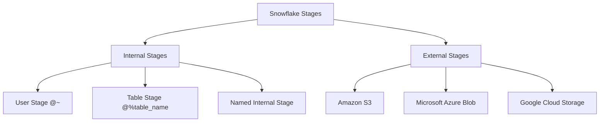
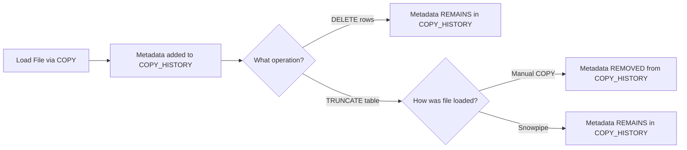
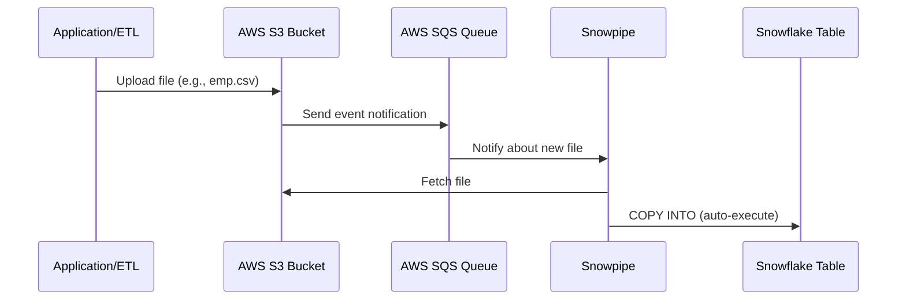

# Lecture 13: Table Types Recap, External Stages, Copy History, and Snowpipe Introduction

---

## Table of Contents
1. [Table Types Recap](#1-table-types-recap)
2. [Stages Overview](#2-stages-overview)
3. [Working with External Stages (S3)](#3-working-with-external-stages-s3)
4. [DESCRIBE STAGE and Bucket Structure](#4-describe-stage-and-bucket-structure)
5. [Copy History](#5-copy-history)
6. [Snowpipe — Automated Continuous Loading](#6-snowpipe--automated-continuous-loading)
7. [Auto Ingest vs Manual Refresh](#7-auto-ingest-vs-manual-refresh)
8. [Data Unloading (Table to File)](#8-data-unloading-table-to-file)
9. [Key Commands Reference](#9-key-commands-reference)
10. [Key Terms](#10-key-terms)
11. [Summary](#11-summary)

---

## 1. Table Types Recap

Snowflake has four distinct table types. Understanding their differences is essential for designing the right data architecture.

| Table Type   | Retention Period         | Fail-Safe | Behavior                                     |
|--------------|--------------------------|-----------|----------------------------------------------|
| **Permanent**    | 0–90 days (default: 1 day) | 7 days    | Default table type; persists indefinitely    |
| **Transient**    | 0–1 day                  | None      | No fail-safe; lower storage cost             |
| **Temporary**    | 0–1 day (session only)   | None      | Dropped automatically when session ends      |
| **External**     | N/A (data lives outside) | None      | Points to files in an external stage         |

### Creating a Database with Custom Retention

```sql
CREATE DATABASE test_db
  DATA_RETENTION_TIME_IN_DAYS = 2;
```

### Checking Table Retention Periods

```sql
SELECT table_name, table_type, retention_time
FROM information_schema.tables
WHERE table_type = 'BASE TABLE';
```

> **Key Point:** The maximum retention period for permanent tables is **90 days**. The default is 1 day, unless the database-level setting overrides it.

### External Tables

An external table lets you query files in an external stage as if they were a regular table.

```sql
-- Example: creating an external table on a stage
CREATE EXTERNAL TABLE ext_emp
  LOCATION = @s3_csv_stage
  FILE_FORMAT = (TYPE = CSV SKIP_HEADER = 1);
```

---

## 2. Stages Overview

A **stage** is a named location where data files are stored before loading into Snowflake (or after unloading from Snowflake).



### Viewing Stages

```sql
SHOW STAGES;
```

### Listing Files in a Stage

```sql
LIST @stage_name;
-- or
LS @stage_name;
```

### Removing Files from a Stage

```sql
RM @stage_name/filename.csv;
-- Remove all files in a stage:
RM @stage_name;
```

---

## 3. Working with External Stages (S3)

### Integration-Based S3 Stage (Recommended for Production)

An **integration object** is an account-level object that securely connects Snowflake to a cloud provider without embedding credentials.

```sql
-- Step 1: Create a Storage Integration
CREATE STORAGE INTEGRATION s3_integration_prod
  TYPE = EXTERNAL_STAGE
  STORAGE_PROVIDER = 'S3'
  ENABLED = TRUE
  STORAGE_AWS_ROLE_ARN = 'arn:aws:iam::123456789:role/snowflake-role'
  STORAGE_ALLOWED_LOCATIONS = ('s3://my-bucket/data/');
```

> **Important:** Integration objects are **account-level**, not database-level. You cannot create two integration objects with the same name in one Snowflake account, but you can create tables with the same name in different schemas.

```sql
-- Step 2: Get the External ID and IAM User ARN
DESCRIBE STORAGE INTEGRATION s3_integration_prod;
-- Copy: STORAGE_AWS_IAM_USER_ARN and STORAGE_AWS_EXTERNAL_ID
-- Update the Trust Policy in your AWS IAM Role with these values.
```

```sql
-- Step 3: Create the External Stage using the Integration
CREATE STAGE prod_s3_stage
  STORAGE_INTEGRATION = s3_integration_prod
  URL = 's3://my-bucket/data/'
  FILE_FORMAT = (TYPE = CSV SKIP_HEADER = 1);
```

### Loading Data from an External Stage

```sql
COPY INTO emp
FROM @s3_csv_stage/emp.csv
FILE_FORMAT = (FORMAT_NAME = 'csv_format');
```

---

## 4. DESCRIBE STAGE and Bucket Structure

Use `DESCRIBE STAGE` to inspect a stage's configuration, including the cloud bucket/folder it points to.

```sql
DESCRIBE STAGE s3_csv_stage;
```

**Key output columns:**
- `STAGE_LOCATION` — The S3 bucket URL (e.g., `s3://my-bucket/stg_csv_files/`)
- `STAGE_TYPE` — External vs Internal
- `FILE_FORMAT_TYPE` — CSV, JSON, Parquet, etc.

### Practical Example

```
STAGE_LOCATION: s3://spend-data-bucket/stg_csv_files/
```
- **Bucket name:** `spend-data-bucket`
- **Folder:** `stg_csv_files/`

---

## 5. Copy History

The `INFORMATION_SCHEMA.COPY_HISTORY` table function tracks every file loaded via the COPY command or Snowpipe.

```sql
SELECT *
FROM TABLE(INFORMATION_SCHEMA.COPY_HISTORY(
  TABLE_NAME => 'EMP',
  START_TIME => DATEADD(DAYS, -1, CURRENT_TIMESTAMP())
));
```

**Important columns:**
| Column | Description |
|--------|-------------|
| `FILE_NAME` | Path/name of the loaded file |
| `STATUS` | LOADED, LOAD_FAILED, PARTIALLY_LOADED |
| `ROW_COUNT` | Number of rows loaded |
| `ERROR_COUNT` | Number of errors encountered |
| `LAST_LOAD_TIME` | Timestamp of load completion |
| `PIPE_NAME` | NULL if loaded manually; pipe name if via Snowpipe |

### Critical Behavior: DELETE vs TRUNCATE



> **Exam Question:** What is the difference between DELETE and TRUNCATE with respect to copy history?
> - `DELETE`: Row-level removal. Metadata in COPY_HISTORY is **preserved**. You still cannot reload the same file.
> - `TRUNCATE`: Removes all data. Metadata loaded manually via COPY is **removed**, meaning those files can be reloaded. However, files loaded via **Snowpipe** retain their metadata even after TRUNCATE.

### Reloading After Truncate

```sql
TRUNCATE TABLE emp;  -- Metadata for manual COPY is cleared
-- Now you can reload the same file:
COPY INTO emp FROM @s3_csv_stage/emp.csv FILE_FORMAT = (FORMAT_NAME = 'csv_format');
```

### Preventing Duplicate Loads

Snowflake automatically checks COPY_HISTORY before loading. If a file was previously loaded, the COPY command will report `0 files processed`.

```sql
-- This will return "Copy executed with 0 files processed" if already loaded:
COPY INTO emp FROM @s3_csv_stage/emp.csv FILE_FORMAT = (FORMAT_NAME = 'csv_format');
```

To force a reload, use the `FORCE = TRUE` parameter:

```sql
COPY INTO emp FROM @s3_csv_stage/emp.csv
FILE_FORMAT = (FORMAT_NAME = 'csv_format')
FORCE = TRUE;  -- Bypasses the duplicate check
```

### Capturing the Source File Name During Load

```sql
-- Using $1, $2... positional columns plus METADATA$FILENAME:
COPY INTO emp (emp_no, emp_name, salary, file_name)
FROM (
  SELECT $1, $2, $3, SPLIT_PART(METADATA$FILENAME, '/', -1)
  FROM @s3_csv_stage
)
FILE_FORMAT = (FORMAT_NAME = 'csv_format');
```

---

## 6. Snowpipe — Automated Continuous Loading

### What is Snowpipe?

Snowpipe is Snowflake's **serverless, continuous data ingestion** service. It automatically loads data from a stage into a table as soon as files arrive, without requiring a running warehouse.



### Creating a Snowpipe

```sql
CREATE PIPE pipe_load_data
  AUTO_INGEST = TRUE
AS
COPY INTO emp
FROM @s3_csv_stage
FILE_FORMAT = (FORMAT_NAME = 'csv_format');
```

**Parameters:**
- `AUTO_INGEST = TRUE` — Snowflake uses an AWS SQS queue to receive event notifications from S3 and auto-ingest files.
- `AUTO_INGEST = FALSE` — Files are NOT auto-loaded. You must manually refresh the pipe.

### Viewing Pipes

```sql
SHOW PIPES;

-- Or via information schema:
SELECT * FROM information_schema.pipes;
```

### Getting the Notification Channel

After creating a pipe with `AUTO_INGEST = TRUE`, copy the **notification_channel** column value. This is the SQS ARN you need to configure in your S3 bucket's event notifications.

```sql
SHOW PIPES;
-- Look for: notification_channel column
```

### Configuring S3 Event Notifications

1. Go to AWS S3 → Your Bucket → Properties → Event Notifications
2. Click **Create event notification**
3. Event types: Select **"All object create events"**
4. Destination: Select **SQS queue**
5. Enter SQS ARN: Paste the `notification_channel` value from Snowpipe

### Checking Pipe Status

```sql
SELECT SYSTEM$PIPE_STATUS('pipe_load_data');

-- Format as JSON for readability:
SELECT PARSE_JSON(SYSTEM$PIPE_STATUS('pipe_load_data'));
```

**Key status fields:**
- `executionState` — RUNNING, PAUSED, STOPPED
- `pendingFileCount` — Files waiting to be loaded
- `lastIngestedFilePath` — Most recent file that was loaded

### Getting the DDL of a Pipe

```sql
SELECT GET_DDL('pipe', 'pipe_load_data');
```

### Validating Errors in Snowpipe

```sql
SELECT *
FROM TABLE(INFORMATION_SCHEMA.VALIDATE_PIPE_LOAD(
  PIPE_NAME => 'pipe_load_data',
  START_TIME => DATEADD(HOURS, -1, CURRENT_TIMESTAMP())
));
```

### Manual Pipe Refresh (for AUTO_INGEST = FALSE)

```sql
ALTER PIPE pipe_name REFRESH;
```

---

## 7. Auto Ingest vs Manual Refresh

| Feature | `AUTO_INGEST = TRUE` | `AUTO_INGEST = FALSE` |
|---------|----------------------|-----------------------|
| Trigger | S3 Event → SQS → Snowpipe | Manual `ALTER PIPE ... REFRESH` |
| Status fields | Multiple (last file, pending count, etc.) | Minimal (execution state, pending count) |
| Setup required | SQS notification configuration | None |
| Suitable for | Production real-time ingestion | Batch/manual workflows |

### Serverless Nature of Snowpipe

Snowpipe is a **serverless** feature — it does not use a warehouse you define. Snowflake manages its own internal compute for Snowpipe execution. Costs appear under **"Snowpipe"** service type in the Cost Management console.

> **Key Insight:** Unlike a regular `COPY INTO` command (which needs an active warehouse), Snowpipe works without a warehouse. This is why it is called serverless.

---

## 8. Data Unloading (Table to File)

Unloading means writing data **from a Snowflake table to a file** in a stage.

```sql
-- Unload table to S3 stage:
COPY INTO @s3_csv_stage
FROM emp
FILE_FORMAT = (FORMAT_NAME = 'csv_format');
```

After this command, a CSV file appears in the S3 bucket. You can then reload it:

```sql
COPY INTO emp
FROM @s3_csv_stage
FILE_FORMAT = (FORMAT_NAME = 'csv_format');
```

---

## 9. Key Commands Reference

### Stage Management

```sql
-- View all stages
SHOW STAGES;

-- Describe a stage (get bucket/folder info)
DESCRIBE STAGE stage_name;

-- List files in a stage
LIST @stage_name;

-- Remove a specific file from a stage
RM @stage_name/filename.csv;

-- Remove all files from a stage
RM @stage_name;
```

### Copy / Unload

```sql
-- Load from stage to table
COPY INTO table_name
FROM @stage_name
FILE_FORMAT = (FORMAT_NAME = 'format_name');

-- Unload from table to stage
COPY INTO @stage_name
FROM table_name
FILE_FORMAT = (FORMAT_NAME = 'format_name');

-- Load with force reload (ignore copy history)
COPY INTO table_name
FROM @stage_name
FILE_FORMAT = (FORMAT_NAME = 'format_name')
FORCE = TRUE;
```

### Copy History

```sql
SELECT *
FROM TABLE(INFORMATION_SCHEMA.COPY_HISTORY(
  TABLE_NAME => 'TABLE_NAME',
  START_TIME => DATEADD(DAYS, -1, CURRENT_TIMESTAMP())
));
```

### Snowpipe

```sql
-- Create pipe
CREATE PIPE pipe_name AUTO_INGEST = TRUE AS
COPY INTO table_name FROM @stage_name FILE_FORMAT = (FORMAT_NAME = 'fmt');

-- View pipes
SHOW PIPES;
SELECT * FROM information_schema.pipes;

-- Check pipe status
SELECT PARSE_JSON(SYSTEM$PIPE_STATUS('pipe_name'));

-- Validate pipe errors
SELECT * FROM TABLE(INFORMATION_SCHEMA.VALIDATE_PIPE_LOAD(
  PIPE_NAME => 'pipe_name',
  START_TIME => DATEADD(HOURS, -1, CURRENT_TIMESTAMP())
));

-- Refresh pipe manually
ALTER PIPE pipe_name REFRESH;
```

### File Formats

```sql
-- View file formats
SHOW FILE_FORMATS;
SELECT * FROM information_schema.file_formats;

-- Create a CSV file format
CREATE FILE FORMAT csv_format
  TYPE = CSV
  SKIP_HEADER = 1;
```

---

## 10. Key Terms

| Term | Definition |
|------|------------|
| **Stage** | Named storage location for data files (internal or external) |
| **Internal Stage** | Storage managed by Snowflake itself |
| **External Stage** | Points to cloud storage (S3, Azure, GCS) |
| **Storage Integration** | Account-level object that authorizes Snowflake to access cloud storage |
| **COPY INTO** | SQL command to load data from a stage into a table, or unload from table to stage |
| **Copy History** | Metadata log of all files loaded via COPY or Snowpipe |
| **Snowpipe** | Serverless continuous ingestion service |
| **AUTO_INGEST** | Snowpipe parameter enabling automatic S3 event-triggered loading |
| **SQS** | AWS Simple Queue Service used to send event notifications to Snowpipe |
| **Notification Channel** | SQS ARN generated by Snowpipe; must be configured in S3 event notifications |
| **VALIDATE_PIPE_LOAD** | Table function to inspect errors during Snowpipe ingestion |
| **Serverless** | Snowpipe does not require a user-defined warehouse to operate |

---

## 11. Summary

- Snowflake supports four table types: **permanent, transient, temporary, and external**.
- **DESCRIBE STAGE** reveals the cloud bucket and folder path a stage points to.
- **COPY_HISTORY** tracks all files loaded into a table. `DELETE` preserves history; `TRUNCATE` removes metadata for manually loaded files but not Snowpipe-loaded files.
- **Snowpipe** automates continuous loading: files placed in an S3 bucket trigger SQS notifications, which cause Snowpipe to execute the COPY command — all without a warehouse (serverless).
- Setting up Snowpipe requires pasting the pipe's **notification_channel** ARN into AWS S3 event notifications.
- `AUTO_INGEST = FALSE` requires manual `ALTER PIPE ... REFRESH` to trigger loads.
- Use `VALIDATE_PIPE_LOAD` to troubleshoot file ingestion errors.
- Data **unloading** (table → file) uses the same `COPY INTO` syntax with the stage as the target.
