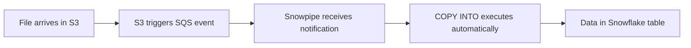
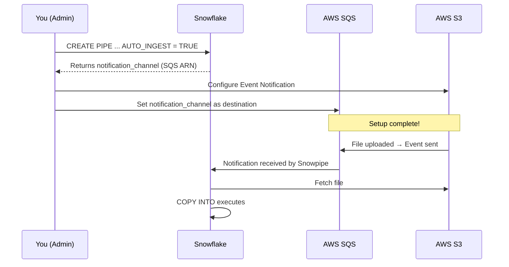
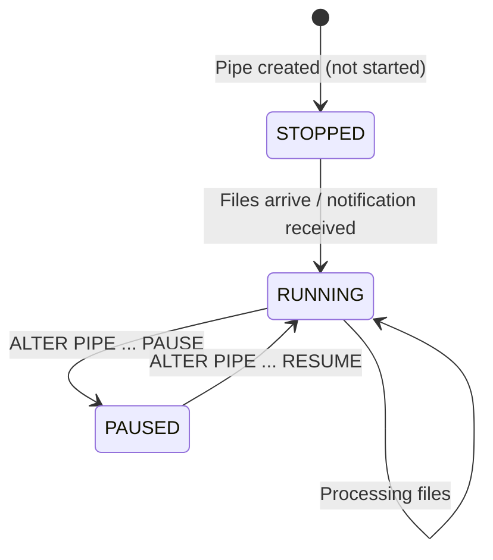
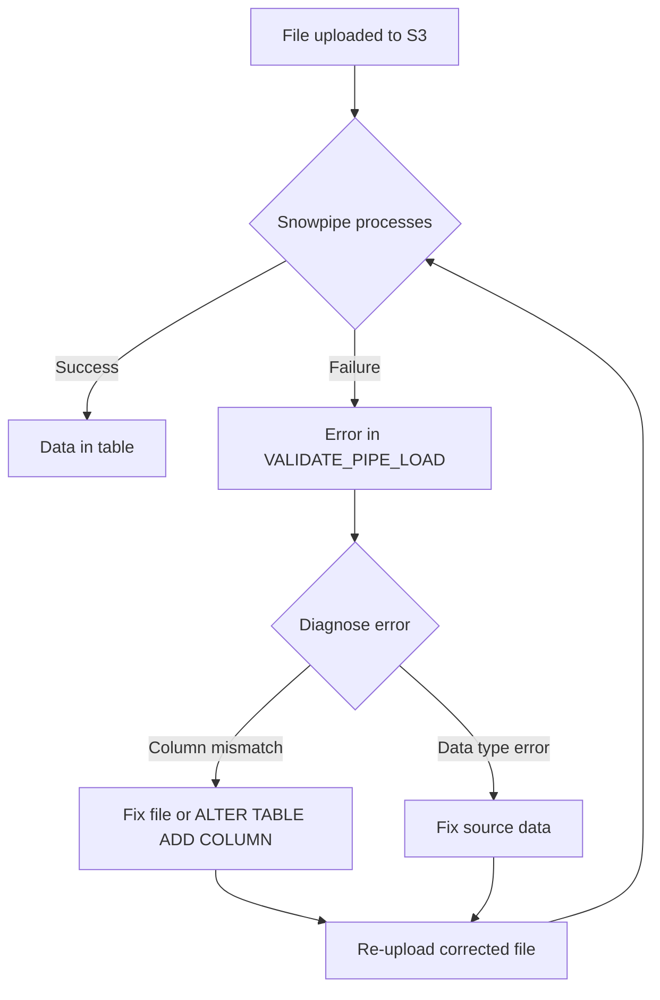
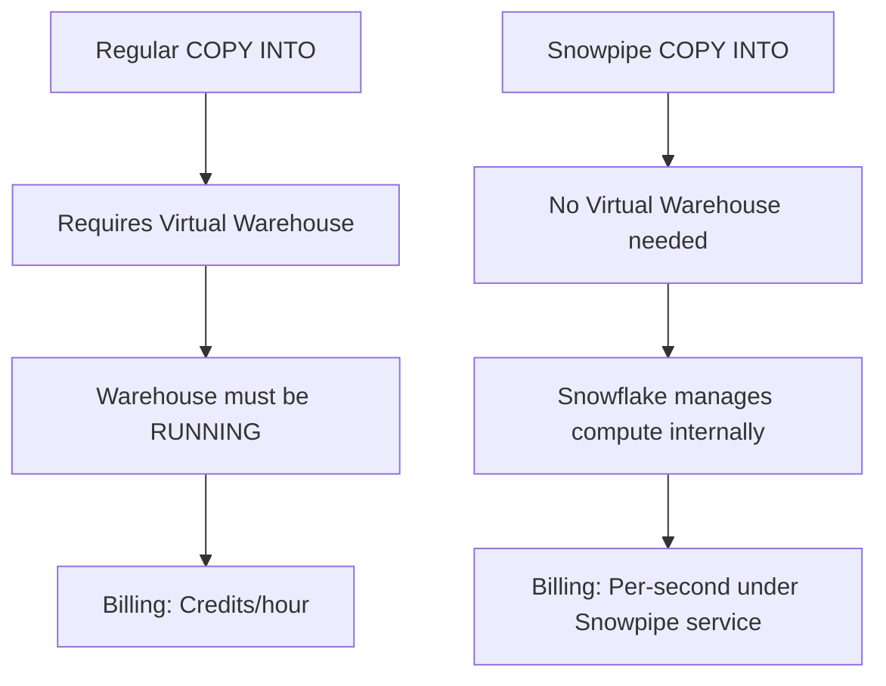
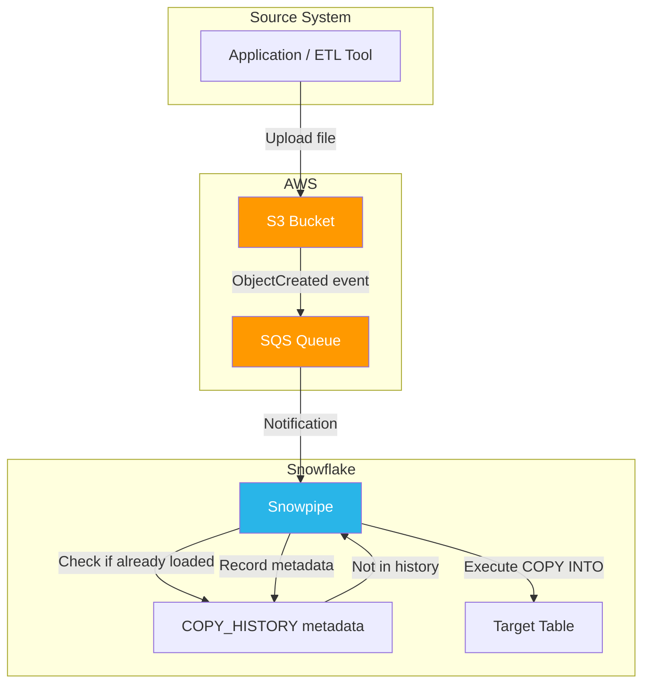

# Lecture 14: Snowpipe — Continuous Data Ingestion

---

## Table of Contents
1. [What is Snowpipe?](#1-what-is-snowpipe)
2. [File Size Recommendations](#2-file-size-recommendations)
3. [Creating a Snowpipe](#3-creating-a-snowpipe)
4. [GET_DDL for Pipes](#4-get_ddl-for-pipes)
5. [AUTO_INGEST = TRUE vs FALSE](#5-auto_ingest--true-vs-false)
6. [SQS Event Notification Setup](#6-sqs-event-notification-setup)
7. [Monitoring Pipe Status](#7-monitoring-pipe-status)
8. [Validating Pipe Errors](#8-validating-pipe-errors)
9. [Snowpipe as a Serverless Feature](#9-snowpipe-as-a-serverless-feature)
10. [Complete Snowpipe Architecture](#10-complete-snowpipe-architecture)
11. [Key Commands Reference](#11-key-commands-reference)
12. [Key Terms](#12-key-terms)
13. [Summary](#13-summary)

---

## 1. What is Snowpipe?

**Snowpipe** is Snowflake's continuous, event-driven, serverless data ingestion service. Instead of running a manual `COPY INTO` command each time a file arrives, Snowpipe automatically detects new files and loads them into the target table.

### The Problem Snowpipe Solves

Without Snowpipe, you must manually run `COPY INTO` every time a new file lands in a stage:

```sql
-- Without Snowpipe (manual, repetitive):
COPY INTO emp FROM @s3_csv_stage FILE_FORMAT = (FORMAT_NAME = 'csv_format');
-- You must run this every time a file arrives — not practical in production.
```

With Snowpipe, this happens **automatically** the moment a file arrives in S3.



---

## 2. File Size Recommendations

Snowflake's documentation provides guidelines for optimal Snowpipe file sizes:

| Scenario | Recommendation |
|----------|---------------|
| **Optimal file size** | ~250 MB per file |
| **Maximum file size** | 5 GB |
| **Files larger than 5 GB** | Split into multiple smaller files |
| **Minimum latency** | ~1 second (from file upload to data availability) |

### Why File Size Matters

- Files that are **too small** (< 1 MB) create overhead for Snowpipe's internal micro-batch processing.
- Files that are **too large** (> 5 GB) take significantly longer to process and should be split.
- The **250 MB sweet spot** balances throughput and latency.

### Splitting Large Files — Example

```bash
# Linux example: split a large CSV into 250MB chunks
split -b 250m large_data.csv chunk_

# Then upload all chunks to S3:
aws s3 cp chunk_* s3://my-bucket/data/
```

---

## 3. Creating a Snowpipe

### Basic Syntax

```sql
CREATE PIPE pipe_name
  AUTO_INGEST = TRUE
AS
  COPY INTO target_table
  FROM @stage_name
  FILE_FORMAT = (FORMAT_NAME = 'file_format_name');
```

### Complete Example

```sql
-- Create a pipe that auto-loads CSV files from S3 into the EMP table
CREATE PIPE pipe_load_data
  AUTO_INGEST = TRUE
AS
  COPY INTO emp
  FROM @s3_csv_stage
  FILE_FORMAT = (FORMAT_NAME = 'csv_format');
```

### Verifying the Pipe Was Created

```sql
-- Method 1: SHOW PIPES
SHOW PIPES;

-- Method 2: Information schema
SELECT * FROM information_schema.pipes;
```

**Key columns in SHOW PIPES output:**

| Column | Description |
|--------|-------------|
| `name` | Pipe name |
| `definition` | The COPY INTO statement embedded in the pipe |
| `notification_channel` | SQS ARN (only for AUTO_INGEST = TRUE) |
| `owner` | Role that created the pipe |
| `pattern` | Optional file pattern filter |

---

## 4. GET_DDL for Pipes

To retrieve the full CREATE PIPE statement:

```sql
SELECT GET_DDL('pipe', 'pipe_load_data');
```

**Example output:**
```sql
CREATE OR REPLACE PIPE PIPE_LOAD_DATA
  AUTO_INGEST = TRUE
AS
COPY INTO EMP
FROM @S3_CSV_STAGE
FILE_FORMAT = (FORMAT_NAME = 'CSV_FORMAT');
```

You can use this to:
- Review the pipe definition
- Recreate the pipe in another environment
- Document your pipeline

### GET_DDL for Other Objects

```sql
SELECT GET_DDL('table', 'emp');          -- Table DDL
SELECT GET_DDL('view', 'my_view');       -- View DDL
SELECT GET_DDL('procedure', 'my_proc(NUMBER)');  -- Procedure DDL
```

---

## 5. AUTO_INGEST = TRUE vs FALSE

### AUTO_INGEST = TRUE (Event-Driven)

```sql
CREATE PIPE pipe_event_driven
  AUTO_INGEST = TRUE
AS
  COPY INTO emp FROM @s3_csv_stage FILE_FORMAT = (FORMAT_NAME = 'csv_format');
```

- Snowpipe **automatically** executes the COPY command when a file arrives in S3.
- Requires SQS event notification setup in AWS.
- `SYSTEM$PIPE_STATUS` returns many fields including `lastIngestedFilePath`, `pendingFileCount`, `lastForwardedFilePath`.

### AUTO_INGEST = FALSE (Manual Refresh)

```sql
CREATE PIPE pipe_manual
  AUTO_INGEST = FALSE
AS
  COPY INTO emp FROM @s3_csv_stage FILE_FORMAT = (FORMAT_NAME = 'csv_format');
```

- Snowpipe does **NOT** automatically detect files.
- You must manually trigger loading using `ALTER PIPE ... REFRESH`.
- `SYSTEM$PIPE_STATUS` returns minimal fields (execution state and pending file count only).

### Status Comparison

| Status Field | AUTO_INGEST = TRUE | AUTO_INGEST = FALSE |
|--------------|-------------------|---------------------|
| `executionState` | RUNNING | RUNNING/STOPPED |
| `pendingFileCount` | Available | Available |
| `lastIngestedFilePath` | Available | Not available |
| `lastForwardedFilePath` | Available | Not available |

### Manually Triggering a Pipe Refresh

```sql
ALTER PIPE pipe_manual REFRESH;
```

This scans the stage, identifies new files (not yet in COPY_HISTORY), and queues them for loading.

---

## 6. SQS Event Notification Setup

When using `AUTO_INGEST = TRUE`, you must configure AWS S3 to send event notifications to the Snowpipe SQS queue.

### Step-by-Step Setup

**Step 1: Get the notification channel from SHOW PIPES**

```sql
SHOW PIPES;
-- Copy the value in the "notification_channel" column
-- Example: arn:aws:sqs:us-east-1:123456789:sf-snowpipe-XXXXX
```

**Step 2: Configure S3 Event Notification**

1. Go to **AWS Console** → **S3** → Select your bucket
2. Click the **Properties** tab
3. Scroll to **Event notifications** → Click **Create event notification**
4. Fill in:
   - **Name:** `notify-snowpipe` (any name)
   - **Event types:** Check **"All object create events"** (`s3:ObjectCreated:*`)
5. **Destination:** Select **SQS queue**
6. **Specify SQS:** Enter SQS ARN (the notification_channel value)
7. Click **Save changes**



---

## 7. Monitoring Pipe Status

### SYSTEM$PIPE_STATUS

```sql
-- Returns a JSON string
SELECT SYSTEM$PIPE_STATUS('pipe_load_data');

-- Format as readable JSON
SELECT PARSE_JSON(SYSTEM$PIPE_STATUS('pipe_load_data'));
```

### Key Status Fields

```json
{
  "executionState": "RUNNING",
  "pendingFileCount": 0,
  "lastForwardedFilePath": "s3://my-bucket/data/emp10.csv",
  "lastIngestedFilePath": "s3://my-bucket/data/emp10.csv",
  "lastIngestedTimestamp": "2025-04-08T07:12:33.000Z",
  "notificationChannelName": "arn:aws:sqs:..."
}
```

### Pipe Status Lifecycle



---

## 8. Validating Pipe Errors

When files fail to load through Snowpipe, use `VALIDATE_PIPE_LOAD`:

```sql
SELECT *
FROM TABLE(INFORMATION_SCHEMA.VALIDATE_PIPE_LOAD(
  PIPE_NAME => 'pipe_load_data',
  START_TIME => DATEADD(HOURS, -1, CURRENT_TIMESTAMP())
));
```

**Common error messages:**
- `Number of columns in file X does not match the corresponding table` — File has extra/missing columns
- `Numeric value 'ABC' is not recognized` — Data type mismatch
- `File not found` — File was deleted before Snowpipe processed it

### Error Resolution Workflow



### Also Check COPY_HISTORY After Errors

```sql
SELECT *
FROM TABLE(INFORMATION_SCHEMA.COPY_HISTORY(
  TABLE_NAME => 'EMP',
  START_TIME => DATEADD(HOURS, -1, CURRENT_TIMESTAMP())
))
WHERE status = 'LOAD_FAILED';
```

---

## 9. Snowpipe as a Serverless Feature

### What "Serverless" Means for Snowpipe

- Snowpipe does **not require a virtual warehouse** to execute COPY commands.
- Snowflake provisions its own internal compute for Snowpipe.
- You are billed per second of compute usage under the **Snowpipe** service type.



### Verifying This

```sql
-- Suspend the warehouse completely
ALTER WAREHOUSE my_warehouse SUSPEND;

-- Snowpipe still works! Upload a file and check:
SELECT PARSE_JSON(SYSTEM$PIPE_STATUS('pipe_load_data'));
-- Files will still be loaded because Snowpipe doesn't need your warehouse
```

### Viewing Snowpipe Costs

1. Go to Snowflake UI → **Admin** → **Cost Management**
2. Click **Consumption** tab
3. Filter by Service Type: **Snowpipe** or **Snowpipe Streaming**

---

## 10. Complete Snowpipe Architecture



### Key Flow Details

1. Application uploads `emp.csv` to `s3://my-bucket/data/`
2. S3 automatically sends an `ObjectCreated` event to the configured SQS queue
3. Snowpipe polls the SQS queue and receives the notification
4. Snowpipe checks COPY_HISTORY — if the file was not previously loaded, it proceeds
5. Snowpipe executes the embedded COPY INTO statement
6. Data is loaded into the target table
7. Metadata is written to COPY_HISTORY

---

## 11. Key Commands Reference

```sql
-- Create a Snowpipe
CREATE PIPE pipe_name AUTO_INGEST = TRUE AS
  COPY INTO target_table FROM @stage_name
  FILE_FORMAT = (FORMAT_NAME = 'fmt_name');

-- View pipes
SHOW PIPES;
SELECT * FROM information_schema.pipes;

-- Get pipe DDL
SELECT GET_DDL('pipe', 'pipe_name');

-- Check pipe status (JSON format)
SELECT PARSE_JSON(SYSTEM$PIPE_STATUS('pipe_name'));

-- Validate pipe load errors
SELECT * FROM TABLE(INFORMATION_SCHEMA.VALIDATE_PIPE_LOAD(
  PIPE_NAME => 'pipe_name',
  START_TIME => DATEADD(HOURS, -1, CURRENT_TIMESTAMP())
));

-- Manually refresh a pipe (for AUTO_INGEST = FALSE)
ALTER PIPE pipe_name REFRESH;

-- Pause a pipe
ALTER PIPE pipe_name SET PIPE_EXECUTION_PAUSED = TRUE;

-- Resume a pipe
ALTER PIPE pipe_name SET PIPE_EXECUTION_PAUSED = FALSE;

-- Drop a pipe
DROP PIPE pipe_name;
```

---

## 12. Key Terms

| Term | Definition |
|------|------------|
| **Snowpipe** | Snowflake's serverless continuous data ingestion service |
| **AUTO_INGEST** | Parameter that enables event-driven file detection via SQS |
| **SQS** | AWS Simple Queue Service; the messaging system used to notify Snowpipe |
| **Notification Channel** | The SQS ARN generated per pipe; must be configured in S3 event notifications |
| **Serverless** | Snowpipe uses Snowflake-managed compute instead of a user-defined warehouse |
| **VALIDATE_PIPE_LOAD** | Table function to inspect file-level loading errors |
| **Pipe Refresh** | Manual command to re-scan a stage for unloaded files |
| **Micro-batch** | Snowpipe processes files in small batches (~1 second latency target) |
| **GET_DDL** | Function to retrieve the CREATE statement of any Snowflake object |

---

## 13. Summary

- **Snowpipe** solves the problem of manual `COPY INTO` by automating data loading when files arrive in cloud storage.
- **Optimal file size** is 250 MB; maximum is 5 GB. Split larger files before uploading.
- **Minimum latency** is approximately 1 second from file upload to data availability.
- Creating a pipe with `AUTO_INGEST = TRUE` generates a **notification_channel** (SQS ARN) that must be configured in AWS S3 Event Notifications.
- `AUTO_INGEST = FALSE` requires manual `ALTER PIPE ... REFRESH` to trigger loads.
- Snowpipe is **serverless** — no warehouse is needed, and costs appear under the Snowpipe service type.
- Monitor pipes with `SYSTEM$PIPE_STATUS` and troubleshoot errors with `VALIDATE_PIPE_LOAD`.
- `COPY_HISTORY` tracks all loaded files. Snowpipe metadata persists even after `TRUNCATE TABLE`.
