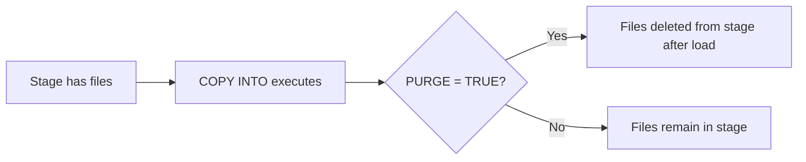
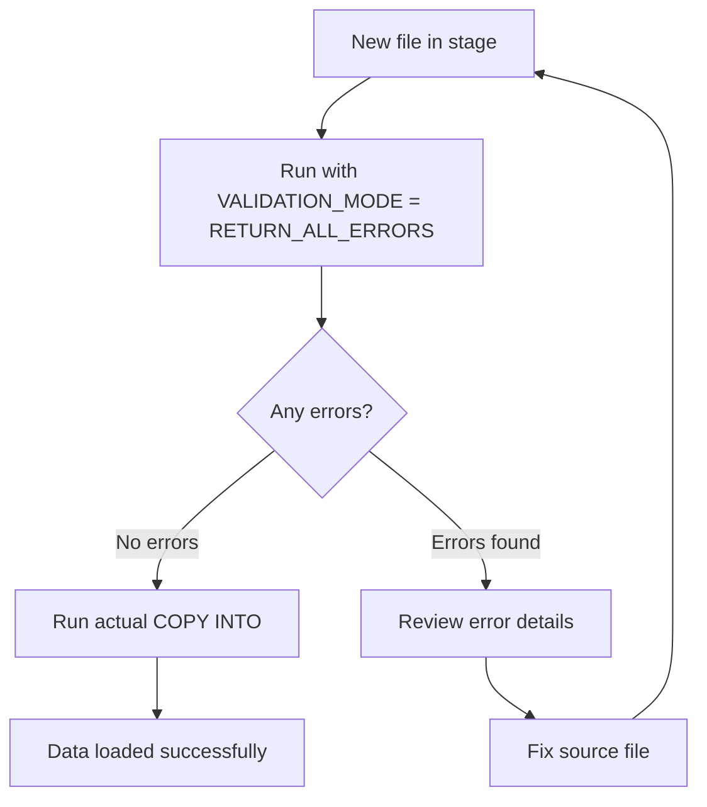
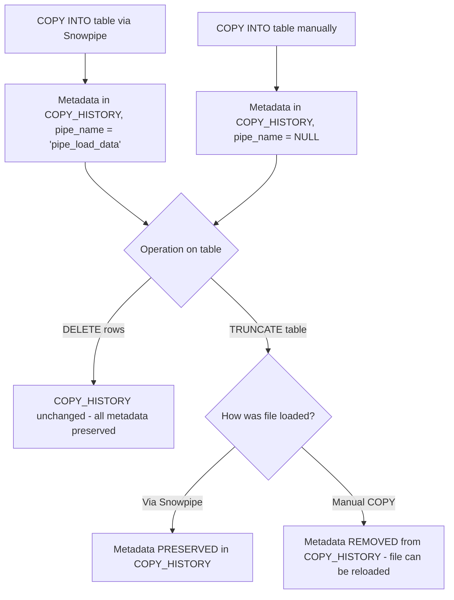

# Lecture 15: COPY Command Options and Error Handling

---

## Table of Contents
1. [Overview of COPY Command Options](#1-overview-of-copy-command-options)
2. [ON_ERROR Parameter](#2-on_error-parameter)
3. [PURGE Parameter](#3-purge-parameter)
4. [TRUNCATECOLUMNS Parameter](#4-truncatecolumns-parameter)
5. [VALIDATION_MODE Parameter](#5-validation_mode-parameter)
6. [Loading Only Valid Records](#6-loading-only-valid-records)
7. [Copy History After Truncate — Recap](#7-copy-history-after-truncate--recap)
8. [Putting Files via SnowSQL](#8-putting-files-via-snowsql)
9. [Practical Error Scenarios](#9-practical-error-scenarios)
10. [Key Commands Reference](#10-key-commands-reference)
11. [Key Terms](#11-key-terms)
12. [Summary](#12-summary)

---

## 1. Overview of COPY Command Options

The `COPY INTO` command supports numerous optional parameters that control error handling, file cleanup, column truncation, and validation behavior.

### Full COPY INTO Syntax with Options

```sql
COPY INTO table_name
FROM @stage_name
FILE_FORMAT = (FORMAT_NAME = 'fmt_name')
ON_ERROR = { CONTINUE | SKIP_FILE | ABORT_STATEMENT }
PURGE = { TRUE | FALSE }
TRUNCATECOLUMNS = { TRUE | FALSE }
FORCE = { TRUE | FALSE }
VALIDATION_MODE = { RETURN_ALL_ERRORS | RETURN_N_ROWS | RETURN_ERRORS };
```

---

## 2. ON_ERROR Parameter

The `ON_ERROR` parameter controls what Snowflake does when it encounters errors in a data file.

### ON_ERROR = ABORT_STATEMENT (Default)

```sql
COPY INTO emp
FROM @s3_csv_stage
FILE_FORMAT = (FORMAT_NAME = 'csv_format')
ON_ERROR = ABORT_STATEMENT;
```

- **Behavior:** If any single row has an error, the entire COPY operation is aborted.
- **No data** is loaded if any error is found.
- This is the **default** behavior if `ON_ERROR` is not specified.

### ON_ERROR = CONTINUE

```sql
COPY INTO emp
FROM @s3_csv_stage
FILE_FORMAT = (FORMAT_NAME = 'csv_format')
ON_ERROR = CONTINUE;
```

- **Behavior:** Skip rows with errors and load all valid rows.
- Error rows are ignored; valid rows proceed.
- Useful when your data has occasional bad records that you don't want to block the entire load.

**Example scenario:**
```
File content:
1, Alice, 5000       ← Valid row
2, Bob, NOT_A_NUM   ← Invalid (number expected for salary)
3, Carol, 6000       ← Valid row

With ON_ERROR = CONTINUE:
- Row 1 loads successfully
- Row 2 is skipped (error logged)
- Row 3 loads successfully
- Result: 2 rows loaded, 1 error
```

### ON_ERROR = SKIP_FILE

```sql
COPY INTO emp
FROM @s3_csv_stage
FILE_FORMAT = (FORMAT_NAME = 'csv_format')
ON_ERROR = SKIP_FILE;
```

- **Behavior:** If any error is found in a file, **skip the entire file**.
- The whole file is not loaded (not just the bad row).
- Useful when you want all-or-nothing loading per file.

### ON_ERROR = SKIP_FILE_N (Skip file if more than N errors)

```sql
-- Skip the file if it has more than 2 errors
COPY INTO emp
FROM @s3_csv_stage
FILE_FORMAT = (FORMAT_NAME = 'csv_format')
ON_ERROR = SKIP_FILE_2;
```

- Skip the file only if the number of errors **exceeds N**.
- If errors <= N, load the valid rows and skip the bad ones.

### Comparison Table

| ON_ERROR Value | Bad Row Behavior | File Behavior |
|---------------|-----------------|---------------|
| `ABORT_STATEMENT` | Stops everything | Entire operation aborted |
| `CONTINUE` | Skips bad row | Other rows in all files still load |
| `SKIP_FILE` | N/A | Entire file skipped if any error |
| `SKIP_FILE_N` | N/A | File skipped if errors > N |

---

## 3. PURGE Parameter

The `PURGE` parameter controls whether source files are deleted from the stage after a successful load.

### PURGE = FALSE (Default)

```sql
COPY INTO emp
FROM @s3_csv_stage
FILE_FORMAT = (FORMAT_NAME = 'csv_format')
PURGE = FALSE;
```

- Files **remain** in the stage after loading.
- Default behavior.

### PURGE = TRUE

```sql
COPY INTO emp
FROM @s3_csv_stage
FILE_FORMAT = (FORMAT_NAME = 'csv_format')
PURGE = TRUE;
```

- Files are **automatically deleted** from the stage after successful loading.
- Useful for keeping the stage clean and reducing storage costs.
- Note: Files are only purged if the load was successful.



---

## 4. TRUNCATECOLUMNS Parameter

The `TRUNCATECOLUMNS` parameter handles situations where a string value in the file is longer than the target column's maximum length.

### TRUNCATECOLUMNS = FALSE (Default)

```sql
COPY INTO emp
FROM @s3_csv_stage
FILE_FORMAT = (FORMAT_NAME = 'csv_format')
TRUNCATECOLUMNS = FALSE;
```

- **Behavior:** If a string is longer than the column's max length, the row fails with an error.

### TRUNCATECOLUMNS = TRUE

```sql
COPY INTO emp
FROM @s3_csv_stage
FILE_FORMAT = (FORMAT_NAME = 'csv_format')
TRUNCATECOLUMNS = TRUE;
```

- **Behavior:** If a string exceeds the column length, it is **silently truncated** to fit.
- No error is thrown; the data is loaded with the truncated value.

**Example:**
```
Column: emp_name VARCHAR(10)
File value: "Christopher"  (11 characters)

TRUNCATECOLUMNS = FALSE  →  Error: value too long
TRUNCATECOLUMNS = TRUE   →  Loads as "Christoph" (10 chars, truncated)
```

---

## 5. VALIDATION_MODE Parameter

`VALIDATION_MODE` lets you **test a COPY statement** without actually loading any data. It returns error information about what would fail if you ran the COPY.

### VALIDATION_MODE = RETURN_ALL_ERRORS

```sql
COPY INTO emp
FROM @s3_csv_stage
FILE_FORMAT = (FORMAT_NAME = 'csv_format')
VALIDATION_MODE = RETURN_ALL_ERRORS;
```

- Returns **all errors** that would occur if you actually ran the COPY.
- **No data is loaded** — this is a dry run / preview mode.
- Returns a result set showing file name, line number, column name, and error message for each problematic row.

### VALIDATION_MODE = RETURN_N_ROWS

```sql
-- Preview the first 10 rows without loading
COPY INTO emp
FROM @s3_csv_stage
FILE_FORMAT = (FORMAT_NAME = 'csv_format')
VALIDATION_MODE = RETURN_10_ROWS;
```

- Returns the **first N rows** from the files as they would be parsed.
- Useful for quickly previewing file contents before loading.

### VALIDATION_MODE = RETURN_ERRORS

```sql
COPY INTO emp
FROM @s3_csv_stage
FILE_FORMAT = (FORMAT_NAME = 'csv_format')
VALIDATION_MODE = RETURN_ERRORS;
```

- Similar to `RETURN_ALL_ERRORS` but only for the current files in the stage that have not yet been loaded.

### Using VALIDATION_MODE Workflow



---

## 6. Loading Only Valid Records

A common real-world scenario: a file contains mostly valid records with a few bad rows. You want to load the valid ones and skip the bad ones.

### Approach 1: Use ON_ERROR = CONTINUE

```sql
COPY INTO emp
FROM @s3_csv_stage/mixed_quality_file.csv
FILE_FORMAT = (FORMAT_NAME = 'csv_format')
ON_ERROR = CONTINUE;
```

After loading, check what was skipped:

```sql
SELECT *
FROM TABLE(INFORMATION_SCHEMA.COPY_HISTORY(
  TABLE_NAME => 'EMP',
  START_TIME => DATEADD(HOURS, -1, CURRENT_TIMESTAMP())
));
-- Look at ERROR_COUNT and ROW_COUNT columns
```

### Approach 2: Pre-validate then Load

```sql
-- Step 1: Check for errors first
COPY INTO emp
FROM @s3_csv_stage/file.csv
FILE_FORMAT = (FORMAT_NAME = 'csv_format')
VALIDATION_MODE = RETURN_ALL_ERRORS;

-- Step 2: If acceptable, run the actual load
COPY INTO emp
FROM @s3_csv_stage/file.csv
FILE_FORMAT = (FORMAT_NAME = 'csv_format')
ON_ERROR = CONTINUE;
```

---

## 7. Copy History After Truncate — Recap

This is a frequently tested concept:



**The critical distinction:**
- **DELETE:** Metadata is always preserved. You cannot reload the same file.
- **TRUNCATE:** Manually loaded file metadata is removed (can reload). Snowpipe metadata remains (cannot reload through pipe).

### Practical Example

```sql
-- Load file manually
COPY INTO emp FROM @s3_csv_stage/emp.csv FILE_FORMAT = (FORMAT_NAME = 'csv_format');
-- Result: 25 rows loaded, metadata in COPY_HISTORY with pipe_name = NULL

-- Try to reload same file:
COPY INTO emp FROM @s3_csv_stage/emp.csv FILE_FORMAT = (FORMAT_NAME = 'csv_format');
-- Result: "Copy executed with 0 files processed" (already in history)

-- Delete all rows
DELETE FROM emp;
-- Try to reload:
COPY INTO emp FROM @s3_csv_stage/emp.csv FILE_FORMAT = (FORMAT_NAME = 'csv_format');
-- Result: Still "0 files processed" (metadata preserved despite DELETE)

-- TRUNCATE the table
TRUNCATE TABLE emp;
-- Try to reload:
COPY INTO emp FROM @s3_csv_stage/emp.csv FILE_FORMAT = (FORMAT_NAME = 'csv_format');
-- Result: 25 rows loaded! (metadata was removed by TRUNCATE for manual loads)
```

---

## 8. Putting Files via SnowSQL

The `PUT` command (to upload files from local machine to an internal stage) can only be run through **SnowSQL** (CLI), not through the Snowflake web UI.

### Connecting via SnowSQL

```bash
snowsql -a <account_name> -u <username>
# Enter password when prompted
```

### Switching Database and Schema in SnowSQL

```sql
USE DATABASE sales_db;
USE SCHEMA sales_schema;
```

### PUT Command (Upload file to internal stage)

```bash
PUT file:///path/to/emp40.csv @csv_stage;
```

### COPY from Internal Stage to Table

```sql
COPY INTO emp
FROM @csv_stage/emp40.csv
FILE_FORMAT = (FORMAT_NAME = 'csv_format');
```

### Why SnowSQL is Required for PUT

The Snowflake web UI (Snowsight) is browser-based and cannot directly access local file paths. The `PUT` command transfers a file from your **local machine** to Snowflake's internal stage, which requires SnowSQL to run locally.

---

## 9. Practical Error Scenarios

### Scenario 1: Column Count Mismatch

```
Table: emp (10 columns)
File: emp30.csv (11 columns — has an extra "date_of_exit" column)

Error: "Number of columns in the file 11 does not match the corresponding table"
Status in COPY_HISTORY: LOAD_FAILED
```

**Resolution:**
```sql
-- Option A: Remove the extra column from the file, re-upload
-- Option B: Add the column to the table
ALTER TABLE emp ADD COLUMN date_of_exit DATE;

-- Option C: Select only specific columns in the COPY statement
COPY INTO emp (emp_no, emp_name, dept_no, job, mgr, hire_date, salary, commission, dept_no2)
FROM (SELECT $1, $2, $3, $4, $5, $6, $7, $8, $9 FROM @s3_csv_stage/emp30.csv)
FILE_FORMAT = (FORMAT_NAME = 'csv_format');
```

### Scenario 2: Data Type Mismatch

```
Column: salary NUMBER
File value: "five thousand"

Error: "Numeric value 'five thousand' is not recognized"
Status: LOAD_FAILED
```

**Resolution:**
```sql
-- Use ON_ERROR = CONTINUE to skip bad rows
COPY INTO emp FROM @s3_csv_stage FILE_FORMAT = (FORMAT_NAME = 'csv_format')
ON_ERROR = CONTINUE;

-- Or use VALIDATION_MODE first to identify issues
COPY INTO emp FROM @s3_csv_stage FILE_FORMAT = (FORMAT_NAME = 'csv_format')
VALIDATION_MODE = RETURN_ALL_ERRORS;
```

### Scenario 3: Checking Whether a File Was Loaded by Snowpipe or Manually

```sql
SELECT file_name, pipe_name, status, row_count
FROM TABLE(INFORMATION_SCHEMA.COPY_HISTORY(
  TABLE_NAME => 'EMP',
  START_TIME => DATEADD(DAYS, -1, CURRENT_TIMESTAMP())
));
-- pipe_name = NULL  → Loaded manually via COPY command
-- pipe_name = 'PIPE_LOAD_DATA'  → Loaded via Snowpipe
```

---

## 10. Key Commands Reference

```sql
-- COPY with ON_ERROR options
COPY INTO table_name FROM @stage_name
FILE_FORMAT = (FORMAT_NAME = 'fmt')
ON_ERROR = CONTINUE;          -- Skip bad rows, load valid rows

COPY INTO table_name FROM @stage_name
FILE_FORMAT = (FORMAT_NAME = 'fmt')
ON_ERROR = SKIP_FILE;         -- Skip entire file if any error

COPY INTO table_name FROM @stage_name
FILE_FORMAT = (FORMAT_NAME = 'fmt')
ON_ERROR = ABORT_STATEMENT;   -- Abort entire COPY if any error (default)

-- COPY with PURGE
COPY INTO table_name FROM @stage_name
FILE_FORMAT = (FORMAT_NAME = 'fmt')
PURGE = TRUE;                 -- Delete file from stage after load

-- COPY with TRUNCATECOLUMNS
COPY INTO table_name FROM @stage_name
FILE_FORMAT = (FORMAT_NAME = 'fmt')
TRUNCATECOLUMNS = TRUE;       -- Truncate strings that are too long

-- VALIDATION_MODE (dry run — no data loaded)
COPY INTO table_name FROM @stage_name
FILE_FORMAT = (FORMAT_NAME = 'fmt')
VALIDATION_MODE = RETURN_ALL_ERRORS;

-- FORCE reload (ignore copy history)
COPY INTO table_name FROM @stage_name
FILE_FORMAT = (FORMAT_NAME = 'fmt')
FORCE = TRUE;

-- Check copy history
SELECT * FROM TABLE(INFORMATION_SCHEMA.COPY_HISTORY(
  TABLE_NAME => 'TABLE_NAME',
  START_TIME => DATEADD(DAYS, -1, CURRENT_TIMESTAMP())
));

-- PUT file to internal stage (SnowSQL only)
PUT file:///local/path/file.csv @internal_stage;

-- List files in stage
LIST @stage_name;

-- Remove file from stage
RM @stage_name/file.csv;
```

---

## 11. Key Terms

| Term | Definition |
|------|------------|
| **ON_ERROR** | Controls behavior when a row error is encountered during COPY |
| **ABORT_STATEMENT** | Default error handling; stops the entire COPY if any error occurs |
| **CONTINUE** | Skip bad rows; load all valid rows |
| **SKIP_FILE** | Skip the entire file if any error is found |
| **PURGE** | When TRUE, deletes stage files after successful loading |
| **TRUNCATECOLUMNS** | When TRUE, truncates string values that exceed column length |
| **VALIDATION_MODE** | Dry-run mode; returns errors without loading data |
| **RETURN_ALL_ERRORS** | Returns every error that would occur during loading |
| **FORCE** | When TRUE, bypasses COPY_HISTORY duplicate check |
| **PUT** | SnowSQL command to upload local files to an internal stage |

---

## 12. Summary

- The `COPY INTO` command has powerful options to handle errors gracefully without aborting an entire load.
- **ON_ERROR = CONTINUE** is the most commonly used option for production loads where occasional bad records are expected.
- **VALIDATION_MODE = RETURN_ALL_ERRORS** is a safe dry-run tool to preview what would fail before committing to a real load.
- **PURGE = TRUE** keeps stages clean by auto-deleting loaded files.
- **TRUNCATECOLUMNS = TRUE** silently truncates oversized strings instead of failing.
- The `PUT` command (upload local file to stage) requires **SnowSQL CLI** — it cannot be run in the web UI.
- Remember the key COPY_HISTORY behavior: **DELETE** preserves metadata; **TRUNCATE** removes metadata for manually loaded files but preserves it for Snowpipe-loaded files.
