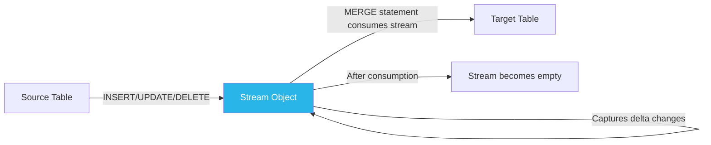
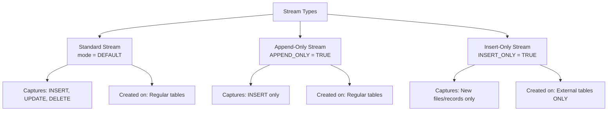
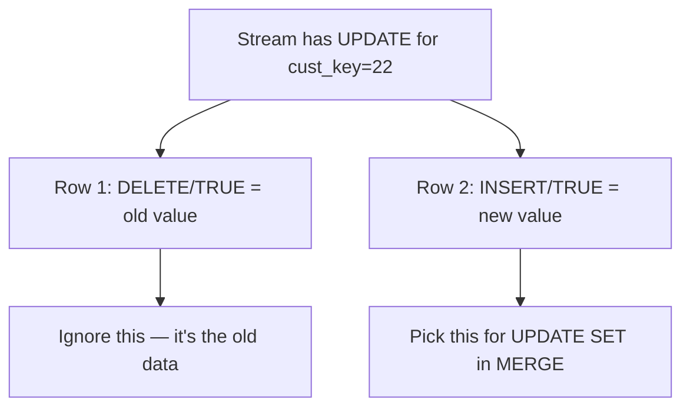
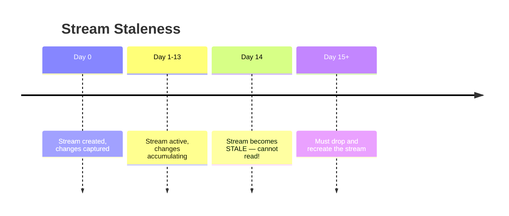

# Lecture 16: Streams — Change Data Capture in Snowflake

---

## Table of Contents
1. [What is Change Data Capture (CDC)?](#1-what-is-change-data-capture-cdc)
2. [What is a Stream?](#2-what-is-a-stream)
3. [Types of Streams](#3-types-of-streams)
4. [Creating a Standard Stream](#4-creating-a-standard-stream)
5. [Stream Metadata Columns](#5-stream-metadata-columns)
6. [Metadata Values for Each Operation](#6-metadata-values-for-each-operation)
7. [Consuming a Stream with MERGE](#7-consuming-a-stream-with-merge)
8. [Stream Staleness](#8-stream-staleness)
9. [Append-Only Stream](#9-append-only-stream)
10. [Insert-Only Stream (External Tables)](#10-insert-only-stream-external-tables)
11. [Performance Optimization with Streams](#11-performance-optimization-with-streams)
12. [Important Edge Cases](#12-important-edge-cases)
13. [Key Commands Reference](#13-key-commands-reference)
14. [Key Terms](#14-key-terms)
15. [Summary](#15-summary)

---

## 1. What is Change Data Capture (CDC)?

**Change Data Capture (CDC)** is the technique of tracking and recording changes (INSERT, UPDATE, DELETE) made to a source table so those changes can be replicated to a target.

### The Problem Without CDC

Without CDC, to keep a target table in sync, you must scan the **entire source table** and join it against the target:

```sql
-- Without CDC — scans ALL 150 million rows even for 1 change:
MERGE INTO target_customer t
USING source_customer s ON t.cust_key = s.cust_key
WHEN MATCHED AND t.cust_name != s.cust_name THEN UPDATE SET ...
WHEN NOT MATCHED THEN INSERT ...;
-- Time: ~45 seconds for 150 million rows!
```

### The Solution: CDC with Streams

With a stream, only the **changed rows** are processed:

```sql
-- With CDC — processes only the 2 changed rows:
MERGE INTO target_customer t
USING customer_stream s ON t.cust_key = s.cust_key
WHEN MATCHED AND s.METADATA$ISUPDATE THEN UPDATE SET ...
WHEN NOT MATCHED THEN INSERT ...;
-- Time: ~4 seconds!
```

---

## 2. What is a Stream?

A Snowflake **stream** is an object that records Data Manipulation Language (DML) changes made to a source table. It acts as a "change log" or "delta table."



### Key Properties of Streams

- A stream is created **on top of** a base table.
- It automatically captures any DML changes to that table.
- Once you consume the stream (e.g., via MERGE), it empties itself.
- The stream does **not copy** the data — it only stores the **offset** and change metadata.

---

## 3. Types of Streams



| Stream Type | Captures | Created On |
|-------------|---------|------------|
| **Standard** | INSERT, UPDATE, DELETE | Regular tables |
| **Append-Only** | INSERT only (no updates/deletes) | Regular tables |
| **Insert-Only** | New file arrivals | External tables only |

---

## 4. Creating a Standard Stream

```sql
-- Create a standard stream on the source table
CREATE STREAM standard_stream ON TABLE source_customer;

-- View all streams
SHOW STREAMS;

-- Check stream via information schema
SELECT * FROM information_schema.streams;
```

### How to Identify the Stream Type

When you run `SHOW STREAMS`, look at the **mode** column:
- `DEFAULT` → Standard stream
- `APPEND_ONLY` → Append-only stream
- `INSERT_ONLY` → Insert-only stream (external tables only)

### Checking Whether a Stream Has Data

```sql
-- Method 1: Query the stream directly
SELECT * FROM standard_stream;

-- Method 2: Use the system function
SELECT SYSTEM$STREAM_HAS_DATA('standard_stream');
-- Returns: TRUE (has data) or FALSE (no changes)
```

---

## 5. Stream Metadata Columns

When you query a stream, it returns all columns from the base table **plus** three additional metadata columns:

| Column | Type | Description |
|--------|------|-------------|
| `METADATA$ACTION` | VARCHAR | The DML action: `INSERT` or `DELETE` |
| `METADATA$ISUPDATE` | BOOLEAN | `TRUE` if this row is part of an UPDATE operation |
| `METADATA$ROW_ID` | VARCHAR | Unique identifier for the changed row |

---

## 6. Metadata Values for Each Operation

### INSERT Operation

```sql
-- Perform an insert on the source
INSERT INTO source_customer VALUES (150000001, 'Krishna', '123 MG Road', '9876543210');

-- Check the stream
SELECT cust_key, cust_name, METADATA$ACTION, METADATA$ISUPDATE
FROM standard_stream;
```

| cust_key | cust_name | METADATA$ACTION | METADATA$ISUPDATE |
|---------|-----------|-----------------|-------------------|
| 150000001 | Krishna | INSERT | FALSE |

> Insert = **INSERT / FALSE**

### DELETE Operation

```sql
DELETE FROM source_customer WHERE cust_key = 100;

-- Stream now shows:
```

| cust_key | METADATA$ACTION | METADATA$ISUPDATE |
|---------|-----------------|-------------------|
| 100 | DELETE | FALSE |

> Delete = **DELETE / FALSE**

### UPDATE Operation

An UPDATE is represented as **two rows** in the stream — the old record and the new record:

```sql
UPDATE source_customer
SET cust_name = 'Updated Name', cust_address = 'New Address'
WHERE cust_key = 22;

-- Stream shows TWO rows for cust_key = 22:
```

| cust_key | cust_name | METADATA$ACTION | METADATA$ISUPDATE |
|---------|-----------|-----------------|-------------------|
| 22 | Old Name | DELETE | TRUE |
| 22 | Updated Name | INSERT | TRUE |

> Old record = **DELETE / TRUE**
> New record (latest) = **INSERT / TRUE**

### Complete Metadata Cheat Sheet

| Operation | METADATA$ACTION | METADATA$ISUPDATE | Notes |
|-----------|----------------|-------------------|-------|
| INSERT | INSERT | FALSE | Pure new record |
| DELETE | DELETE | FALSE | Pure deletion |
| UPDATE (old) | DELETE | TRUE | Old version of the row |
| UPDATE (new) | INSERT | TRUE | New version of the row |

---

## 7. Consuming a Stream with MERGE

The MERGE statement is used to apply stream changes to the target table.

### Complete MERGE Statement with Stream

```sql
MERGE INTO target_customer t
USING standard_stream s
ON t.cust_key = s.cust_key

-- Handle INSERT operations (new records)
WHEN NOT MATCHED AND s.METADATA$ACTION = 'INSERT' AND s.METADATA$ISUPDATE = FALSE
THEN INSERT (cust_key, cust_name, cust_address, cust_phone)
     VALUES (s.cust_key, s.cust_name, s.cust_address, s.cust_phone)

-- Handle UPDATE operations (updated records — pick INSERT TRUE)
WHEN MATCHED AND s.METADATA$ACTION = 'INSERT' AND s.METADATA$ISUPDATE = TRUE
THEN UPDATE SET
    t.cust_name = s.cust_name,
    t.cust_address = s.cust_address,
    t.cust_phone = s.cust_phone

-- Handle DELETE operations
WHEN MATCHED AND s.METADATA$ACTION = 'DELETE' AND s.METADATA$ISUPDATE = FALSE
THEN DELETE;
```

### Why UPDATE Uses "INSERT TRUE"

When processing updates, you want the **latest** version of the record. The latest version is marked as `INSERT / TRUE`. The `DELETE / TRUE` entry is the **old** version.



### After Consuming the Stream

Once the MERGE successfully completes, the stream automatically becomes empty:

```sql
SELECT SYSTEM$STREAM_HAS_DATA('standard_stream');
-- Returns FALSE — stream is now empty
```

---

## 8. Stream Staleness

A stream becomes **stale** if it is not consumed for an extended period.

```sql
-- Check stale_after timestamp
SHOW STREAMS;
-- Look at the "stale_after" column

-- Check current time
SELECT CURRENT_TIMESTAMP();

-- Calculate days until staleness
-- stale_after - current_time = approximately 14 days
```

### Staleness Rules

- A stream becomes stale after approximately **14 days** of non-consumption.
- Once stale, the stream is **unavailable** — you cannot read its data.
- Staleness is tied to the table's **data retention period**. If the table has a longer retention, the stream may be available longer.

### What Stale Means

> If you don't consume a stream for 14 days, your stream becomes **stale** (unavailable). This is a frequently asked exam question.



---

## 9. Append-Only Stream

### Creating an Append-Only Stream

```sql
CREATE STREAM append_only_stream
ON TABLE source_customer
APPEND_ONLY = TRUE;
```

### Behavior

- Captures **only INSERT** operations.
- Does NOT capture UPDATE or DELETE operations.
- Shows `DEFAULT` as mode in `SHOW STREAMS`? No — it shows `APPEND_ONLY`.

### When to Use Append-Only Streams

Use append-only streams when:
- Your source table only grows (e.g., event logs, transaction logs, audit tables)
- You don't care about updates and deletes
- You want a simpler, more efficient stream for insert-heavy workloads

### Comparison

```sql
-- After performing INSERT, UPDATE, DELETE on source:

-- Standard stream shows:
SELECT COUNT(*) FROM standard_stream;  -- Shows: 4+ rows (insert, delete, update old/new)

-- Append-only stream shows:
SELECT COUNT(*) FROM append_only_stream;  -- Shows: 1 row (only the insert)
```

---

## 10. Insert-Only Stream (External Tables)

### Creating an Insert-Only Stream

```sql
-- Can ONLY be created on external tables
CREATE STREAM insert_only_stream
ON EXTERNAL TABLE ext_emp_info
INSERT_ONLY = TRUE;
```

### How It Works

1. Create the stream on an external table.
2. Upload a new file to the stage that the external table points to.
3. Refresh the external table to detect the new file:

```sql
ALTER EXTERNAL TABLE ext_emp_info REFRESH;
```

4. The stream now shows the new records.

### Metadata Column for Insert-Only Streams

Insert-only streams include an extra metadata column: `METADATA$FILENAME`

```sql
SELECT *, METADATA$FILENAME
FROM insert_only_stream;
-- This shows which file each record came from
```

### Checking External Tables

```sql
-- View external tables
SHOW EXTERNAL TABLES;

SELECT * FROM information_schema.external_tables;
-- Shows location (stage path), file format, etc.
```

---

## 11. Performance Optimization with Streams

### The Problem Without Streams (Full Table Join)

```sql
-- Joining two 150-million-row tables = very slow:
MERGE INTO target_customer t
USING source_customer s ON t.cust_key = s.cust_key
...
-- Time: ~45 seconds for just 1 change!
```

### The Solution: Using a Change Table with Stream Logic

```sql
-- Step 1: Create a changes table that holds only the deltas
CREATE TABLE t_changes AS
SELECT * FROM source_customer WHERE 1=2; -- empty copy of structure

-- Step 2: Insert only changed records into t_changes

-- Step 3: Use t_changes (2 rows) instead of source_customer (150M rows)
MERGE INTO target_customer t
USING t_changes s ON t.cust_key = s.cust_key
...
-- Time: ~4 seconds!
```

Streams automate step 2 — they automatically capture exactly which rows changed.

---

## 12. Important Edge Cases

### Case 1: Insert then Update the Same New Row

```sql
-- Insert a new record
INSERT INTO source_customer VALUES (200000001, 'Dirk', 'Mumbai', '111');

-- Stream has: INSERT/FALSE for 200000001

-- Now update that SAME newly inserted row
UPDATE source_customer SET cust_name = 'Dirk Updated' WHERE cust_key = 200000001;

-- Stream shows: still only 1 row (INSERT/FALSE) — not 2!
-- Because the row was never pushed to target yet
```

**Rule:** If you insert a new record and update it *before consuming the stream*, the stream shows only **one INSERT row** with the latest value.

### Case 2: Insert, Update, then Delete the Same Row

```sql
-- Insert
INSERT INTO source_customer VALUES (200000002, 'Vijay', 'Delhi', '222');
-- Update
UPDATE source_customer SET cust_name = 'Vijay V' WHERE cust_key = 200000002;
-- Delete
DELETE FROM source_customer WHERE cust_key = 200000002;

-- Stream shows: 0 rows!
```

**Rule:** If a record is inserted and then deleted before the stream is consumed, the stream is **empty for that record** (net effect is nothing changed).

### Case 3: Multiple Updates to the Same Existing Row

```sql
-- Update an existing record (already in target)
UPDATE source_customer SET cust_address = 'Chennai' WHERE cust_key = 500;
-- Update again
UPDATE source_customer SET cust_address = 'Bangalore' WHERE cust_key = 500;

-- Stream shows: 2 rows (DELETE/TRUE and INSERT/TRUE)
-- The INSERT/TRUE row has the LATEST value: 'Bangalore'
```

**Rule:** The stream always captures the **latest** state of a changed record, not intermediate states.

---

## 13. Key Commands Reference

```sql
-- Create stream (standard)
CREATE STREAM stream_name ON TABLE table_name;

-- Create append-only stream
CREATE STREAM stream_name ON TABLE table_name APPEND_ONLY = TRUE;

-- Create insert-only stream (external table)
CREATE STREAM stream_name ON EXTERNAL TABLE ext_table_name INSERT_ONLY = TRUE;

-- View streams
SHOW STREAMS;

-- Check if stream has data
SELECT SYSTEM$STREAM_HAS_DATA('stream_name');

-- Query stream data
SELECT * FROM stream_name;

-- Consume stream with MERGE
MERGE INTO target_table t
USING stream_name s ON t.key = s.key
WHEN NOT MATCHED AND s.METADATA$ACTION = 'INSERT' AND NOT s.METADATA$ISUPDATE
  THEN INSERT VALUES (...)
WHEN MATCHED AND s.METADATA$ACTION = 'INSERT' AND s.METADATA$ISUPDATE
  THEN UPDATE SET ...
WHEN MATCHED AND s.METADATA$ACTION = 'DELETE' AND NOT s.METADATA$ISUPDATE
  THEN DELETE;

-- Drop stream
DROP STREAM stream_name;
```

---

## 14. Key Terms

| Term | Definition |
|------|------------|
| **Stream** | Snowflake object that records DML changes on a table |
| **Change Data Capture (CDC)** | Technique to track and replicate data changes |
| **Standard Stream** | Captures INSERT, UPDATE, DELETE |
| **Append-Only Stream** | Captures only INSERT operations |
| **Insert-Only Stream** | Captures new files in external tables |
| **METADATA$ACTION** | Column in stream: INSERT or DELETE |
| **METADATA$ISUPDATE** | Column in stream: TRUE if row is part of an UPDATE |
| **METADATA$ROW_ID** | Unique row identifier in stream |
| **MERGE Statement** | SQL command to synchronize target table using stream data |
| **Stale Stream** | A stream not consumed for ~14 days becomes unavailable |
| **Consume** | The act of reading and processing stream data (empties the stream) |

---

## 15. Summary

- **Streams** are Snowflake's mechanism for capturing CDC (Change Data Capture) — they record INSERT, UPDATE, and DELETE operations on a source table.
- There are three stream types: **Standard** (all changes), **Append-Only** (inserts only), and **Insert-Only** (external tables only).
- Streams add three metadata columns: `METADATA$ACTION`, `METADATA$ISUPDATE`, and `METADATA$ROW_ID`.
- The **MERGE statement** is used to apply stream changes to a target table. The metadata columns determine whether to INSERT, UPDATE, or DELETE.
- For UPDATE operations: the stream contains **two rows** — old (DELETE/TRUE) and new (INSERT/TRUE). Always use INSERT/TRUE for the update.
- If you insert and then delete the same record before consuming the stream, the stream shows **zero records** for that key (net effect).
- A stream becomes **stale** (unavailable) after approximately 14 days of non-consumption.
- Using streams dramatically improves MERGE performance by processing only changed rows instead of scanning entire tables.
