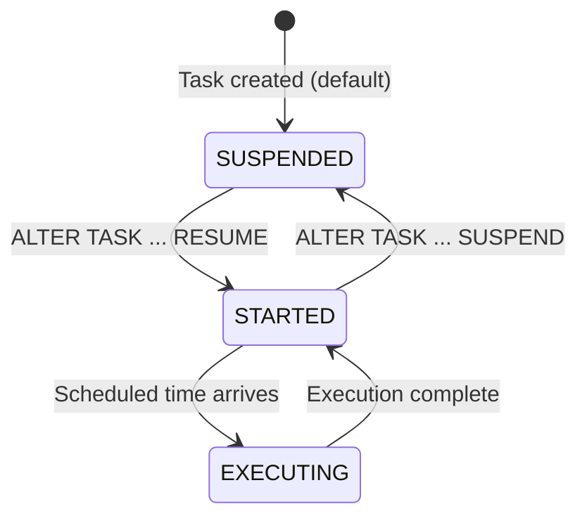
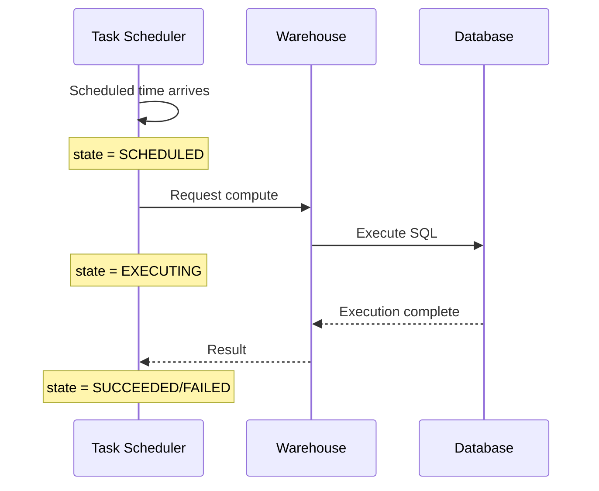
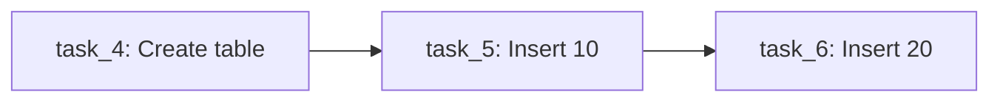

# Lecture 17: Tasks, Scheduling, and User-Defined Functions (UDFs)

---

## Table of Contents
1. [Tasks — Introduction](#1-tasks--introduction)
2. [Creating a Task](#2-creating-a-task)
3. [SCHEDULE Keyword](#3-schedule-keyword)
4. [Cron Scheduling with USING CRON](#4-cron-scheduling-with-using-cron)
5. [Task States and Management](#5-task-states-and-management)
6. [Conditional Task Execution](#6-conditional-task-execution)
7. [Task History Monitoring](#7-task-history-monitoring)
8. [Task Dependencies (DAG)](#8-task-dependencies-dag)
9. [Execute Task Immediately](#9-execute-task-immediately)
10. [User-Defined Functions (UDFs)](#10-user-defined-functions-udfs)
11. [Scalar Functions](#11-scalar-functions)
12. [Tabular Functions](#12-tabular-functions)
13. [Key Commands Reference](#13-key-commands-reference)
14. [Key Terms](#14-key-terms)
15. [Summary](#15-summary)

---

## 1. Tasks — Introduction

A **Task** in Snowflake is an object used to schedule a SQL statement or stored procedure to execute at a defined interval.

### What Can a Task Execute?

- A single SQL statement (SELECT, INSERT, UPDATE, DELETE, MERGE, TRUNCATE, etc.)
- A call to a stored procedure: `CALL procedure_name()`
- A CREATE TABLE or other DDL statement

### Real-World Use Cases

- Automatically run a MERGE statement every 2 minutes to sync changes from a stream
- Create a reporting table every night at midnight
- Refresh materialized views on a schedule
- Call a data quality procedure hourly

---

## 2. Creating a Task

### Basic Syntax

```sql
CREATE TASK task_name
  WAREHOUSE = warehouse_name
  SCHEDULE = 'N MINUTES'
AS
  <sql_statement>;
```

### Example: Run MERGE Every 2 Minutes

```sql
CREATE TASK task_1
  WAREHOUSE = dev_warehouse
  SCHEDULE = '2 MINUTES'
AS
  MERGE INTO target_customer t
  USING standard_stream s ON t.cust_key = s.cust_key
  WHEN NOT MATCHED AND s.METADATA$ACTION = 'INSERT' AND NOT s.METADATA$ISUPDATE
    THEN INSERT (cust_key, cust_name, cust_address, cust_phone)
         VALUES (s.cust_key, s.cust_name, s.cust_address, s.cust_phone)
  WHEN MATCHED AND s.METADATA$ACTION = 'INSERT' AND s.METADATA$ISUPDATE
    THEN UPDATE SET t.cust_name = s.cust_name, t.cust_address = s.cust_address
  WHEN MATCHED AND s.METADATA$ACTION = 'DELETE' AND NOT s.METADATA$ISUPDATE
    THEN DELETE;
```

> **Default State:** When a task is created, it is in **SUSPENDED** state. You must manually start it.

### Viewing Tasks

```sql
SHOW TASKS;

-- Via information schema
SELECT * FROM TABLE(INFORMATION_SCHEMA.TASK_HISTORY(TASK_NAME => 'task_1'));
```

---

## 3. SCHEDULE Keyword

### Option 1: Interval in Minutes

```sql
SCHEDULE = '5 MINUTES'    -- Every 5 minutes
SCHEDULE = '60 MINUTES'   -- Every hour
SCHEDULE = '1440 MINUTES' -- Every day
```

### Option 2: Cron Expression

```sql
SCHEDULE = 'USING CRON * * * * * UTC'
-- Format: minute hour day-of-month month day-of-week timezone
```

---

## 4. Cron Scheduling with USING CRON

Cron expressions give fine-grained control over when a task runs. They follow a standard 5-field format.

### Cron Format

```
* * * * * UTC
│ │ │ │ │ └── Timezone (e.g., UTC, America/Los_Angeles)
│ │ │ │ └──── Day of week (0–6, Sunday=0)
│ │ │ └────── Month (1–12 or JAN–DEC)
│ │ └──────── Day of month (1–31)
│ └────────── Hour (0–23)
└──────────── Minute (0–59)
```

> **Default timezone in Snowflake:** `America/Los_Angeles` (US Pacific)

### Reference Tool

Visit [crontab.guru](https://crontab.guru) to test and validate cron expressions.

### Cron Examples

| Schedule | Cron Expression |
|----------|----------------|
| Every minute | `* * * * * UTC` |
| Every 5 minutes | `*/5 * * * * UTC` |
| At 7:15 AM daily | `15 7 * * * UTC` |
| At midnight every day | `0 0 * * * UTC` |
| Mon–Fri at 8 AM | `0 8 * * 1-5 UTC` |
| April 14th (Monday) at 7:15 AM | `15 7 14 4 1 UTC` |
| Every hour between 7 AM and 8 AM | `* 7-8 * * * UTC` |
| Every 5 min between 7–8 AM | `*/5 7-8 * * * UTC` |

### Creating a Task for April 14th Monday at 7:15 AM

```sql
CREATE TASK task_3
  WAREHOUSE = dev_warehouse
  SCHEDULE = 'USING CRON 15 7 14 4 1 UTC'
AS
  MERGE INTO target_customer t USING standard_stream s ...;
```

**Breaking down `15 7 14 4 1 UTC`:**
- `15` = at minute 15
- `7` = at 7 o'clock (7 AM)
- `14` = on the 14th day of the month
- `4` = in April (month 4)
- `1` = on Monday (day 1)
- `UTC` = UTC timezone

---

## 5. Task States and Management

### Task Lifecycle



### Starting a Task

```sql
ALTER TASK task_name RESUME;
```

### Suspending a Task

```sql
ALTER TASK task_name SUSPEND;
```

### Verifying Task State

```sql
SHOW TASKS;
-- Look at the "state" column: SUSPENDED or STARTED
```

---

## 6. Conditional Task Execution

A task can include a **WHEN** condition so it only runs if the condition is TRUE. This saves warehouse credits.

### Problem Without Condition

Without a condition, the task runs at every scheduled interval — even when the stream has no data:

```sql
-- This runs every 2 minutes even if stream is empty (wastes credits):
CREATE TASK task_1
  WAREHOUSE = dev_warehouse
  SCHEDULE = '2 MINUTES'
AS
  MERGE INTO target_customer t USING standard_stream s ...;
```

### Solution: Use WHEN Clause

```sql
CREATE TASK task_2
  WAREHOUSE = dev_warehouse
  SCHEDULE = '2 MINUTES'
  WHEN SYSTEM$STREAM_HAS_DATA('standard_stream')
AS
  MERGE INTO target_customer t USING standard_stream s ...;
```

**Behavior:**
- If `SYSTEM$STREAM_HAS_DATA('standard_stream')` returns `TRUE` → MERGE executes
- If it returns `FALSE` → Task is **SKIPPED** (no warehouse credits consumed)

### Task Status Values

| Status | Meaning |
|--------|---------|
| `SCHEDULED` | Task is waiting for its scheduled time |
| `EXECUTING` | Task SQL is currently running |
| `SUCCEEDED` | Task completed successfully |
| `FAILED` | Task encountered an error |
| `SKIPPED` | WHEN condition was FALSE; task did not run |

### Verifying Skip Behavior

```sql
-- After task runs with empty stream:
SELECT * FROM TABLE(INFORMATION_SCHEMA.TASK_HISTORY(TASK_NAME => 'task_2'));
-- state column shows: SKIPPED
-- Because SYSTEM$STREAM_HAS_DATA returned FALSE
```

---

## 7. Task History Monitoring

```sql
-- Monitor task execution history
SELECT *
FROM TABLE(INFORMATION_SCHEMA.TASK_HISTORY(
  TASK_NAME => 'task_name'
))
ORDER BY scheduled_time DESC;
```

**Key columns:**
| Column | Description |
|--------|-------------|
| `query_id` | NULL if not started yet; populated after execution |
| `query_text` | The SQL statement executed |
| `state` | SCHEDULED, EXECUTING, SUCCEEDED, FAILED, SKIPPED |
| `scheduled_time` | When the task was scheduled to run |
| `completed_time` | When execution finished |
| `error_message` | Details if the task failed |

### Task Execution Lifecycle



---

## 8. Task Dependencies (DAG)

Tasks can form a **Directed Acyclic Graph (DAG)** — a pipeline where tasks run in a defined order.

### Creating a Task Dependency

```sql
-- Parent task: creates a table
CREATE TASK task_4
  WAREHOUSE = dev_warehouse
  SCHEDULE = '2 MINUTES'
AS
  CREATE OR REPLACE TABLE t_dbt VALUES (NULL);

-- Child task: depends on task_4
CREATE TASK task_5
  WAREHOUSE = dev_warehouse
  AFTER task_4            -- Runs after task_4 completes
AS
  INSERT INTO t_dbt VALUES (10);

-- Grandchild task: depends on task_5
CREATE TASK task_6
  WAREHOUSE = dev_warehouse
  AFTER task_5
AS
  INSERT INTO t_dbt VALUES (20);
```



### Rules for Task Dependencies

1. **You cannot start a child task** if the parent is already STARTED.
2. To start child tasks independently, you must first **SUSPEND the parent**.
3. There is a system function to start all tasks in a DAG at once.

### Finding Task Dependencies

```sql
-- What tasks depend on task_5?
SELECT *
FROM TABLE(INFORMATION_SCHEMA.TASK_DEPENDENTS(
  TASK_NAME => 'task_5'
));
```

**Result interpretation:**
- Lists all child tasks that depend on `task_5`
- Shows `PREDECESSOR` column (parent task)

### Starting All Tasks in a DAG at Once

```sql
-- Start the parent task first (suspending all first):
ALTER TASK task_6 SUSPEND;
ALTER TASK task_5 SUSPEND;
ALTER TASK task_4 SUSPEND;

-- Enable all dependent tasks with one command:
SELECT SYSTEM$TASK_DEPENDENTS_ENABLE('task_4');
-- This starts task_4 (parent) AND automatically starts task_5 and task_6
```

---

## 9. Execute Task Immediately

Sometimes you need to run a task **right now** without waiting for the next scheduled time.

```sql
EXECUTE TASK task_name;
```

This triggers the task to run immediately. You will see the message: **"Task is scheduled to run immediately"**

```sql
-- Verify in task history:
SELECT *
FROM TABLE(INFORMATION_SCHEMA.TASK_HISTORY(TASK_NAME => 'task_name'))
ORDER BY scheduled_time DESC
LIMIT 1;
-- state should be SUCCEEDED
```

---

## 10. User-Defined Functions (UDFs)

UDFs allow you to create custom functions with your own logic, just like built-in functions (e.g., `UPPER()`, `SPLIT_PART()`).

### Types of UDFs

| Type | Returns | How to Call |
|------|---------|-------------|
| **Scalar** | Single value (one row, one column) | In SELECT list |
| **Tabular (UDTF)** | A table (multiple rows/columns) | Using `TABLE()` in FROM clause |

### Supported Languages

```sql
LANGUAGE SQL        -- Standard SQL
LANGUAGE JAVASCRIPT -- JavaScript
LANGUAGE PYTHON     -- Python
LANGUAGE JAVA       -- Java
```

### Viewing Existing UDFs

```sql
SELECT * FROM information_schema.functions;
```

---

## 11. Scalar Functions

### Creating a Scalar UDF

```sql
-- Function to calculate net salary
CREATE OR REPLACE FUNCTION fn_net_salary(p_emp_no NUMBER)
  RETURNS NUMBER
  LANGUAGE SQL
AS
$$
  SELECT salary + NVL(commission, 0)
  FROM emp
  WHERE emp_no = p_emp_no
$$;
```

### Calling a Scalar UDF

```sql
-- All functions are called from SELECT statements
SELECT fn_net_salary(7902);
-- Returns: 3500 (e.g., salary 3000 + commission 500)
```

### More Complex Example: Gratuity Calculation

```sql
-- Gratuity formula: (Last Salary × 15 × Years of Service) / 26
CREATE OR REPLACE FUNCTION fn_gratuity(p_emp_no NUMBER)
  RETURNS NUMBER
  LANGUAGE SQL
AS
$$
  SELECT ROUND(
    salary * 15 * DATEDIFF(YEAR, hire_date, CURRENT_DATE()) / 26
  )
  FROM emp
  WHERE emp_no = p_emp_no
$$;
```

```sql
-- Call it:
SELECT fn_gratuity(7902);
-- Returns: 346154 (example result for ~6 years of service at 100,000 salary)
```

### Difference Between Functions and Procedures

| Feature | Function | Procedure |
|---------|----------|-----------|
| Called from | SELECT statement | `CALL` keyword |
| Returns value | Yes (single value or table) | Yes (optional, via RETURN) |
| Can execute DML | Limited | Yes (INSERT, UPDATE, DELETE) |
| Can be used in WHERE | Yes | No |
| Can use transactions | No | Yes |

---

## 12. Tabular Functions

A **tabular UDF (UDTF)** returns a table — multiple rows and/or columns.

### Creating a Tabular UDF

```sql
CREATE OR REPLACE FUNCTION fr_tabular_info(p_dept_no NUMBER)
  RETURNS TABLE (emp_no NUMBER, emp_name VARCHAR, salary NUMBER)
  LANGUAGE SQL
AS
$$
  SELECT emp_no, emp_name, salary
  FROM emp
  WHERE dept_no = p_dept_no
$$;
```

### Calling a Tabular UDF

```sql
-- You must use TABLE() in the FROM clause
SELECT *
FROM TABLE(fr_tabular_info(10));
```

This returns a full table of results, not just a single value.

---

## 13. Key Commands Reference

### Tasks

```sql
-- Create task with fixed interval
CREATE TASK task_name
  WAREHOUSE = wh_name
  SCHEDULE = '5 MINUTES'
AS <sql_statement>;

-- Create task with cron schedule
CREATE TASK task_name
  WAREHOUSE = wh_name
  SCHEDULE = 'USING CRON 0 7 * * * UTC'
AS <sql_statement>;

-- Create task with conditional execution
CREATE TASK task_name
  WAREHOUSE = wh_name
  SCHEDULE = '5 MINUTES'
  WHEN SYSTEM$STREAM_HAS_DATA('stream_name')
AS <sql_statement>;

-- Create child task (dependency)
CREATE TASK child_task
  WAREHOUSE = wh_name
  AFTER parent_task
AS <sql_statement>;

-- Start a task
ALTER TASK task_name RESUME;

-- Stop a task
ALTER TASK task_name SUSPEND;

-- Run immediately
EXECUTE TASK task_name;

-- View tasks
SHOW TASKS;

-- Task history
SELECT * FROM TABLE(INFORMATION_SCHEMA.TASK_HISTORY(TASK_NAME => 'task_name'));

-- Task dependencies
SELECT * FROM TABLE(INFORMATION_SCHEMA.TASK_DEPENDENTS(TASK_NAME => 'parent_task'));

-- Enable all dependent tasks
SELECT SYSTEM$TASK_DEPENDENTS_ENABLE('parent_task');
```

### UDFs

```sql
-- Create scalar UDF
CREATE OR REPLACE FUNCTION fn_name(param_name TYPE)
  RETURNS RETURN_TYPE
  LANGUAGE SQL
AS
$$
  SELECT ...
$$;

-- Create tabular UDF
CREATE OR REPLACE FUNCTION fn_name(param_name TYPE)
  RETURNS TABLE (col1 TYPE1, col2 TYPE2)
  LANGUAGE SQL
AS
$$
  SELECT col1, col2 FROM table_name WHERE ...
$$;

-- Call scalar UDF
SELECT fn_name(arg_value);

-- Call tabular UDF
SELECT * FROM TABLE(fn_name(arg_value));

-- View UDFs
SELECT * FROM information_schema.functions;
```

---

## 14. Key Terms

| Term | Definition |
|------|------------|
| **Task** | Snowflake object that schedules SQL or procedure execution |
| **SCHEDULE** | Task parameter defining the execution interval (minutes or cron) |
| **USING CRON** | Syntax for precise cron-based scheduling |
| **Cron** | Time-based job scheduler with 5-field expressions (min, hr, day, month, weekday) |
| **RESUME** | Command to start/enable a task |
| **SUSPEND** | Command to pause/disable a task |
| **EXECUTE TASK** | Command to run a task immediately |
| **WHEN Clause** | Conditional expression in task; skips execution if FALSE |
| **SKIPPED** | Task state when WHEN condition returned FALSE |
| **DAG** | Directed Acyclic Graph — a pipeline of dependent tasks |
| **AFTER** | Task keyword to create a dependency on a parent task |
| **UDF** | User-Defined Function — custom function written by the user |
| **Scalar UDF** | Returns a single value |
| **Tabular UDF (UDTF)** | Returns a table (multiple rows/columns) |

---

## 15. Summary

- **Tasks** automate SQL execution on a schedule, eliminating the need for external schedulers.
- Use `SCHEDULE = 'N MINUTES'` for simple interval-based scheduling.
- Use `SCHEDULE = 'USING CRON ...'` for precise scheduling (specific hours, days, weekdays).
- All tasks are **SUSPENDED** by default when created. Use `ALTER TASK ... RESUME` to start.
- The `WHEN SYSTEM$STREAM_HAS_DATA()` condition prevents unnecessary warehouse usage when streams are empty.
- Task execution states progress: **SCHEDULED → EXECUTING → SUCCEEDED/FAILED/SKIPPED**
- Tasks can be chained using `AFTER parent_task` to form a **DAG**.
- `SYSTEM$TASK_DEPENDENTS_ENABLE('parent_task')` starts all tasks in a DAG at once.
- `EXECUTE TASK` runs a task immediately without waiting for its schedule.
- **UDFs** are custom functions: **scalar** (return one value, called in SELECT) and **tabular** (return a table, called via `TABLE()` in FROM).
