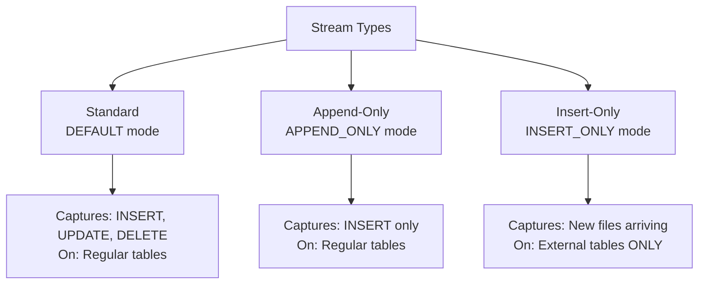
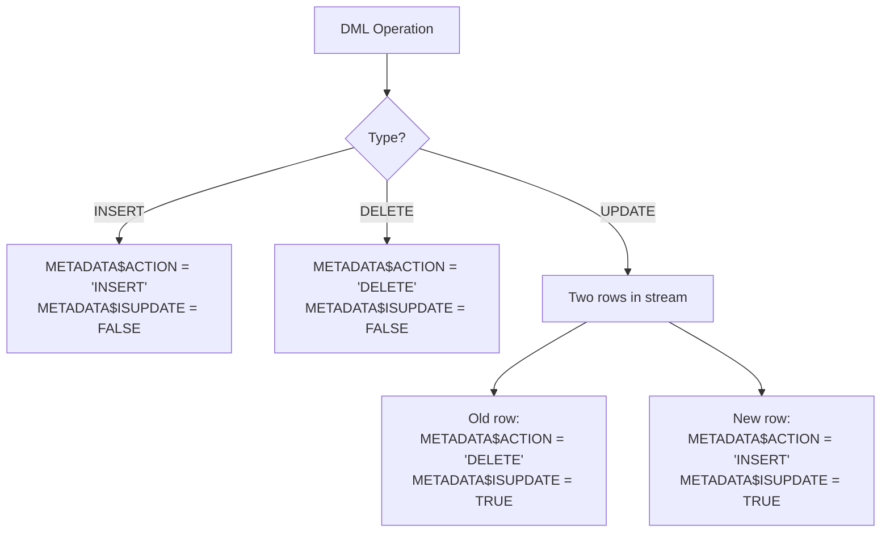
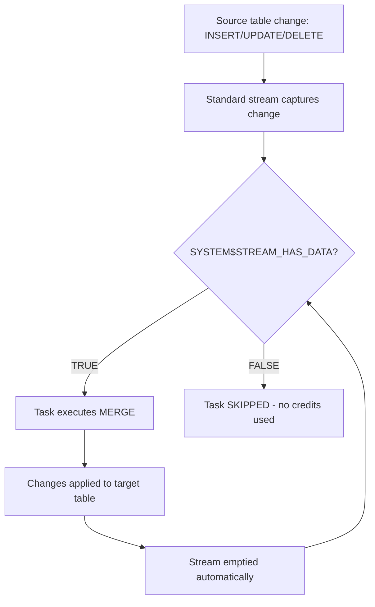

# Lecture 18: Streams and MERGE — Advanced Topics, Warehouse Auto-Resume

---

## Table of Contents
1. [Stream Types Review](#1-stream-types-review)
2. [Append-Only Stream Deep Dive](#2-append-only-stream-deep-dive)
3. [Insert-Only Stream on External Tables](#3-insert-only-stream-on-external-tables)
4. [Metadata Values — Complete Reference](#4-metadata-values--complete-reference)
5. [MERGE with Stream — Full Example](#5-merge-with-stream--full-example)
6. [Automating MERGE with Tasks](#6-automating-merge-with-tasks)
7. [Tasks Integrated with Streams](#7-tasks-integrated-with-streams)
8. [Warehouse AUTO_RESUME and AUTO_SUSPEND](#8-warehouse-auto_resume-and-auto_suspend)
9. [UDFs and Procedures Context](#9-udfs-and-procedures-context)
10. [Key Commands Reference](#10-key-commands-reference)
11. [Key Terms](#11-key-terms)
12. [Summary](#12-summary)

---

## 1. Stream Types Review

Snowflake provides three types of streams, each designed for a specific use case.



### Checking the Stream Mode

```sql
SHOW STREAMS;
-- Look at "mode" column:
-- DEFAULT      → Standard stream
-- APPEND_ONLY  → Append-only stream
-- INSERT_ONLY  → Insert-only stream
```

---

## 2. Append-Only Stream Deep Dive

### What Append-Only Streams Capture

```sql
-- Create the stream
CREATE STREAM append_only_stream
ON TABLE source_customer
APPEND_ONLY = TRUE;

-- Perform operations on source table
INSERT INTO source_customer VALUES (2340, 'New Customer', '456 Street', '9999');
UPDATE source_customer SET cust_name = 'Changed' WHERE cust_key = 100;
DELETE FROM source_customer WHERE cust_key = 45;

-- Check append-only stream:
SELECT * FROM append_only_stream;
-- Only shows: the inserted row (cust_key = 2340)
-- UPDATE and DELETE are NOT captured

-- Check standard stream:
SELECT * FROM standard_stream;
-- Shows ALL changes: insert + update (2 rows) + delete = 4 rows total
```

### When to Use Append-Only Streams

| Use Case | Recommended Stream Type |
|----------|------------------------|
| Log tables (only growing) | Append-Only |
| Event capture (click events, sensor data) | Append-Only |
| Full CDC synchronization | Standard |
| Tracking file arrivals in a stage | Insert-Only (on external table) |

---

## 3. Insert-Only Stream on External Tables

Insert-only streams can **only** be created on external tables. They capture when new files are added to the external stage.

### Full Workflow

```sql
-- Step 1: Identify your external table and its stage
SHOW EXTERNAL TABLES;

-- Step 2: Get the stage details from the external table DDL
SELECT GET_DDL('table', 'ext_emp_info');
-- Shows the stage the external table points to

-- Step 3: Describe the stage to find bucket/folder
DESCRIBE STAGE my_external_stage;

-- Step 4: Create the insert-only stream
CREATE STREAM insert_only_stream
ON EXTERNAL TABLE ext_emp_info
INSERT_ONLY = TRUE;

-- Step 5: Upload a file to the S3 bucket

-- Step 6: Refresh the external table to detect new file
ALTER EXTERNAL TABLE ext_emp_info REFRESH;
-- Output: "1 file(s) registered"

-- Step 7: Check the stream
SELECT * FROM insert_only_stream;
-- Now shows records from the newly uploaded file
```

### Extra Metadata Column

Insert-only streams include `METADATA$FILENAME`:

```sql
SELECT *, METADATA$FILENAME FROM insert_only_stream;
-- METADATA$FILENAME shows: 's3://bucket/folder/emp10.csv'
```

This is extremely useful for tracking which file each record came from.

### External Tables Information

```sql
-- View external table details including location
SELECT table_name, location, file_format_type
FROM information_schema.external_tables;
-- location shows: @database.schema.stage_name
```

---

## 4. Metadata Values — Complete Reference



### Decision Logic for MERGE

```sql
-- For INSERT: find INSERT/FALSE
WHERE METADATA$ACTION = 'INSERT' AND METADATA$ISUPDATE = FALSE

-- For UPDATE: find INSERT/TRUE (latest version)
WHERE METADATA$ACTION = 'INSERT' AND METADATA$ISUPDATE = TRUE

-- For DELETE: find DELETE/FALSE
WHERE METADATA$ACTION = 'DELETE' AND METADATA$ISUPDATE = FALSE
```

---

## 5. MERGE with Stream — Full Example

### Setup

```sql
-- Source table (150 million rows — real production scenario)
CREATE TABLE source_customer AS
SELECT * FROM snowflake_sample_data.tpch_sf1000.customer;

-- Target table (same structure, starts with same data)
CREATE TABLE target_customer AS
SELECT * FROM source_customer;

-- Create a standard stream on the source
CREATE STREAM standard_stream ON TABLE source_customer;
```

### Make Changes to Source

```sql
-- Insert a new customer
INSERT INTO source_customer
VALUES (150000001, 'Customer One', '123 MG Road', NULL, 8, 500.00, 'BUILDING', 'New customer');

-- Update an existing customer
UPDATE source_customer
SET c_name = 'Updated Name', c_address = 'New Address', c_phone = '999-999-9999'
WHERE c_custkey = 1;

-- Delete a customer
DELETE FROM source_customer WHERE c_custkey = 100;
```

### Verify Stream Before MERGE

```sql
-- Check stream has data
SELECT SYSTEM$STREAM_HAS_DATA('standard_stream');
-- Returns: TRUE

-- See all records in stream
SELECT c_custkey, c_name, METADATA$ACTION, METADATA$ISUPDATE
FROM standard_stream;
-- Should show: 4 rows (insert x1, update x2 [old+new], delete x1)
```

### Execute the MERGE

```sql
MERGE INTO target_customer t
USING standard_stream s
ON t.c_custkey = s.c_custkey

-- Insert new records
WHEN NOT MATCHED
  AND s.METADATA$ACTION = 'INSERT'
  AND s.METADATA$ISUPDATE = FALSE
THEN INSERT (c_custkey, c_name, c_address, c_nationkey, c_acctbal, c_mktsegment, c_comment)
     VALUES (s.c_custkey, s.c_name, s.c_address, s.c_nationkey, s.c_acctbal, s.c_mktsegment, s.c_comment)

-- Update changed records (use the INSERT/TRUE row — latest value)
WHEN MATCHED
  AND s.METADATA$ACTION = 'INSERT'
  AND s.METADATA$ISUPDATE = TRUE
THEN UPDATE SET
    t.c_name = s.c_name,
    t.c_address = s.c_address,
    t.c_phone = s.c_phone

-- Delete removed records
WHEN MATCHED
  AND s.METADATA$ACTION = 'DELETE'
  AND s.METADATA$ISUPDATE = FALSE
THEN DELETE;
```

### Verify Results

```sql
-- Stream should be empty after MERGE
SELECT SYSTEM$STREAM_HAS_DATA('standard_stream');
-- Returns: FALSE

-- Check target was updated correctly
SELECT * FROM target_customer WHERE c_custkey = 150000001; -- New record present
SELECT * FROM target_customer WHERE c_custkey = 1;          -- Updated
SELECT * FROM target_customer WHERE c_custkey = 100;        -- Deleted (no row)
```

---

## 6. Automating MERGE with Tasks

### Inefficient Approach (Without Condition)

```sql
-- Runs every 2 minutes, even when stream is empty — wastes credits
CREATE TASK task_merge_all
  WAREHOUSE = dev_warehouse
  SCHEDULE = '2 MINUTES'
AS
  MERGE INTO target_customer ...;
```

### Efficient Approach (With Condition)

```sql
-- Only runs when stream actually has data
CREATE TASK task_merge_conditional
  WAREHOUSE = dev_warehouse
  SCHEDULE = '2 MINUTES'
  WHEN SYSTEM$STREAM_HAS_DATA('standard_stream')
AS
  MERGE INTO target_customer t
  USING standard_stream s ON t.c_custkey = s.c_custkey
  ...;
```

### Starting the Task

```sql
ALTER TASK task_merge_conditional RESUME;
```

### Monitoring the Conditional Task

```sql
SELECT *
FROM TABLE(INFORMATION_SCHEMA.TASK_HISTORY(
  TASK_NAME => 'task_merge_conditional'
))
ORDER BY scheduled_time DESC;

-- When stream is empty: state = SKIPPED
-- When stream has data: state = SUCCEEDED (or FAILED)
```

---

## 7. Tasks Integrated with Streams

### The Full Automation Pipeline



### Verifying the Pipeline is Working

```sql
-- 1. Insert a change into source
INSERT INTO source_customer VALUES (200000001, 'Test', 'Test Address', NULL, 8, 100, 'AUTO', '');

-- 2. Check stream
SELECT SYSTEM$STREAM_HAS_DATA('standard_stream');
-- Returns: TRUE

-- 3. Wait for task to run (or execute immediately)
EXECUTE TASK task_merge_conditional;

-- 4. Verify target was updated
SELECT * FROM target_customer WHERE c_custkey = 200000001;
-- Should see the record

-- 5. Verify stream is now empty
SELECT SYSTEM$STREAM_HAS_DATA('standard_stream');
-- Returns: FALSE
```

---

## 8. Warehouse AUTO_RESUME and AUTO_SUSPEND

When running tasks and procedures, the warehouse's auto-start behavior matters.

### Checking Warehouse Parameters

```sql
SHOW WAREHOUSES;
-- Key columns:
-- auto_resume: TRUE/FALSE
-- auto_suspend: Number of seconds before auto-suspend
```

### AUTO_SUSPEND

```sql
-- Default: 600 seconds = 10 minutes of inactivity
ALTER WAREHOUSE dev_warehouse SET AUTO_SUSPEND = 600;

-- Set to 60 seconds (more aggressive suspension for cost savings)
ALTER WAREHOUSE dev_warehouse SET AUTO_SUSPEND = 60;

-- Disable auto-suspend (warehouse never suspends)
ALTER WAREHOUSE dev_warehouse SET AUTO_SUSPEND = 0;
```

### AUTO_RESUME

```sql
-- Enable auto-resume (warehouse starts automatically when query arrives)
ALTER WAREHOUSE dev_warehouse SET AUTO_RESUME = TRUE;

-- Disable auto-resume (must manually start warehouse)
ALTER WAREHOUSE dev_warehouse SET AUTO_RESUME = FALSE;
```

### Why This Matters for Tasks

If `AUTO_RESUME = FALSE` and the warehouse is suspended, tasks will **fail** because they can't get compute:

```sql
-- Warehouse is suspended
-- Task tries to run:
-- Error: Warehouse 'DEV_WAREHOUSE' is not running

-- Fix:
ALTER WAREHOUSE dev_warehouse SET AUTO_RESUME = TRUE;
-- Now the warehouse auto-starts when the task runs
```

### Best Practice

```sql
-- For production warehouses used by tasks:
ALTER WAREHOUSE prod_warehouse
  SET AUTO_RESUME = TRUE
  SET AUTO_SUSPEND = 300;  -- 5 minutes
```

### Difference Between Snowpipe and Tasks (Warehouse Usage)

| Feature | Snowpipe | Task |
|---------|---------|------|
| Needs warehouse? | No (serverless) | Yes |
| AUTO_RESUME needed? | No | Yes (recommended) |
| Billing type | Serverless credits | Virtual warehouse credits |

---

## 9. UDFs and Procedures Context

### Stream Data in a Procedure or Function

Tasks can call stored procedures, and those procedures can use stream data:

```sql
-- A procedure that consumes the stream
CREATE OR REPLACE PROCEDURE proc_sync_customers()
  RETURNS VARCHAR
  LANGUAGE SQL
AS
$$
BEGIN
  MERGE INTO target_customer t
  USING standard_stream s ON t.c_custkey = s.c_custkey
  WHEN NOT MATCHED AND s.METADATA$ACTION = 'INSERT' AND NOT s.METADATA$ISUPDATE
    THEN INSERT VALUES (s.c_custkey, s.c_name, s.c_address, s.c_nationkey, s.c_acctbal, s.c_mktsegment, s.c_comment)
  WHEN MATCHED AND s.METADATA$ACTION = 'INSERT' AND s.METADATA$ISUPDATE
    THEN UPDATE SET t.c_name = s.c_name, t.c_address = s.c_address
  WHEN MATCHED AND s.METADATA$ACTION = 'DELETE' AND NOT s.METADATA$ISUPDATE
    THEN DELETE;
  RETURN 'Sync complete';
END;
$$;

-- Task that calls the procedure
CREATE TASK task_call_proc
  WAREHOUSE = dev_warehouse
  SCHEDULE = '5 MINUTES'
  WHEN SYSTEM$STREAM_HAS_DATA('standard_stream')
AS
  CALL proc_sync_customers();
```

---

## 10. Key Commands Reference

```sql
-- Standard stream
CREATE STREAM std_stream ON TABLE table_name;

-- Append-only stream
CREATE STREAM aoo_stream ON TABLE table_name APPEND_ONLY = TRUE;

-- Insert-only stream (external table)
CREATE STREAM ins_stream ON EXTERNAL TABLE ext_table INSERT_ONLY = TRUE;

-- Check stream data
SELECT SYSTEM$STREAM_HAS_DATA('stream_name');

-- Query stream
SELECT *, METADATA$ACTION, METADATA$ISUPDATE FROM stream_name;

-- Refresh external table (needed for insert-only stream to pick up new files)
ALTER EXTERNAL TABLE ext_table REFRESH;

-- Show streams
SHOW STREAMS;

-- Warehouse settings
ALTER WAREHOUSE wh_name SET AUTO_RESUME = TRUE;
ALTER WAREHOUSE wh_name SET AUTO_SUSPEND = 300;
ALTER WAREHOUSE wh_name RESUME;   -- Start manually
ALTER WAREHOUSE wh_name SUSPEND;  -- Stop manually

-- Task with condition
CREATE TASK task_name
  WAREHOUSE = wh_name
  SCHEDULE = '5 MINUTES'
  WHEN SYSTEM$STREAM_HAS_DATA('stream_name')
AS CALL proc_name();

-- Task management
ALTER TASK task_name RESUME;
ALTER TASK task_name SUSPEND;
EXECUTE TASK task_name;  -- Run immediately

-- Task history
SELECT * FROM TABLE(INFORMATION_SCHEMA.TASK_HISTORY(TASK_NAME => 'task_name'));
```

---

## 11. Key Terms

| Term | Definition |
|------|------------|
| **Standard Stream** | Captures all DML: INSERT, UPDATE, DELETE |
| **Append-Only Stream** | Captures INSERT operations only on regular tables |
| **Insert-Only Stream** | Captures new file arrivals on external tables |
| **METADATA$ACTION** | Stream column: INSERT or DELETE |
| **METADATA$ISUPDATE** | Stream column: TRUE for update operations |
| **METADATA$FILENAME** | Available in insert-only streams; name of the file |
| **Stale Stream** | Stream not consumed for ~14 days; becomes unavailable |
| **MERGE** | SQL statement to apply stream changes to a target table |
| **WHEN Condition** | Task parameter to conditionally execute based on expression |
| **SKIPPED** | Task state when WHEN condition is FALSE |
| **AUTO_RESUME** | Warehouse setting: start automatically when needed |
| **AUTO_SUSPEND** | Warehouse setting: seconds of inactivity before suspension |

---

## 12. Summary

- **Three stream types:** Standard (all DML), Append-Only (inserts only), Insert-Only (external tables only).
- **Append-only streams** are ideal for log/event tables that only grow; they ignore UPDATE and DELETE.
- **Insert-only streams** detect new files added to external stage paths; they require `ALTER EXTERNAL TABLE ... REFRESH` to pick up new files.
- The **MERGE statement** is the standard way to consume a stream and apply changes to a target table.
- **UPDATE rows** in a standard stream appear as two entries: DELETE/TRUE (old) + INSERT/TRUE (new). Always use INSERT/TRUE.
- **WHEN SYSTEM$STREAM_HAS_DATA()** in a task's WHEN clause prevents unnecessary warehouse usage when no changes exist.
- Warehouses need `AUTO_RESUME = TRUE` to start automatically when tasks need them.
- The full pipeline: Source changes → Stream captures → Task checks condition → Task calls MERGE → Target updated → Stream emptied.
