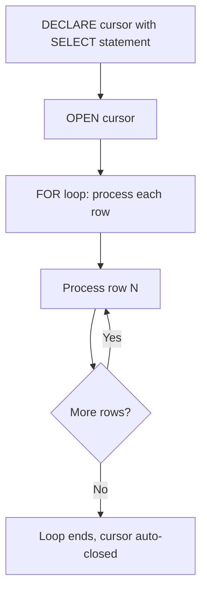

# Lecture 19: Stored Procedures — Introduction and SQL Scripting

---

## Table of Contents
1. [What is a Stored Procedure?](#1-what-is-a-stored-procedure)
2. [Functions vs Procedures](#2-functions-vs-procedures)
3. [SQL Procedure Syntax](#3-sql-procedure-syntax)
4. [Variables in Procedures](#4-variables-in-procedures)
5. [Simple Procedure Example — Net Salary](#5-simple-procedure-example--net-salary)
6. [Conditional Logic — IF/ELSE/END IF](#6-conditional-logic--ifelseend-if)
7. [Gratuity Calculation Procedure](#7-gratuity-calculation-procedure)
8. [Cursor — Processing Multiple Rows](#8-cursor--processing-multiple-rows)
9. [Gratuity with Cursor Procedure](#9-gratuity-with-cursor-procedure)
10. [Cursor with Parameters](#10-cursor-with-parameters)
11. [Calling Procedures](#11-calling-procedures)
12. [Key Commands Reference](#12-key-commands-reference)
13. [Key Terms](#13-key-terms)
14. [Summary](#14-summary)

---

## 1. What is a Stored Procedure?

A **stored procedure** is a named, reusable block of code stored in the database that can perform complex business logic, including DML operations (INSERT, UPDATE, DELETE), control flow (IF/ELSE, loops), and exception handling.

### Why Use Stored Procedures?

- Encapsulate complex business logic in the database
- Reuse logic without rewriting SQL
- Perform multi-step operations as a single unit
- Handle errors gracefully with exception blocks
- Process rows one at a time using cursors

### Warehouse and Procedures

Before calling any procedure, ensure the warehouse is running. The `AUTO_RESUME` setting controls whether it starts automatically.

```sql
-- Check warehouse status
SHOW WAREHOUSES;

-- Enable auto-resume
ALTER WAREHOUSE dev_warehouse SET AUTO_RESUME = TRUE;
```

---

## 2. Functions vs Procedures

| Feature | Function (UDF) | Procedure |
|---------|----------------|-----------|
| Called with | `SELECT fn_name()` | `CALL proc_name()` |
| Can execute DML | No (SQL functions) | Yes |
| Can be used in WHERE clause | Yes | No |
| Returns | Always returns a value | Optional RETURN |
| Can use transactions | No | Yes |
| Process multiple rows | No | Yes (via cursor) |
| Languages supported | SQL, JS, Python, Java | SQL, JS, Python, Java |

---

## 3. SQL Procedure Syntax

### Complete Structure

```sql
CREATE OR REPLACE PROCEDURE procedure_name(
  param_name   DATA_TYPE
)
RETURNS RETURN_TYPE
LANGUAGE SQL
AS
$$
DECLARE
  -- Variable declarations go here
  var_name   DATA_TYPE;
  var_name2  DATA_TYPE;

BEGIN
  -- Main logic goes here
  SELECT col1, col2 INTO :var_name, :var_name2
  FROM table_name
  WHERE key_col = :param_name;

  RETURN var_name;

EXCEPTION
  WHEN STATEMENT_ERROR THEN
    RETURN SQLERRM;
  WHEN OTHER THEN
    RETURN SQLERRM;
END;
$$;
```

### Key Syntax Rules

1. **`$$` delimiters** — mark the start and end of the procedure body.
2. **`DECLARE` section** — optional; where you declare variables.
3. **`BEGIN ... END`** — the main logic block.
4. **`EXCEPTION`** — optional; catches runtime errors.
5. **Colon operator (`:`)** — used when referencing variables or parameters inside SQL statements.

---

## 4. Variables in Procedures

### Declaring Variables

```sql
DECLARE
  v_emp_no     NUMBER;
  v_emp_name   VARCHAR;
  v_salary     NUMBER;
  v_commission NUMBER;
  v_net_salary NUMBER;
```

### Assigning Values to Variables

```sql
-- Method 1: Direct assignment
v_net_salary := 5000;

-- Method 2: Assign from a SELECT INTO
SELECT emp_no, emp_name, salary, commission
INTO :v_emp_no, :v_emp_name, :v_salary, :v_commission
FROM emp
WHERE emp_no = :p_emp_no;  -- p_emp_no is the input parameter
```

### The Colon Operator

The colon (`:`) is required when:
1. **Referencing input parameters** inside SQL statements: `:p_emp_no`
2. **Referencing declared variables** inside SQL statements: `:v_salary`
3. **Assigning values**: `v_net_salary := value`

```sql
-- Without colon: p_emp_no is treated as a column name (WRONG)
WHERE emp_no = p_emp_no;   -- This may not work as expected

-- With colon: p_emp_no is treated as a variable/parameter (CORRECT)
WHERE emp_no = :p_emp_no;  -- This is the correct syntax
```

---

## 5. Simple Procedure Example — Net Salary

### Requirement

Given an employee number, return the net salary (salary + commission).

### Table Setup

```sql
CREATE TABLE emp (
  emp_no     NUMBER,
  emp_name   VARCHAR(50),
  job        VARCHAR(20),
  mgr        NUMBER,
  hire_date  DATE,
  salary     NUMBER,
  commission NUMBER,
  dept_no    NUMBER
);

-- Update all employees to have a commission
UPDATE emp SET commission = 500;
```

### Creating the Procedure

```sql
CREATE OR REPLACE PROCEDURE pr_emp_details(
  p_emp_no  NUMBER
)
RETURNS VARCHAR
LANGUAGE SQL
AS
$$
DECLARE
  v_emp_no     NUMBER;
  v_emp_name   VARCHAR;
  v_salary     NUMBER;
  v_commission NUMBER;
  v_net_salary NUMBER;

BEGIN
  -- Fetch employee details
  SELECT emp_no, emp_name, salary, commission
  INTO :v_emp_no, :v_emp_name, :v_salary, :v_commission
  FROM emp
  WHERE emp_no = :p_emp_no;

  -- Calculate net salary
  v_net_salary := :v_salary + NVL(:v_commission, 0);

  -- Return result
  RETURN v_net_salary;
END;
$$;
```

### Calling the Procedure

```sql
CALL pr_emp_details(7902);
-- Returns: 100500 (salary 100000 + commission 500)
```

---

## 6. Conditional Logic — IF/ELSE/END IF

Procedures support conditional logic using IF/ELSEIF/ELSE/END IF.

### Syntax

```sql
IF condition1 THEN
  -- do this
ELSEIF condition2 THEN
  -- do this
ELSE
  -- do this by default
END IF;
```

### Alternative: CASE Statement

```sql
CASE
  WHEN condition1 THEN result1
  WHEN condition2 THEN result2
  ELSE default_result
END;
```

---

## 7. Gratuity Calculation Procedure

### Business Rules

1. Employee must have **completed 5+ years** of service.
2. Employee must have **resigned** (date_of_exit IS NOT NULL).
3. Formula: `ROUND(salary × 15 × years_of_service / 26)`

### Table Setup

```sql
-- Add new columns to emp table
ALTER TABLE emp ADD COLUMN date_of_exit DATE;
ALTER TABLE emp ADD COLUMN gratuity NUMBER;

-- Update a specific employee's exit date (simulating resignation)
UPDATE emp
SET date_of_exit = '2025-04-01'
WHERE emp_no = 7902;
```

### Procedure Code

```sql
CREATE OR REPLACE PROCEDURE pr_emp_gratuity(
  p_emp_no  NUMBER
)
RETURNS VARCHAR
LANGUAGE SQL
AS
$$
DECLARE
  v_emp_name    VARCHAR;
  v_salary      NUMBER;
  v_hire_date   DATE;
  v_exit_date   DATE;
  v_experience  NUMBER;
  v_eligible    VARCHAR;
  v_gratuity    NUMBER;
  v_message     VARCHAR;

BEGIN
  -- Fetch employee data
  SELECT emp_name, salary, hire_date, date_of_exit
  INTO :v_emp_name, :v_salary, :v_hire_date, :v_exit_date
  FROM emp
  WHERE emp_no = :p_emp_no;

  -- Calculate years of experience
  v_experience := DATEDIFF(YEAR, :v_hire_date, CURRENT_DATE());

  -- Determine eligibility
  IF :v_experience >= 5 AND :v_exit_date IS NOT NULL THEN
    v_eligible := 'Y';
  ELSE
    v_eligible := 'N';
  END IF;

  -- Apply gratuity logic
  IF :v_eligible = 'Y' THEN
    v_gratuity := ROUND(:v_salary * 15 * :v_experience / 26);

    -- Update the gratuity column
    UPDATE emp
    SET gratuity = :v_gratuity
    WHERE emp_no = :p_emp_no;

    v_message := 'Eligible for gratuity';
  ELSE
    v_message := 'Not eligible for gratuity';
  END IF;

  RETURN :v_message;
END;
$$;
```

### Testing the Procedure

```sql
-- Employee 7902 (eligible: 6+ years, has resignation date)
CALL pr_emp_gratuity(7902);
-- Returns: 'Eligible for gratuity'

-- Verify gratuity was updated
SELECT emp_no, salary, hire_date, date_of_exit, gratuity
FROM emp WHERE emp_no = 7902;
-- gratuity column should now have a value like 346154

-- Employee 7369 (not eligible: only 3 years)
CALL pr_emp_gratuity(7369);
-- Returns: 'Not eligible for gratuity'
```

---

## 8. Cursor — Processing Multiple Rows

### The Problem

A `SELECT INTO` statement in a procedure **fails** if it returns more than one row:

```sql
-- This will fail if dept_no = 10 has 3 employees:
SELECT emp_no, emp_name, salary INTO :v_emp_no, :v_emp_name, :v_salary
FROM emp WHERE dept_no = :p_dept_no;
-- Error: "SELECT INTO statement expects exactly one row but found 3"
```

### The Solution: Cursor

A **cursor** is a database object that allows processing of query results **one row at a time** in a loop.

### Cursor Lifecycle



### Cursor Declaration Syntax

```sql
DECLARE
  -- Cursor declaration
  c1 CURSOR FOR SELECT emp_no, emp_name, salary FROM emp;
```

### Cursor with Parameter (Dynamic WHERE clause)

```sql
DECLARE
  -- Cursor with a ? placeholder for a parameter
  c1 CURSOR FOR SELECT emp_no, emp_name, salary
                FROM emp
                WHERE dept_no = ?;  -- ? is replaced by the parameter at OPEN time
```

### Cursor FOR Loop Syntax

```sql
BEGIN
  OPEN c1 USING (:p_dept_no);  -- Pass parameter at OPEN time

  FOR i IN c1 LOOP
    -- Access row values using i.column_name
    v_emp_no   := i.emp_no;
    v_emp_name := i.emp_name;
    v_salary   := i.salary;

    -- Do something with the row
    -- e.g., UPDATE another table
  END LOOP;
END;
```

---

## 9. Gratuity with Cursor Procedure

### Requirement

Update the gratuity for **all employees** (no parameter needed — process all rows).

```sql
CREATE OR REPLACE PROCEDURE pr_gratuity_cursor()
RETURNS VARCHAR
LANGUAGE SQL
AS
$$
DECLARE
  -- Cursor — no parameter needed
  c1 CURSOR FOR
    SELECT emp_no, emp_name, salary, hire_date, date_of_exit
    FROM emp;

  v_emp_no     NUMBER;
  v_emp_name   VARCHAR;
  v_salary     NUMBER;
  v_hire_date  DATE;
  v_exit_date  DATE;
  v_experience NUMBER;
  v_eligible   VARCHAR;
  v_gratuity   NUMBER;
  v_message    VARCHAR;

BEGIN
  OPEN c1;

  FOR i IN c1 LOOP
    -- Assign cursor row values to variables
    v_emp_no    := i.emp_no;
    v_emp_name  := i.emp_name;
    v_salary    := i.salary;
    v_hire_date := i.hire_date;
    v_exit_date := i.date_of_exit;

    -- Calculate experience
    v_experience := DATEDIFF(YEAR, :v_hire_date, CURRENT_DATE());

    -- Eligibility check
    IF :v_experience >= 5 AND :v_exit_date IS NOT NULL THEN
      v_eligible := 'Y';
    ELSE
      v_eligible := 'N';
    END IF;

    -- Update if eligible
    IF :v_eligible = 'Y' THEN
      v_gratuity := ROUND(:v_salary * 15 * :v_experience / 26);
      UPDATE emp SET gratuity = :v_gratuity WHERE emp_no = :v_emp_no;
    END IF;

  END LOOP;

  RETURN 'Gratuity updated for all eligible employees';
END;
$$;
```

### Running and Verifying

```sql
-- First, reset gratuity for all employees
UPDATE emp SET gratuity = NULL;

-- Set exit date for all employees (for testing)
UPDATE emp SET date_of_exit = CURRENT_DATE() - 2;

-- Call the procedure (no parameters)
CALL pr_gratuity_cursor();

-- Verify results
SELECT emp_no, hire_date, salary, gratuity, date_of_exit
FROM emp
ORDER BY emp_no;
-- Employees with 5+ years should have gratuity values
-- Employees with < 5 years should have NULL gratuity
```

---

## 10. Cursor with Parameters

### Requirement

Update gratuity for employees **in a specific department** only.

```sql
CREATE OR REPLACE PROCEDURE pr_gratuity_by_dept(
  p_dept_no  NUMBER
)
RETURNS VARCHAR
LANGUAGE SQL
AS
$$
DECLARE
  -- Cursor with ? placeholder for parameter
  c1 CURSOR FOR
    SELECT emp_no, emp_name, salary, hire_date, date_of_exit
    FROM emp
    WHERE dept_no = ?;  -- ? will be replaced by the parameter

  v_emp_no     NUMBER;
  v_salary     NUMBER;
  v_hire_date  DATE;
  v_exit_date  DATE;
  v_experience NUMBER;
  v_gratuity   NUMBER;

BEGIN
  -- Pass parameter when opening cursor
  OPEN c1 USING (:p_dept_no);

  FOR i IN c1 LOOP
    v_emp_no    := i.emp_no;
    v_salary    := i.salary;
    v_hire_date := i.hire_date;
    v_exit_date := i.date_of_exit;

    v_experience := DATEDIFF(YEAR, :v_hire_date, CURRENT_DATE());

    IF :v_experience >= 5 AND :v_exit_date IS NOT NULL THEN
      v_gratuity := ROUND(:v_salary * 15 * :v_experience / 26);
      UPDATE emp SET gratuity = :v_gratuity WHERE emp_no = :v_emp_no;
    END IF;

  END LOOP;

  RETURN 'Done for dept ' || :p_dept_no;
END;
$$;
```

### Testing

```sql
CALL pr_gratuity_by_dept(10);  -- Updates dept 10 employees
CALL pr_gratuity_by_dept(20);  -- Updates dept 20 employees
CALL pr_gratuity_by_dept(30);  -- Updates dept 30 employees
```

---

## 11. Calling Procedures

```sql
-- Call with one parameter
CALL procedure_name(argument_value);

-- Call with multiple parameters
CALL procedure_name(arg1, arg2, arg3);

-- Call with no parameters
CALL procedure_name();
```

### Viewing Procedure Information

```sql
-- View all procedures in the schema
SELECT * FROM information_schema.procedures;

-- Key columns:
-- PROCEDURE_NAME
-- ARGUMENT_SIGNATURE (data types of parameters)
-- DATA_TYPE (return type)
-- PROCEDURE_DEFINITION (the procedure body)
-- PROCEDURE_OWNER
```

### Getting Procedure DDL

```sql
SELECT GET_DDL('procedure', 'pr_emp_details(NUMBER)');
-- You must include the parameter data type in parentheses!
```

---

## 12. Key Commands Reference

```sql
-- Create a procedure
CREATE OR REPLACE PROCEDURE proc_name(param_name TYPE)
RETURNS VARCHAR
LANGUAGE SQL
AS
$$
DECLARE
  var_name TYPE;
BEGIN
  -- logic
  RETURN :var_name;
END;
$$;

-- Call a procedure
CALL proc_name(argument);

-- View procedures
SELECT * FROM information_schema.procedures;

-- Get procedure DDL
SELECT GET_DDL('procedure', 'proc_name(NUMBER)');

-- Add column to table
ALTER TABLE emp ADD COLUMN gratuity NUMBER;

-- Warehouse auto-resume
ALTER WAREHOUSE wh_name SET AUTO_RESUME = TRUE;
ALTER WAREHOUSE wh_name SET AUTO_SUSPEND = 600;

-- Date difference (years)
DATEDIFF(YEAR, hire_date, CURRENT_DATE())
```

---

## 13. Key Terms

| Term | Definition |
|------|------------|
| **Stored Procedure** | Named block of code stored in DB; can perform DML and control flow |
| **DECLARE section** | Section of a procedure where variables are declared |
| **BEGIN...END** | Main logic block of a procedure |
| **EXCEPTION** | Optional error handling section |
| **Colon operator (:)** | Used to reference parameters/variables inside SQL in procedures |
| **SELECT INTO** | Assigns query result to variables; fails if more than 1 row returned |
| **Cursor** | Database object to process query result one row at a time |
| **OPEN cursor** | Executes the cursor's query and prepares it for iteration |
| **FOR loop** | Iterates through cursor rows one at a time |
| **? placeholder** | Used in cursor declaration when a parameter is passed at OPEN time |
| **CALL** | Keyword used to execute a stored procedure |
| **AUTO_RESUME** | Warehouse setting: TRUE = starts automatically when needed |
| **AUTO_SUSPEND** | Warehouse setting: seconds of inactivity before suspension |

---

## 14. Summary

- **Stored procedures** allow complex, multi-step business logic including DML, conditionals, and loops.
- Procedures are called with `CALL proc_name(args)` — unlike functions which are called from SELECT.
- **Variables** must be declared in the `DECLARE` section. Use `:variable_name` (colon prefix) when referencing them inside SQL statements.
- **Conditional logic** uses `IF ... THEN ... ELSEIF ... ELSE ... END IF` syntax.
- The `CASE` statement can also be used for conditional branching.
- **`SELECT INTO`** loads query results into variables — but fails if the query returns more than one row.
- A **cursor** solves the multi-row problem by iterating over results one row at a time using a `FOR loop`.
- Cursors with dynamic parameters use `?` as a placeholder in the declaration and pass the parameter at `OPEN c1 USING (:p_param)`.
- Use `INFORMATION_SCHEMA.PROCEDURES` to view all procedures; use `GET_DDL('procedure', 'name(TYPE)')` to see the procedure code.
- Ensure the warehouse has `AUTO_RESUME = TRUE` so procedures can execute even if the warehouse was suspended.
