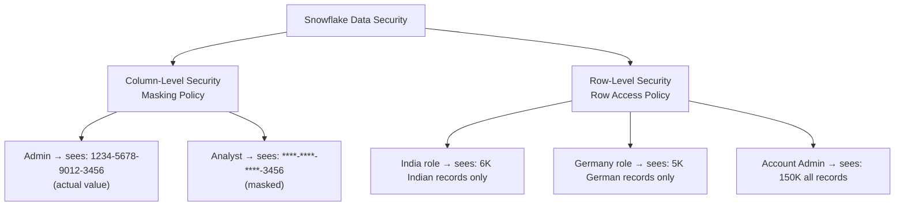
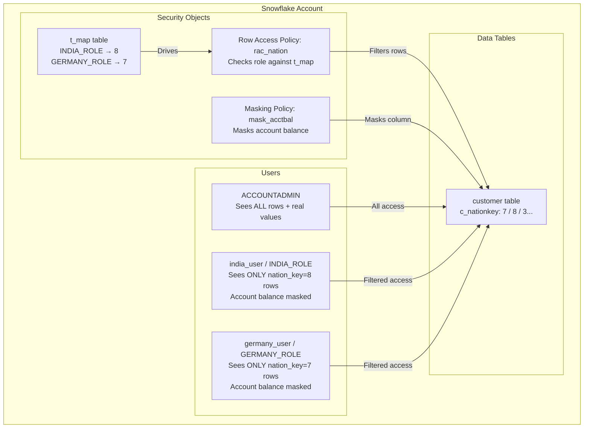

# Lecture 21: Masking Policies — Column-Level and Row-Level Security

---

## Table of Contents
1. [What are Masking Policies?](#1-what-are-masking-policies)
2. [Column-Level Security (Masking Policy)](#2-column-level-security-masking-policy)
3. [Creating a Masking Policy](#3-creating-a-masking-policy)
4. [Applying a Masking Policy to a Column](#4-applying-a-masking-policy-to-a-column)
5. [Testing the Masking Policy](#5-testing-the-masking-policy)
6. [SHOW MASKING POLICIES](#6-show-masking-policies)
7. [Row-Level Security (Row Access Policy)](#7-row-level-security-row-access-policy)
8. [Creating a Row Access Policy](#8-creating-a-row-access-policy)
9. [Applying a Row Access Policy](#9-applying-a-row-access-policy)
10. [Driving Tables for Row Access Policies](#10-driving-tables-for-row-access-policies)
11. [Architecture Diagram](#11-architecture-diagram)
12. [Key Commands Reference](#12-key-commands-reference)
13. [Key Terms](#13-key-terms)
14. [Summary](#14-summary)

---

## 1. What are Masking Policies?

**Masking policies** in Snowflake control what data a user sees when querying a table, based on their role.

There are two types:

| Type | Scope | Controls |
|------|-------|----------|
| **Masking Policy** (Column-Level) | Individual columns | Whether a column's value is visible or masked |
| **Row Access Policy** (Row-Level) | Entire rows | Which rows a user can see |



---

## 2. Column-Level Security (Masking Policy)

### Use Case

A customer table has an `account_balance` column. Only `ACCOUNTADMIN` and certain privileged roles should see the actual balance. Other roles should see `****`.

### Demo Setup

```sql
-- Create a test customer table
CREATE TABLE customer AS
SELECT c_custkey, c_name, c_address, c_phone, c_acctbal, c_mktsegment, c_comment
FROM snowflake_sample_data.tpch_sf1.customer
LIMIT 100;

-- Verify the data
SELECT c_name, c_acctbal FROM customer LIMIT 5;
-- Shows actual balance values
```

### Create a Restricted User

```sql
-- Create user and role for testing
CREATE USER test_user PASSWORD = 'Test123!';
CREATE ROLE analyst_role;
GRANT ROLE analyst_role TO USER test_user;

-- Grant access to database, schema, warehouse, and table
GRANT USAGE ON WAREHOUSE dev_warehouse TO ROLE analyst_role;
GRANT USAGE ON DATABASE test_db TO ROLE analyst_role;
GRANT USAGE ON SCHEMA test_schema TO ROLE analyst_role;
GRANT SELECT ON TABLE customer TO ROLE analyst_role;
```

---

## 3. Creating a Masking Policy

### Masking Policy Syntax

```sql
CREATE MASKING POLICY policy_name
AS (val DATA_TYPE)
RETURNS DATA_TYPE ->
  CASE
    WHEN CURRENT_ROLE() = 'ACCOUNTADMIN'
      THEN val              -- Show the real value
    ELSE '****'             -- Show masked value
  END;
```

### Example: Mask Account Balance

```sql
CREATE MASKING POLICY mask_account_balance
AS (val NUMBER)
RETURNS NUMBER ->
  CASE
    WHEN CURRENT_ROLE() = 'ACCOUNTADMIN'
      THEN val              -- Admin sees actual balance
    ELSE -1                 -- Others see -1 (masked number)
  END;
```

### Example: Mask a VARCHAR Column

```sql
CREATE MASKING POLICY mask_phone
AS (val VARCHAR)
RETURNS VARCHAR ->
  CASE
    WHEN CURRENT_ROLE() IN ('ACCOUNTADMIN', 'FINANCE_ROLE')
      THEN val
    ELSE CONCAT(LEFT(val, 3), '****')  -- Show first 3 chars, mask rest
  END;
```

### Key Rules for Masking Policies

1. The **input type** (`val DATA_TYPE`) must match the **column data type**.
2. The **return type** must also match the column data type.
3. The masked value must be the **same data type** as the real value.
   - If column is NUMBER → return -1, 0, or another number (not `'****'`)
   - If column is VARCHAR → return `'****'` or any string

---

## 4. Applying a Masking Policy to a Column

```sql
ALTER TABLE table_name
MODIFY COLUMN column_name
SET MASKING POLICY policy_name;
```

### Example

```sql
-- Apply masking to account balance column
ALTER TABLE customer
MODIFY COLUMN c_acctbal
SET MASKING POLICY mask_account_balance;
```

---

## 5. Testing the Masking Policy

### As ACCOUNTADMIN

```sql
-- When logged in as ACCOUNTADMIN:
SELECT c_name, c_acctbal FROM customer LIMIT 5;
-- Result: Shows actual balance values (e.g., 711.56, 121.65, 7498.12)
```

### As analyst_role (restricted)

```sql
-- When logged in as analyst_role (test_user):
SELECT c_name, c_acctbal FROM customer LIMIT 5;
-- Result: c_acctbal shows -1 for all rows (masked)
```

---

## 6. SHOW MASKING POLICIES

```sql
SHOW MASKING POLICIES;
```

**Columns:**
- `name` — Policy name
- `body` — The CASE expression
- `owner` — Role that created the policy
- `created_on` — Creation timestamp

---

## 7. Row-Level Security (Row Access Policy)

### Use Case

A customer table contains customers from multiple countries. An India role should only see Indian customers; a Germany role should only see German customers.

### Key Difference from Column Masking

| | Column Masking | Row Access Policy |
|--|---------------|-------------------|
| Controls | Column value visibility | Which rows are visible |
| Return type | Same as column type | **BOOLEAN** |
| Applied to | A column | A column (used as filter) |
| Effect | Masks value | Hides rows entirely |

---

## 8. Creating a Row Access Policy

### Using a Driving Table (Recommended)

A **driving table** maps roles to the values they are allowed to see. This avoids hardcoding and is easier to maintain.

```sql
-- Step 1: Create the mapping/driving table
CREATE TABLE t_map (
  role_name   VARCHAR,
  nation_key  NUMBER
);

-- Step 2: Insert role-to-nation mappings
INSERT INTO t_map VALUES ('INDIA_ROLE', 8);     -- India's nation_key = 8
INSERT INTO t_map VALUES ('GERMANY_ROLE', 7);   -- Germany's nation_key = 7

-- Verify
SELECT * FROM t_map;
```

### Create the Row Access Policy

```sql
CREATE ROW ACCESS POLICY rac_nation
AS (nation_key NUMBER)
RETURNS BOOLEAN ->
  -- Admin can see everything
  CURRENT_ROLE() = 'ACCOUNTADMIN'
  OR
  -- Other roles: check the mapping table
  EXISTS (
    SELECT 1 FROM t_map
    WHERE role_name = CURRENT_ROLE()
      AND t_map.nation_key = nation_key  -- Match the column value
  );
```

**How this works:**
- Returns `TRUE` → row is visible
- Returns `FALSE` → row is hidden
- For ACCOUNTADMIN: always TRUE
- For other roles: TRUE only if the role has a mapping for that nation_key

---

## 9. Applying a Row Access Policy

```sql
ALTER TABLE table_name
ADD ROW ACCESS POLICY policy_name
ON (column_name);
```

### Example

```sql
-- Apply the row access policy to the customer table's nation column
ALTER TABLE customer
ADD ROW ACCESS POLICY rac_nation
ON (c_nationkey);
```

### Removing a Row Access Policy

```sql
ALTER TABLE customer
DROP ROW ACCESS POLICY rac_nation;
```

---

## 10. Driving Tables for Row Access Policies

### Why Use a Driving Table?

**Without driving table (hardcoded — bad practice):**
```sql
CREATE ROW ACCESS POLICY rac_v2
AS (nation_key NUMBER)
RETURNS BOOLEAN ->
  (CURRENT_ROLE() = 'INDIA_ROLE' AND nation_key = 8)
  OR (CURRENT_ROLE() = 'GERMANY_ROLE' AND nation_key = 7)
  OR CURRENT_ROLE() = 'ACCOUNTADMIN';
-- Problem: Must DROP and RECREATE the policy when adding new regions
```

**With driving table (flexible — best practice):**
```sql
-- To add Canada access: just INSERT a row in t_map
INSERT INTO t_map VALUES ('CANADA_ROLE', 3);
-- No need to modify or recreate the policy!
```

### Performance Considerations

- Driving tables typically have 100 rows or fewer (one per role/region).
- Performance impact is minimal.
- For tables with billions of rows, use **Query Acceleration Service** if needed.

### SHOW ROW ACCESS POLICIES

```sql
SHOW ROW ACCESS POLICIES;
```

---

## 11. Architecture Diagram



---

## 12. Key Commands Reference

### Masking Policies

```sql
-- Create masking policy (VARCHAR column)
CREATE MASKING POLICY mask_name
AS (val VARCHAR) RETURNS VARCHAR ->
  CASE
    WHEN CURRENT_ROLE() = 'ACCOUNTADMIN' THEN val
    ELSE '****'
  END;

-- Create masking policy (NUMBER column)
CREATE MASKING POLICY mask_name
AS (val NUMBER) RETURNS NUMBER ->
  CASE
    WHEN CURRENT_ROLE() = 'ACCOUNTADMIN' THEN val
    ELSE -1
  END;

-- Apply masking policy to a column
ALTER TABLE table_name
MODIFY COLUMN column_name
SET MASKING POLICY mask_name;

-- Remove masking policy from a column
ALTER TABLE table_name
MODIFY COLUMN column_name
UNSET MASKING POLICY;

-- Drop masking policy (must UNSET first from all columns)
DROP MASKING POLICY mask_name;

-- View masking policies
SHOW MASKING POLICIES;
```

### Row Access Policies

```sql
-- Create driving/mapping table
CREATE TABLE t_map (role_name VARCHAR, allowed_value NUMBER);
INSERT INTO t_map VALUES ('MY_ROLE', 8);

-- Create row access policy
CREATE ROW ACCESS POLICY rac_name
AS (col_value NUMBER)
RETURNS BOOLEAN ->
  CURRENT_ROLE() = 'ACCOUNTADMIN'
  OR EXISTS (
    SELECT 1 FROM t_map
    WHERE role_name = CURRENT_ROLE() AND t_map.allowed_value = col_value
  );

-- Apply row access policy to table
ALTER TABLE table_name
ADD ROW ACCESS POLICY rac_name ON (column_name);

-- Remove row access policy
ALTER TABLE table_name
DROP ROW ACCESS POLICY rac_name;

-- View row access policies
SHOW ROW ACCESS POLICIES;
```

### User and Role Management (for Testing)

```sql
-- Create user
CREATE USER test_user PASSWORD = 'Test123!';

-- Create role
CREATE ROLE analyst_role;

-- Grant role to user
GRANT ROLE analyst_role TO USER test_user;

-- Grant warehouse/db/schema access
GRANT USAGE ON WAREHOUSE wh_name TO ROLE analyst_role;
GRANT USAGE ON DATABASE db_name TO ROLE analyst_role;
GRANT USAGE ON SCHEMA schema_name TO ROLE analyst_role;
GRANT SELECT ON TABLE table_name TO ROLE analyst_role;
```

---

## 13. Key Terms

| Term | Definition |
|------|------------|
| **Masking Policy** | Controls what value a column shows based on role |
| **Column-Level Security** | Restricting visibility of specific column values |
| **Row Access Policy** | Controls which rows are visible based on role |
| **Row-Level Security** | Restricting visibility of entire rows |
| **CURRENT_ROLE()** | Built-in function returning the active role of the session |
| **Driving Table** | Mapping table that maps roles to allowed data values |
| **BOOLEAN return** | Row access policies return TRUE (show) or FALSE (hide) |
| **UNSET MASKING POLICY** | Removes masking policy from a column |
| **ADD ROW ACCESS POLICY** | Applies a row access policy to a table column |
| **DROP ROW ACCESS POLICY** | Removes a row access policy from a table |

---

## 14. Summary

- **Masking policies** control **column visibility** — the row is visible but the column value may be masked.
- **Row access policies** control **row visibility** — entire rows are hidden if the policy returns FALSE.
- Masking policies use a `CASE WHEN CURRENT_ROLE() = ...` pattern.
- The **input and return types** of a masking policy must match the column's data type exactly.
- Row access policies **return BOOLEAN** — TRUE shows the row, FALSE hides it.
- A **driving table** is the flexible, recommended approach for row access policies — it maps roles to allowed values without hardcoding.
- To add a new region's access, simply insert a row in the driving table. No policy modification needed.
- To **drop** a masking policy, you must first **UNSET** it from all columns that reference it.
- Use `SHOW MASKING POLICIES` and `SHOW ROW ACCESS POLICIES` to view all security policies.
