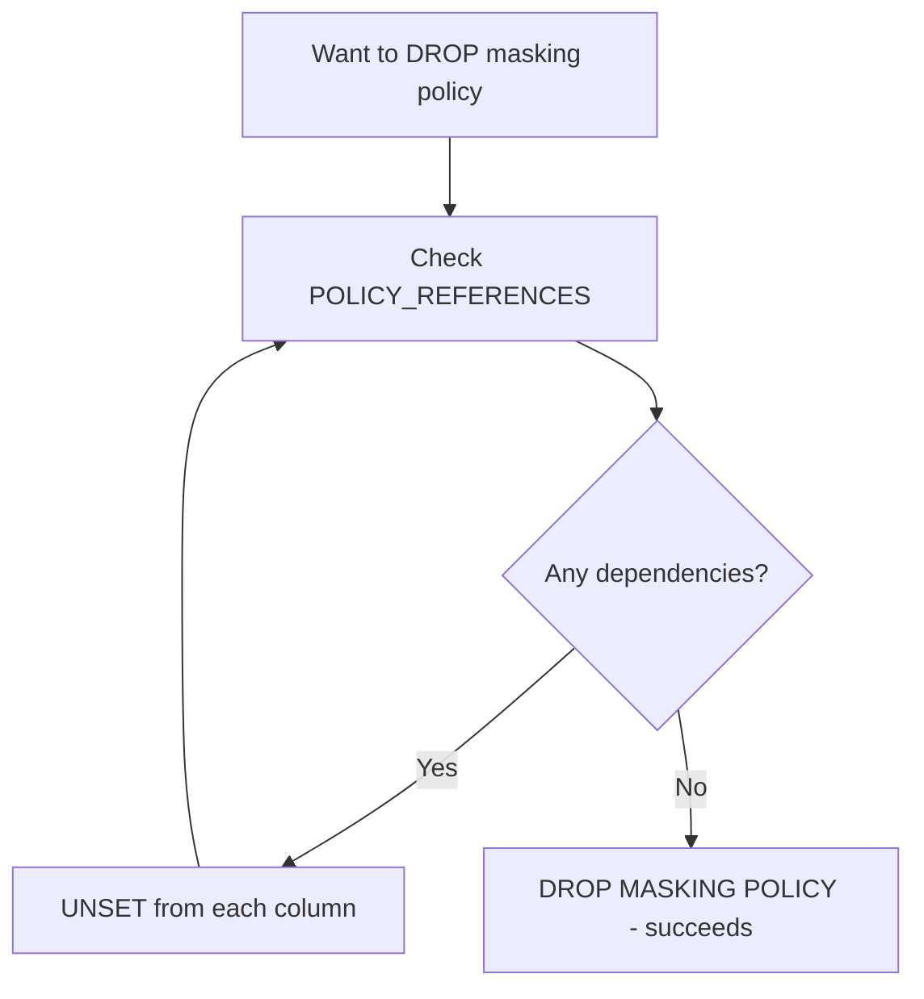
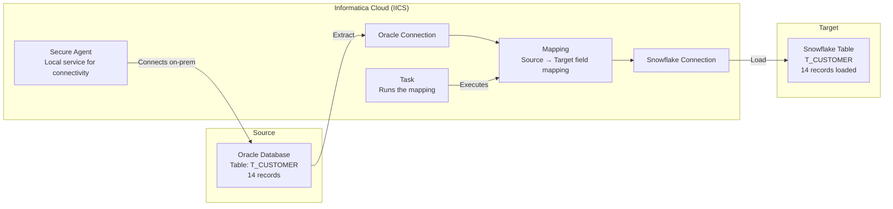

# Lecture 22: Masking Policies Continued, TABLE_STORAGE_METRICS, and Time Travel

---

## Table of Contents
1. [Masking Policy — Removing Dependencies and Dropping](#1-masking-policy--removing-dependencies-and-dropping)
2. [POLICY_REFERENCES — Finding Dependencies](#2-policy_references--finding-dependencies)
3. [TABLE_STORAGE_METRICS View](#3-table_storage_metrics-view)
4. [Time Travel — Offset Method](#4-time-travel--offset-method)
5. [Complete Time Travel Reference](#5-complete-time-travel-reference)
6. [Informatica Cloud — Loading Oracle to Snowflake](#6-informatica-cloud--loading-oracle-to-snowflake)
7. [Key Commands Reference](#7-key-commands-reference)
8. [Key Terms](#8-key-terms)
9. [Summary](#9-summary)

---

## 1. Masking Policy — Removing Dependencies and Dropping

### The Problem: Cannot Drop a Policy In Use

```sql
SHOW MASKING POLICIES;
-- You have: mask_salary, mask_acctbal

DROP MASKING POLICY mask_acctbal;
-- Error: "Cannot drop masking policy because it is referenced in column(s)"
```

You **cannot drop** a masking policy while it is attached to any column. You must first **UNSET** it from all columns.

### Step 1: Find All Dependencies

```sql
-- Find all columns that reference a masking policy
SELECT *
FROM information_schema.policy_references
WHERE policy_name = 'MASK_ACCTBAL';
```

**Key columns in the result:**
| Column | Description |
|--------|-------------|
| `POLICY_NAME` | Name of the masking policy |
| `REF_ENTITY_NAME` | Table name that uses this policy |
| `REF_COLUMN_NAME` | Column name that has the masking policy applied |
| `POLICY_STATUS` | Active/Inactive |

### Step 2: UNSET Masking Policy from Each Column

```sql
-- Remove masking policy from column 1
ALTER TABLE customer
MODIFY COLUMN salary
UNSET MASKING POLICY;

-- Remove masking policy from column 2
ALTER TABLE customer
MODIFY COLUMN c_acctbal
UNSET MASKING POLICY;

-- No need to specify the policy name when unsetting
```

### Step 3: Verify No Dependencies Remain

```sql
SELECT *
FROM information_schema.policy_references
WHERE policy_name = 'MASK_ACCTBAL';
-- Should return 0 rows
```

### Step 4: Drop the Policy

```sql
DROP MASKING POLICY mask_acctbal;
-- Now succeeds!
```

### The Complete Workflow



---

## 2. POLICY_REFERENCES — Finding Dependencies

`INFORMATION_SCHEMA.POLICY_REFERENCES` is the view that shows which tables and columns use any given policy.

```sql
-- Find all references to a specific policy
SELECT
  policy_name,
  ref_entity_name AS table_name,
  ref_column_name AS column_name,
  policy_status
FROM information_schema.policy_references
WHERE policy_name = 'MASK_SALARY';
```

### Example Output

| POLICY_NAME | TABLE_NAME | COLUMN_NAME | POLICY_STATUS |
|-------------|-----------|-------------|---------------|
| MASK_SALARY | CUSTOMER | SALARY | Active |
| MASK_SALARY | EMPLOYEE | BASE_SALARY | Active |

---

## 3. TABLE_STORAGE_METRICS View

### What is TABLE_STORAGE_METRICS?

`INFORMATION_SCHEMA.TABLE_STORAGE_METRICS` is a special view that provides detailed storage information for all tables, including:
- Active data size (current data)
- Time-travel data size (retained versions)
- Fail-safe data size (after time travel window)
- Drop status and timestamps

### Checking Table Size

```sql
SELECT
  table_name,
  table_schema,
  active_bytes,
  time_travel_bytes,
  failsafe_bytes,
  table_dropped,
  table_created,
  ROUND(active_bytes / 1024 / 1024, 2) AS size_mb
FROM information_schema.table_storage_metrics
WHERE table_name = 'SNS_CUSTOMER';
```

**Key columns explained:**

| Column | Description |
|--------|-------------|
| `ACTIVE_BYTES` | Size of current/live data |
| `TIME_TRAVEL_BYTES` | Size of time-travel retained versions |
| `FAILSAFE_BYTES` | Size of fail-safe data |
| `TABLE_DROPPED` | Timestamp when table was dropped (NULL if active) |
| `TABLE_CREATED` | Timestamp when table was created |

### Converting Bytes to Human-Readable Sizes

```sql
SELECT
  table_name,
  active_bytes,
  ROUND(active_bytes / 1024, 2) AS size_kb,
  ROUND(active_bytes / 1024 / 1024, 2) AS size_mb,
  ROUND(active_bytes / 1024 / 1024 / 1024, 4) AS size_gb
FROM information_schema.table_storage_metrics
WHERE table_name = 'CUSTOMER';
```

### Viewing Dropped Tables

One key use of TABLE_STORAGE_METRICS is to inspect **dropped tables** — tables that have been dropped but are still in the fail-safe period.

```sql
-- Show all dropped tables and when they were dropped
SELECT table_name, table_created, table_dropped, active_bytes
FROM information_schema.table_storage_metrics
WHERE table_dropped IS NOT NULL
ORDER BY table_dropped DESC;
```

### Practical Example

```sql
-- Create and drop the customer table
CREATE TABLE sns_customer AS
SELECT * FROM snowflake_sample_data.tpch_sf1.customer;

DROP TABLE sns_customer;

-- Verify in TABLE_STORAGE_METRICS
SELECT table_name, table_dropped, active_bytes
FROM information_schema.table_storage_metrics
WHERE table_name = 'SNS_CUSTOMER';
-- table_dropped shows the drop timestamp
```

---

## 4. Time Travel — Offset Method

### Review: Time Travel Methods

Snowflake Time Travel lets you query data at a point in the past. There are three methods:

| Method | Syntax | Use Case |
|--------|--------|---------|
| **Offset** | `AT(OFFSET => -N)` | N seconds in the past |
| **Timestamp** | `AT(TIMESTAMP => 'timestamp')` | Specific point in time |
| **Statement** | `BEFORE(STATEMENT => 'query_id')` | Before a specific query ran |

### Method 1: OFFSET

```sql
-- Query the table as it was 60 seconds ago
SELECT * FROM customer
AT(OFFSET => -60);

-- Query the table as it was 5 minutes ago (300 seconds)
SELECT * FROM customer
AT(OFFSET => -300);

-- Query the table as it was 1 hour ago
SELECT * FROM customer
AT(OFFSET => -3600);
```

### Method 2: TIMESTAMP

```sql
-- Query at a specific timestamp
SELECT * FROM customer
AT(TIMESTAMP => '2025-04-08 07:00:00'::TIMESTAMP_NTZ);

-- Using BEFORE instead of AT
SELECT * FROM customer
BEFORE(TIMESTAMP => '2025-04-08 07:00:00'::TIMESTAMP_NTZ);
```

### Method 3: STATEMENT (Query ID)

```sql
-- Find the query ID of a recent operation
SELECT query_id, query_text, start_time
FROM TABLE(INFORMATION_SCHEMA.QUERY_HISTORY())
WHERE query_text LIKE '%DELETE%'
ORDER BY start_time DESC
LIMIT 5;

-- Query data BEFORE that statement ran
SELECT * FROM customer
BEFORE(STATEMENT => '01abc123-def4-5678-9012-abcdef123456');
```

### Practical Recovery Scenario

```sql
-- Step 1: Accidentally delete all records
DELETE FROM customer;
-- Oops! All 150K records gone.

-- Step 2: Find the query ID of the DELETE
SELECT query_id, query_text
FROM TABLE(INFORMATION_SCHEMA.QUERY_HISTORY())
WHERE query_text ILIKE '%DELETE FROM CUSTOMER%'
ORDER BY start_time DESC
LIMIT 1;

-- Step 3: Restore using BEFORE(STATEMENT)
CREATE OR REPLACE TABLE customer AS
SELECT * FROM customer
BEFORE(STATEMENT => '<query_id_from_step_2>');

-- Step 4: Verify restoration
SELECT COUNT(*) FROM customer;
-- Should be 150K again
```

---

## 5. Complete Time Travel Reference

### Time Travel Window

| Table Type | Max Retention |
|-----------|--------------|
| Permanent | 0–90 days |
| Transient | 0–1 day |
| Temporary | 0–1 day |

### Setting Retention Period

```sql
-- Set at database level
CREATE DATABASE my_db
  DATA_RETENTION_TIME_IN_DAYS = 7;

-- Set at table level
ALTER TABLE customer
  SET DATA_RETENTION_TIME_IN_DAYS = 30;

-- Set at schema level
ALTER SCHEMA my_schema
  SET DATA_RETENTION_TIME_IN_DAYS = 14;
```

### Checking Current Retention Setting

```sql
SHOW TABLES LIKE 'CUSTOMER';
-- Look at "retention_time" column

SELECT table_name, retention_time
FROM information_schema.tables
WHERE table_name = 'CUSTOMER';
```

### UNDROP (Restore a Dropped Table)

```sql
DROP TABLE customer;
-- Table is gone but in time travel...

UNDROP TABLE customer;
-- Table is restored!
```

### UNDROP Database or Schema

```sql
UNDROP DATABASE my_db;
UNDROP SCHEMA my_schema;
```

---

## 6. Informatica Cloud — Loading Oracle to Snowflake

This section introduces Informatica Cloud (IICS) as an ETL tool for loading data from Oracle to Snowflake.

### Architecture



### Key Components

| Component | Description |
|-----------|-------------|
| **Mapping** | Defines source, target, and column field mappings |
| **Task** | Calls the mapping and runs the ETL job |
| **Secure Agent** | Local service that connects Informatica Cloud to on-premises databases |
| **Connection** | Configuration for connecting to source (Oracle) or target (Snowflake) |
| **Smart Map** | Auto-maps source and target fields with matching names |

### Steps to Load Oracle to Snowflake via Informatica

1. **Install Secure Agent** — Downloads and runs locally to connect to on-premises Oracle.
2. **Create Oracle Connection** — Provide: username, password, hostname, port, service name.
3. **Install Snowflake Connector** — From "Add-on Connectors" in IICS, install the Snowflake connector.
4. **Create Snowflake Connection** — Provide: account name, username, password, warehouse, database.
5. **Create Mapping** — Select source (Oracle) and target (Snowflake), choose tables, click "Smart Map".
6. **Create Task** — Name the task, select the mapping, save.
7. **Run the Task** — Execute and monitor until status shows "Succeeded".

### Connection Details for Snowflake

```
Account Name: <your_snowflake_account>   -- From Snowflake UI URL
User Name: <snowflake_username>
Password: <snowflake_password>
Warehouse: COMPUTE_WAREHOUSE
Database: TEST_DB
```

### Oracle User Setup (for Informatica Connection)

```sql
-- In Oracle SQL (run as SYSDBA):
CREATE USER ravi IDENTIFIED BY oracle;
GRANT CONNECT, RESOURCE, UNLIMITED TABLESPACE TO ravi;
```

### Informatica vs DBT

| Feature | Informatica IICS | DBT |
|---------|-----------------|-----|
| Primary Use | ETL (Extract, Transform, Load) | Transformation (ELT - after loading) |
| Visual Interface | Yes | Code-based (SQL models) |
| Cost | Higher | Lower |
| Performance | Good for complex transforms | Faster for SQL transforms |
| Partner with Snowflake | Yes | Yes (official partner) |

---

## 7. Key Commands Reference

### Masking Policy Cleanup

```sql
-- Find policy dependencies
SELECT * FROM information_schema.policy_references
WHERE policy_name = 'POLICY_NAME';

-- Remove masking policy from a column
ALTER TABLE table_name MODIFY COLUMN col_name UNSET MASKING POLICY;

-- Drop masking policy (must unset first)
DROP MASKING POLICY policy_name;

-- View masking policies
SHOW MASKING POLICIES;
```

### Table Storage Metrics

```sql
-- Check table size
SELECT table_name, active_bytes, table_dropped
FROM information_schema.table_storage_metrics
WHERE table_name = 'TABLE_NAME';

-- All dropped tables
SELECT table_name, table_created, table_dropped
FROM information_schema.table_storage_metrics
WHERE table_dropped IS NOT NULL;
```

### Time Travel

```sql
-- Offset method
SELECT * FROM table_name AT(OFFSET => -300);       -- 5 min ago
SELECT * FROM table_name BEFORE(OFFSET => -300);   -- Before 5 min ago

-- Timestamp method
SELECT * FROM table_name
AT(TIMESTAMP => '2025-04-08 07:00:00'::TIMESTAMP_NTZ);

-- Statement method
SELECT * FROM table_name
BEFORE(STATEMENT => 'query_id_string');

-- UNDROP table
UNDROP TABLE table_name;

-- Set retention period
ALTER TABLE table_name SET DATA_RETENTION_TIME_IN_DAYS = 30;
```

---

## 8. Key Terms

| Term | Definition |
|------|------------|
| **POLICY_REFERENCES** | Information schema view showing policy-to-column dependencies |
| **UNSET MASKING POLICY** | Removes a masking policy from a column |
| **TABLE_STORAGE_METRICS** | View showing table sizes, creation/drop timestamps |
| **ACTIVE_BYTES** | Storage size of live table data |
| **TIME_TRAVEL_BYTES** | Storage retained for time travel queries |
| **FAILSAFE_BYTES** | Storage in the 7-day fail-safe period |
| **TABLE_DROPPED** | Timestamp when a table was dropped |
| **Time Travel** | Snowflake feature to query data at a past point in time |
| **OFFSET** | Time travel method using seconds offset from now |
| **TIMESTAMP** | Time travel method using a specific datetime |
| **STATEMENT** | Time travel method referencing a past query ID |
| **UNDROP** | Restores a dropped table, schema, or database |
| **Informatica IICS** | Cloud-based ETL tool; used to load data from Oracle to Snowflake |
| **Secure Agent** | Local Informatica service enabling connectivity to on-premises databases |
| **Mapping** | Informatica component defining source-to-target field mappings |
| **Task** | Informatica component that executes a mapping |

---

## 9. Summary

- To **drop a masking policy**, you must first find all dependencies using `INFORMATION_SCHEMA.POLICY_REFERENCES`, then `UNSET` the policy from each column, then drop it.
- `TABLE_STORAGE_METRICS` provides table sizes in bytes and tracks dropped tables — the only way to see information about tables that have been dropped.
- **Time Travel** has three methods: OFFSET (seconds), TIMESTAMP (specific datetime), STATEMENT (before a query ID).
- `UNDROP TABLE/DATABASE/SCHEMA` restores dropped objects within the retention window.
- **Informatica Cloud (IICS)** uses a Secure Agent + Mapping + Task workflow to load data from on-premises Oracle to Snowflake.
- The Snowflake connector for Informatica is available as an "add-on connector" in the IICS marketplace.
- Informatica vs DBT: Informatica is ETL (transform during load); DBT is ELT (load first, transform after).
