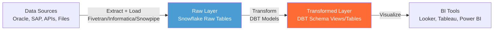
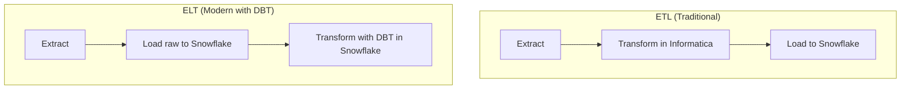
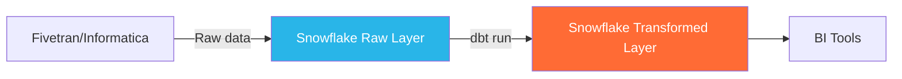

# Lecture 23: Informatica Cloud Recap and DBT Introduction

---

## Table of Contents
1. [Informatica Cloud — Complete Workflow](#1-informatica-cloud--complete-workflow)
2. [Snowflake CLI (SnowSQL) vs Web UI](#2-snowflake-cli-snowsql-vs-web-ui)
3. [Introduction to DBT](#3-introduction-to-dbt)
4. [DBT Cloud vs DBT Core](#4-dbt-cloud-vs-dbt-core)
5. [Creating a DBT Cloud Account](#5-creating-a-dbt-cloud-account)
6. [Setting Up DBT Cloud with Snowflake](#6-setting-up-dbt-cloud-with-snowflake)
7. [GitHub Integration with DBT Cloud](#7-github-integration-with-dbt-cloud)
8. [DBT Models](#8-dbt-models)
9. [Creating and Running Your First Model](#9-creating-and-running-your-first-model)
10. [Materialization in DBT](#10-materialization-in-dbt)
11. [ELT vs ETL — Why DBT?](#11-elt-vs-etl--why-dbt)
12. [Key Commands Reference](#12-key-commands-reference)
13. [Key Terms](#13-key-terms)
14. [Summary](#14-summary)

---

## 1. Informatica Cloud — Complete Workflow

### Recap from Previous Session

Loading data from Oracle to Snowflake using Informatica Intelligent Cloud Services (IICS):

```mermaid
flowchart LR
    subgraph "On-Premises"
        ORA[Oracle DB]
        AGENT[Secure Agent\nService]
    end

    subgraph "Informatica Cloud (IICS)"
        direction TB
        CONN_O[Oracle Connection]
        CONN_S[Snowflake Connection]
        MAP[Mapping\nDefine: Source Table → Target Table\nColumn mapping via Smart Map]
        TASK[Task\nCalls the mapping]
    end

    subgraph "Snowflake Cloud"
        SF_TABLE[Snowflake Table]
    end

    ORA <-->|Connects via| AGENT
    AGENT <-->|Secure connection| CONN_O
    CONN_O --> MAP
    CONN_S --> MAP
    MAP <-- TASK
    MAP -->|Loads data| SF_TABLE
```

### Three Steps of an Informatica Load

1. **Create Mapping** — Define source (Oracle table) and target (Snowflake table), auto-map columns with Smart Map.
2. **Create Task** — Create a Mapping Task that calls the mapping, configure data flow type.
3. **Run Task** — Execute the task and monitor status until "Succeeded".

### Informatica vs Other ETL Tools

| ETL Tool | Type | Notes |
|----------|------|-------|
| Informatica PowerCenter | On-premises | Legacy ETL; version 10.x |
| Informatica IICS | Cloud | Modern cloud version |
| Talend | On-premises/Cloud | Open-source option |
| IBM DataStage | On-premises | Enterprise ETL |
| DBT | Cloud/CLI | Transformation only (T in ELT) |

---

## 2. Snowflake CLI (SnowSQL) vs Web UI

For Snowflake, there are two access methods:

| | Snowsight (Web UI) | SnowSQL (CLI) |
|--|-------------------|---------------|
| Type | Browser-based | Command-line |
| PUT command | Not supported | Supported |
| COPY command | Supported | Supported |
| Access | snowflake.com | Install SnowSQL client |
| Use case | Day-to-day queries | File upload, automation scripts |

Similarly, DBT has two versions:

| | DBT Cloud | DBT Core |
|--|-----------|----------|
| Type | Web-based IDE | Command-line |
| Setup required | Minimal (SaaS) | Python + Anaconda + DBT install |
| Used in real life | Mostly | Sometimes |

---

## 3. Introduction to DBT

### What is DBT?

**DBT (Data Build Tool)** is an open-source transformation tool that enables data analysts and engineers to apply transformations on data **already loaded** in a data warehouse.

### DBT's Role in the Modern Data Stack



### ELT vs ETL

| Approach | Order | Who Transforms | Example |
|----------|-------|---------------|---------|
| **ETL** | Extract → Transform → Load | ETL Tool (Informatica) | Transform in Informatica, load to Snowflake |
| **ELT** | Extract → Load → Transform | Warehouse (DBT + Snowflake) | Load raw to Snowflake, transform with DBT |



### Why DBT is Popular

1. **Faster transformations** — SQL runs directly in Snowflake (no ETL engine overhead)
2. **Cost-effective** — Less licensing cost than Informatica
3. **Snowflake partnership** — Snowflake officially promotes DBT
4. **Multi-platform** — Works with Snowflake, Redshift, BigQuery, Databricks, Athena, and more
5. **Version control** — Code lives in Git; team collaboration is easy
6. **Testing built-in** — Add tests to validate data quality

---

## 4. DBT Cloud vs DBT Core

| Feature | DBT Cloud | DBT Core |
|---------|-----------|----------|
| Interface | Web browser (IDE) | Terminal (CLI) |
| Setup | Account signup only | Python + Anaconda + pip install |
| Collaboration | Built-in | Via Git |
| Scheduling | Built-in | External scheduler needed |
| Cost | Paid (15-day free trial) | Open-source (free) |
| Git integration | Built-in | Manual |
| Used in production | Mostly | Sometimes |
| Recommended for learning | Yes (easier) | Yes (for CLI familiarity) |

---

## 5. Creating a DBT Cloud Account

### Steps

1. Go to **[cloud.getdbt.com](https://cloud.getdbt.com)** and click **"Try dbt for free"**
2. Fill in:
   - First name, last name
   - Company name
   - Email address (use a unique email)
   - Password
3. Click **Create Account**
4. Check email for **activation link** and click **Verify**
5. Complete the onboarding survey and click **Next**

> **Note:** DBT Cloud gives a **14-day free trial** (vs 30 days for Snowflake).

### After Login

You will land on the main DBT Cloud dashboard with two main sections:
- **Develop** — Write SQL models (IDE)
- **Deploy** — Schedule and run models

---

## 6. Setting Up DBT Cloud with Snowflake

### Step 1: Create a New Connection

1. In DBT Cloud, go to **Account Settings** → **Projects**
2. Click **Add New Connection**
3. Select **Snowflake** from the database list
4. Fill in connection details:

```
Connection Name: snowflake
Account Name: <your_snowflake_account_id>
Database: TEST_DB
Warehouse: COMPUTE_WAREHOUSE
Role: ACCOUNTADMIN (optional)
```

> **Finding your Snowflake account name:**
> Look at the URL in Snowflake: `https://<account_name>.snowflakecomputing.com`

### Step 2: Set Development Credentials

1. Go to **Develop** section
2. Click on your profile → **Credentials**
3. Enter:
   - Username: your Snowflake username
   - Password: your Snowflake password
   - Schema: `dbt_schema` (a new schema DBT will create)
4. Click **Test Connection**
5. Verify: "Test completed successfully"

> DBT will create a new schema (`dbt_schema`) in the connected database. All objects created by DBT will go here.

### Connection Details

```yaml
# What you configure in DBT Cloud:
account: <snowflake_account>
database: TEST_DB
warehouse: COMPUTE_WAREHOUSE
schema: dbt_schema       # DBT creates this automatically
role: ACCOUNTADMIN
user: <username>
password: <password>
```

---

## 7. GitHub Integration with DBT Cloud

DBT Cloud stores your model code in a GitHub repository.

### Setting Up GitHub

1. Go to [github.com](https://github.com) and sign up / log in.
2. Create a new repository named `dbt_repo`.
3. Copy the **SSH URL**: `git@github.com:username/dbt_repo.git`

### Connecting GitHub to DBT Cloud

1. In DBT Cloud → **Account Settings** → Project → **Repository**
2. Click **Git Clone** and paste the SSH URL
3. DBT Cloud generates a **Deploy Key** — copy it
4. In GitHub → Repository → **Settings** → **Deploy Keys** → **Add deploy key**
5. Paste the deploy key, give it a name (e.g., `dbt-key`), check "Allow write access"
6. Click **Add Key**
7. Back in DBT Cloud, click **Import**

### Initializing the DBT Project

Once connected to GitHub:

1. Click **Start Developing** in DBT Cloud
2. Click **Initialize Project**
3. DBT creates the project structure:

```
dbt_repo/
├── analyses/          -- Ad-hoc SQL analysis files
├── macros/            -- Reusable Jinja macros
├── models/            -- SQL model files (main folder)
│   └── example/
├── seeds/             -- CSV files to load as tables
├── snapshots/         -- Slowly Changing Dimension (SCD) tables
├── tests/             -- Data quality tests
├── dbt_project.yml    -- Main project config file
└── profiles.yml       -- Connection profiles (DBT Core only)
```

---

## 8. DBT Models

### What is a Model?

A **model** in DBT is a `.sql` file that contains a SELECT statement. When you run a model, DBT executes the SELECT and creates a view (or table) in Snowflake.

```
Model = SELECT statement = Business transformation logic
```

### Model Location

Models live in the `models/` folder. Each `.sql` file is one model.

```
models/
├── t_ind_customer.sql     -- Model for Indian customers
└── example/
    └── my_first_dbt_model.sql
```

### Model Example

```sql
-- File: models/t_ind_customer.sql
-- Select Indian customers with high balance in Furniture segment

WITH c_india_customer AS (
  SELECT *
  FROM test_db.test_schema.sns_customer
  WHERE c_nationkey = 8                    -- India's nation key
)
SELECT *
FROM c_india_customer
WHERE c_mktsegment = 'FURNITURE'
  AND c_acctbal > 9000
```

---

## 9. Creating and Running Your First Model

### Step 1: Prepare Source Data in Snowflake

```sql
-- Create a customer table to use as source
CREATE TABLE sns_customer AS
SELECT *
FROM snowflake_sample_data.tpch_sf1.customer;

-- Verify
SELECT COUNT(*) FROM sns_customer;  -- 150,000 rows
```

### Step 2: Explore the Transformation

```sql
-- Test your transformation in Snowflake first
SELECT COUNT(*)
FROM sns_customer
WHERE c_nationkey = 8            -- Indian customers
  AND c_mktsegment = 'FURNITURE'
  AND c_acctbal > 9000;
-- Result: ~114 records
```

### Step 3: Create a DBT Model

In DBT Cloud → Develop → models folder:
1. Right-click `models` folder
2. Click **Create new file**
3. Name: `t_ind_customer.sql`
4. Paste the SELECT statement

```sql
-- models/t_ind_customer.sql
WITH c_india_customer AS (
  SELECT *
  FROM test_db.test_schema.sns_customer
  WHERE c_nationkey = 8
)
SELECT *
FROM c_india_customer
WHERE c_mktsegment = 'FURNITURE'
  AND c_acctbal > 9000
```

5. Click **Save**

### Step 4: Run the Model

In the DBT Cloud command bar:

```bash
dbt run --select t_ind_customer
```

Or just:

```bash
dbt run
```

(runs all models)

### Step 5: Verify in Snowflake

```sql
-- DBT created a new schema called dbt_schema (if it didn't exist)
USE DATABASE test_db;
USE SCHEMA dbt_schema;

SELECT * FROM t_ind_customer;
-- Returns 114 records (Indian furniture customers with high balance)
```

---

## 10. Materialization in DBT

### Default: View

By default, running a DBT model creates a **VIEW** in Snowflake:

```sql
-- DBT automatically generates something like:
CREATE OR REPLACE VIEW dbt_schema.t_ind_customer AS (
  <your SELECT statement>
);
```

### Creating as a Table

To create a **TABLE** instead of a view, add a config block at the top of the model:

```sql
-- models/t_ind_customer.sql
{{ config(materialized='table') }}

WITH c_india_customer AS (
  SELECT *
  FROM test_db.test_schema.sns_customer
  WHERE c_nationkey = 8
)
SELECT *
FROM c_india_customer
WHERE c_mktsegment = 'FURNITURE'
  AND c_acctbal > 9000
```

DBT generates:
```sql
CREATE OR REPLACE TRANSIENT TABLE dbt_schema.t_ind_customer AS (
  <your SELECT statement>
);
```

> **Note:** DBT creates **transient tables** by default when materialization = 'table'.

### Verifying Transient Tables

```sql
SELECT table_name, is_transient
FROM information_schema.tables
WHERE table_schema = 'DBT_SCHEMA'
  AND is_transient = 'YES';
```

### Four Materialization Types

| Type | Description | When to Use |
|------|-------------|-------------|
| `view` | Creates a view (default) | When you always want fresh data |
| `table` | Creates a transient table | When query performance matters |
| `incremental` | Appends/updates new rows only | Large tables; append-only loads |
| `ephemeral` | Not materialized; used as CTE | Intermediate transformations |

### Setting Default Materialization in dbt_project.yml

```yaml
# dbt_project.yml
models:
  my_project:
    +materialized: table  # Make all models tables by default
```

---

## 11. ELT vs ETL — Why DBT?

### The Traditional ETL Problem

In ETL tools like Informatica, the transformation engine is **separate** from the warehouse:
- Data flows OUT of the source
- Transformation happens IN the ETL engine (limited compute)
- Then loads into Snowflake

This is slower and more expensive for complex transformations.

### The ELT Advantage with DBT

With DBT:
1. Data is loaded into Snowflake first (raw layer)
2. Transformations run **inside Snowflake** using Snowflake's compute
3. Results stored in Snowflake



### Migration Scenario

Many companies are migrating from Oracle to Snowflake:

```
Oracle (legacy) → ETL Tool → Snowflake (new)
       ↓
  Informatica extracts Oracle data
       ↓
  DBT applies transformations in Snowflake
       ↓
  Same result — but faster and cheaper
```

---

## 12. Key Commands Reference

### DBT Cloud Commands (run in the command bar)

```bash
# Run all models
dbt run

# Run a specific model
dbt run --select model_name

# Run with full refresh (drop and recreate)
dbt run --full-refresh

# Run just the model file (with extension)
dbt run --select t_ind_customer.sql

# Test data quality
dbt test

# Generate and view documentation
dbt docs generate
dbt docs serve

# Load CSV seed files
dbt seed
```

### Snowflake Queries for Verification

```sql
-- Check objects in DBT schema
SHOW TABLES IN SCHEMA dbt_schema;
SHOW VIEWS IN SCHEMA dbt_schema;

-- Check if table is transient
SELECT table_name, is_transient
FROM information_schema.tables
WHERE table_schema = 'DBT_SCHEMA';

-- Query a DBT-created view/table
SELECT * FROM dbt_schema.t_ind_customer LIMIT 10;
```

---

## 13. Key Terms

| Term | Definition |
|------|------------|
| **DBT** | Data Build Tool — transformation framework for data warehouses |
| **DBT Cloud** | Web-based IDE and scheduling platform for DBT |
| **DBT Core** | Open-source CLI version of DBT |
| **Model** | A .sql file in DBT containing a SELECT statement |
| **Materialization** | How DBT persists a model result: view, table, incremental, or ephemeral |
| **ELT** | Extract, Load, Transform — load raw data first, then transform |
| **ETL** | Extract, Transform, Load — transform before loading |
| **Profiles.yml** | DBT Core config file with connection details |
| **dbt_project.yml** | DBT project configuration file |
| **Seed** | CSV file loaded into Snowflake as a table via `dbt seed` |
| **Snapshot** | DBT feature for tracking slowly changing dimensions |
| **Deploy Key** | SSH key used by DBT Cloud to access GitHub repository |
| **Fivetran** | Data extraction/loading tool; ELT's extraction layer |
| **Informatica IICS** | Cloud ETL tool for loading from Oracle to Snowflake |
| **Secure Agent** | Informatica component enabling on-premises DB connectivity |

---

## 14. Summary

- **Informatica IICS** follows a 3-step workflow: Create Mapping → Create Task → Run Task to load from Oracle to Snowflake.
- **DBT** is a transformation tool that runs SQL transformations directly inside Snowflake — this is the ELT approach.
- **DBT Cloud** (web IDE) and **DBT Core** (CLI) accomplish the same thing but with different interfaces.
- A **DBT model** is a `.sql` file with a SELECT statement. Running it creates a view or table in Snowflake.
- By default, DBT creates **views** in a dedicated schema (`dbt_schema`). Add `{{ config(materialized='table') }}` to create a table.
- DBT creates **transient tables** when materialized as 'table'.
- Four materialization types: `view` (default), `table`, `incremental`, `ephemeral`.
- DBT integrates with **GitHub** for version control. The project structure includes `models/`, `seeds/`, `snapshots/`, `tests/`, `macros/`.
- DBT is growing rapidly, especially with cloud warehouses (Snowflake, Redshift, BigQuery, Databricks). It is faster and more cost-effective than ETL tools for transformations.
