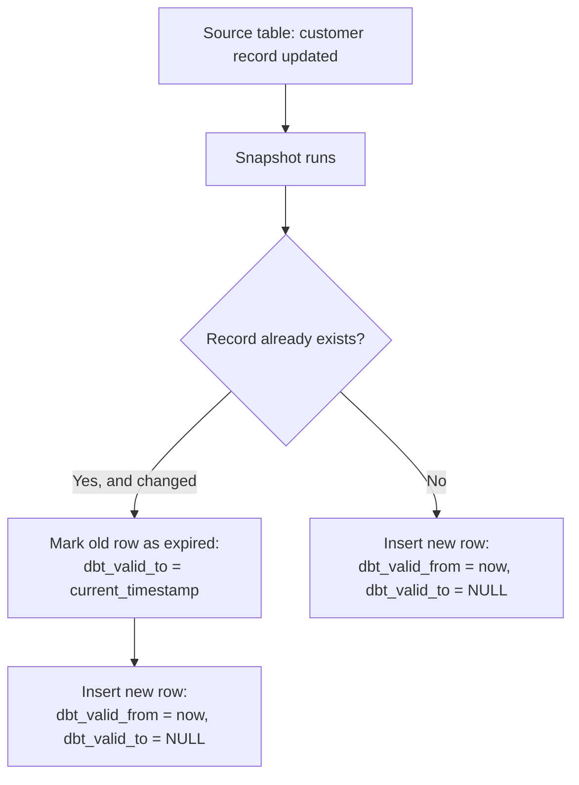
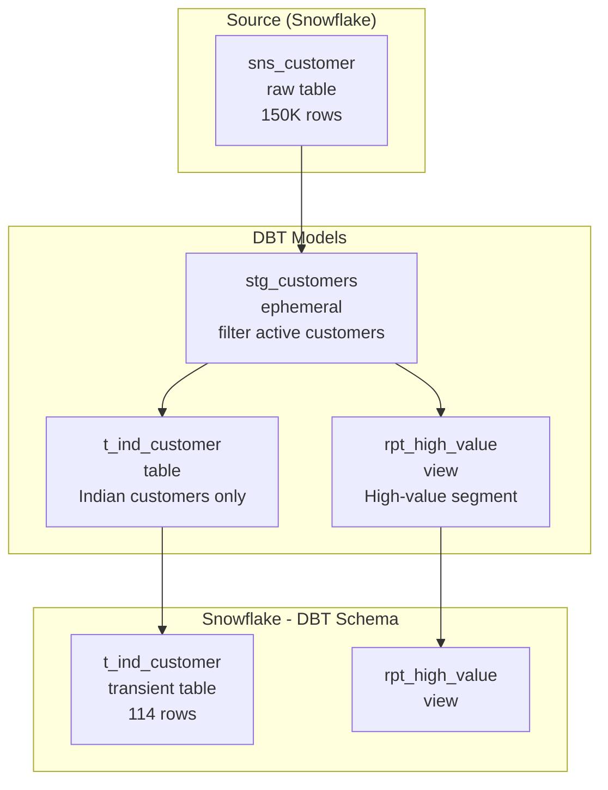

# Lecture 24: DBT Cloud and DBT Core — Deep Dive

---

## Table of Contents
1. [DBT Cloud — Recap and Continuation](#1-dbt-cloud--recap-and-continuation)
2. [Materialization Deep Dive](#2-materialization-deep-dive)
3. [Understanding the Generated SQL](#3-understanding-the-generated-sql)
4. [DBT Core — Installation and Setup](#4-dbt-core--installation-and-setup)
5. [DBT Core — Project Initialization](#5-dbt-core--project-initialization)
6. [YAML Configuration Files](#6-yaml-configuration-files)
7. [Creating Models in DBT Core](#7-creating-models-in-dbt-core)
8. [Seeds in DBT](#8-seeds-in-dbt)
9. [Snapshots in DBT](#9-snapshots-in-dbt)
10. [DBT Cloud vs DBT Core — Full Comparison](#10-dbt-cloud-vs-dbt-core--full-comparison)
11. [DBT Project Architecture](#11-dbt-project-architecture)
12. [Key Commands Reference](#12-key-commands-reference)
13. [Key Terms](#13-key-terms)
14. [Summary](#14-summary)

---

## 1. DBT Cloud — Recap and Continuation

### What We Covered Last Session

- DBT Cloud account creation
- Connecting DBT Cloud to Snowflake
- GitHub repository integration
- Creating and running a basic model
- Default materialization = view

### Where We Left Off

We created a model `t_ind_customer.sql` that:
- Filters Indian customers (`c_nationkey = 8`)
- Filters Furniture segment
- Filters account balance > 9000

Running this created a **view** in the `dbt_schema` schema in Snowflake.

---

## 2. Materialization Deep Dive

### View (Default)

```sql
-- models/t_ind_customer.sql (no config = view by default)
SELECT *
FROM test_db.test_schema.sns_customer
WHERE c_nationkey = 8
  AND c_mktsegment = 'FURNITURE'
  AND c_acctbal > 9000
```

After `dbt run`:
```sql
-- DBT generates this SQL:
CREATE OR REPLACE VIEW dbt_schema.t_ind_customer AS (
  SELECT * FROM test_db.test_schema.sns_customer
  WHERE c_nationkey = 8 AND c_mktsegment = 'FURNITURE' AND c_acctbal > 9000
);
```

### Table Materialization

```sql
-- models/t_ind_customer.sql
{{ config(materialized='table') }}

SELECT *
FROM test_db.test_schema.sns_customer
WHERE c_nationkey = 8
  AND c_mktsegment = 'FURNITURE'
  AND c_acctbal > 9000
```

After `dbt run`:
```sql
-- DBT generates this SQL:
CREATE OR REPLACE TRANSIENT TABLE dbt_schema.t_ind_customer AS (
  SELECT * FROM test_db.test_schema.sns_customer
  WHERE c_nationkey = 8 AND c_mktsegment = 'FURNITURE' AND c_acctbal > 9000
);
```

> **Key observation:** DBT creates **TRANSIENT** tables (not permanent tables) by default.

### Why Transient Tables?

Transient tables:
- Have reduced storage costs (no fail-safe)
- Are appropriate for intermediate transformed data (raw data is safe in the source)
- Can be recreated from models at any time

### Incremental Materialization

```sql
-- models/t_events_incremental.sql
{{ config(
  materialized='incremental',
  unique_key='event_id'
) }}

SELECT *
FROM test_db.test_schema.raw_events

WHERE event_timestamp > (SELECT MAX(event_timestamp) FROM {{ this }})

```

**How incremental works:**
- First run: Creates the entire table
- Subsequent runs: Only processes new rows (more efficient for large tables)

### Ephemeral Materialization

```sql
-- models/stg_customers.sql
{{ config(materialized='ephemeral') }}

SELECT *
FROM test_db.test_schema.raw_customers
WHERE is_active = TRUE
```

Ephemeral models are **not materialized** in Snowflake — they become Common Table Expressions (CTEs) used by other models.

### Materialization Comparison

| Materialization | Creates in DB? | Use Case |
|----------------|---------------|---------|
| `view` | Yes (view) | Always fresh; small datasets |
| `table` | Yes (transient table) | Better query performance |
| `incremental` | Yes (table, grows over time) | Large, append-heavy datasets |
| `ephemeral` | No (CTE only) | Intermediate transformations |

---

## 3. Understanding the Generated SQL

### How to View Generated SQL in DBT Cloud

After running a model:
1. Go to **Develop** → **Target** folder
2. Click on **models** → Select your model
3. View the compiled SQL

### Viewing in DBT Core

After running `dbt run`, compiled SQL is saved in:
```
project_folder/target/compiled/project_name/models/model_name.sql
project_folder/target/run/project_name/models/model_name.sql
```

### Example: Generated SQL for Table Materialization

```sql
-- What DBT actually runs in Snowflake:

BEGIN;

  CREATE OR REPLACE TRANSIENT TABLE dbt_schema.t_ind_customer
  AS (
    WITH c_india_customer AS (
      SELECT *
      FROM test_db.test_schema.sns_customer
      WHERE c_nationkey = 8
    )
    SELECT *
    FROM c_india_customer
    WHERE c_mktsegment = 'FURNITURE'
      AND c_acctbal > 9000
  );

COMMIT;
```

---

## 4. DBT Core — Installation and Setup

### Prerequisites

1. **Python** (3.8 or higher)
2. **Anaconda** (virtual environment manager)
3. **Visual Studio Code** (IDE)

### Step 1: Install Python

```
1. Go to python.org → Downloads
2. Download latest version (e.g., 3.12.x)
3. Run installer → check "Add to PATH" → Install
```

### Step 2: Install Anaconda

```
1. Go to anaconda.com
2. Enter email → get download link
3. Download the installer
4. Run installer: Next → Agree → Next → Install
```

### Step 3: Open Anaconda Prompt

1. Open **Anaconda Prompt** from Windows Start menu
2. You will see the base environment: `(base) C:\Users\username>`

### Step 4: Create a New Virtual Environment

```bash
# List existing environments
conda env list
# Output: Only "base" shown

# Create a new environment for DBT
conda create -n dbt_project python=3.12
# Answer "y" when asked to proceed

# List environments again to verify
conda env list
# Output: base, dbt_project
```

### Step 5: Activate the Environment

```bash
# Activate your new environment
conda activate dbt_project
# Prompt changes to: (dbt_project) C:\Users\username>
```

### Step 6: Check Installed Packages

```bash
# List packages (before DBT install)
pip list
# Shows only 3 default packages
```

### Step 7: Install DBT Core

```bash
# Install DBT Core (main package)
pip install dbt-core
```

### Step 8: Install Snowflake Plugin

```bash
# Install Snowflake adapter for DBT
pip install dbt-snowflake
```

### Step 9: Verify Installation

```bash
# Check DBT version
dbt --version

# Example output:
# Core: 1.9.4
# Installed plugins:
#   - snowflake: 1.9.x
```

---

## 5. DBT Core — Project Initialization

### Step 1: Create a Project Folder

```bash
# Create a folder for your DBT project
mkdir C:\dbt_project

# Navigate to the folder
cd C:\dbt_project
```

### Step 2: Initialize a DBT Project

```bash
dbt init
```

DBT will ask several questions:

```
Enter a name for your project (letters, digits, underscore): project_one
Which database would you like to use?
[1] snowflake

Enter a number: 1

account (https://<this_value>.snowflakecomputing.com): <your_account>
user [dev username]: <your_username>
[1] password  [2] keypair  [3] sso
Desired authentication type option (enter a number): 1
password (dev password): <your_password>
role (dev role, pass if none): ACCOUNTADMIN
warehouse (ex. COMPUTE_WH): COMPUTE_WAREHOUSE
database (ex. dbt): DEV_DB
schema (dev schema): dev_schema
threads (1 or more) [1]: 1
```

### Step 3: Navigate to Project Folder

```bash
cd project_one
# Now you're inside the DBT project
```

### Step 4: Validate the Connection

```bash
dbt debug
```

**Expected output:**
```
All checks passed!
  Connection:
    account: <account>
    user: <username>
    database: DEV_DB
    schema: dev_schema
    warehouse: COMPUTE_WAREHOUSE
  Connection test: OK connection ok
```

`dbt debug` verifies:
- `profiles.yml` exists and is valid
- `dbt_project.yml` exists and is valid
- Connection to Snowflake is successful

---

## 6. YAML Configuration Files

### profiles.yml

Created automatically when you run `dbt init`. Stores connection details.

**Location:** `~/.dbt/profiles.yml` (user's home folder)

```yaml
# ~/.dbt/profiles.yml
project_one:
  outputs:
    dev:
      type: snowflake
      account: <account_id>
      user: <username>
      password: <password>
      role: ACCOUNTADMIN
      database: DEV_DB
      warehouse: COMPUTE_WAREHOUSE
      schema: dev_schema
      threads: 1
  target: dev
```

### dbt_project.yml

The main project configuration file, located inside your project folder.

```yaml
# dbt_project.yml
name: 'project_one'
version: '1.0.0'
config-version: 2

profile: 'project_one'

model-paths: ["models"]
analysis-paths: ["analyses"]
test-paths: ["tests"]
seed-paths: ["seeds"]
macro-paths: ["macros"]
snapshot-paths: ["snapshots"]

models:
  project_one:
    +materialized: view  # default materialization
```

### schema.yml (Optional — for Tests and Documentation)

```yaml
# models/schema.yml
version: 2

models:
  - name: t_ind_customer
    description: "Indian customers with high balance in Furniture segment"
    columns:
      - name: c_custkey
        description: "Customer key"
        tests:
          - unique
          - not_null
```

---

## 7. Creating Models in DBT Core

### Open Project in VS Code

```bash
# From Anaconda prompt, open VS Code in project directory
code .
```

### Create a New Model File

In VS Code:
1. Navigate to `models/` folder
2. Right-click → **New File**
3. Name: `t_ind_customer.sql`

```sql
-- models/t_ind_customer.sql
-- Model: Indian customers (materialized as table)

{{ config(materialized='table') }}

SELECT
  c_custkey,
  c_name,
  c_address,
  c_phone,
  c_acctbal,
  c_mktsegment,
  c_nationkey
FROM dev_db.dev_schema.sns_customer
WHERE c_nationkey = 8
  AND c_mktsegment IN ('BUILDING', 'FURNITURE')
  AND c_acctbal > 9000
```

### Run the Model

```bash
# In Anaconda prompt (from project directory)
dbt run --select t_ind_customer
```

**Output:**
```
Running with dbt=1.9.4
Found 1 model, 0 tests, 0 sources, 0 exposures, 0 metrics

Concurrency: 1 threads (target='dev')

1 of 1 START sql table model dev_schema.t_ind_customer .................. [RUN]
1 of 1 OK created sql table model dev_schema.t_ind_customer ............. [SELECT 114 in 2.45s]

Finished running 1 table model in 3.12s.
Completed successfully.
```

### Verify in Snowflake

```sql
-- Check the object was created
SHOW TABLES IN SCHEMA dev_schema;
-- Should see: t_ind_customer (TRANSIENT table)

-- Query the model result
SELECT COUNT(*) FROM dev_schema.t_ind_customer;
-- Returns: 114
```

### Create a View Model (no config = view)

```sql
-- models/v_ind_customer.sql
-- No config block = creates a view by default

SELECT
  c_custkey,
  c_name,
  c_acctbal
FROM dev_db.dev_schema.sns_customer
WHERE c_nationkey = 8
```

```bash
dbt run --select v_ind_customer
```

```sql
-- Verify in Snowflake
SHOW VIEWS IN SCHEMA dev_schema;
-- Shows: v_ind_customer as a VIEW
```

---

## 8. Seeds in DBT

### What are Seeds?

Seeds are **CSV files** that DBT loads directly into Snowflake as tables. They are useful for:
- Reference/lookup data (country codes, category mappings)
- Static configuration tables
- Small datasets that rarely change

### Creating a Seed

1. Place a CSV file in the `seeds/` folder:

```
seeds/
└── nation_codes.csv
```

```csv
nation_key,nation_name,region
8,INDIA,ASIA
7,GERMANY,EUROPE
3,CANADA,AMERICA
```

2. Run the seed command:

```bash
dbt seed
```

3. Verify in Snowflake:

```sql
SELECT * FROM dev_schema.nation_codes;
-- Returns 3 rows from the CSV file
```

### Seed Configuration

```yaml
# dbt_project.yml
seeds:
  project_one:
    nation_codes:
      +schema: seed_schema    # Store seeds in a different schema
      +column_types:
        nation_key: NUMBER
        nation_name: VARCHAR(100)
```

---

## 9. Snapshots in DBT

### What are Snapshots?

**Snapshots** are DBT's implementation of **Slowly Changing Dimensions (SCD Type 2)**. They track historical changes to records over time.

### How Snapshots Work



### Creating a Snapshot

Create a file in the `snapshots/` folder:

```sql
-- snapshots/snap_customer.sql


{{
  config(
    target_database='dev_db',
    target_schema='dev_schema',
    unique_key='c_custkey',
    strategy='timestamp',
    updated_at='updated_at'
  )
}}

SELECT *
FROM dev_db.dev_schema.sns_customer


```

### Running Snapshots

```bash
dbt snapshot
```

### Snapshot Metadata Columns

After running a snapshot, DBT adds these columns:

| Column | Description |
|--------|-------------|
| `dbt_scd_id` | Unique ID for each snapshot record |
| `dbt_valid_from` | When this version became active |
| `dbt_valid_to` | When this version expired (NULL = current) |
| `dbt_updated_at` | Timestamp of the source update |

---

## 10. DBT Cloud vs DBT Core — Full Comparison

| Feature | DBT Cloud | DBT Core |
|---------|-----------|----------|
| **Interface** | Web browser IDE | Terminal/CLI |
| **Installation** | None (SaaS) | Python + Anaconda + pip install |
| **Connection setup** | GUI forms | profiles.yml |
| **Model execution** | Click "Run" button | `dbt run` command |
| **Scheduling** | Built-in job scheduler | External (Airflow, cron) |
| **Git integration** | Built-in (GitHub/GitLab) | Manual git commands |
| **Collaboration** | Multi-user, branches | Via Git |
| **Logs** | Web UI | Terminal output + target/ folder |
| **Cost** | Paid (developer plan free tier available) | Open-source (free) |
| **Used in real world** | Mostly | Sometimes (for CI/CD pipelines) |
| **Recommended for** | Production teams | Learning + automation |

### What's the Same?

Both DBT Cloud and DBT Core:
- Create the same SQL objects in Snowflake
- Use the same model files (`.sql` files)
- Support all four materialization types
- Support seeds, snapshots, tests, and macros
- Use the same `dbt run`, `dbt test`, `dbt seed` commands

---

## 11. DBT Project Architecture

### How DBT Models Relate to Each Other



### Referencing Other Models with ref()

```sql
-- Instead of hardcoding table paths, use ref() to reference other models:
{{ config(materialized='view') }}

SELECT *
FROM {{ ref('t_ind_customer') }}  -- References the t_ind_customer model
WHERE c_acctbal > 10000
```

This is the **recommended way** to reference models in DBT — it handles schema names automatically and tracks lineage.

### Source vs Ref

```sql
-- Reference a raw Snowflake table (not a DBT model):
SELECT * FROM {{ source('raw_layer', 'sns_customer') }}

-- Reference another DBT model:
SELECT * FROM {{ ref('stg_customers') }}
```

---

## 12. Key Commands Reference

### DBT Core Commands

```bash
# Verify DBT installation
dbt --version

# Initialize a new DBT project
dbt init

# Test connection to Snowflake
dbt debug

# Run all models
dbt run

# Run a specific model
dbt run --select model_name

# Run with full refresh (recreate all tables)
dbt run --full-refresh

# Run all models in a folder
dbt run --select models/staging/*

# Load seed files (CSV → Snowflake tables)
dbt seed

# Run snapshots
dbt snapshot

# Run data tests
dbt test

# Generate documentation
dbt docs generate

# Preview documentation in browser
dbt docs serve

# List all project resources
dbt ls

# Clean generated files
dbt clean
```

### DBT Core Installation Commands

```bash
# Create virtual environment
conda create -n dbt_project python=3.12

# Activate environment
conda activate dbt_project

# List packages
pip list

# Install DBT Core
pip install dbt-core

# Install Snowflake adapter
pip install dbt-snowflake

# Check version
dbt --version
```

### Snowflake Verification Queries

```sql
-- Check DBT-created objects
SHOW TABLES IN SCHEMA dev_schema;
SHOW VIEWS IN SCHEMA dev_schema;

-- Check if transient table
SELECT table_name, is_transient
FROM information_schema.tables
WHERE table_schema = 'DEV_SCHEMA';

-- Query DBT model output
SELECT * FROM dev_schema.t_ind_customer LIMIT 10;

-- Check seeds
SELECT * FROM dev_schema.nation_codes;
```

---

## 13. Key Terms

| Term | Definition |
|------|------------|
| **DBT Core** | Open-source CLI version of DBT; installed via pip |
| **DBT Cloud** | Web-based IDE and scheduling platform for DBT |
| **Model** | A `.sql` file in DBT containing a SELECT statement |
| **Materialization** | How a model is stored: view, table, incremental, or ephemeral |
| **Transient Table** | Table without fail-safe; what DBT creates for `materialized='table'` |
| **Seed** | CSV file loaded into Snowflake as a table via `dbt seed` |
| **Snapshot** | SCD Type 2 implementation in DBT; tracks historical row changes |
| **Profiles.yml** | DBT Core connection configuration file (in ~/.dbt/) |
| **dbt_project.yml** | Main DBT project configuration file |
| **Schema.yml** | Optional file for model documentation and tests |
| **ref()** | DBT Jinja function to reference other models |
| **source()** | DBT Jinja function to reference raw source tables |
| **Incremental** | Materialization that only processes new/changed rows |
| **Ephemeral** | Materialization that creates a CTE, not a DB object |
| **dbt run** | Command to execute all or selected models |
| **dbt debug** | Command to validate configuration and test connection |
| **dbt seed** | Command to load CSV files as Snowflake tables |
| **dbt test** | Command to run data quality tests |
| **Anaconda** | Python virtual environment manager |
| **conda activate** | Command to switch to a specific virtual environment |

---

## 14. Summary

- DBT Cloud and DBT Core accomplish the same thing — they run SQL transformations in Snowflake — but Cloud provides a web UI while Core is command-line.
- **Materialization types:** `view` (default), `table` (creates transient table), `incremental` (appends new rows), `ephemeral` (CTE only).
- Add `{{ config(materialized='table') }}` at the top of a model to create a table instead of a view.
- **DBT creates transient tables** (not permanent) when `materialized='table'` — this reduces fail-safe storage costs.
- **dbt debug** validates all configuration files and tests the Snowflake connection.
- **Seeds** load CSV files as tables — useful for reference/lookup data.
- **Snapshots** implement SCD Type 2 — they track historical changes with `dbt_valid_from` / `dbt_valid_to` columns.
- DBT Core installation: `conda create` → `conda activate` → `pip install dbt-core` → `pip install dbt-snowflake`.
- Use `ref('model_name')` to reference other DBT models (instead of hardcoding table paths).
- **DBT follows ELT** — load raw data into Snowflake first, then transform. This is more performant and cost-effective than traditional ETL tools like Informatica.
- DBT is the official Snowflake-recommended transformation tool and is growing rapidly in real-world use.
