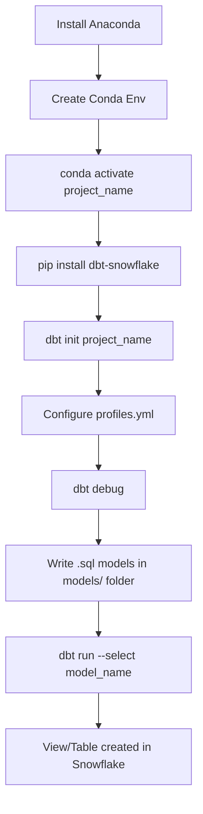

# Lecture 25: DBT Core — Setup, Models, and Profiles

## Overview
This lecture covers setting up DBT Core using Anaconda, creating Python/Conda environments, configuring connections to Snowflake via `profiles.yml`, and running SQL models that create views and tables in Snowflake.

---

## 1. DBT Core vs DBT Cloud

| Feature | DBT Core | DBT Cloud |
|---|---|---|
| Installation | Local via pip/conda | Web UI (dbt.com) |
| GitHub Integration | Manual | Built-in |
| Scheduling | External tools | Built-in Jobs |
| IDE | VS Code / terminal | Browser IDE |
| Cost | Free / open source | Free trial + paid tiers |
| Use case | Local dev, scripted workflows | Collaborative, production |

---

## 2. Setting Up Anaconda and Conda Environments

### Why Use Conda?
Conda manages Python environments and packages, keeping project dependencies isolated.

### Step 1: Install Anaconda
Download from [anaconda.com](https://www.anaconda.com/products/distribution) and install.

### Step 2: List Existing Environments
```bash
conda env list
```
Example output:
```
# conda environments:
#
base                  *  C:\Users\user\anaconda3
dbt_project              C:\Users\user\anaconda3\envs\dbt_project
```

### Step 3: Activate a Conda Environment
```bash
conda activate dbt_project
```
After activation, the terminal prompt changes to show the active environment name:
```
(dbt_project) C:\Users\user>
```

### Step 4: Install DBT for Snowflake
```bash
pip install dbt-snowflake
```
This installs both `dbt-core` and the Snowflake adapter.

---

## 3. Initializing a DBT Project

### Command: `dbt init`
```bash
dbt init my_project
```
This creates the project folder structure:
```
my_project/
├── dbt_project.yml
├── models/
│   └── example/
├── seeds/
├── snapshots/
├── macros/
├── tests/
└── target/
```

### Command: `dbt debug`
Verifies all connections and configurations.
```bash
dbt debug
```
Expected output:
```
Running with dbt=1.x.x
Checking your connection to dbt...
  profiles.yml file [OK found and valid]
  dbt_project.yml file [OK found and valid]
  Connection test: [OK connection ok]

All checks passed!
```

---

## 4. Key Configuration Files

### `profiles.yml`
Located at `~/.dbt/profiles.yml`. Stores database connection details.

```yaml
my_project:
  target: dev
  outputs:
    dev:
      type: snowflake
      account: <your_account_identifier>
      user: <username>
      password: <password>
      role: SYSADMIN
      database: DEV_DB
      warehouse: COMPUTE_WH
      schema: DEV_SCHEMA
      threads: 4
      client_session_keep_alive: False
```

> **Important:** The `target` key maps to the environment (`dev`, `prod`, etc.). Each environment must have a unique name under `outputs`.

### `dbt_project.yml`
Defines project settings, model paths, and materializations.

```yaml
name: 'my_project'
version: '1.0.0'
config-version: 2

profile: 'my_project'

model-paths: ["models"]
seed-paths: ["seeds"]
snapshot-paths: ["snapshots"]
macro-paths: ["macros"]

target-path: "target"

models:
  my_project:
    materialized: view      # default: view
```

---

## 5. Opening VS Code from the Terminal

```bash
code .
```
Launches Visual Studio Code in the current project folder.

---

## 6. DBT Models

A **model** is a `.sql` file in the `models/` folder. When executed, DBT runs the SQL and creates the result as a **view** or **table** in Snowflake.

### Default Behavior: View
By default, every model creates a **view** in the target schema.

### Example Model: `t_customer.sql`
```sql
SELECT
    c_custkey,
    c_name,
    c_address
FROM TEST_DB.TEST_SCHEMA.customer
```

### Running a Specific Model
```bash
dbt run --select t_customer
```

### Running All Models
```bash
dbt run
```

---

## 7. Materialization: View vs Table

### Method 1: Change in `dbt_project.yml`
```yaml
models:
  my_project:
    materialized: table     # Change from "view" to "table"
```

### Method 2: Add Config Block Inside the Model File
```sql
{{ config(materialized='table') }}

SELECT
    c_custkey,
    c_name,
    c_address
FROM TEST_DB.TEST_SCHEMA.customer
```

---

## 8. Referring One Model Inside Another (`ref()`)

The `ref()` function lets one model reference another model, creating a dependency graph.

```sql
-- File: t_customer_orders_report.sql
WITH customers AS (
    SELECT * FROM {{ ref('t_customer') }}   -- references t_customer model
),
orders AS (
    SELECT * FROM {{ ref('t_orders') }}     -- references t_orders model
)
SELECT
    c.c_name,
    COUNT(o.o_orderkey) AS total_orders,
    MIN(o.o_orderdate)  AS first_order,
    MAX(o.o_orderdate)  AS latest_order
FROM customers c
JOIN orders o ON c.c_custkey = o.o_custkey
GROUP BY c.c_name
```

> **Note:** You cannot use `ref()` for a model that has not been executed yet. Always run the referenced model first, or let DBT manage the dependency order automatically when you run all models.

---

## 9. Complete Workflow Example



---

## 10. Practical Example — Joining Three Tables

**Requirement:** Join `customers`, `orders`, and `payments` tables to produce a customer order report.

```sql
-- File: t_cust_order_report.sql
{{ config(materialized='view') }}

WITH cte_customers AS (
    SELECT
        customer_id,
        first_name,
        last_name
    FROM {{ ref('t_customers') }}
),
cte_orders AS (
    SELECT
        customer_id,
        order_id,
        order_date,
        status,
        MAX(order_date) OVER (PARTITION BY customer_id) AS latest_order_date,
        COUNT(order_id)  OVER (PARTITION BY customer_id) AS total_orders
    FROM {{ ref('t_orders') }}
)
SELECT
    c.customer_id,
    c.first_name,
    c.last_name,
    MIN(o.order_date)  AS first_order_date,
    MAX(o.order_date)  AS latest_order_date,
    COUNT(o.order_id)  AS total_orders
FROM cte_customers c
JOIN cte_orders o ON c.customer_id = o.customer_id
GROUP BY
    c.customer_id,
    c.first_name,
    c.last_name
```

---

## 11. Key Commands

| Command | Description |
|---|---|
| `conda env list` | List all Conda environments |
| `conda activate <env_name>` | Activate a specific environment |
| `pip install dbt-snowflake` | Install DBT with Snowflake adapter |
| `dbt init <project_name>` | Initialize a new DBT project |
| `dbt debug` | Verify connection and configuration |
| `dbt run` | Run all models in the project |
| `dbt run --select <model_name>` | Run a single model |
| `code .` | Open VS Code in current directory |

---

## Summary

- DBT Core is installed locally inside a Conda environment using `pip install dbt-snowflake`.
- `profiles.yml` holds Snowflake connection details; `dbt_project.yml` holds project configuration.
- A **model** is a SQL file that DBT executes and materializes as a **view** (default) or **table** in Snowflake.
- Use `{{ config(materialized='table') }}` inside a model to override the default to table.
- Use `{{ ref('model_name') }}` to reference one model inside another, enabling reusable, modular SQL.
- `dbt run` executes all models; `dbt run --select model_name` runs a specific one.
