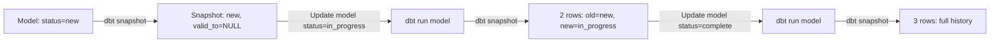

# Lecture 26: DBT Seeds, Snapshots, Pre/Post Hooks, and Macros Intro

## Overview
This lecture covers three advanced DBT features: **Seeds** (loading CSV files to Snowflake tables), **Snapshots** (implementing SCD Type 2 history tracking), and **Pre/Post Hooks** (audit logging around model execution). A brief introduction to macros is also included.

---

## 1. DBT Seeds — Loading CSV Files to Tables

### What is a Seed?
A **seed** is a CSV file placed in the `seeds/` folder of a DBT project. Running `dbt seed` loads the CSV data into a Snowflake **table** (not a view).

> **Key distinction:** Models can be views or tables. Seeds are **always tables**.

### Creating a Seed File
1. Create a CSV file inside the `seeds/` folder.

Example: `seeds/emp.csv`
```csv
emp_id,emp_name,department,salary
1,Alice,Engineering,90000
2,Bob,Finance,75000
3,Carol,HR,65000
```

### Running the Seed
```bash
# Run all seeds
dbt seed

# Run a specific seed
dbt seed --select emp
```

### What Happens Internally
DBT generates and executes a `CREATE TABLE` and `INSERT` statement:
```sql
CREATE TABLE "DEV_DB"."DEV_SCHEMA"."EMP" (
    emp_id    NUMBER,
    emp_name  VARCHAR,
    department VARCHAR,
    salary    NUMBER
);
INSERT INTO "DEV_DB"."DEV_SCHEMA"."EMP" VALUES (...);
```

### Referencing a Seed in a Model
You can reference a seed from a model using the same `ref()` function:
```sql
-- Inside a model file
SELECT * FROM {{ ref('emp') }}
```

---

## 2. SCD Type 1 vs SCD Type 2

Before understanding snapshots, it is important to understand Slowly Changing Dimensions (SCDs).

### SCD Type 1 — No History (Overwrite)
The old value is directly updated. No historical record is kept.

| emp_id | emp_name | salary |
|---|---|---|
| 1 | Alice | ~~80,000~~ → 90,000 |

### SCD Type 2 — Full History (New Row)
Both the old and new record are maintained. Three extra columns are added: `start_date`, `end_date`, `active_flag`.

| emp_id | emp_name | salary | start_date | end_date | active |
|---|---|---|---|---|---|
| 1 | Alice | 80,000 | 2023-01-01 | 2024-06-01 | N |
| 1 | Alice | 90,000 | 2024-06-01 | NULL | Y |

**Rules:**
- The **latest** active record has `end_date = NULL`.
- Old records have a non-null `end_date`.
- `start_date` of new row = `end_date` of old row + 1 day.

---

## 3. DBT Snapshots — Implementing SCD Type 2

### What is a Snapshot?
A **snapshot** in DBT tracks changes to source data over time and stores a history of those changes (SCD Type 2).

### Creating a Snapshot File
Snapshot files are placed in the `snapshots/` folder with `.sql` extension.

```sql
-- File: snapshots/change_track.sql


{{
    config(
        target_schema = 'dbt_schema',
        strategy       = 'check',
        unique_key     = 'ticket_id',
        check_cols     = ['ticket_status']
    )
}}

SELECT * FROM {{ ref('customer') }}


```

### Configuration Parameters

| Parameter | Description |
|---|---|
| `target_schema` | Schema where the snapshot table is created |
| `strategy` | `check` (compare column values) or `timestamp` (use updated_at column) |
| `unique_key` | Column that uniquely identifies each row |
| `check_cols` | Columns to check for changes |

### Running a Snapshot
```bash
# Run all snapshots
dbt snapshot

# Run a specific snapshot
dbt snapshot --select change_track
```

### Snapshot Table Structure
DBT automatically adds these columns to the snapshot table:

| Column | Description |
|---|---|
| `dbt_scd_id` | Unique ID for each record version |
| `dbt_updated_at` | Timestamp when the record was updated |
| `dbt_valid_from` | When this record version became active |
| `dbt_valid_to` | When this record version ended (NULL = current) |

### Full Workflow Example

**Step 1:** Source model `customer.sql` has 3 tickets with status `new`.

**Step 2:** Run `dbt snapshot` — captures initial state. All rows have `dbt_valid_to = NULL`.

**Step 3:** Update `customer.sql` — change ticket_id=1 status to `in_progress`. Run `dbt run --select customer`.

**Step 4:** Run `dbt snapshot` again — DBT captures the change:
- Old row: `status=new`, `dbt_valid_to = <timestamp>`
- New row: `status=in_progress`, `dbt_valid_to = NULL`

**Step 5:** Update status to `complete`, repeat. Three versions of ticket_id=1 now exist.



---

## 4. Pre-Hook and Post-Hook

### What are Hooks?
Hooks are SQL statements executed **before** (`pre-hook`) or **after** (`post-hook`) a DBT model runs.

**Use case:** Audit logging — record when each model started and ended execution.

### Step 1: Create the Audit Log Table in Snowflake
```sql
CREATE TABLE T_AUDIT_LOG (
    id           NUMBER AUTOINCREMENT START 1 INCREMENT 1,
    audit_type   VARCHAR,
    model_name   VARCHAR,
    created_date TIMESTAMP DEFAULT CURRENT_TIMESTAMP()
);
```

### Step 2: Configure Hooks in `dbt_project.yml`
```yaml
models:
  my_project:
    materialized: view
    pre-hook:
      - "INSERT INTO PROD_DB.PROD_SCHEMA.T_AUDIT_LOG (audit_type, model_name)
         VALUES ('started', '{{ this.name }}')"
    post-hook:
      - "INSERT INTO PROD_DB.PROD_SCHEMA.T_AUDIT_LOG (audit_type, model_name)
         VALUES ('ended', '{{ this.name }}')"
```

> **`{{ this.name }}`** — A DBT Jinja variable that dynamically inserts the current model's name.
> **`{{ this }}`** — Returns the fully qualified relation name (database.schema.model).

### Step 3: Run All Models
```bash
dbt run
```

### Verifying the Audit Log
```sql
SELECT * FROM T_AUDIT_LOG ORDER BY created_date;
```

Expected output (2 models run):
```
ID | AUDIT_TYPE | MODEL_NAME | CREATED_DATE
---|-----------|------------|----------------------------
1  | started   | customer   | 2025-01-01 10:00:00.000
2  | ended     | customer   | 2025-01-01 10:00:05.000
3  | started   | orders     | 2025-01-01 10:00:06.000
4  | ended     | orders     | 2025-01-01 10:00:12.000
```

### Alternative: `on-run-start` and `on-run-end`
These hooks run **once** for the entire `dbt run` command (not per model).

```yaml
on-run-start:
  - "INSERT INTO T_AUDIT_LOG (audit_type, model_name) VALUES ('run started', 'ALL')"

on-run-end:
  - "INSERT INTO T_AUDIT_LOG (audit_type, model_name) VALUES ('run ended', 'ALL')"
```

---

## 5. Macros — Introduction

### What is a Macro?
A macro is a reusable piece of Jinja-templated SQL code stored in the `macros/` folder. Macros are similar to functions or stored procedures.

```sql
-- macros/my_macro.sql

    CURRENT_DATE()

```

Calling a macro inside a model:
```sql
SELECT {{ get_current_date() }} AS today_date
```

The built-in DBT functions `ref()` and `config()` are themselves macros.

---

## 6. Key Commands

| Command | Description |
|---|---|
| `dbt seed` | Load all CSV seed files to Snowflake tables |
| `dbt seed --select <seed_name>` | Load a specific seed |
| `dbt snapshot` | Run all snapshots to capture SCD Type 2 changes |
| `dbt snapshot --select <name>` | Run a specific snapshot |
| `dbt run` | Run all models (pre/post hooks execute automatically) |

---

## Summary

- **Seeds** load CSV files from the `seeds/` folder into Snowflake as tables using `dbt seed`.
- Seeds can be referenced inside models using `{{ ref('seed_name') }}`.
- **Snapshots** implement SCD Type 2 history tracking. DBT adds `dbt_valid_from` and `dbt_valid_to` columns to track record versions.
- **Pre-hook** and **Post-hook** run SQL before and after each model execution — ideal for audit logging.
- `{{ this.name }}` dynamically captures the current model name inside a hook.
- `on-run-start` / `on-run-end` run SQL once before/after the entire `dbt run` command.
- **Macros** are reusable Jinja SQL functions stored in `macros/`; `ref()` and `config()` are built-in macros.
