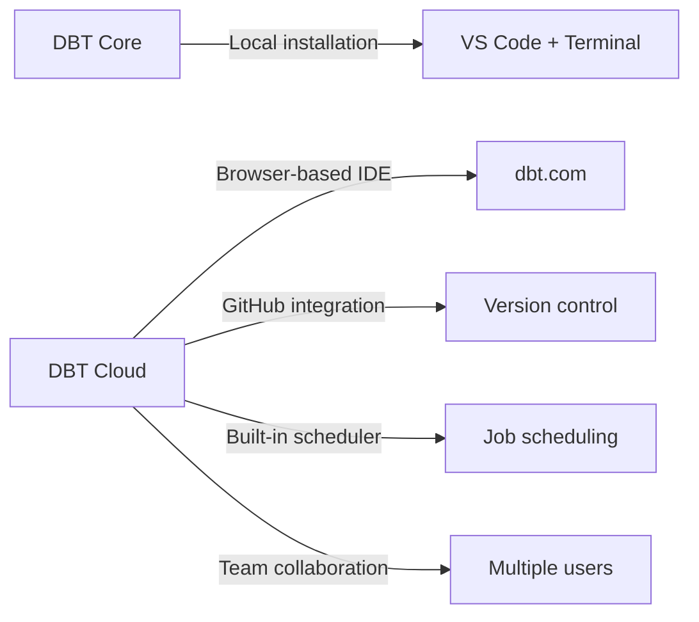

# Lecture 27: DBT Cloud — GitHub Integration, Snapshots, and Hooks

## Overview
This lecture covers setting up DBT Cloud from scratch: creating a Snowflake connection, linking a GitHub repository via SSH deploy keys, initializing a DBT project, and running models with pre/post hooks for audit logging. The SCD Type 2 / Snapshot concepts are reinforced with a practical example.

---

## 1. DBT Cloud vs DBT Core — Recap



**When to use DBT Cloud:**
- Production deployments requiring scheduling.
- Team collaboration with version control.
- No local environment setup required.
- GitHub/GitLab integration is needed.

**When to use DBT Core:**
- Local development and experimentation.
- No licensing cost required.
- Custom scripted pipelines (Apache Airflow, etc.).

---

## 2. Creating a Snowflake Connection in DBT Cloud

### Step-by-Step

1. Go to [cloud.getdbt.com](https://cloud.getdbt.com) and log in.
2. Navigate to **Account Settings** → **Projects** → **New Project**.
3. Give the project a name (e.g., `snowflake_project`).
4. Under **Configure a Connection**, select **Snowflake**.

### Required Snowflake Connection Parameters

| Parameter | Example Value | Notes |
|---|---|---|
| Account | `abc123.us-east-1` | Snowflake account identifier |
| Database | `PROD_DB` | Target database |
| Warehouse | `COMPUTE_WH` | Virtual warehouse to use |
| Schema | `DBT_SCHEMA` | Default schema for models |
| Role | `SYSADMIN` | Role with CREATE permission |
| Username | `krishna` | Snowflake user |
| Password | `*****` | Snowflake password |

5. Click **Test Connection** to validate. If successful, click **Save**.

---

## 3. Setting Up a GitHub Repository

### Step 1: Create a New Repository on GitHub
1. Go to [github.com](https://github.com) → Click **New** repository.
2. Name it (e.g., `dbt_repo`).
3. Set visibility to **Public** or **Private**.
4. Click **Create repository**.

### Step 2: Copy the SSH URL
On the repository page, click **SSH** and copy the URL:
```
git@github.com:<username>/dbt_repo.git
```

### Step 3: Configure SSH in DBT Cloud
1. In DBT Cloud, go to **Account Settings** → **Integrations** → **GitHub**.
2. Click **Import a Git Repository**.
3. Paste the SSH URL.
4. Click **Generate Deploy Key** — DBT Cloud generates an SSH public key.
5. Copy the generated key.

### Step 4: Add Deploy Key in GitHub
1. Go to your GitHub repository → **Settings** → **Deploy keys**.
2. Click **Add deploy key**.
3. Paste the DBT Cloud public key.
4. Check **Allow write access**.
5. Click **Add key**.

---

## 4. Initializing the DBT Cloud Project

1. Go back to DBT Cloud → Click **Start Developing**.
2. Click **Initialize your project** — This creates the default folder structure:
   ```
   models/
   seeds/
   snapshots/
   macros/
   dbt_project.yml
   ```
3. The project is now linked to your GitHub repository.

---

## 5. SCD Type 2 and Snapshot — DBT Cloud Example

### Source Model: `customer.sql`
```sql
-- models/customer.sql
{{ config(materialized='table') }}

SELECT 1 AS ticket_id, 101 AS customer_id, 'new' AS ticket_status, '2025-01-01'::DATE AS created_date
UNION ALL
SELECT 2, 102, 'new', '2025-01-01'
UNION ALL
SELECT 3, 103, 'new', '2025-01-01'
```

### Snapshot: `change_track.sql`
```sql
-- snapshots/change_track.sql


{{
    config(
        target_schema = 'dbt_schema',
        strategy       = 'check',
        unique_key     = 'ticket_id',
        check_cols     = ['ticket_status']
    )
}}

SELECT * FROM {{ ref('customer') }}


```

### Running the Snapshot
```bash
dbt snapshot --select change_track
```

### Tracking Changes Over Time

| Step | Action | change_track rows |
|---|---|---|
| 1 | Initial `dbt snapshot` | 3 rows, all `valid_to = NULL` |
| 2 | Update model: status → `in_progress`, `dbt run`, `dbt snapshot` | 6 rows (3 old + 3 new) |
| 3 | Update model: status → `complete`, `dbt run`, `dbt snapshot` | 9 rows total |

---

## 6. Pre-Hook and Post-Hook in DBT Cloud

### Audit Table Setup (in Snowflake)
```sql
CREATE TABLE PROD_DB.PROD_SCHEMA.T_AUDIT_LOG (
    id           NUMBER AUTOINCREMENT,
    audit_type   VARCHAR(50),
    model_name   VARCHAR(200),
    created_date TIMESTAMP DEFAULT CURRENT_TIMESTAMP()
);
```

### Hook Configuration in `dbt_project.yml`
```yaml
name: 'snowflake_project'
version: '1.0.0'

profile: 'snowflake_project'

models:
  snowflake_project:
    materialized: view
    pre-hook:
      - "INSERT INTO PROD_DB.PROD_SCHEMA.T_AUDIT_LOG (audit_type, model_name)
         VALUES ('started', '{{ this.name }}')"
    post-hook:
      - "INSERT INTO PROD_DB.PROD_SCHEMA.T_AUDIT_LOG (audit_type, model_name)
         VALUES ('ended', '{{ this.name }}')"
```

### Running Models with Hooks
In the DBT Cloud IDE terminal:
```bash
dbt run
```

Each model execution will:
1. Execute the `pre-hook` INSERT (logs "started").
2. Execute the model SQL.
3. Execute the `post-hook` INSERT (logs "ended").

### Verifying the Audit Log
```sql
SELECT id, audit_type, model_name, created_date
FROM PROD_DB.PROD_SCHEMA.T_AUDIT_LOG
ORDER BY created_date;
```

---

## 7. Scheduling Jobs in DBT Cloud

1. Navigate to **Deploy** → **Jobs**.
2. Click **New Job**.
3. Give the job a name.
4. Select the environment (`production`).
5. Under **Commands**, add:
   ```
   dbt run
   dbt snapshot
   ```
6. Under **Schedule**, configure:
   - **Cron** or **Day/Time** based scheduling.
   - Example cron: `0 2 * * *` (runs at 2 AM daily).
7. Click **Save**.

---

## 8. Secure Views and Materialized Views

### Normal View — Definition Is Visible to Others
```sql
CREATE OR REPLACE VIEW V_CUSTOMER AS
SELECT customer_id, c_name, c_nationkey
FROM T_CUSTOMER
WHERE c_nationkey < 10;
```
Any user with access can run `SHOW VIEWS` and see the full `text` column (the CREATE statement). This can expose business logic and table structure.

### Secure View — Hides the Definition
```sql
CREATE OR REPLACE SECURE VIEW V_CUSTOMER_SECURE AS
SELECT customer_id, c_name, c_nationkey
FROM T_CUSTOMER
WHERE c_nationkey < 10;
```
Non-owner roles cannot see the underlying SQL in `SHOW VIEWS`. The `is_secure` column shows `TRUE`.

```sql
SHOW VIEWS;
-- Check the column: IS_SECURE = true for secure views
```

**Key point:** Secure views can also join multiple tables — no restriction there.

### Materialized View — Pre-Computes and Stores Results
```sql
CREATE MATERIALIZED VIEW MV_COUNTRY_WISE_INFO AS
SELECT
    c_nationkey,
    SUM(c_acctbal) AS total_balance
FROM T_CUSTOMER
GROUP BY c_nationkey;
```

**Limitations of materialized views:**
- Can only reference a **single table** — no JOINs allowed
- If you try to join two tables you get: `Invalid materialized view definition — more than one table reference`
- Has **storage cost** (stores the pre-computed results)
- Has **refresh cost** (charged every time it re-reads the base table)
- Auto-refreshes when underlying data changes

### Secure Materialized View
```sql
CREATE SECURE MATERIALIZED VIEW SMV_COUNTRY AS
SELECT
    c_nationkey,
    SUM(c_acctbal) AS total_balance
FROM T_CUSTOMER
GROUP BY c_nationkey;
```
In `SHOW VIEWS`: both `IS_SECURE = TRUE` and `IS_MATERIALIZED = TRUE`.

### Complete View Type Comparison

| Type | Storage Cost | JOIN Support | Auto-Refresh | Definition Hidden |
|---|---|---|---|---|
| View | None | Yes (multiple tables) | N/A | No |
| Secure View | None | Yes (multiple tables) | N/A | Yes (non-owners) |
| Materialized View | Yes | Single table ONLY | Yes (automatic) | No |
| Secure Materialized View | Yes | Single table ONLY | Yes (automatic) | Yes (non-owners) |
| Dynamic Table | Yes | Yes (multiple tables) | Yes (configurable lag) | No |

> **When to use materialized view:** Aggregate queries (SUM, AVG, COUNT) on a single large table that is infrequently updated. Snowflake maintains the result automatically.
>
> **When NOT to use materialized view:** When you need to JOIN two tables. Use a Dynamic Table instead.

---

## 9. Dynamic Tables — Snowflake's Alternative to Materialized Views

Dynamic Tables solve the single-table limitation of materialized views. They can join multiple tables and refresh on a schedule.

### Creating a Dynamic Table
```sql
CREATE OR REPLACE DYNAMIC TABLE T_REFRESH_DATA
    TARGET_LAG = '2 minutes'
    WAREHOUSE  = COMPUTE_WH
    COMMENT    = 'Refreshes customer + nation data every 2 min'
AS
SELECT
    c.c_custkey,
    c.c_name,
    n.n_nationkey,
    n.n_name AS nation_name
FROM T_CUSTOMER c
JOIN T_NATION n ON c.c_nationkey = n.n_nationkey;
```

**Key parameters:**
- `TARGET_LAG = '2 minutes'` — Snowflake refreshes the table at most every 2 minutes. Set this based on how stale your data can be.
- `WAREHOUSE = COMPUTE_WH` — The warehouse used to perform the refresh computation.

### Manual Refresh
```sql
ALTER DYNAMIC TABLE T_REFRESH_DATA REFRESH;
```

### Check Refresh History
```sql
SELECT * FROM TABLE(INFORMATION_SCHEMA.DYNAMIC_TABLE_REFRESH_HISTORY(
    NAME => 'T_REFRESH_DATA'
));
```

The output shows: `REFRESH_ACTION` (FULL/INCREMENTAL/NO_DATA), `ROWS_INSERTED`, `ROWS_DELETED`, and whether it was a manual or scheduled refresh.

### How the Refresh History Looks

| REFRESH_TRIGGER | REFRESH_ACTION | ROWS_INSERTED | ROWS_DELETED |
|---|---|---|---|
| SCHEDULED | FULL | 25 | 0 |
| SCHEDULED | NO_DATA | 0 | 0 |
| MANUAL | INCREMENTAL | 0 | 1 |

### Dynamic Table vs Materialized View

| Feature | Materialized View | Dynamic Table |
|---|---|---|
| Multi-table JOINs | No | Yes |
| Refresh control | Automatic only | Configurable lag + manual |
| Recommended by Snowflake | Legacy | Yes (preferred) |
| Use case | Simple aggregates | Any pipeline transformation |

---

## 10. Key Commands

| Command | Description |
|---|---|
| `dbt run` | Run all models (hooks execute automatically) |
| `dbt run --select model_name` | Run a specific model |
| `dbt snapshot --select snapshot_name` | Run a specific snapshot |
| `dbt debug` | Test connection |
| `show streams` | List all streams in Snowflake |
| `show views` | List all views in current schema |

---

## Summary

- DBT Cloud integrates with GitHub using SSH deploy keys — add the DBT-generated public key to the GitHub repository's Deploy Keys setting.
- Snowflake connection parameters (account, database, warehouse, schema, credentials) are configured in DBT Cloud's connection settings.
- Snapshots implement SCD Type 2 by tracking changes with `dbt_valid_from` and `dbt_valid_to` columns.
- Pre/post hooks insert audit log records before and after each model execution; `{{ this.name }}` provides the dynamic model name.
- DBT Cloud supports built-in job scheduling with cron expressions.
- Materialized views support single-table aggregates with automatic refresh; use Dynamic Tables for multi-table refresh scenarios.
