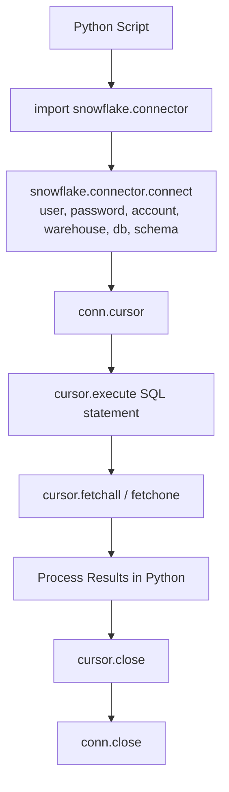

# Lecture 29: Python Connector for Snowflake

## Overview
This lecture covers connecting to Snowflake from Python using the `snowflake-connector-python` package in PyCharm. Topics include installing Python and PyCharm (Community Edition), installing the Snowflake connector package, writing connection code, executing queries, fetching results, and closing connections. An introduction to Snowpark is also provided.

---

## 1. Why Use Python with Snowflake?

| Use Case | Description |
|---|---|
| ETL/ELT Pipelines | Automate data loading from S3, Oracle, APIs to Snowflake |
| Query Execution | Run SQL statements programmatically |
| Snowpark | Write DataFrame-style code that runs inside Snowflake |
| ML/AI | Use Python ML libraries alongside Snowflake data |
| Apache Airflow DAGs | Trigger Snowflake jobs from Python-based orchestrators |
| Stored Procedures | Write Snowflake procedures in Python |

---

## 2. Installation

### Step 1: Install Python
1. Go to [python.org/downloads](https://www.python.org/downloads/)
2. Download the latest version (e.g., Python 3.12).
3. During installation, check **"Add Python to PATH"**.

### Step 2: Install PyCharm Community Edition
1. Go to [jetbrains.com/pycharm](https://www.jetbrains.com/pycharm/download/)
2. Scroll to **Community Edition** → Click **Download**.
3. Run the installer.

### Step 3: Install the Snowflake Connector Package

#### Option A: Via PyCharm UI
1. Open PyCharm → Create or open a project.
2. Go to **File** → **Settings** → **Project** → **Python Interpreter**.
3. Click the **+** (install) button.
4. Search for: `snowflake-connector-python`
5. Click **Install Package**.

#### Option B: Via Terminal / Command Prompt
```bash
pip install snowflake-connector-python
```

> **Note:** When DBT was installed earlier, `dbt-core` and `dbt-snowflake` were installed. The Snowflake connector is a separate package for direct Python-to-Snowflake connections.

---

## 3. Python Connection Code

### Basic Connection
```python
import snowflake.connector

# Establish connection
conn = snowflake.connector.connect(
    user      = 'your_username',
    password  = 'your_password',
    account   = 'your_account_identifier',   # e.g. abc123.us-east-1
    warehouse = 'COMPUTE_WH',
    database  = 'DEV_DB',
    schema    = 'DEV_SCHEMA'
)

print("Connection established successfully!")
```

### Key Connection Parameters

| Parameter | Description | Example |
|---|---|---|
| `user` | Snowflake username | `'krishna'` |
| `password` | Snowflake password | `'mypassword'` |
| `account` | Account identifier (from Snowflake URL) | `'abc123.us-east-1'` |
| `warehouse` | Virtual warehouse to use | `'QA_WAREHOUSE'` |
| `database` | Default database | `'DEV_DB'` |
| `schema` | Default schema | `'DEV_SCHEMA'` |
| `role` | Role to use (optional) | `'SYSADMIN'` |

---

## 4. Executing Queries and Fetching Results

### Full Example — Connect, Query, Fetch, Close
```python
import snowflake.connector

# Step 1: Establish connection
conn = snowflake.connector.connect(
    user      = 'krishna',
    password  = 'mypassword',
    account   = 'abc123.us-east-1',
    warehouse = 'QA_WAREHOUSE',
    database  = 'DEV_DB',
    schema    = 'DEV_SCHEMA'
)

# Step 2: Create a cursor
cursor = conn.cursor()

# Step 3: Execute a SQL query
cursor.execute("SELECT * FROM DEEP_ROD_INFO LIMIT 10")

# Step 4: Fetch results
rows = cursor.fetchall()

# Step 5: Print each row
for row in rows:
    print(row)

# Step 6: Close cursor and connection
cursor.close()
conn.close()
```

### Fetch Methods

| Method | Returns | Best Use |
|---|---|---|
| `cursor.fetchone()` | One row as a tuple (or `None`) | When you expect exactly one result (COUNT, MAX) |
| `cursor.fetchmany(n)` | List of next `n` rows | Streaming large results in batches |
| `cursor.fetchall()` | List of all remaining rows | Small to medium result sets |

```python
# fetchone example — get a single count
cursor.execute("SELECT COUNT(*) FROM T_CUSTOMER")
count_row = cursor.fetchone()
print(f"Total rows: {count_row[0]}")  # count_row is a tuple, e.g. (150000,)

# fetchmany example — process in batches of 1000
cursor.execute("SELECT * FROM STORE_SALES")
while True:
    batch = cursor.fetchmany(1000)
    if not batch:
        break
    for row in batch:
        print(row)

# fetchall example — all rows at once
cursor.execute("SELECT * FROM T_CUSTOMER LIMIT 100")
all_rows = cursor.fetchall()
for row in all_rows:
    print(row)
```

---

## 5. Parameterized Queries (Preventing SQL Injection)

Never build SQL by string concatenation with user input. Use parameterized queries with `%s` placeholders instead.

```python
import snowflake.connector

conn = snowflake.connector.connect(
    user='krishna', password='mypassword',
    account='abc123.us-east-1',
    warehouse='COMPUTE_WH', database='DEV_DB', schema='DEV_SCHEMA'
)
cursor = conn.cursor()

# BAD - SQL injection risk
user_input = "'; DROP TABLE T_CUSTOMER; --"
cursor.execute(f"SELECT * FROM T_CUSTOMER WHERE c_name = '{user_input}'")  # NEVER do this

# GOOD - parameterized query with %s
cursor.execute(
    "SELECT * FROM T_CUSTOMER WHERE c_name = %s AND c_nationkey = %s",
    ('Customer#1', 5)    # Parameters passed as a tuple
)
rows = cursor.fetchall()

cursor.close()
conn.close()
```

> **Why `%s`?** Snowflake uses `%s` (not `?` or `:param`) as the placeholder. The connector handles escaping automatically, preventing SQL injection.

---

## 5a. Fetching Results as a Pandas DataFrame

If you have pandas installed, you can load query results directly into a DataFrame:

```python
import snowflake.connector
import pandas as pd

conn = snowflake.connector.connect(
    user='krishna', password='mypassword',
    account='abc123.us-east-1',
    warehouse='COMPUTE_WH', database='DEV_DB', schema='DEV_SCHEMA'
)
cursor = conn.cursor()

cursor.execute("SELECT * FROM T_CUSTOMER LIMIT 1000")

# Load directly into DataFrame
df = cursor.fetch_pandas_all()

print(df.head())
print(df.shape)  # (1000, n_columns)

cursor.close()
conn.close()
```

The column names in the DataFrame match the Snowflake column names exactly.

---

## 5b. Context Managers (Cleaner Resource Handling)

Instead of manually calling `cursor.close()` and `conn.close()`, use Python's `with` statement:

```python
import snowflake.connector

# The connection is automatically closed when the with block exits
with snowflake.connector.connect(
    user='krishna', password='mypassword',
    account='abc123.us-east-1',
    warehouse='COMPUTE_WH', database='DEV_DB', schema='DEV_SCHEMA'
) as conn:

    # The cursor is automatically closed when this block exits
    with conn.cursor() as cursor:
        cursor.execute("SELECT COUNT(*) FROM T_CUSTOMER")
        result = cursor.fetchone()
        print(f"Row count: {result[0]}")

# No need to call cursor.close() or conn.close() — handled automatically
```

This is the preferred pattern in production code because it guarantees cleanup even if an exception occurs.

---

## 5c. Error Handling

```python
import snowflake.connector
from snowflake.connector import errors

conn = None
cursor = None
try:
    conn = snowflake.connector.connect(
        user='krishna', password='wrong_password',    # intentional error
        account='abc123.us-east-1',
        warehouse='COMPUTE_WH', database='DEV_DB', schema='DEV_SCHEMA'
    )
    cursor = conn.cursor()
    cursor.execute("SELECT * FROM NONEXISTENT_TABLE")
    rows = cursor.fetchall()

except errors.DatabaseError as e:
    # Catches Snowflake-specific errors (auth failure, SQL errors, etc.)
    print(f"Snowflake error: {e.msg}")
    print(f"Error code: {e.errno}")

except Exception as e:
    # Catches other Python exceptions
    print(f"Unexpected error: {e}")

finally:
    # Always runs — cleanup regardless of success or failure
    if cursor:
        cursor.close()
    if conn:
        conn.close()
```

---

## 6. Executing DDL and DML Statements

```python
import snowflake.connector

conn = snowflake.connector.connect(
    user='krishna', password='mypassword',
    account='abc123.us-east-1',
    warehouse='COMPUTE_WH', database='DEV_DB', schema='DEV_SCHEMA'
)
cursor = conn.cursor()

# Create a table
cursor.execute("""
    CREATE TABLE IF NOT EXISTS T_PYTHON_TEST (
        id      NUMBER,
        name    VARCHAR(100),
        city    VARCHAR(100)
    )
""")

# Insert a row
cursor.execute("""
    INSERT INTO T_PYTHON_TEST (id, name, city)
    VALUES (1, 'Alice', 'New York')
""")

# Commit the transaction (required for DML)
conn.commit()

# Verify
cursor.execute("SELECT COUNT(*) FROM T_PYTHON_TEST")
count = cursor.fetchone()
print(f"Row count: {count[0]}")

cursor.close()
conn.close()
```

---

## 6. Snowflake Roles Overview

When connecting via Python, the role used determines what objects are accessible.

```python
# Connect with a specific role
conn = snowflake.connector.connect(
    user='krishna',
    password='mypassword',
    account='abc123.us-east-1',
    role='DEVELOPER_ROLE',    # Specify role here
    warehouse='COMPUTE_WH',
    database='DEV_DB',
    schema='DEV_SCHEMA'
)
```

### Default Snowflake Roles

| Role | Purpose |
|---|---|
| `ACCOUNTADMIN` | Full admin access — highest privilege |
| `SYSADMIN` | Manages databases, warehouses, and objects |
| `SECURITYADMIN` | Manages users, roles, and grants |
| `USERADMIN` | Creates and manages users and roles |
| `PUBLIC` | Default role assigned to all users |

> In real projects, custom roles (e.g., `DEVELOPER_ROLE`, `ANALYST_ROLE`) are used. Use `SHOW ROLES` to see available roles.

```sql
SHOW ROLES;
```

---

## 7. snowflake-connector-python vs snowflake-snowpark-python

These are two different packages with different purposes:

| Feature | `snowflake-connector-python` | `snowflake-snowpark-python` |
|---|---|---|
| Install | `pip install snowflake-connector-python` | `pip install snowflake-snowpark-python` |
| Connection object | `snowflake.connector.connect()` | `Session.builder.configs({}).create()` |
| Query style | Send SQL strings with `cursor.execute()` | DataFrame API (like pandas) |
| Computation location | On your local machine | Inside Snowflake's engine |
| Result fetch | `cursor.fetchall()`, `fetchone()` | `df.collect()`, `df.to_pandas()` |
| Best for | ETL scripts, admin tasks, running SQL | ML pipelines, large-scale transforms |

**Simple rule:**
- Use `snowflake-connector-python` when you want to **send SQL commands** to Snowflake from Python.
- Use `snowflake-snowpark-python` when you want to **write Python code that runs inside Snowflake** (the computation stays in the cloud).

---

## 9. Introduction to Snowpark

Snowpark is a developer framework that lets you write Python, Java, or Scala code that runs **inside Snowflake** — meaning the computation happens in Snowflake's engine, not on your local machine.

### When to Use Snowpark
- DataFrame transformations using Python syntax.
- Loading data from a stage to a table using Python.
- Running ML/AI workloads inside Snowflake.

### Installing Snowpark Package
```bash
pip install snowflake-snowpark-python
```

### Snowpark Example — Create a Table with Range Data
```python
from snowflake.snowpark import Session

# Create session
session = Session.builder.configs({
    "account"  : "abc123.us-east-1",
    "user"     : "krishna",
    "password" : "mypassword",
    "warehouse": "COMPUTE_WH",
    "database" : "DEV_DB",
    "schema"   : "DEV_SCHEMA"
}).create()

# Create a range of values
data = [[i] for i in range(1, 21, 2)]   # [1, 3, 5, ..., 19]
df = session.create_dataframe(data, schema=["value"])

# Write to Snowflake table
df.write.mode("overwrite").save_as_table("T_RANGE")

print("Table T_RANGE created successfully")
session.close()
```

---

## 8. Warehouse Sizing for Performance

Warehouse size directly affects query execution speed:

| Size | Credits/Hour | Use Case |
|---|---|---|
| X-Small | 1 | Light development queries |
| Small | 2 | Small datasets |
| Medium | 4 | Moderate workloads |
| Large | 8 | Heavy development, test data validation |
| X-Large | 16 | Large data loads |
| 2X-Large | 32 | Very large workloads |

```python
# Switch warehouse in Python
cursor.execute("USE WAREHOUSE LARGE_WH")
cursor.execute("SELECT COUNT(*) FROM HUGE_TABLE")
```

---

## 9. Complete Workflow Diagram



---

## 10. Key Commands

| Command | Description |
|---|---|
| `pip install snowflake-connector-python` | Install Snowflake Python connector |
| `pip install snowflake-snowpark-python` | Install Snowpark package |
| `snowflake.connector.connect(...)` | Establish a Snowflake connection |
| `conn.cursor()` | Create a query cursor |
| `cursor.execute("SQL")` | Run a SQL statement |
| `cursor.fetchall()` | Retrieve all result rows |
| `cursor.fetchone()` | Retrieve one result row |
| `conn.commit()` | Commit DML transactions |
| `cursor.close()` | Close the cursor |
| `conn.close()` | Close the connection |

---

## Summary

- The `snowflake-connector-python` package enables Python scripts to connect to and query Snowflake.
- Install PyCharm Community Edition as a free Python IDE; install the package via PyCharm's package manager or `pip`.
- Connection requires: `user`, `password`, `account`, `warehouse`, `database`, `schema`.
- Cursors execute SQL statements; `fetchall()`, `fetchone()`, and `fetchmany(n)` retrieve results.
- Always close both the cursor and connection after use.
- **Snowpark** is an advanced framework allowing Python DataFrame-style code to run inside Snowflake's compute engine.
- Warehouse sizing has a significant impact on query performance — use larger warehouses for heavy workloads.
