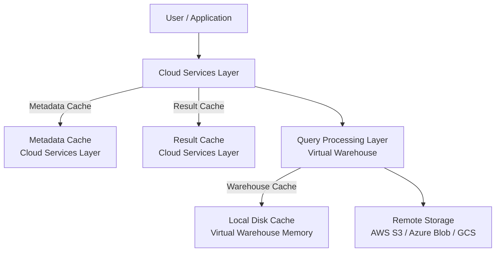
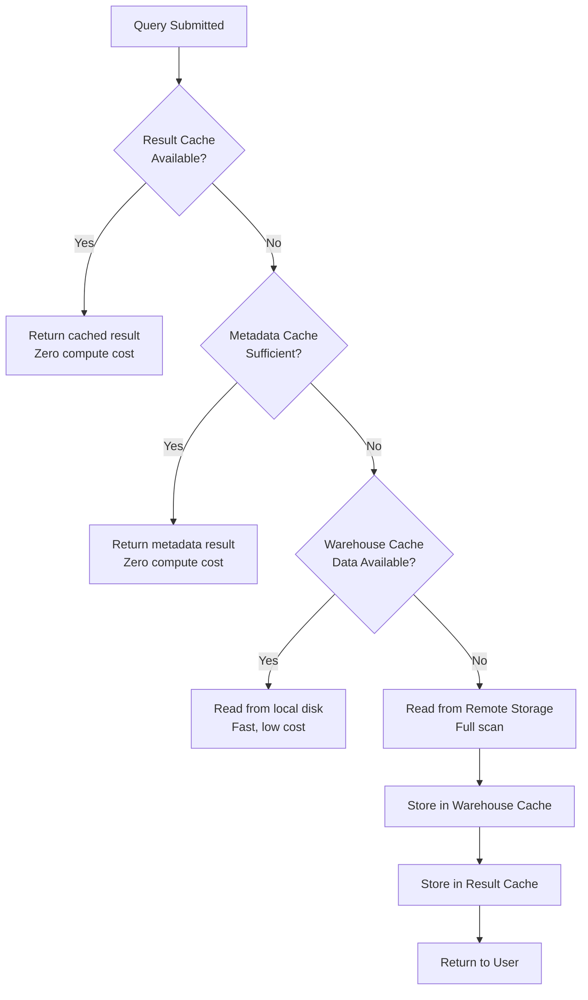

# Lecture 30: Caching in Snowflake — Result Cache, Warehouse Cache, and Metadata Cache

## Overview
This lecture explains Snowflake's three-layer caching architecture. Understanding caching is critical for performance tuning and cost optimization. The lecture demonstrates how each cache works, how to test them, and how to enable/disable result cache using query parameters.

---

## 1. Snowflake Architecture — Where Caches Live



### The Three Cache Types

| Cache Type | Location | Lifetime | What It Stores |
|---|---|---|---|
| **Result Cache** | Cloud Services Layer | 24 hours (extendable) | Complete query results |
| **Warehouse Cache** (Local Disk Cache) | Virtual Warehouse | Until warehouse suspends | Micro-partition data scanned by the warehouse |
| **Metadata Cache** | Cloud Services Layer | Persistent | Table statistics: row counts, MIN, MAX, etc. |

---

## 2. Metadata Cache

### What is Metadata Cache?
Snowflake automatically maintains metadata (statistics) about every table — including row counts, column min/max values, and number of micro-partitions. Aggregate operations that can be answered from metadata do NOT scan actual data.

### Queries That Use Metadata Cache
- `COUNT(*)`
- `COUNT(column)`
- `MAX(column)`
- `MIN(column)`
- `SHOW TABLES` (row counts)
- `INFORMATION_SCHEMA.TABLES` queries

### Example
```sql
SELECT COUNT(*) FROM STORE_SALES;
```
**Result:** Returns immediately. Query profile shows "Metadata-based result" — no data was scanned from storage.

```sql
SELECT MAX(sale_date) FROM STORE_SALES;
```
**Result:** Also metadata-based — Snowflake stored the max value when data was loaded.

### How to Verify
Click on the Query ID after execution → Look for the label **"Metadata-based result"** in the query profile.

```sql
-- This is also metadata-based (querying system catalog)
SELECT * FROM INFORMATION_SCHEMA.TABLES
WHERE TABLE_TYPE = 'BASE TABLE';
```

---

## 3. Result Cache

### What is Result Cache?
When a query is executed, Snowflake caches the **complete result set** in the Cloud Services Layer. If the same exact query is re-executed within 24 hours AND the underlying data has not changed, Snowflake returns the result from cache — zero compute cost.

### Conditions for Result Cache Hit
1. The SQL text must be **identical** (case-sensitive, whitespace-sensitive).
2. The underlying data must be **unchanged** since last execution.
3. The result must be less than **24 hours** old.
4. `USE_CACHED_RESULT` session parameter must be `TRUE` (default).

### How to Verify a Cache Hit
Run the same query twice:
```sql
SELECT s_suppkey, SUM(s_acctbal) AS total_balance
FROM SNOWFLAKE_SAMPLE_DATA.TPCH_SF1.SUPPLIER
GROUP BY s_suppkey
ORDER BY total_balance DESC;
```
Second execution → Click Query ID → Displays **"Query result reuse"**.

### Disabling Result Cache
```sql
-- Session level
ALTER SESSION SET USE_CACHED_RESULT = FALSE;

-- Verify current setting
SHOW PARAMETERS LIKE 'USE_CACHED_RESULT';
```

```sql
-- Re-enable
ALTER SESSION SET USE_CACHED_RESULT = TRUE;
```

### When Result Cache is Invalidated
- New rows are inserted, updated, or deleted in the underlying table.
- The query text changes (even whitespace or case).
- 24 hours pass.

### Case Sensitivity Example
```sql
-- First query - cached
SELECT * FROM T_TIME WHERE t_hour = 10;

-- This is treated as a DIFFERENT query (lowercase vs uppercase)
SELECT * FROM t_time WHERE T_HOUR = 10;
-- Result: NOT served from cache - will re-execute
```

---

## 4. Warehouse Cache (Local Disk Cache)

### What is Warehouse Cache?
When a virtual warehouse scans micro-partitions from remote storage (S3/Azure/GCS), it caches those data blocks in its **local SSD storage** (local disk cache). If the same data is needed again, it reads from local cache instead of remote storage — much faster.

### How to Verify Warehouse Cache

#### Step 1: Suspend the warehouse (clears local cache)
```sql
ALTER WAREHOUSE COMPUTE_WH SUSPEND;
```

#### Step 2: Run a query for the first time
```sql
SELECT * FROM T_TIME_DIM WHERE t_hour = 10;
```
Click Query ID → "Percentage scanned from cache" = **0%** (reading from remote disk).

#### Step 3: Run the same query a second time (warehouse still active)
```sql
SELECT * FROM T_TIME_DIM WHERE t_hour = 10;
```
Click Query ID → "Percentage scanned from cache" = **100%** (reading from local warehouse cache).

#### Step 4: Suspend warehouse and run again
```sql
ALTER WAREHOUSE COMPUTE_WH SUSPEND;
-- Then re-run the query
SELECT * FROM T_TIME_DIM WHERE t_hour = 10;
```
Click Query ID → "Percentage scanned from cache" = **0%** (cache was cleared when warehouse suspended).

### Key Point
Warehouse cache persists **only while the warehouse is running**. Suspending a warehouse clears its local cache.

---

## 5. Cache Lookup Order

When a query is executed, Snowflake checks caches in this order:



---

## 6. Practical Demo Summary

| Scenario | Cache Used | Indicator |
|---|---|---|
| `COUNT(*)` on large table | Metadata Cache | "Metadata-based result" |
| Same query, data unchanged | Result Cache | "Query result reuse" |
| Same query, warehouse active | Warehouse Cache | Scanned from cache = 100% |
| First-time query | Remote Disk | Scanned from cache = 0% |
| Same query after data INSERT | Warehouse Cache | Result cache invalidated |
| Same query with different case | Remote Disk | Treated as new query |
| After warehouse suspend | Remote Disk | Warehouse cache cleared |

---

## 7. Query Acceleration Service (Bonus Topic)

For queries taking many minutes on large datasets, Snowflake offers **Query Acceleration Service (QAS)**:

### How It Works
QAS temporarily increases the effective warehouse size by a **scaling factor** to speed up eligible queries.

```sql
-- Find the optimal scaling factor
SELECT PARSE_JSON(
    SYSTEM$ESTIMATE_QUERY_ACCELERATION('<query_id>')
) AS acceleration_estimate;
```

Returns JSON like:
```json
{
  "estimatedQueryTimes": {
    "1" : 310,
    "8" : 142,
    "16": 72,
    "26": 47,
    "32": 38
  },
  "status": "eligible",
  "originalQueryTime": 316
}
```

### Enabling QAS on a Warehouse
```sql
ALTER WAREHOUSE COMPUTE_WH SET
    ENABLE_QUERY_ACCELERATION     = TRUE,
    QUERY_ACCELERATION_MAX_SCALE_FACTOR = 26;
```

### Key Terms
- **Scaling Factor** — How many times the warehouse size is multiplied (e.g., 8×, 16×, 26×).
- **Eligible** — The query qualifies for QAS (long-running, scans large data).
- **Ineligible** — The query is too fast or doesn't benefit from parallelization.

---

## 8. Key Commands

| Command | Description |
|---|---|
| `ALTER SESSION SET USE_CACHED_RESULT = FALSE` | Disable result cache |
| `ALTER SESSION SET USE_CACHED_RESULT = TRUE` | Enable result cache |
| `SHOW PARAMETERS LIKE 'USE_CACHED_RESULT'` | Check current cache setting |
| `ALTER WAREHOUSE <name> SUSPEND` | Suspend warehouse (clears local cache) |
| `SYSTEM$ESTIMATE_QUERY_ACCELERATION('<id>')` | Estimate QAS scaling factor |
| `ALTER WAREHOUSE <name> SET ENABLE_QUERY_ACCELERATION = TRUE` | Enable QAS |

---

## Summary

- Snowflake has **three cache types**: Metadata Cache, Result Cache, and Warehouse (Local Disk) Cache.
- **Metadata Cache** (Cloud Services Layer) serves `COUNT(*)`, `MAX()`, `MIN()` without scanning data.
- **Result Cache** (Cloud Services Layer) returns identical query results within 24 hours at zero compute cost.
- **Warehouse Cache** (Virtual Warehouse) stores recently scanned micro-partitions in local SSD; cleared when warehouse suspends.
- Result cache is invalidated if: data changes, query text changes, or 24 hours elapse.
- Even a case change in the query text (e.g., `WHERE T_HOUR` vs `WHERE t_hour`) bypasses result cache.
- `USE_CACHED_RESULT = FALSE` disables result cache for a session, useful for testing actual query performance.
- Query Acceleration Service (QAS) multiplies effective warehouse size by a scaling factor to speed up eligible long-running queries.
