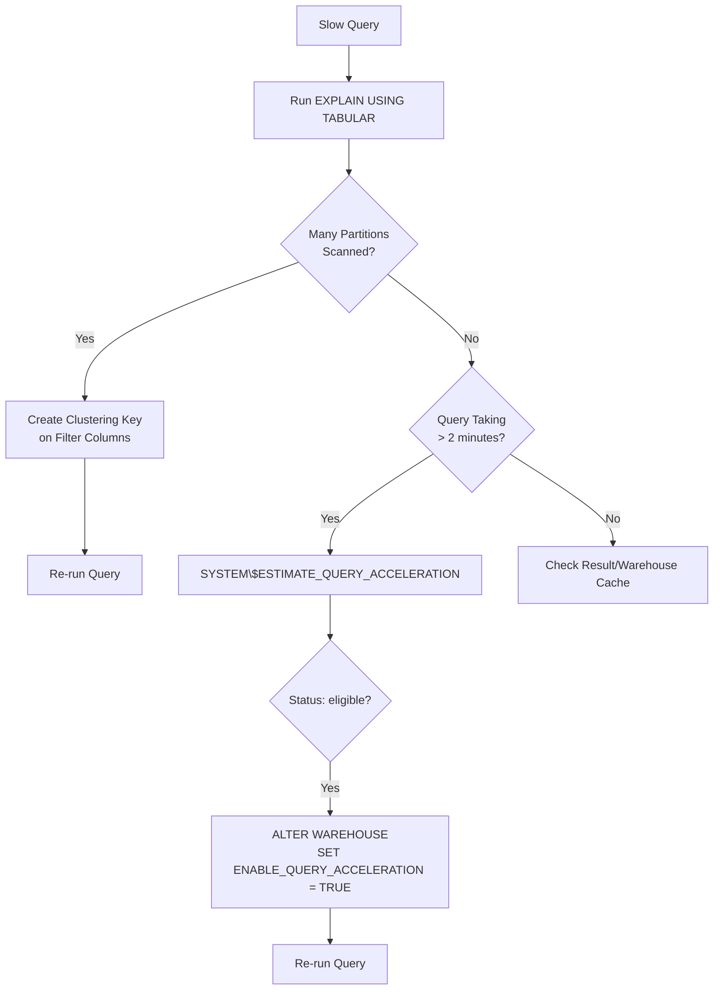

# Lecture 31: Query Optimization — EXPLAIN Plans, Clustering Keys, and Query Acceleration

## Overview
This lecture covers Snowflake's query optimization tools: generating execution plans with `EXPLAIN`, understanding micro-partition pruning, creating clustering keys on large tables, and using Query Acceleration Service (QAS) to dramatically speed up long-running queries.

---

## 1. Why Query Optimization Matters

Large Snowflake tables can contain millions to billions of rows stored across thousands of micro-partitions. Without optimization:
- Full micro-partition scans occur even for filtered queries.
- Queries take minutes when they could complete in seconds.
- Warehouse credits are consumed unnecessarily.

---

## 2. EXPLAIN — Viewing the Execution Plan

### Formats Available

| Format | Command | Output |
|---|---|---|
| Text | `EXPLAIN USING TEXT` | Human-readable steps |
| Tabular | `EXPLAIN USING TABULAR` | Table with step numbers |
| JSON | `EXPLAIN USING JSON` | Machine-readable JSON |

### Syntax
```sql
EXPLAIN USING TEXT
SELECT
    i.i_item_sk,
    i.i_item_desc,
    SUM(ss.ss_sales_price) AS total_sales
FROM STORE_SALES ss
JOIN ITEM         i  ON ss.ss_item_sk = i.i_item_sk
WHERE i.i_category = 'Electronics'
GROUP BY i.i_item_sk, i.i_item_desc
ORDER BY total_sales DESC;
```

### Example TEXT Output
```
GlobalStats:
  partitionsTotal=120
  partitionsAssigned=120
  bytesAssigned=1073741824

Operations:
1 -  TableScan[STORE_SALES] (filter: ss_item_sk IS NOT NULL)
2 -  TableScan[ITEM]
3 -  HashJoin (i.i_item_sk = ss.ss_item_sk)
4 -  Filter (i.i_category = 'Electronics')
5 -  Aggregate (GROUP BY)
6 -  Sort
7 -  Result
```

### Example TABULAR Output
```sql
EXPLAIN USING TABULAR
SELECT ...;
```
Returns a table with columns: `step`, `id`, `node_type`, `rows`, `cost`, `bytes`.

### Example JSON Output
```sql
EXPLAIN USING JSON
SELECT ...;
```
Returns key-value JSON — same plan in machine-parsable format.

---

## 3. Micro-Partitions and Automatic Clustering

### What is a Micro-Partition?
Snowflake automatically divides table data into **micro-partitions** of 50–500 MB compressed. Each micro-partition stores column metadata (min/max values) which Snowflake uses to skip irrelevant partitions during queries.

### Partition Pruning
When a query has a WHERE clause, Snowflake uses partition metadata to skip micro-partitions that cannot contain matching rows.

```sql
-- Without clustering: may scan all 120 partitions
SELECT * FROM STORE_SALES WHERE ss_sold_date_sk = 2451119;

-- With clustering on ss_sold_date_sk: scans only relevant partitions
SELECT * FROM STORE_SALES WHERE ss_sold_date_sk = 2451119;
```

---

## 4. Clustering Keys

### Step 0: Check Cardinality BEFORE Creating a Clustering Key

Before clustering, check how many distinct values the column has. Low cardinality = better clustering key.

```sql
-- Check distinct values in a column before clustering
SELECT COUNT(DISTINCT i_category) FROM ITEM;   -- Result: 7 distinct categories → GOOD

SELECT COUNT(DISTINCT i_item_sk) FROM ITEM;    -- Result: 402,000 distinct IDs → BAD
```

**Why cardinality matters:**

```
Low cardinality (4-20 distinct values):
  Partitions with overlapping ranges are few.
  Filter WHERE i_category = 'Books' → scans only relevant partitions.

High cardinality (400,000+ distinct values):
  Nearly every partition has a different value.
  Clustering is ineffective — still scans most partitions.
  Snowflake itself warns: "HIGH CARDINALITY — clustering may not improve performance"
```

> **Rule of thumb:** If a column has fewer than ~100 distinct values (like dates, categories, regions), it is a good clustering key. If it has millions of distinct values (like a row ID or transaction ID), do not cluster on it.

### When to Create a Clustering Key
- The table has **large volume** of data (hundreds of millions+ rows).
- Queries frequently filter on a specific column.
- The column has **low to medium cardinality** (date columns, category columns — not unique IDs).

> **Warning:** Do NOT cluster on columns with very high cardinality (unique IDs). Snowflake itself warns you when you try: `"HIGH CARDINALITY which might result in reducing the quality of clustering"`.

### Checking Clustering Information
```sql
SELECT SYSTEM$CLUSTERING_INFORMATION('ITEM_TABLE', '(i_category, i_class)');
```

If the table is not clustered:
```
Error: invalid clustering keys on table ITEM_TABLE
```

### Creating a Clustering Key
```sql
ALTER TABLE ITEM_TABLE CLUSTER BY (i_category);
```

Or cluster during table creation:
```sql
CREATE TABLE STORE_SALES (
    ss_sold_date_sk  NUMBER,
    ss_item_sk       NUMBER,
    ss_sales_price   NUMBER,
    ...
) CLUSTER BY (ss_sold_date_sk);
```

### Retrieving Clustering Information
```sql
SELECT SYSTEM$CLUSTERING_INFORMATION('STORE_SALES', '(ss_sold_date_sk)');
```

Returns JSON:
```json
{
  "cluster_by_keys": "LINEAR(ss_sold_date_sk)",
  "total_partition_count": 120,
  "total_constant_partition_count": 95,
  "average_overlaps": 2.8,
  "average_depth": 3.5,
  "partition_depth_histogram": {
    "00000": 95,
    "00001": 18,
    "00002": 7
  }
}
```

| Metric | Ideal Value | Meaning |
|---|---|---|
| `average_depth` | Close to 1 | Less depth = better clustering |
| `average_overlaps` | Close to 0 | Less overlap = better pruning |
| `total_constant_partition_count` | High | More partitions have only one cluster key value |

### Dropping a Clustering Key
```sql
ALTER TABLE ITEM_TABLE DROP CLUSTERING KEY;
```

---

## 5. Getting the DDL to Check Clustering

```sql
SELECT GET_DDL('TABLE', 'ITEM_TABLE');
```

Example output:
```sql
CREATE OR REPLACE TABLE ITEM_TABLE (
    i_item_sk    NUMBER,
    i_item_desc  VARCHAR,
    i_category   VARCHAR
) CLUSTER BY (i_category);
```

---

## 6. Best Practices for Clustering Keys

| Do | Avoid |
|---|---|
| Cluster on date columns | Clustering on unique ID columns |
| Cluster on columns used in WHERE filters | Clustering on columns rarely filtered |
| Use for tables > 1 TB | Applying to small tables (overhead not worth it) |
| Cluster on columns with low cardinality | High cardinality columns (>1M distinct values) |

---

## 7. Query Acceleration Service (QAS) — Deep Dive

### Problem Statement
A query joins 4 large TPC tables and takes 10 minutes on an X-Small warehouse.

### Step 1: Capture the Query ID
After running the slow query:
```sql
-- Hover over the query in query history to get the ID
-- Or use:
SELECT LAST_QUERY_ID();
```

### Step 2: Estimate QAS Benefit
```sql
SELECT PARSE_JSON(
    SYSTEM$ESTIMATE_QUERY_ACCELERATION('<query_id_here>')
) AS estimate;
```

Example result:
```json
{
  "estimatedQueryTimes": {
    "1" : 316,
    "4" : 142,
    "8" : 95,
    "16": 72,
    "26": 47,
    "32": 38
  },
  "originalQueryTime": 316,
  "status": "eligible",
  "queryUUID": "01abc123..."
}
```

Interpretation:
- Without QAS: 316 seconds (5+ minutes).
- With scaling factor 8: 95 seconds.
- With scaling factor 26: 47 seconds.
- With scaling factor 32: 38 seconds.

### Step 3: Enable QAS on the Warehouse
```sql
ALTER WAREHOUSE COMPUTE_WH SET
    ENABLE_QUERY_ACCELERATION           = TRUE,
    QUERY_ACCELERATION_MAX_SCALE_FACTOR = 26;
```

### Step 4: Re-run the Query
The same query now completes in ~42 seconds (close to the estimated 47 seconds).

### Verifying QAS Settings
```sql
SHOW WAREHOUSES;
-- Check: ENABLE_QUERY_ACCELERATION = true, QUERY_ACCELERATION_MAX_SCALE_FACTOR = 26
```

### Finding Queries Eligible for QAS
```sql
-- View that shows queries eligible for acceleration in the past 14 days
SELECT *
FROM SNOWFLAKE.ACCOUNT_USAGE.QUERY_ACCELERATION_ELIGIBLE
ORDER BY ELIGIBLE_QUERY_COUNT DESC;
```

This view shows which queries are long-running AND eligible. Use it to find candidates for enabling QAS on a warehouse.

```sql
-- Check which recent queries were eligible for QAS (real-time)
SELECT * FROM TABLE(INFORMATION_SCHEMA.QUERY_HISTORY())
WHERE QUERY_ACCELERATION_PARTITIONS_SCANNED > 0
ORDER BY START_TIME DESC;
```

### Important Notes on QAS
1. Not all queries are eligible — only complex queries involving large scans.
2. If a query takes < 1 second, QAS is `ineligible`.
3. QAS scales the warehouse **temporarily** — you are charged for the extra credits consumed.
4. The scaling factor can be set between 0 and 100.

---

## 8. Horizontal Scaling (Multi-Cluster Warehouse)

Whereas QAS speeds up a single query, **multi-cluster warehouses** handle **concurrency** — many users running many queries simultaneously.

```sql
CREATE WAREHOUSE MULTI_CLUSTER_WH
    WAREHOUSE_SIZE = 'SMALL'
    MIN_CLUSTER_COUNT = 1
    MAX_CLUSTER_COUNT = 4
    SCALING_POLICY = 'STANDARD';
```

| Feature | QAS | Multi-Cluster |
|---|---|---|
| Addresses | Long query runtime | High concurrency (many queries) |
| Mechanism | Temporary size increase | Multiple parallel clusters |
| Called | Vertical scaling boost | Horizontal scaling |

---

## 9. Complete Optimization Workflow



---

## 10. Key Commands

| Command | Description |
|---|---|
| `EXPLAIN USING TEXT SELECT ...` | View text execution plan |
| `EXPLAIN USING TABULAR SELECT ...` | View tabular execution plan |
| `EXPLAIN USING JSON SELECT ...` | View JSON execution plan |
| `ALTER TABLE t CLUSTER BY (col)` | Add clustering key |
| `SYSTEM$CLUSTERING_INFORMATION('t', '(col)')` | View clustering stats |
| `GET_DDL('TABLE', 'table_name')` | View table DDL including cluster keys |
| `SYSTEM$ESTIMATE_QUERY_ACCELERATION('<id>')` | Estimate QAS benefit |
| `ALTER WAREHOUSE w SET ENABLE_QUERY_ACCELERATION = TRUE` | Enable QAS |
| `ALTER WAREHOUSE w SET QUERY_ACCELERATION_MAX_SCALE_FACTOR = 26` | Set QAS scale factor |
| `ALTER TABLE t DROP CLUSTERING KEY` | Remove clustering key |

---

## Summary

- `EXPLAIN USING TEXT/TABULAR/JSON` generates an execution plan — useful for understanding how Snowflake processes a query.
- Snowflake stores data in **micro-partitions** with column metadata (min/max). Snowflake uses this to prune irrelevant partitions during queries.
- **Clustering Keys** manually reorganize micro-partitions to improve pruning for frequently filtered columns (best on large tables with low-cardinality filter columns like dates).
- Avoid clustering on high-cardinality columns (unique IDs) — it reduces clustering quality.
- `SYSTEM$CLUSTERING_INFORMATION` shows how well a table is clustered.
- **Query Acceleration Service (QAS)** temporarily scales up a warehouse by a scaling factor (e.g., 26×) to speed up eligible long-running queries.
- `SYSTEM$ESTIMATE_QUERY_ACCELERATION` gives estimated completion times at different scaling factors.
- QAS and multi-cluster warehouses solve different problems: QAS = faster single queries; multi-cluster = handling many concurrent queries.
