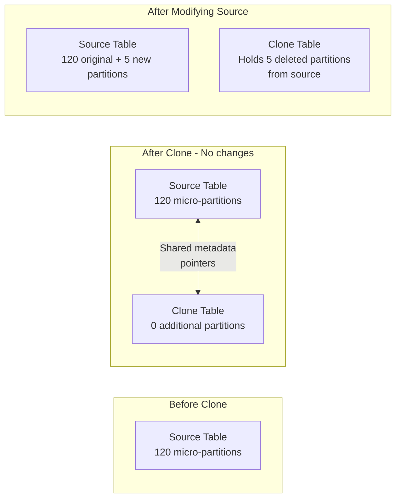

# Lecture 32: Zero-Copy Cloning and Python Connector in PyCharm

## Overview
This lecture covers Snowflake's **Zero-Copy Cloning** feature — creating instant, storage-efficient copies of tables, schemas, or databases. It also continues the Python connector setup in PyCharm, and introduces Resource Monitors and Multi-Cluster Warehouses.

---

## 1. Zero-Copy Cloning

### What is Cloning?
Cloning creates an exact copy of a Snowflake object (table, schema, or database) **instantly**, with **no initial storage cost**. Both the original and the clone share the same underlying micro-partitions until either is modified.

### Why Use Cloning?

| Scenario | How Cloning Helps |
|---|---|
| Taking a backup before major changes | Clone the table — no extra storage cost |
| Copying production data to lower environments | Clone prod tables to dev/QA without storage duplication |
| Point-in-time snapshots for testing | Clone at any point, including Time Travel versions |
| Experiment on data without risking production | Clone, modify the clone, discard if needed |

### Traditional Backup vs Clone

| Method | Storage Cost | Time | Process |
|---|---|---|---|
| `CREATE TABLE backup AS SELECT * FROM source` | 100% of source size | Minutes–hours for large tables | Full data copy |
| `CREATE TABLE clone CLONE source` | 0 (until modified) | Instant | Metadata pointer copy |

---

## 2. Cloning Syntax

### Clone a Table
```sql
CREATE TABLE T_STORE_SALES_BACKUP CLONE T_STORE_SALES;
```

### Clone a Schema
```sql
CREATE SCHEMA DEV_SCHEMA_BACKUP CLONE PROD_SCHEMA;
```

### Clone a Database
```sql
CREATE DATABASE PROD_DB_BACKUP CLONE PROD_DB;
```

### Clone with Time Travel (Clone Past Version)
```sql
-- Clone a table as it was 1 hour ago
CREATE TABLE T_ORDERS_RESTORE
CLONE T_ORDERS
AT (OFFSET => -3600);   -- 3600 seconds = 1 hour

-- Clone at a specific timestamp
CREATE TABLE T_ORDERS_RESTORE
CLONE T_ORDERS
AT (TIMESTAMP => '2025-01-01 10:00:00'::TIMESTAMP);

-- Clone at a specific statement ID
CREATE TABLE T_ORDERS_RESTORE
CLONE T_ORDERS
AT (STATEMENT => '<query_id>');
```

---

## 3. Zero-Copy: How It Works



**Rule:** Once either the source or the clone is modified (INSERT, UPDATE, DELETE), new micro-partitions are created for the changes. The original shared partitions remain until both sides no longer reference them.

---

## 4. Checking Clone Storage Cost

Use `TABLE_STORAGE_METRICS` to see actual bytes used:

```sql
SELECT
    table_name,
    active_bytes,
    time_travel_bytes,
    failsafe_bytes,
    ROUND(active_bytes / POWER(1024, 3), 4) AS active_gb
FROM INFORMATION_SCHEMA.TABLE_STORAGE_METRICS
WHERE table_dropped IS NULL
ORDER BY active_bytes DESC;
```

### Example Results

| TABLE_NAME | ACTIVE_BYTES | ACTIVE_GB |
|---|---|---|
| T_STORE_SALES | 4,294,967,296 | 4.0 |
| T_STORE_SALES_BACKUP | 0 | 0.0 |

After deleting rows from source and the clone holding those records:

| TABLE_NAME | ACTIVE_BYTES | ACTIVE_GB |
|---|---|---|
| T_STORE_SALES | 4,000,000,000 | 3.7 |
| T_STORE_SALES_BACKUP | 294,967,296 | 0.27 |

---

## 5. Independence After Cloning

After cloning, the source and clone become **independent objects**:
- Deleting rows from the **source** does NOT delete them from the **clone**.
- Deleting rows from the **clone** does NOT affect the **source**.
- Changes to one create new micro-partitions — both objects pay the storage cost for those exclusive micro-partitions.

```sql
-- Delete from source
DELETE FROM T_STORE_SALES WHERE item_key BETWEEN 1 AND 1000;

-- Rows still visible in clone
SELECT COUNT(*) FROM T_STORE_SALES_BACKUP;  -- Still has the 1000 deleted rows
```

---

## 6. Python Connector Setup — PyCharm

### Creating a New Project in PyCharm
1. Open PyCharm → **New Project**.
2. Set project name (e.g., `snowflake`).
3. Under **Python Interpreter**, create or select a virtual environment.
4. Click **Create**.

### Installing the Snowflake Connector Package

#### Via PyCharm UI
1. **File** → **Settings** → **Project: snowflake** → **Python Interpreter**.
2. Click **+** → Search `snowflake-connector-python` → **Install Package**.

#### Via Terminal
```bash
pip install snowflake-connector-python
```

### Creating a Python File
1. Right-click project name → **New** → **Python File**.
2. Name it `snowflake_connect.py`.

---

## 7. Complete Python Connection Example (PyCharm)

```python
import snowflake.connector

# Connection parameters
conn = snowflake.connector.connect(
    user      = 'krishna',
    password  = 'your_password',
    account   = 'your_account_id',
    warehouse = 'QA_WAREHOUSE',
    database  = 'DEV_DB',
    schema    = 'DEV_SCHEMA'
)

# Create cursor
cursor = conn.cursor()

# Execute query
cursor.execute("SELECT * FROM DEEP_ROD_INFO LIMIT 20")

# Fetch and print results
results = cursor.fetchall()
for row in results:
    print(row)

# Cleanup
cursor.close()
conn.close()

print("Done!")
```

### Running in PyCharm
- Click the green **Run** button (▶) in the toolbar.
- Or right-click the file → **Run 'snowflake_connect'**.
- Output appears in the **Run** panel at the bottom.

---

## 8. Resource Monitor

A **Resource Monitor** tracks and controls warehouse credit consumption.

### Create a Resource Monitor (UI)
Navigate to **Admin** → **Cost Management** → **Resource Monitors** → Click **+**.

### Create via SQL

#### Warehouse-Level Monitor
```sql
CREATE RESOURCE MONITOR RM_DEV_WAREHOUSE
    WITH CREDIT_QUOTA = 10
    FREQUENCY = MONTHLY
    START_TIMESTAMP = IMMEDIATELY
    TRIGGERS
        ON 50 PERCENT DO NOTIFY
        ON 80 PERCENT DO SUSPEND
        ON 90 PERCENT DO SUSPEND_IMMEDIATE
    WAREHOUSES = DEV_WAREHOUSE;
```

#### Account-Level Monitor
```sql
CREATE RESOURCE MONITOR RM_ACCOUNT_LEVEL
    WITH CREDIT_QUOTA = 40
    FREQUENCY = MONTHLY
    START_TIMESTAMP = IMMEDIATELY
    TRIGGERS
        ON 50 PERCENT DO NOTIFY
        ON 60 PERCENT DO NOTIFY
        ON 80 PERCENT DO SUSPEND
        ON 90 PERCENT DO SUSPEND_IMMEDIATE;
```

### Trigger Actions Explained

| Action | Description |
|---|---|
| `NOTIFY` | Sends email notification to administrators |
| `SUSPEND` | Waits for running queries to complete, then suspends warehouse |
| `SUSPEND_IMMEDIATE` | Immediately suspends warehouse — running queries are killed |

### Viewing Resource Monitors
```sql
SHOW RESOURCE MONITORS;
```

---

## 9. Multi-Cluster Warehouses (Horizontal Scaling)

When many users run queries concurrently, queries queue up. Multi-cluster warehouses add parallel clusters to handle the load.

```sql
CREATE WAREHOUSE HIGH_CONCURRENCY_WH
    WAREHOUSE_SIZE    = 'SMALL'
    MIN_CLUSTER_COUNT = 1
    MAX_CLUSTER_COUNT = 4
    SCALING_POLICY    = 'STANDARD'   -- or 'ECONOMY'
    AUTO_SUSPEND      = 300           -- 5 minutes
    AUTO_RESUME       = TRUE;
```

### Scaling Policies

| Policy | Behavior |
|---|---|
| `STANDARD` | Adds clusters as soon as queries start queuing |
| `ECONOMY` | Waits until queuing is significant before adding clusters |

### Auto-Suspend and Auto-Resume
```sql
ALTER WAREHOUSE COMPUTE_WH SET
    AUTO_SUSPEND = 300     -- suspend after 5 minutes of inactivity
    AUTO_RESUME  = TRUE;   -- automatically resume when a query is submitted
```

---

## 10. Key Commands

| Command | Description |
|---|---|
| `CREATE TABLE clone_t CLONE source_t` | Clone a table |
| `CREATE SCHEMA clone_s CLONE source_s` | Clone a schema |
| `CREATE DATABASE clone_db CLONE source_db` | Clone a database |
| `CREATE TABLE t CLONE s AT (OFFSET => -3600)` | Clone with Time Travel (1 hour back) |
| `SELECT * FROM INFORMATION_SCHEMA.TABLE_STORAGE_METRICS` | Check table storage bytes |
| `SHOW RESOURCE MONITORS` | List all resource monitors |
| `CREATE RESOURCE MONITOR ... WITH CREDIT_QUOTA = 10` | Create a resource monitor |
| `ALTER WAREHOUSE w SET AUTO_SUSPEND = 300` | Set auto-suspend time |
| `ALTER WAREHOUSE w SET MIN_CLUSTER_COUNT = 2 MAX_CLUSTER_COUNT = 5` | Set cluster range |

---

## Summary

- **Zero-Copy Cloning** creates instant copies of tables, schemas, or databases with no initial storage cost.
- Both source and clone share the same micro-partitions until either is modified — new micro-partitions are created only for changes.
- After cloning, both objects are **independent** — deleting from one does not affect the other.
- `TABLE_STORAGE_METRICS` shows actual bytes consumed by each table, including clone tables.
- Cloning can be combined with **Time Travel** to restore or clone historical states of data.
- **Resource Monitors** control credit consumption per warehouse or per account, with configurable alerts (`NOTIFY`), soft suspends (`SUSPEND`), and hard suspends (`SUSPEND_IMMEDIATE`).
- **Multi-cluster warehouses** handle concurrency by running multiple parallel clusters — each serving a subset of queries.
- Python connector is installed via `pip install snowflake-connector-python` and used with `snowflake.connector.connect()` in PyCharm or any Python environment.
