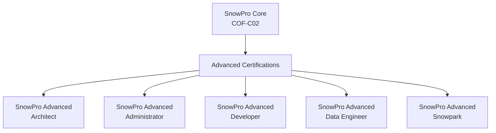

# Lecture 33: Snowflake Certifications — Overview and Exam Process

## Overview
This lecture covers the Snowflake certification landscape, focusing on the SnowPro Core certification. It walks through the exam registration process on the Kryterion/Webassessor platform, available certifications, exam format, and tips for the online proctored exam.

---

## 1. Snowflake Certification Overview

### Available Certifications

| Certification | Level | Focus Area |
|---|---|---|
| SnowPro Core | Foundation | Core Snowflake concepts, all domains |
| SnowPro Advanced: Architect | Advanced | Architecture, design patterns |
| SnowPro Advanced: Administrator | Advanced | Account management, security, operations |
| SnowPro Advanced: Developer | Advanced | SQL, Python, application development |
| SnowPro Advanced: Data Engineer | Advanced | Data pipelines, ingestion, transformation |
| SnowPro Advanced: Snowpark | Advanced | Python/Java/Scala with Snowpark |

> **Recommended path:** Start with SnowPro Core before attempting Advanced certifications.

---

## 2. SnowPro Core Certification

### Exam Details

| Property | Detail |
|---|---|
| Exam Code | COF-C02 |
| Duration | 115 minutes |
| Number of Questions | 100 questions |
| Passing Score | 750 out of 1000 |
| Price | ~$175–$180 USD |
| Format | Multiple choice, multiple select |
| Delivery | Online proctored or in-person test center |

### Exam Domains (Approximate Weightings)

| Domain | Topic | Weight |
|---|---|---|
| 1 | Snowflake Data Cloud Features & Architecture | 25% |
| 2 | Account Access and Security | 20% |
| 3 | Performance Concepts | 15% |
| 4 | Data Loading and Unloading | 10% |
| 5 | Data Transformations | 20% |
| 6 | Data Protection and Data Sharing | 10% |

### Key Topics to Study

**Architecture:**
- Virtual warehouses, cloud services layer, storage layer
- Micro-partitions, clustering, data pruning
- Multi-cluster warehouses, auto-suspend/resume

**Security:**
- RBAC (Role-Based Access Control)
- Network policies
- Column-level security (masking policies)
- Row-level access policies
- MFA (Multi-Factor Authentication)

**Performance:**
- Result cache, warehouse cache, metadata cache
- Clustering keys
- Query Acceleration Service
- EXPLAIN plans

**Data Loading:**
- Internal stages (`@~`, `@%table`, `@stage_name`)
- External stages (S3, Azure, GCS)
- COPY INTO command
- Snowpipe (auto-ingest)
- PUT and GET commands

**Semi-Structured Data:**
- VARIANT, ARRAY, OBJECT types
- `PARSE_JSON`, `TRY_PARSE_JSON`
- Dot notation and bracket notation
- `FLATTEN` table function
- `ARRAY_AGG`, `OBJECT_CONSTRUCT`

**Data Protection:**
- Time Travel (up to 90 days for Enterprise)
- Fail-Safe (7 days, non-configurable)
- Zero-Copy Cloning
- Data sharing (secure shares, data exchange)

---

## 3. Exam Registration Process

### Step 1: Create an Account
1. Search for **"SnowPro Core Certification"** — navigate to [snowpro.com](https://www.snowpro.com) or Kryterion's platform.
2. If you do not have an account, click **Register** / **Sign Up**.
3. Fill in personal details:
   - First Name, Last Name
   - Email address
   - Address details
   - **User Type:** Select **Other** (or most applicable category)

### Step 2: Schedule an Exam
1. Log in to [webassessor.com](https://webassessor.com) or [home.pearsonvue.com](https://home.pearsonvue.com).
2. Click **Schedule and Manage Exams** → **Manage My Exams**.
3. Search for: `SnowPro Core`
4. Available options include:
   - SnowPro Core Certification
   - SnowPro Core Practice Exam

### Step 3: Select Delivery Method
- **Online Proctored** — Take from home with a webcam.
- **In Person** — Visit a local Pearson VUE test center.

### Step 4: Select Date and Time
- Choose your time zone.
- Select available date and time slot.
- Click **Next**.

### Step 5: Payment
- Pay approximately **$175–$180 USD** by credit/debit card.

---

## 4. Online Proctored Exam — What to Expect

### Before the Exam
1. A proctor contacts you via the exam platform app.
2. You must install the **proctoring application** (link provided during registration).
3. Verify your identity by showing a valid **government-issued photo ID**.

### Environment Check
The proctor requires you to:
1. Show the **front view** of your desk/workspace.
2. Show the **left** and **right** sides.
3. Show what is **behind** you.
4. Show above/ceiling area.
5. Take screenshots or videos of the surroundings.

### During the Exam
- You are **not allowed**:
  - To move around.
  - To use pen, paper, or mobile phones.
  - To have other people in the room.
  - To look away from the screen for extended periods.
- Duration: **115 minutes**.
- You may see flagged questions to review before submitting.

### Tips for Success
- Clear your desk completely before the exam.
- Ensure stable internet connection.
- Use a machine with a working webcam.
- Test your system compatibility beforehand (Kryterion System Check).

---

## 5. DBT Certifications (Bonus)

DBT Labs also offers certifications:

| Certification | Description |
|---|---|
| dbt Analytics Engineering Certification | Validates DBT Core and Cloud knowledge |

Registration: [getdbt.com/certifications](https://www.getdbt.com/certifications)

---

## 6. Study Resources

| Resource | Type | Link |
|---|---|---|
| Snowflake Official Documentation | Docs | docs.snowflake.com |
| SnowPro Core Study Guide | PDF | snowpro.com |
| Snowflake University | Free courses | learn.snowflake.com |
| Practice Exams (Kryterion) | Paid | webassessor.com |
| Udemy / A Cloud Guru | Video courses | udemy.com |
| Snowflake Community | Forum | community.snowflake.com |

### Recommended Study Order
1. Complete Snowflake's free **Snowflake Essentials** course on Snowflake University.
2. Read the official **SnowPro Core Study Guide**.
3. Practice hands-on using a **Snowflake free trial** (30 days).
4. Take the **SnowPro Core Practice Exam** to gauge readiness.
5. Review weak areas from practice exam results.
6. Schedule and take the exam.

---

## 7. Certification Benefits

| Benefit | Description |
|---|---|
| Resume differentiation | Demonstrates verified Snowflake expertise |
| Higher salary | Certified professionals command higher pay |
| Employer recognition | Many employers specifically request SnowPro Core |
| Partner requirements | Snowflake Partners require certified staff |
| Digital badge | Shareable credential on LinkedIn |

---

## Summary

- Snowflake offers six certifications: one foundational (SnowPro Core) and five advanced tracks.
- **SnowPro Core** is the recommended starting point — covers architecture, security, performance, data loading, transformations, and data protection.
- Exam registration is done through the Kryterion/Webassessor platform; costs approximately $175–$180 USD.
- Online proctored exams require environment verification (room scan, ID check) and strict conduct rules.
- Study resources include Snowflake University (free), official study guide, practice exams, and hands-on trial account.
- DBT also offers its own Analytics Engineering certification for professionals working with DBT.
