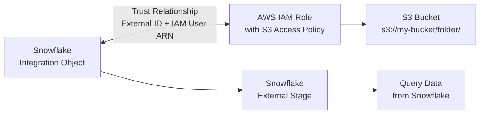

# Lecture 34: External Stages with S3 Storage Integration — Detailed Setup

## Overview
This lecture covers the complete end-to-end process for setting up a Snowflake external stage on Amazon S3 using a **Storage Integration** object (the recommended approach). This is contrasted with the older credentials-based approach. Topics include: creating an IAM role, getting the ARN, establishing trust between Snowflake and AWS, altering integrations to add new locations, creating stages, and external tables.

---

## 1. External Stage: Two Approaches

### Approach 1: Credentials-Based (NOT Recommended)

```sql
CREATE STAGE S3_CSV_STAGE
    URL = 's3://my-bucket/csv-files/'
    CREDENTIALS = (
        AWS_KEY_ID     = 'AKIA...'
        AWS_SECRET_KEY = 'wJal...'
    );
```

**Problems with this approach:**
- If the AWS admin deactivates/deletes the IAM user, all stages become **invalid**.
- Any jobs using these stages will **fail**.
- When you `DESCRIBE` the stage, the AWS Key ID is **visible** — a security violation.
- Snowflake is **HIPAA compliant** — showing user credentials in a `DESCRIBE` output violates this.

### Approach 2: Storage Integration (Recommended)

Uses IAM Roles instead of user credentials. No credentials are exposed. Even if AWS team changes users/keys, the integration stays valid.

---

## 2. Architecture: Storage Integration Flow



---

## 3. Step-by-Step: Storage Integration Setup

### Step 1: Create an S3 Bucket and Folder

In the AWS Console:
1. Go to **S3** → **Create bucket**.
2. Name: `vkt-may-2105` (or any unique name).
3. Select a region.
4. Create a folder inside the bucket: `stg_csv_files/`.

Copy the S3 URI:
```
s3://vkt-may-2105/stg_csv_files/
```

### Step 2: Create an IAM Role for Snowflake

1. Go to **AWS IAM** → **Roles** → **Create role**.
2. Select **AWS Account** → **Another AWS account**.
3. Enter a placeholder account ID (you will update this later).
4. Check **Require external ID**.
5. Enter a placeholder External ID (e.g., `snowflake_temp_123`).
6. Click **Next**.
7. Under **Permissions**, attach: **AmazonS3FullAccess** (or a more restrictive policy).
8. Give the role a name: `snowflake_role`.
9. Click **Create role**.

### Step 3: Copy the Role ARN

1. Go to **IAM** → **Roles** → Search for `snowflake_role`.
2. Click on the role → Copy the **ARN**:
   ```
   arn:aws:iam::123456789012:role/snowflake_role
   ```

### Step 4: Create the Storage Integration in Snowflake

```sql
CREATE STORAGE INTEGRATION S3_INTEGRATION
    TYPE                      = EXTERNAL_STAGE
    STORAGE_PROVIDER          = S3
    ENABLED                   = TRUE
    STORAGE_AWS_ROLE_ARN      = 'arn:aws:iam::123456789012:role/snowflake_role'
    STORAGE_ALLOWED_LOCATIONS = ('s3://vkt-may-2105/stg_csv_files/');
```

### Step 5: Describe the Integration to Get Snowflake Parameters

```sql
DESCRIBE STORAGE INTEGRATION S3_INTEGRATION;
```

Look for these four critical properties:

| Property | Description | Direction |
|---|---|---|
| `STORAGE_AWS_IAM_USER_ARN` | Snowflake's IAM user ARN | Snowflake → AWS |
| `STORAGE_AWS_EXTERNAL_ID` | Snowflake's external ID | Snowflake → AWS |
| `STORAGE_AWS_ROLE_ARN` | The IAM role ARN you provided | From you |
| `STORAGE_ALLOWED_LOCATIONS` | Permitted S3 locations | From you |

Example values:
```
STORAGE_AWS_IAM_USER_ARN   = arn:aws:iam::987654321098:user/snow-abc123
STORAGE_AWS_EXTERNAL_ID    = ABC123_SFCRole=2_def456...
```

### Step 6: Update the Trust Relationship in AWS

1. Go to **IAM** → **Roles** → `snowflake_role`.
2. Click **Trust relationships** tab → **Edit trust policy**.
3. Replace the placeholder values with the actual values from Step 5:

```json
{
  "Version": "2012-10-17",
  "Statement": [
    {
      "Effect": "Allow",
      "Principal": {
        "AWS": "arn:aws:iam::987654321098:user/snow-abc123"
      },
      "Action": "sts:AssumeRole",
      "Condition": {
        "StringEquals": {
          "sts:ExternalId": "ABC123_SFCRole=2_def456..."
        }
      }
    }
  ]
}
```

4. Click **Update policy**.

This completes the **handshake** between Snowflake and AWS.

### Step 7: Create the External Stage Using the Integration

```sql
CREATE STAGE S3_CSV_STAGE_INTEGRATION
    URL                  = 's3://vkt-may-2105/stg_csv_files/'
    STORAGE_INTEGRATION  = S3_INTEGRATION
    DIRECTORY            = (ENABLE = TRUE);
```

### Step 8: Verify the Stage

```sql
-- List files in the stage
LIST @S3_CSV_STAGE_INTEGRATION;
```

If files exist in the S3 folder, they appear here.

---

## 4. Adding New Locations to an Existing Integration

When you want to add a new S3 folder path to an existing integration, you must **include all existing locations** plus the new one (this replaces the list, not appends):

### Describe to See Current Locations
```sql
DESCRIBE STORAGE INTEGRATION S3_INTEGRATION;
-- STORAGE_ALLOWED_LOCATIONS: s3://vkt-may-2105/stg_csv_files/
```

### Alter to Add New Locations
```sql
ALTER STORAGE INTEGRATION S3_INTEGRATION
    SET STORAGE_ALLOWED_LOCATIONS = (
        's3://vkt-may-2105/stg_csv_files/',      -- existing
        's3://vkt-may-2105/stg_json_files/',     -- new
        's3://vkt-may-2105/stg_xml_files/'       -- new
    );
```

> **Important:** You must include ALL existing locations every time you alter. If you omit an existing location, stages using that location become **invalid**.

### Verify the Update
```sql
DESCRIBE STORAGE INTEGRATION S3_INTEGRATION;
-- STORAGE_ALLOWED_LOCATIONS: 3 locations listed
```

---

## 5. Error: Location Not Allowed by Integration

If you try to create a stage with a location not in `STORAGE_ALLOWED_LOCATIONS`:

```sql
-- This fails if stg_json_files is not in the integration
CREATE STAGE S3_JSON_STAGE
    URL                 = 's3://vkt-may-2105/stg_json_files/'
    STORAGE_INTEGRATION = S3_INTEGRATION;

-- ERROR: The location 's3://vkt-may-2105/stg_json_files/' is not allowed
-- by integration. Please describe the integration to check allowed locations.
```

Fix: Add the location to the integration first (see Step above).

---

## 6. Comparing Credential-Based vs Integration-Based Stage

```sql
-- Describe credential-based stage
DESCRIBE STAGE S3_CSV_STAGE_CREDS;
-- Shows: STAGE_CREDENTIALS: AWS_KEY_ID = AKIA...  <-- VISIBLE! Security risk.

-- Describe integration-based stage
DESCRIBE STAGE S3_CSV_STAGE_INTEGRATION;
-- Shows: STORAGE_INTEGRATION = S3_INTEGRATION  <-- No credentials visible. Secure.
```

---

## 7. HIPAA Compliance and Why It Matters

Snowflake is **HIPAA (Health Insurance Portability and Accountability Act) compliant**. This means:
- Healthcare-related data (PHI — Protected Health Information) can be stored in Snowflake.
- Snowflake must follow strict data security and privacy regulations.
- Disclosing user credentials (AWS Key IDs visible in `DESCRIBE STAGE`) violates HIPAA.
- This is why storage integrations (which never expose credentials) are the required approach in regulated environments.

---

## 8. Data Unloading — Exporting Data FROM Snowflake TO S3

Data unloading is the reverse of data loading: you push data from a Snowflake table or query result INTO a stage (and from there to S3).

### Why Unload?
- Export processed/transformed data back to S3 for downstream systems
- Share data with external teams without giving them Snowflake access
- Archive older data to cheaper S3 storage
- Feed data to ML pipelines or BI tools that consume files directly

### Basic Syntax
```sql
COPY INTO @<stage_name>/<optional_path>
FROM <table_or_query>
FILE_FORMAT = (FORMAT_NAME = '<file_format_name>')
[SINGLE = TRUE | FALSE]
[MAX_FILE_SIZE = <bytes>];
```

### Example 1: Unload an Entire Table to CSV
```sql
-- Unload the emp table to S3 CSV stage
COPY INTO @S3_CSV_STAGE
FROM emp
FILE_FORMAT = FILE_CSV_FORMAT;
```
Result: Snowflake creates one or more CSV files in the stage. File names are auto-generated (e.g., `data_0_0_0.csv.gz`).

### Example 2: Unload a Query Result (Filtered Data)
```sql
-- Unload only specific rows from a JSON table
COPY INTO @S3_JSON_STAGE
FROM (SELECT c1 FROM T_SSD WHERE file_name = 'car.json')
FILE_FORMAT = JSON_FORMAT;
```
You can unload any SELECT statement, not just full tables.

### Example 3: Unload to a Single File
```sql
-- SINGLE=TRUE forces all output into one file
-- Maximum file size with SINGLE=TRUE is 5 GB
COPY INTO @S3_CSV_STAGE
FROM (SELECT * FROM T_CUSTOMER LIMIT 100)
FILE_FORMAT = FILE_CSV_FORMAT
SINGLE = TRUE;
```

> **File size recommendations:**
> - Minimum: 250 MB per file (smaller files waste overhead)
> - Maximum: 5 GB per file (with `SINGLE=TRUE`)
> - Default: Snowflake automatically splits into multiple files for large tables

### Example 4: Unload to a Subfolder Path
```sql
-- Unload to a specific prefix/subfolder in the stage
COPY INTO @S3_CSV_STAGE/exports/2025/05/
FROM emp
FILE_FORMAT = FILE_CSV_FORMAT;
```

### Unloading vs Loading Summary

| Direction | Command | Source → Target |
|---|---|---|
| Loading (ingest) | `COPY INTO <table>` | Stage → Snowflake table |
| Unloading (export) | `COPY INTO @<stage>` | Snowflake table/query → Stage |

### Unloading Formats
All file formats supported for loading also work for unloading:
```sql
-- CSV unload
COPY INTO @S3_CSV_STAGE FROM emp FILE_FORMAT = (TYPE = CSV);

-- JSON unload
COPY INTO @S3_JSON_STAGE FROM emp FILE_FORMAT = (TYPE = JSON);

-- Parquet unload
COPY INTO @S3_STAGE FROM emp FILE_FORMAT = (TYPE = PARQUET);
```

---

## 9. External Tables

An **External Table** reads data from an external stage as if it were a native Snowflake table. The data is not stored in Snowflake.

### When to Use External Tables
- Data files change **infrequently** (e.g., historical data, master/reference data).
- You do NOT want to store the data in Snowflake (reduces storage cost).
- You want to query S3 files directly using SQL.

### Creating an External Table (CSV)
```sql
CREATE EXTERNAL TABLE EXT_EMP_INFO
    LOCATION      = @S3_CSV_STAGE_INTEGRATION
    FILE_FORMAT   = (TYPE = CSV SKIP_HEADER = 1)
    AUTO_REFRESH  = FALSE;
```

### Creating an External Table (JSON with Column Mapping)
```sql
CREATE EXTERNAL TABLE EXT_EMP_JSON (
    emp_no    NUMBER       AS (VALUE:c1::NUMBER),
    emp_name  VARCHAR(100) AS (VALUE:c2::VARCHAR),
    job       VARCHAR(50)  AS (VALUE:c3::VARCHAR),
    manager   NUMBER       AS (VALUE:c4::NUMBER),
    hire_date DATE         AS (VALUE:c5::DATE),
    salary    NUMBER       AS (VALUE:c6::NUMBER),
    comm      NUMBER       AS (VALUE:c7::NUMBER)
)
    LOCATION    = @S3_JSON_STAGE_INTEGRATION
    FILE_FORMAT = (TYPE = JSON)
    AUTO_REFRESH = FALSE;
```

### Querying External Tables
```sql
SELECT * FROM EXT_EMP_JSON;

-- Exclude the VALUE metadata column
SELECT * EXCLUDE VALUE FROM EXT_EMP_JSON;
```

### Key Behaviors
- External tables always read from the underlying stage files — they do not cache data.
- Changes to files in S3 are reflected immediately (or after refresh).
- Use `AUTO_REFRESH = TRUE` with Snowpipe for automatic metadata refresh.

---

## 10. Insert-Only Streams on External Tables

Standard streams cannot be created on external tables. Only **insert-only streams** can.

```sql
-- This FAILS for external tables
CREATE STREAM STANDARD_STREAM ON TABLE EXT_EMP_JSON;
-- Error: stream of type insert-only must be on external table or iceberg table

-- This WORKS
CREATE STREAM INSERT_ONLY_STREAM
    ON EXTERNAL TABLE EXT_EMP_JSON
    INSERT_ONLY = TRUE;
```

---

## 11. Complete Integration Setup Checklist

```
[ ] Create S3 bucket and folder
[ ] Create IAM Role with AmazonS3FullAccess policy
[ ] Placeholder trust relationship (you will update later)
[ ] Copy IAM Role ARN
[ ] CREATE STORAGE INTEGRATION in Snowflake with Role ARN
[ ] DESCRIBE STORAGE INTEGRATION to get Snowflake's IAM User ARN and External ID
[ ] Update Trust Relationship in AWS with actual values
[ ] CREATE STAGE using STORAGE_INTEGRATION parameter
[ ] LIST @stage_name to verify files are accessible
[ ] (Optional) CREATE EXTERNAL TABLE on the stage
```

---

## 12. Key Commands

| Command | Description |
|---|---|
| `CREATE STORAGE INTEGRATION ... TYPE = EXTERNAL_STAGE` | Create storage integration |
| `DESCRIBE STORAGE INTEGRATION <name>` | Get Snowflake IAM user ARN + external ID |
| `SHOW INTEGRATIONS` | List all integration objects |
| `ALTER STORAGE INTEGRATION <name> SET STORAGE_ALLOWED_LOCATIONS = (...)` | Add new S3 locations |
| `CREATE STAGE <name> STORAGE_INTEGRATION = <integration>` | Create stage from integration |
| `LIST @stage_name` | List files in stage |
| `CREATE EXTERNAL TABLE ... LOCATION = @stage` | Create external table |
| `DESCRIBE STAGE <name>` | View stage properties |
| `SELECT * EXCLUDE value FROM ext_table` | Query external table excluding metadata column |
| `COPY INTO @stage FROM table` | Unload table to stage (export) |
| `COPY INTO @stage FROM (SELECT ...) SINGLE=TRUE` | Unload query result to single file |
| `ALTER EXTERNAL TABLE t REFRESH` | Detect new files added to S3 |

---

## Summary

- Two ways to create external stages: **credentials-based** (insecure, not recommended) and **storage integration** (recommended).
- Storage integrations use an IAM Role ARN — Snowflake generates an IAM User ARN and External ID that must be placed in the AWS Trust Relationship.
- This mutual exchange creates a **secure trust relationship** between Snowflake and AWS without exposing credentials.
- When adding new S3 locations to an integration, you must include ALL existing locations plus the new ones in a single `ALTER` command.
- Snowflake is HIPAA compliant — credentials-based stages violate HIPAA by exposing AWS keys in `DESCRIBE STAGE` output.
- **External tables** read data directly from S3/stage files without storing data in Snowflake — ideal for infrequently changing reference data.
- Only **insert-only streams** can be created on external tables (not standard streams).
- **Data unloading** uses `COPY INTO @stage FROM table` — the reverse of loading. Use `SINGLE=TRUE` for one output file (max 5 GB). Recommended file size: 250 MB–5 GB per file.
- Use `ALTER EXTERNAL TABLE t REFRESH` to force Snowflake to detect newly added files in the S3 location.
